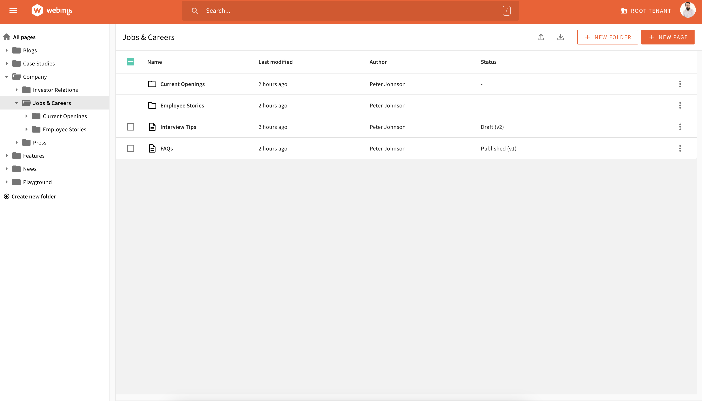

We understand how important it is to be able to organize content in the right way, so we are introducing the Advanced Content Organisation (ACO) for Page Builder to enable you to do exactly that. 
Imagine that you have 200+ pages and they are all over the place. We want to help you to make sure all your pages are organised in an effective, easy to manage way. This new feature will allow you to add your pages in separate folders. You can then rearrange your content as you wish and be able to find what you are looking for in no time.

With the ACO for Page Builder you will be able to sort folders and pages based on Name, Last Modified Date.

<video width="800px" height="auto" controls autoplay>
  <source src="./assets/feature-overview-page-builder-aco/aco-sort.mp4" type="video/mp4" />
</video>

You will also import pages and also export selected or all pages in bulk which may be quite useful if you haven’t yet automated your dev-stage-production deployments.

<video width="800px" height="auto" controls autoplay>
  <source src="./assets/feature-overview-page-builder-aco/aco-import-export.mp4" type="video/mp4" />
</video>

Finally, one can move a page across the hierarchy tree and it has no impact on the page URL. We have decoupled the two to ensure you have the flexibility you need, but also do not have a negative impact on your SEO if you decide to restructure your folder/ page organisation.

<video width="800px" height="auto" controls autoplay>
  <source src="./assets/feature-overview-page-builder-aco/aco-move-page.mp4" type="video/mp4" />
</video>

**Future Developments**

We will introduce a similar structure with File Manager next quarter. However, first we want to test it with you and Page Builder and gather some feedback what works and what doesn’t work for you. What are the new functionalities which you would like to see? Please submit your ideas on our [Ideas board](https://github.com/webiny/webiny-js/discussions/categories/ideas) or on our Slack channel.

Another feature which is in design is tagging. That capability is important to the users, but in the same time tagging implemented wrong could lead to some serious mess later on. Ask Marie Kondo if you don’t trust me. First, we would like to answer questions like do you want to share tags across the Webiny apps - File Manager, HCMS and Page Builder? Do you need the ability to have nested tags such as Earth> Europe> Italy> Rome?  We will be testing some of our assumptions with some key clients, but if you have an opinion, we are hear to listen, so get in touch.

Finally, the search functionality has been refactored in a scalable way so the back end can support the future plans we have for these applications and enable you to serve content dynamically, but for now it remains hidden from the end user until we have the right functionality in place, so if you have any feedback on what you want to see there, please get in touch on our [Slack channel](https://www.webiny.com/slack/).