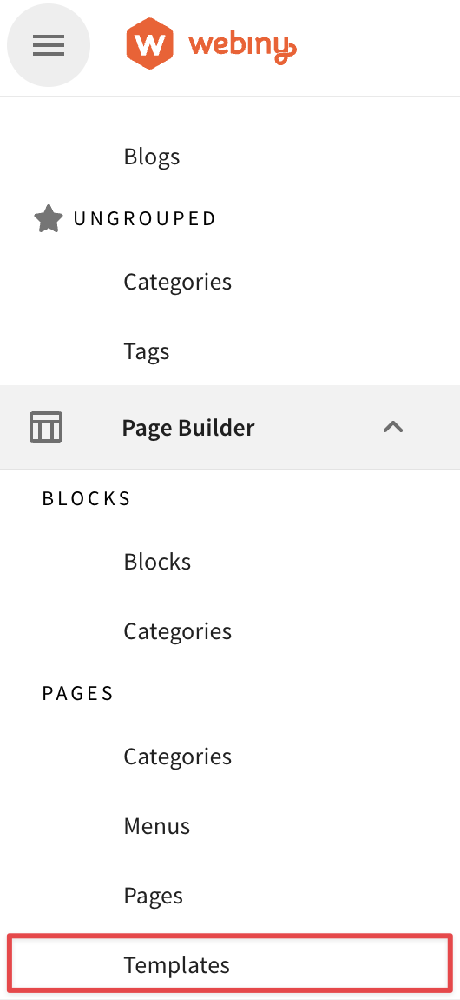

In v5.35, Webiny took the Page Builder application to a new level thanks to all your feedback, provided over the last few months, and of course the hard work put in by our Product and Engineering team. As part of that release we introduced Page Builder Templates.
 
The Page Builder Templates enable your organization to preserve the consistent look and feel of your pages, and they empower your content creators by offering enough flexibility to foster creativity and still save time. Templates are especially powerful if you create pages which have multiple components and it is used across your website multiple times like a feature or product page.
 
The Templates can be accessed from the main menu.

 
Each Template can be created from Blocks or manually built from scratch. Please note that if you decide to use Blocks any changes to the original Block will be transferred to the Template as well unless you unlink the Block.
 
<video width="800px" height="auto" controls autoplay>
  <source src="./assets/feature-overview-page-builder-templates/pt-create.mp4" type="video/mp4" />
</video>
 
Once the template is saved in your library, anyone in your project can access it when creating a new Page. This will allow your content creators to focus on what is important - the content. 
 
<video width="800px" height="auto" controls autoplay>
  <source src="./assets/feature-overview-page-builder-templates/pt-page.mp4" type="video/mp4" />
</video>
Finally, the content creator can unlink the Template from the parent record, which would mean that they have complete freedom to change the page as they see fit. It also mean that they won’t be able to receive any updated if the parent Template is updated in the future.
 
<video width="800px" height="auto" controls autoplay>
  <source src="./assets/feature-overview-page-builder-templates/pt-unlink.mp4" type="video/mp4" />
</video>
 
We hope you like the new Page Builder Templates. Let us know what you think about Templates and if you have any ideas for improvements, we would love to hear from you on our Slack channel.
