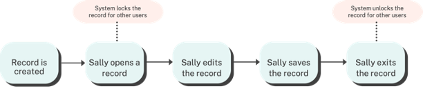
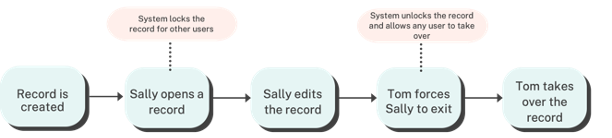

In our ongoing quest to empower users with enhanced collaboration capabilities, we are thrilled to introduce the new Record Locking mechanism for Webiny Headless CMS in release 5.40. This groundbreaking feature was developed alongside some of our Enterprise customers and it is reserved for their tier as it will be most beneficial to large organizations. Record locking adds a layer of control and efficiency to the content editing process, ensuring that any team can work together harmoniously without the risk of accidental data overrides or data loss.

Let's go through a couple of typical scenarios to illustrate how Record Locking works in action:

#### Scenario 1: Exclusive Record Editing - Sally's Uninterrupted Content Management with Record Locking
 Sally begins editing a record in the headless CMS, making changes and updates as needed. She can edit and save her changes uninterrupted because the record is locked for anyone else.

<video width="800px" height="auto" controls autoplay>
<source src="./assets/feature-record-locking/rl-process-one.mp4" type="video/mp4" />
</video>

#### Scenario 2: Managing an Edit Access Request - Tom's Options When a Record is Locked by Another User
While Sally is editing the record, Tom attempts access to the same record. However, the record is locked for editing, publishing, moving or deletion by the record locking functionality until Sally releases the lock or a timeout kicks in.  

##### Options for Tom: 

**- Option 1:** Tom can ping Sally via the company messenger and politely request her to release the lock if her changes are not urgent.

**- Option 2:** In cases of urgency or if Sally is not available, for example she has gone for a lunch break, but left her browser open on the record, Tom could take over the record and proceed with his edits, but if Sally has any unsaved changes, then they would be lost. Users should periodically save their changes to avoid data loss.

<video width="800px" height="auto" controls autoplay>
<source src="./assets/feature-record-locking/rl-force.mp4" type="video/mp4" />
</video>

**- Option 3: **Tom could wait until the automatic timeout kicks in and gain access to the record then.

#### Automatic Lock Timeout:

Let’s briefly explain, the **Automatic Lock Timeout.** To prevent records from being locked indefinitely, by default, this timeout is set to 30 minutes. The engineering team have the flexibility to adjust this setting as needed using a simple project variable. More on that can be found in this [article](https://www.webiny.com/docs/core-development-concepts/basics/environment-variables).

Whether it's a quick adjustment upon project deployment or a later tweak, managing the timeout is easy to customize to suit your organizational preferences.

With the new record locking, Webiny users are safe from unintentionally overwriting someone else's work or encountering conflicts due to simultaneous editing. Now, they can confidently focus on their high-value work knowing that their changes are safe.

Stay tuned for more updates and enhancements as we continue to innovate and refine the Webiny. If you have any feedback do let us know on [our Slack channel](https://www.webiny.com/slack/).

We hope this new feature empowers your users to explore, experiment, and innovate with confidence.
