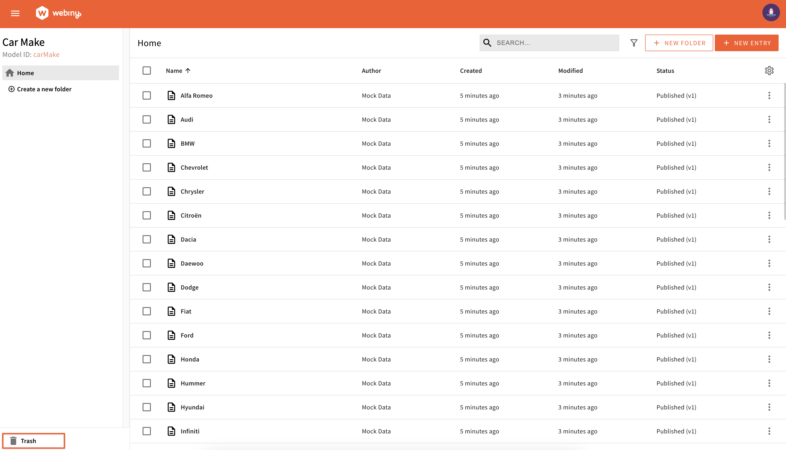

Imagine you've spent hours crafting the perfect web content, meticulously selecting images, fine-tuning wording, and arranging elements just so that everything works together in harmony. Then, in a moment of distraction, you hit the delete button, and it's all gone. Without a robust rubbish bin functionality, such incidents can be a disaster for content creators, leading to frustration, lost time, and compromised projects. Recognizing the need for a safety net in content management, Webiny introduces the Trash Bin feature for headless CMS in our latest update 5.40.  This practical tool acts as a safeguard for your digital assets, ensuring a seamless creative workflow. Whether it's mistakenly deleting a single article or a few hundred records in one go, the consequences of data loss can be devastating. Our Trash Bin steps in, offering peace of mind and empowering users to navigate the digital landscape with confidence. 

## How does it work?

- **Move records to Trash Bin:**

The "Delete" functionality remains the same, but with a crucial enhancement. Previously, deleting records meant they were permanently lost. Now, when users select items for deletion, they are "soft deleted" and moved to the Trash Bin, offering an extra layer of protection before being permanently removed.
<video width="800px" height="auto" controls autoplay>
<source src="./assets/feature-trash-bin/tb-move-to-bin.mp4" type="video/mp4" />
</video>

- **Access the Trash Bin:**

At the bottom left-hand side of your app screen, you can find the Trash Bin. Each HCMS model has its own Trash Bin folder to enable users to find the records they are looking for quickly. In this way, only users with access to this content model can see the deleted records in the bin.

- **Navigating the Trash Bin:**

A very familiar interface awaits the users inside the Trash Bin with which they can search, sort, and select the records they want to restore or permanently delete.

<video width="800px" height="auto" controls autoplay>
<source src="./assets/feature-trash-bin/tb-search.mp4" type="video/mp4" />
</video>

- **Recovery and Permanent Deletion:**

Restoring a wrongly deleted record or purging outdated assets is straightforward and hassle-free, just a click of a button.  The team has also built a cron job to empty the bin daily. Records older than 90 days will be purged permanently in every run. Users can control the retention period for their projects using a variable. More on how to customize this can be found [here](https://www.webiny.com/docs/core-development-concepts/basics/environment-variables#webiny-trash-bin-retention-period-days). 

<video width="800px" height="auto" controls autoplay>
<source src="./assets/feature-trash-bin/tb-restore-delete.mp4" type="video/mp4" />
</video>

The Trash Bin is now available for projects on version 5.40 or later for the Headless CMS application. It is planned for integration with the File Manager and Page Builder later this year. If you have any feedback do let us know on [our Slack channel](https://www.webiny.com/slack/).

We hope this new feature empowers your users to explore, experiment, and innovate with confidence.
