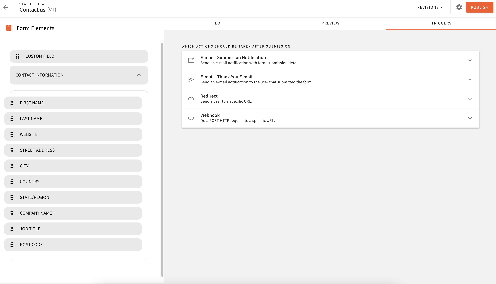
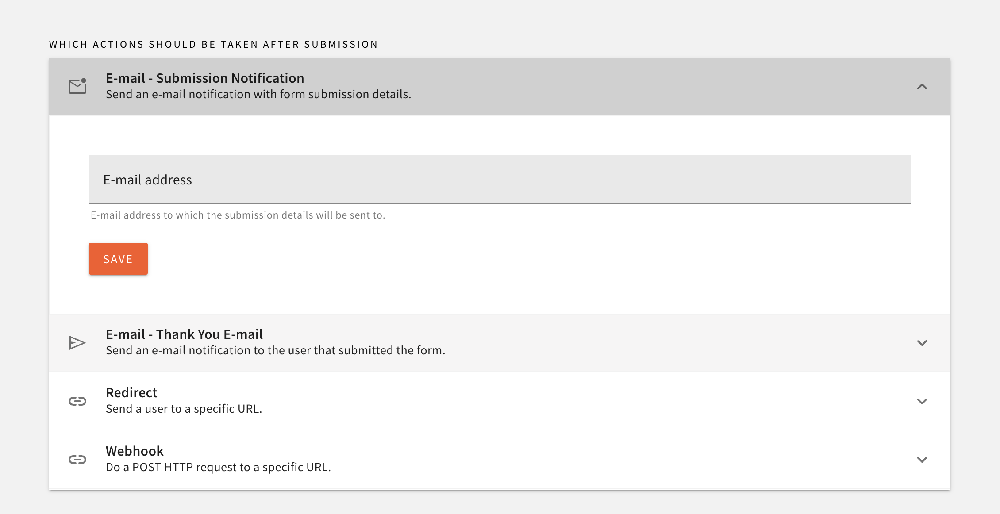
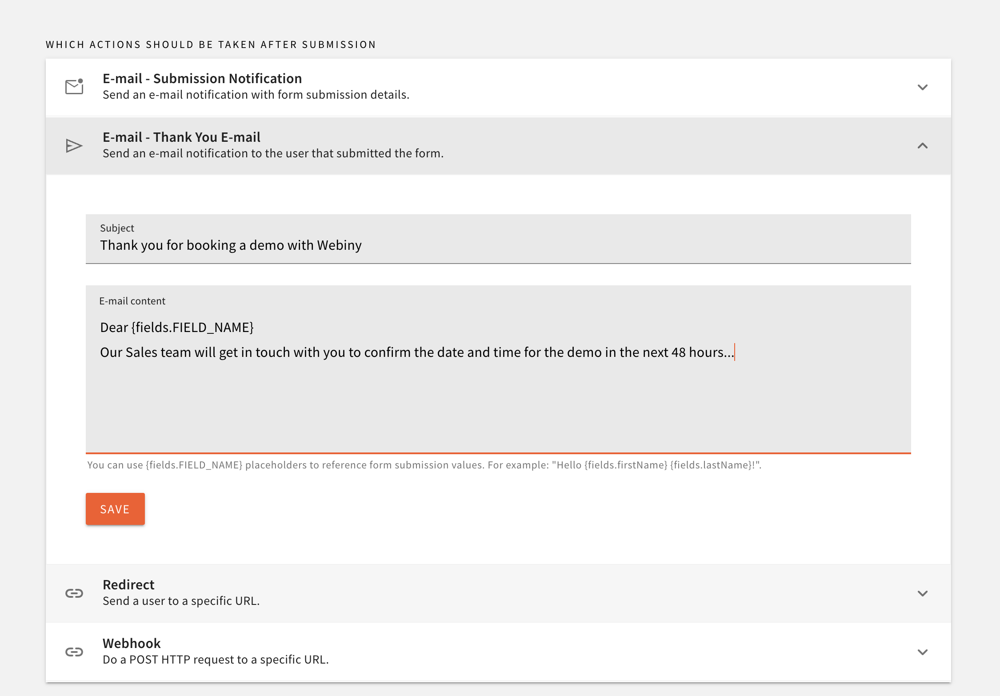
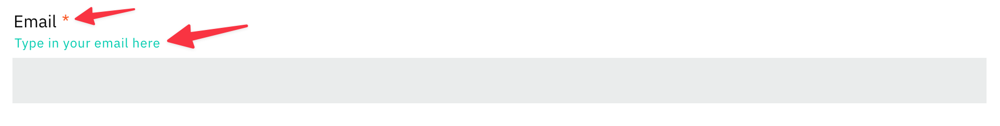
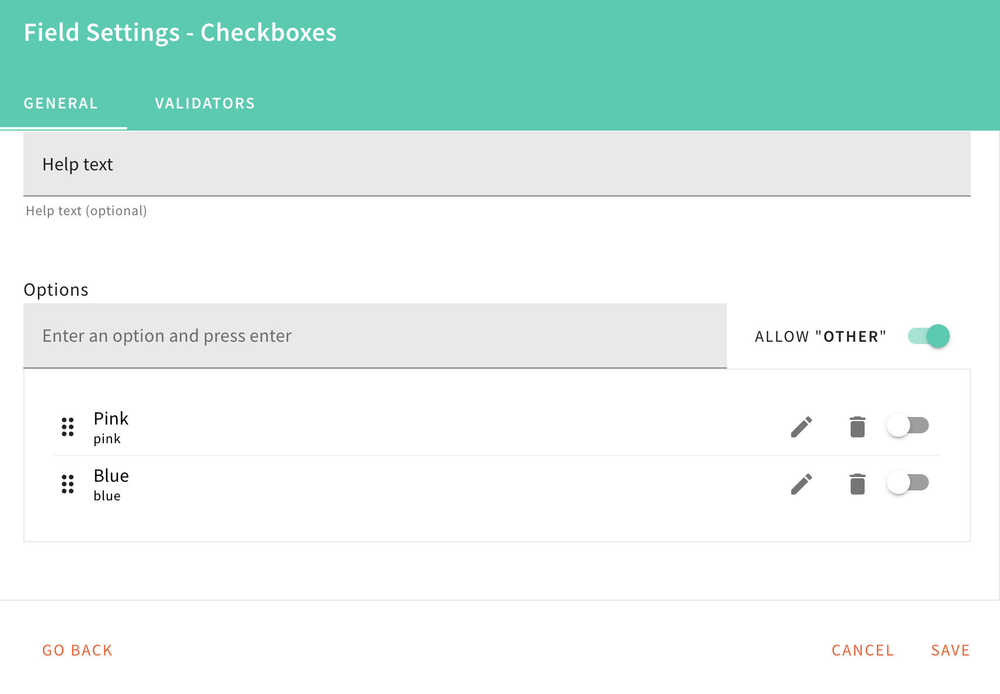
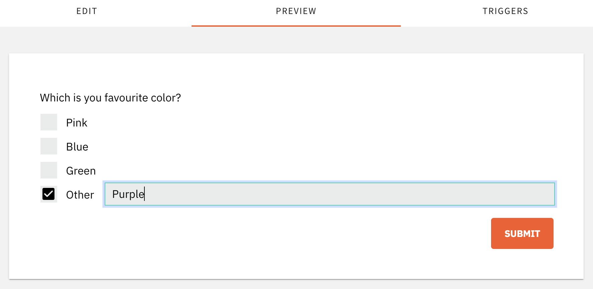
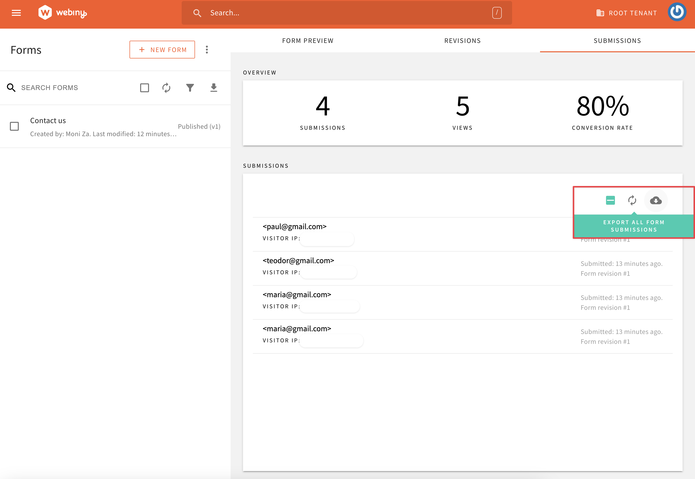
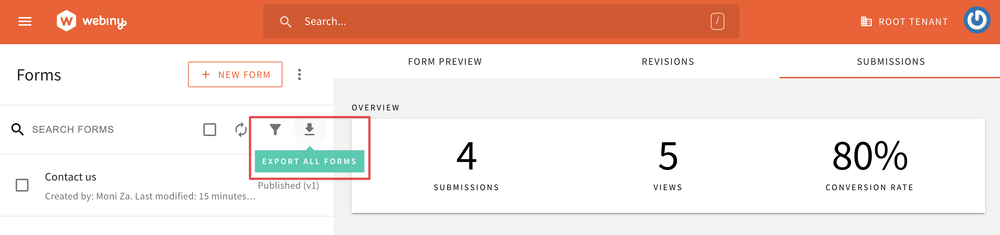
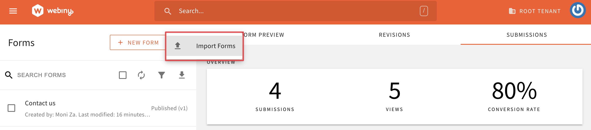

Managing forms could be tricky: having to check your CMS daily to make sure you haven’t missed a customer contact or not being able to respond in time with the needed information. 

At Webiny, we also use forms across our website to capture information from customers. We know it would be awesome if at least part of this process is optimized and automated. The upgrades we built for Form Builder in v5.35 introduced some new functionalities to help you with that.

**New email notifications for new submissions and tailored "Thank you" follow up emails.**

In the Triggers section you can configure your email notification setting.

You can choose which mailbox will receive all **the submissions** for this form:

If you would like to send **follow up emails to your clients** first you have to make sure that the email field is added to the form and made a required field. This will enable the Thank You Email option in the Triggers menu. Then you can customise the content of the follow up email and even make it personal to the user who submitted the query by using the Field ID (which can be found in the field settings)

We also made Form Builder a bit more user-friendly by offering **quicker access to commonly used actions** like making fields required. Now you can access that without going to settings. Small tweak, but saves a lot of time.
 
<video width="800px" height="auto" controls autoplay>
  <source src="./assets/feature-upgrade-form-builder/fb-required.mp4" type="video/mp4" />
</video>

There is also **a new indicator (a red asterisk) for all required fields** and we have moved the help text under the applicable field to make it easier to read.

The Checkbox field also received some love. We have added **an option for “Other”** to give you more flexibility in building the desired forms.

This is what the form would look like from end user perspective:

We enabled users to **export the form submission details in a structured format**, so you can use them in Excel or similar application for further analysis/ tracking.

Finally, **the export and import of Forms** is a new feature to help you with moving a form from one project/ environment to another without having to recreated it.

If you want to find out more about the Form Builder upgrades which we introduced in v5.35 check out this [walkthrough video](https://youtu.be/zvC3tGyyizU). We hope you find all of these improvements useful. Let us know what your feedback is on our [Slack channel](https://www.webiny.com/slack/).