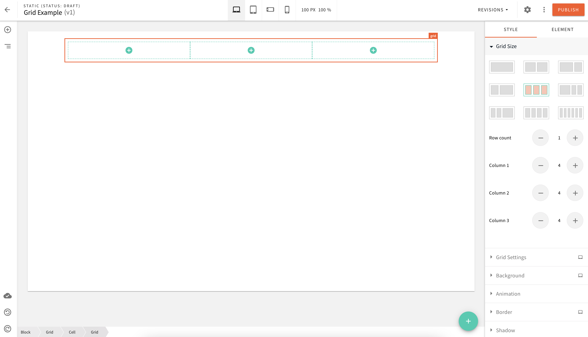
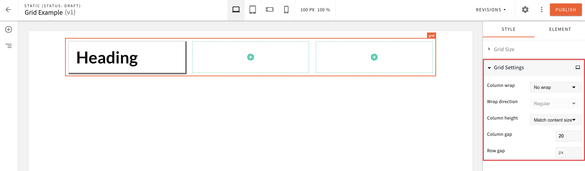
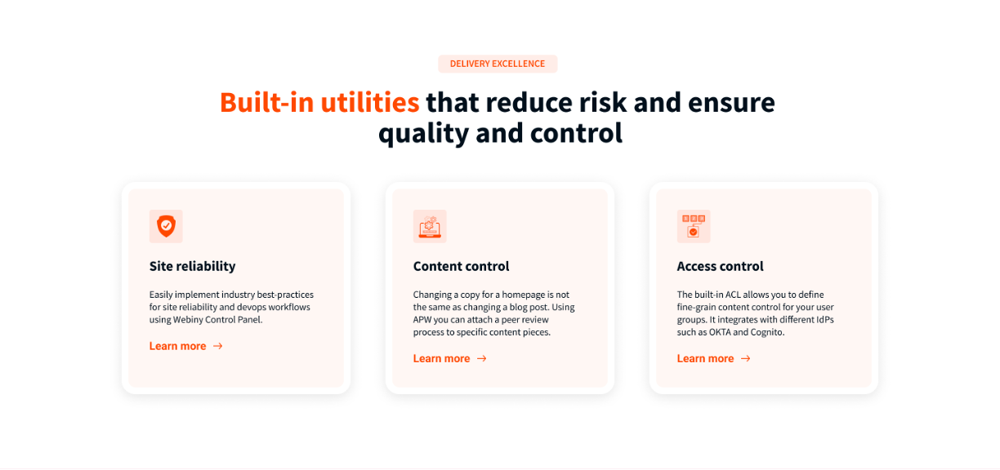
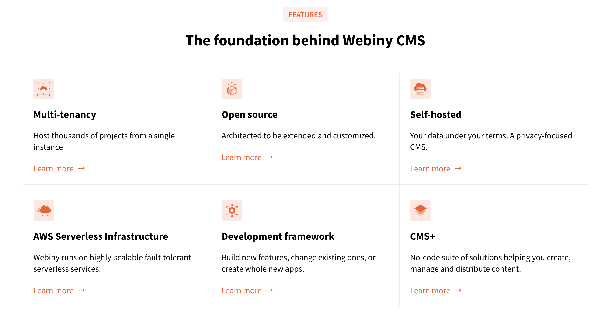

The upgraded Grid is mind blowing! Using all the new functionalities Webiny has introduced will enable you to create almost any design you can think of, but still keep all elements nicely aligned and the space harmonious. Let’s have a look what the new Grid functionalities can bring to the table.

You can easily add a Grid from the Layout menu in the Page Builder Elements.

<video width="800px" height="auto" controls autoplay>
  <source src="./assets/feature-upgrade-page-builder-grid/pb-grid-create.mp4" type="video/mp4" />
</video>

In the Grid Size panel you can customise the number of rows and columns and their size.

In the Grid Settings, one can select the column height and gap between columns.

We have used the Grid functionality to create all of these beautiful page elements on our [Website](https://www.webiny.com/).

Our grid system uses a 12-column grid, which means you can easily create designs with 2-3-4-6-12 columns. If you want to create something which has 5 or 7 columns for example you have to be a bit more creative with the way you use a combination of grids, for example 2+3 columns and the spacing between the columns or you could add 6 columns and then hide one of them. Once you have created your new layout we recommend saving that as a Page Builder Block so that you can reuse it at any time. 

In Q2, we are planning on releasing our new Page Builder pre-built Blocks which will enable the content creators and designers to create templates and pages using pre-defined no-code designs. 

We hope you like the new Grid functionalities. If you want to find out more about the Page Builder upgrades which we introduced in v5.35 check out this [walkthrough video](https://youtu.be/4wXHd8FSAzU). Let us know what you think about Templates and if you have any ideas for improvements. You can use our Idea board or our [Slack channel](https://www.webiny.com/slack/).

 