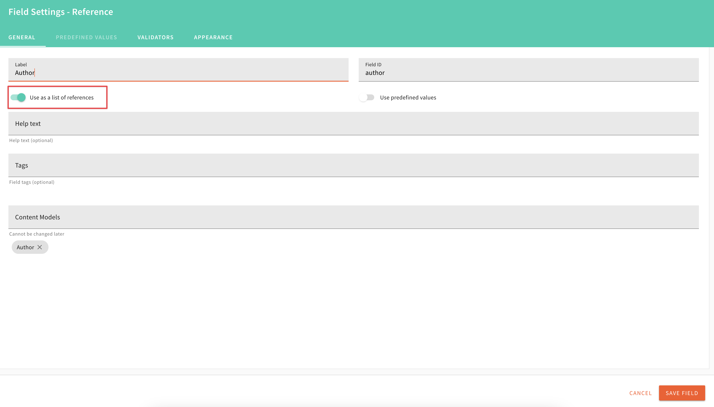
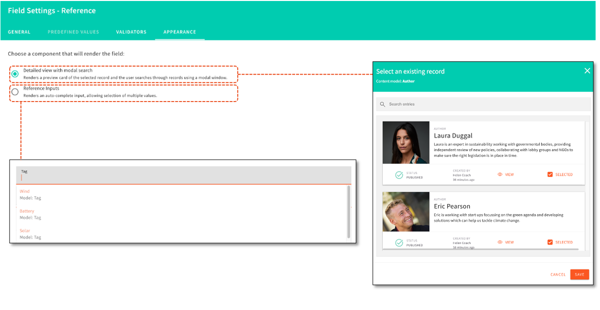

Serverless content management solution (CMS) like Webiny are gaining popularity over the last few years. They allow users to create, edit, search, and manage large collections of digital content quickly without the added cost of infrastructure, because the serverless set up allows companies to pay per use and scale up and down in a matter of minutes. However, one of the most overlooked features of a CMS is the ability to create reference fields to help companies build an adequate data model. Having the correct links between your content models is a corner stone in building a solid data management strategy for your business in your CMS. We know that creating and maintaining the links between records could be time-consuming and painful, so we tried to alleviate some of this pain by refactoring our Reference Field in our Headless CMS in v5.35.

The new edition of this feature allows users to reference more than one content models in that field, enabling you to build more complex use cases and connections between your models.

<video width="800px" height="auto" controls autoplay>
  <source src="./assets/feature-upgrade-reference-field/rf-multimodel.mp4" type="video/mp4" />
</video>

The Admin can control how many entries can be selected within the reference field. If for example a single blog post could have more than one Author, the “Use as a list of references“ should be enabled.

We know not everyone likes change and also that there are simpler use cases like Tags, for example, where the old version of the reference field is more functional. Therefore, we have left you the option to choose the simpler renderer for your reference filed where you see fit.The admin can control this in the Reference Field Field Settings> Appearance.

The new interface gives the content creator more information in a user-friendly way, so when they need to create a new reference or change an existing one, they can do so in less time and less effort. For example, if the creator would like to select the Author of a Blog post, they can see more details about the person and pick the right one quickly instead of going to the Author record itself to get the data. Also selecting multiple entries for a reference field is made easy with the new interface.

<video width="800px" height="auto" controls autoplay>
  <source src="./assets/feature-upgrade-reference-field/rf-select.mp4" type="video/mp4" />
</video>

Ordering them in the correct sequence is also a breeze with this new UI.

<video width="800px" height="auto" controls autoplay>
  <source src="./assets/feature-upgrade-reference-field/rf-move.mp4" type="video/mp4" />
</video>

If you want to find out more about the Reference Field upgrades which we introduced in v5.35 check out this [video](https://youtu.be/qFsOhmpS-44) which covers a few additional features in the Headless CMS. We hope you find all of these improvements useful. Let us know what your feedback is on our [Slack channel](https://www.webiny.com/slack/).