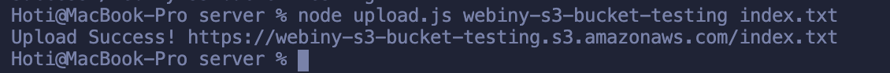
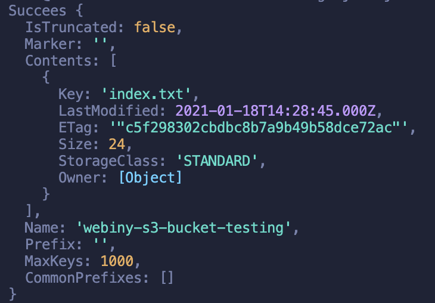

When developing your web application, you must think of a place where to store your data, how to back up them, types of data you want to store, such as images, music, and videos, application hosting, data archiving, disaster recoveries. AWS Simple Storage Service (S3) provides you the solutions for these cases. S3 is one of the core services of AWS cloud infrastructure. It's **object storage** that acts like a regular file system on your personal computer. S3 scales infinitely, with no limit on the amount of data you store.

In this tutorial, we'll get to learn how to use the AWS S3. First, learn what is S3, the core parts of S3 that are the Buckets, Access Point, and Objects. Then we'll get to the practice, by implementing the AWS SDK for Node.js 💻 Finally, we'll provide a cheat sheet on AWS S3 CMD Commands.

---

Amazon Web Services (AWS) provides multiple types of cloud computing services, one of them is the AWS Storage Service. There are different storage services, such as Simple Storage Service (S3), AWS Elastic File System (EFS), & Elastic Block Store (EBS).
For this tutorial, we'll be focusing on the S3 service. S3 is one of the most favorite cloud computing services among all the other services, based on <ExternalLink href="https://twitter.com/acloudguru/status/1240722699493801987">this poll</ExternalLink> by <ExternalLink href="http://acloud.guru">acloud.guru</ExternalLink> on Twitter.

---

## What is S3?

You can use S3 to host your static websites, delivering HTML, JavaScript, images, videos, and other files to your website visitors - that doesn't contain server-side code such as Node.js or PHP. Using S3, you can easily deploy your applications in just two to three clicks via the user interface. S3 provides a simple web services interface you can use to store and retrieve any amount of data from anywhere on the web.

We'll now go through the core concepts of S3, such as **buckets**, **access points**, and **objects**.

### Buckets

To upload your data to S3, you must create an S3 bucket in one of the AWS Regions, within one bucket you can upload many objects to the bucket. For implementation, buckets and objects are resources, and S3 provides **APIs** for you to manage them. There are different methods you can use to create buckets such as.

- **Amazon S3 Console**
  - Follow the guides <ExternalLink href="https://docs.aws.amazon.com/AmazonS3/latest/user-guide/create-bucket.html">here</ExternalLink> to create your first bucket with the S3 console.
- **REST API**
  - To create buckets using REST API, you must authenticate your requests — follow the <ExternalLink href="https://docs.aws.amazon.com/AmazonS3/latest/API/API_CreateBucket.html">PUT Bucket</ExternalLink> in the S3 API reference. But it's recommended to use the AWS Management Console or AWS SDKs instead.
- **AWS SDK**
  - To create buckets with the SDK, you first have to create a **client** and then use the client to send **a request** to **create a bucket**. Note: When creating the client and the bucket, use the same region. Here is a dominant <ExternalLink href="https://docs.aws.amazon.com/sdk-for-javascript/v2/developer-guide/s3-example-creating-buckets.html">source</ExternalLink> on creating and using AWS S3 Buckets.

### Access points

To access the data that you store on S3, you need the _S3 Access Point_. These are **endpoints** that are attached to buckets that you used to perform S3 object operations.

Each access point has distinct permissions and network controls S3 applies for any request that is made through the access point. Access points are used to perform operations on **objects**, but **not** on **buckets**. Go through this <ExternalLink href="https://docs.aws.amazon.com/AmazonS3/latest/dev/access-points.html">source</ExternalLink> to learn how to manage data access with S3 access points.

### Objects

We mentioned that AWS S3 is object storage. Each AWS S3 object has data, a key, and metadata. The object key (or key name) uniquely identifies the object in a bucket. Object metadata is a set of name-value pairs.

You can store objects in one or more buckets, and each object can be up to 5 TB in size. For the real-world solutions, let's say you want to share an image or video stored in AWS S3 bucket on your website, that is possible only if you make the object public or use a pre-signed URL on your website. Follow this <ExternalLink href="https://docs.aws.amazon.com/AmazonS3/latest/dev/UsingObjects.html">source</ExternalLink> on how to work with S3 objects.

## Hands-on S3 with AWS SDK

We'll go with the AWS SDK and Node.js to **create** S3 buckets, **uploading** an object to a specified bucket and **deleting** that bucket afterward; we'll provide a `How-To on the S3` section where you can learn more about different use-cases commands to run on S3.

In order to continue, you must:

- Install Node.js, in case you don't have it, follow the <ExternalLink href="https://nodejs.org/en/">Node.js website</ExternalLink>.
- Set up your user credentials, follow <ExternalLink href="https://docs.aws.amazon.com/sdk-for-javascript/v2/developer-guide/loading-node-credentials-shared.html">here</ExternalLink> for more information.

### Configuring the SDK

To use the AWS SDK for JavaScript, we must first initiate a node module for our hands-on project.

To do that, first, create a folder named `webiny-hands-on-s3` and `cd` into that folder.

Run the command `npm init` — this will ask you to provide the project's name and you can name it as you want, in this case, we'll leave it the same as the folder name with an entry point of the `index.js` file.

Inside our folder, we'll create a couple of files, such as.

- `createBucket.js`
- `upload.js`
- `listObjects.js`
- `deleteBucket.js`

Before we continue to implement any code, we need to install the AWS SDK package by running this command: `npm install aws-sdk --save`.

Let's dive in.

---

### Creating an AWS S3 Bucket

In order to use the SDK, we have to configure the SDK package by loading it into our file. Open the createBucket.js file, and start writing the below code in your own file. In the snippet we have comments to explain to you what we're doing:

```tsx
// Load the AWS SDK for Node.js
var AWS = require("aws-sdk");

// Set the region
AWS.config.update({ region: "us-east-1" });

// Create S3 service object
s3 = new AWS.S3({ apiVersion: "2006-03-01" });

// Create the parameters for calling createBucket -- with this part we'll take the bucket name we'll create
var bucketParams = {
  Bucket: process.argv[2],
};

// Call S3 to create the buckets
s3.createBucket(bucketParams, function(err, data) {
  err ? console.log("Error", err) : console.log("Success", data.Location);
});
```

To create your S3 bucket, with this script, we must run it and give our bucket a name like so: `node createBucket.js webiny-s3-bucket-testing`.
If it's successful, it will console log the Success message together with the location, which will be the bucket name.

### Uploading a file to an AWS S3 Bucket

Open the `upload.js` file and let's dive in. I will repeat some parts of the snippets, such as the SDK configuration, and the AWS S3 service object as shown in the above snippet. The additional part is that we have two command-line arguments, the first one will be the bucket name where you'll upload your file, and the second argument will be the file itself.

Let's dive into the code.

```tsx
// Load the AWS SDK for Node.js
var AWS = require("aws-sdk");

// Set the region
AWS.config.update({ region: "us-east-1" });

// Create S3 service object
s3 = new AWS.S3({ apiVersion: "2006-03-01" });

// Call S3 to retrieve upload file to specified bucket
var uploadParams = { Bucket: process.argv[2], Key: "", Body: "" };
var file = process.argv[3];

// Configure the file stream and obtain the upload parameters
// The node.js file system module allows you to work (read, create, update, delete, rename files)
// with the file system on your computer.
var fs = require("fs");
var readingFile = fs.createReadStream(file);
readingFile.on("error", function(err) {
  console.log("File Error", err);
});

uploadParams.Body = readingFile;
// The path module provides utilities for working with file and directory paths.
// We can access by using this:
var path = require("path");
uploadParams.Key = path.basename(file);

// Call S3 to retrieve upload file to specified bucket
s3.upload(uploadParams, function(err, data) {
  err ? console.log("Error", err) : console.log("Upload Success!", data.Location);
});
```

Now, create an `index.txt` file in your folder, and add some text into it.

Then, run the script by providing two parameters:

1. The S3 bucket we create in the first snippet `webiny-s3-bucket-testing`
2. The local file you want to upload into that S3 bucket.

The full command `node upload.js webiny-s3-bucket-testing index.txt`



🎉 You just uploaded a file into your S3 bucket!

### Listing objects in an AWS S3 Bucket

Now, open the `listObjects.js` file where you'll list the content of this bucket. It's again a repetitive task of configuring the SDK and creating the AWS S3 service object. What this script will do, is that we'll provide the bucket name from which we want to read the objects and the result will be a list of objects (files) or a failure message.

Let's dive into the code.

```tsx
// Load the AWS SDK for Node.js
var AWS = require("aws-sdk");

// Set the region
AWS.config.update({ region: "us-east-1" });

// Create S3 service object
s3 = new AWS.S3({ apiVersion: "2006-03-01" });

// Create the parameters for calling listObjects method
var bucketParams = {
  // in here we'll provide the bucket name we created earlier
  Bucket: "webiny-s3-bucket-testing",
};

// Call S3 to obtain a list of the objects in the bucket

s3.listObjects(bucketParams, function(err, data) {
  err ? console.log("Error", err) : console.log("Success", data);
});
```

Now, let's run the script by running this command: `node listObjects.js` Check out the result 😄



### Deleting an AWS S3 Bucket

Move to the `deleteBucket.js` file, and configure the SDK and create the AWS S3 service object. What you'll use in this script, comparing with the above script, is the `deleteBucket` method. But, this case is different, we previously added objects into our bucket, right? We can't delete the AWS S3 buckets if they're not empty. That means you need to delete the objects inside the bucket first, then delete the bucket.

Let's dive in.

```tsx
// Load the AWS SDK for Node.js
var AWS = require("aws-sdk");

// Set the region
AWS.config.update({ region: "us-east-1" });

// Create S3 service object
s3 = new AWS.S3({ apiVersion: "2006-03-01" });

// Create params for S3.deleteBucket
var bucketParams = {
  // here you'll provide the name of the bucket you want to delete
  Bucket: "webiny-s3-bucket-testing",
};

// We'll first empty the bucket
async function emptyS3Bucket(bucket) {
  const listParams = {
    Bucket: bucket,
    // Prefix: dir,
  };

  const listedObjects = await s3.listObjectsV2(listParams).promise();

  if (listedObjects.Contents.length === 0) return;

  const deleteParams = {
    Bucket: bucket,
    Delete: { Objects: [] },
  };

  listedObjects.Contents.forEach(({ Key }) => {
    deleteParams.Delete.Objects.push({ Key });
  });

  await s3.deleteObjects(deleteParams).promise();

  if (listedObjects.IsTruncated) await emptyS3Bucket(bucket);
}

emptyS3Directory(bucketParams.Bucket);

// Call S3 to delete the bucket
s3.deleteBucket(bucketParams, function(err, data) {
  err ? console.log("Error", err) : console.log("Success", data);
});
```

## `How-to` on S3 - Cheatsheet

1. Download an entire AWS S3 bucket

   1. Install the AWS Command Line Tools

      ```jsx
      sudo easy_install awscli
      // or
      sudo pip install awscli
      // or
      brew install awscli
      ```

   2. Run these commands:

      1. `aws s3 sync s3://<source_bucket> <local_destination>`

         1. Example: `aws s3 sync s3://mybucket .`
            Will download all the objects in `mybucket` to the current directory.
            And will output:

         ```
         download: s3://mybucket/test.txt to test.txt
         ```

2. Are AWS S3 buckets region specific?
   1. The user interface shows all your buckets, in all regions. But buckets exist in a specific region and you need to specify that region when you create a bucket.
3. How to Configure SSL for AWS S3 bucket?
   1. Example: [`https://s3.amazonaws.com/bucket_name/images/logo.gif`](https://s3.amazonaws.com/bucket_name/images/logo.gif)
   2. If you use a custom domain for your bucket, you can use S3 and CloudFront together with your own SSL certificate (or generate a free one via Amazon Certificate Manager): <ExternalLink href="http://aws.amazon.com/cloudfront/custom-ssl-domains/">Amazon CloudFront Custom SSL</ExternalLink>
4. Delete AWS S3 buckets
   1. `aws s3 rb s3://bucket-name`
      1. By default, the bucket must be empty for the operation to succeed. To remove a bucket that's not empty, you need to include the `--force` option.
         `aws s3 rb s3://bucket-name --force`
5. Rename AWS S3 Bucket name

   1. There is no rename bucket functionality for S3 because there are technically no folders in S3, so we have to handle every file within the bucket.

   ```jsx
   aws s3 mb s3://[new-bucket] // 1. Create a new bucket
   aws s3 sync s3://[old-bucket] s3://[new-bucket] // 2. Copy files over
   aws s3 rb --force s3://[old-bucket] // 3. Delete the old bucket
   ```

6. Quick way to list all files in AWS S3 bucket

   ```jsx
   aws s3 ls
   ```

7. AWS S3 copy files and folders between two buckets

   ```jsx
   aws s3 sync s3://DOC-EXAMPLE-BUCKET-SOURCE s3://DOC-EXAMPLE-BUCKET-TARGET
   ```

8. Is it better to have multiple s3 buckets or one bucket with sub folders?
   1. By default, you can create up to 100 buckets in each of your AWS accounts. If you need additional buckets, you can increase your bucket limit by submitting a service limit increase. [Source](https://docs.aws.amazon.com/AmazonS3/latest/dev/BucketRestrictions.html).
   2. The total volume of data and number of objects you can store are unlimited. <ExternalLink href="https://aws.amazon.com/s3/faqs/">Source</ExternalLink>.

---

**\*Object Storage —** Also known as object-based storage, is a strategy that manages and manipulates data storage as distinct units, called objects. There are three key components of an object — **the content** of the object (data stored in the object such as a file or directory), **the unique object identifier (ID),** and **metadata. It stores t**he metadata as key-pair values and contains information such as name, size, date, security attributes, content type, and URL. Each object has an access control list (ACL) to configure who **may access the object.**

---

Now that you've used AWS SDK for S3, you're able to code the solutions that the AWS S3 Console provides via a few clicks, which is faster but, using the SDK you'll be able to continue developing your applications using the AWS services directly by coding. This is a significant advantage for those interested in building applications using AWS services. In this tutorial, we used the AWS SDK to create buckets, upload data, listing data from the buckets, empty, and afterward deleting buckets via AWS SDK for JavaScript for Node.js.

---

If you learned something **new** today and are interested to **follow up on our blogs**, **<ExternalLink href="https://landing.mailerlite.com/webforms/landing/g9f1i1">subscribe </ExternalLink>** to our newsletter and we'll provide you the best content of the serverless world!

---

Thanks for reading! My name is <ExternalLink href="https://twitter.com/albionaitoh">Albiona</ExternalLink> and I work as a developer relations engineer at <ExternalLink href="https://www.webiny.com/">Webiny</ExternalLink>. I enjoy learning new tech and building communities around them = ) If you have questions or just want to say hi, reach out to me via <ExternalLink href="https://twitter.com/albionaitoh">Twitter</ExternalLink>.
