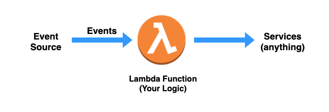
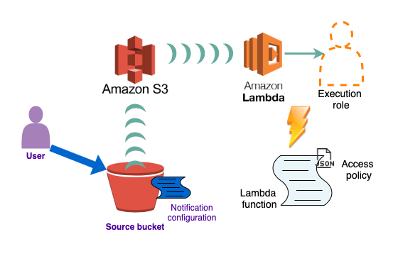
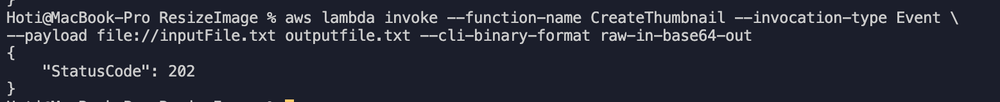

Earlier on the Webiny blog, we discussed <ExternalLink href="https://www.webiny.com/blog/5-aws-services-you-need-to-know-for-web-development?utm_source=Webiny-blog&utm_medium=webiny-blog&utm_campaign=webiny-weekly-tech-blog-feb-15&utm_content=webiny-5-aws-services-you-need-for-web-development&utm_term=W00542">the top 5 AWS services you need to know when it comes to web development</ExternalLink> — The one AWS service that grew super fast is the compute service: Lambda. `Lambda is a compute service that lets you run code without provisioning or managing servers.` — <ExternalLink href="https://docs.aws.amazon.com/lambda/latest/dg/welcome.html">What is AWS Lambda?</ExternalLink>. 

In this article, we’ll provide a guide for beginners to get started with Lambda service, starting from the serverless architecture paradigm, where does Lambda come in? We’ll go through what is Lambda, the core parts of Lambda, Lambda invocation patterns, and Lambda Execution Models? 

Last but not least, you'll get hands-on Lambda by triggering a Lambda function in each S3 image file upload where you'll resize the image.

Let's dive in.

When starting with AWS Lambda there is a great chance you heard about Serverless! **Serverless** is the new **application architecture paradigm** that came up with the **creation** of the **AWS Lambda service**. 

With serverless usually referred to as serverless applications, you will focus on the core product and business logic, learn more about serverless on the *Serverless Computing* section in <ExternalLink href="https://www.webiny.com/blog/get-started-with-cloud-concepts?utm_source=Webiny-blog&utm_medium=webiny-blog&utm_campaign=webiny-weekly-tech-blog-feb-15&utm_content=webiny-get-started-with-cloud-computing&utm_term=W00543">Get Started with Cloud Computing blog</ExternalLink>.

Lambda is usually described as a type of **serverless** ***Function-as-a-Service(FaaS)**** — a **single unit** acting as a **service** performing an **action**, no need for a server.

## What is Lambda?

Lambda is a high-scale, provision-free serverless compute service, that is offered via **functions**. With Lambda you can build the cloud logic layer for your application. You can create Lambda functions in multiple programming languages, such as Java, Node.js, C#, Go. 

Your **code** will be placed inside the Lambda function, and depending on the **event source** that will **trigger the Lambda function**, it will **execute the code** toward any **service** you want to connect your Lambda too, such as databases, data stores, or API endpoints. 

Right now we mentioned three important steps of creating and using Lambda functions, those are the **Event sources** that trigger Lambda functions, the **Code** inside Lambda function, and the **Services** you connect with your Lambda function. 

There are somewhere 50 different event sources at AWS that directly invoke the Lambda function — these services represent different **categories** such as changes in data state, requests to endpoints, etc. Many event source options can trigger your Lambda function directly, check out the full list <ExternalLink href="https://docs.aws.amazon.com/lambda/latest/dg/lambda-services.html">here</ExternalLink>.  

The other side of the Lambda function is the **services** we mentioned, anything you would do when building an application elsewhere can be done inside Lambda as well. As we can see Lambda runs within a simplified architecture that looks like the image below.


<p style="text-align: center; font-style: italic;">
  Fig 1: Simplified architecture of a running Lambda function
</p>

The Lambda runtime converts the event source into an object and passes it to your function, enabling you to build reactive, event-driven systems. When there are multiple, simultaneous events to respond to, Lambda simply runs more copies of the function in parallel.

## Lambda core parts

Our goal is to learn the key components and features of Lambda, then followed by a real-world example of building serverless applications using Lambda. Now, we'll go through the core parts of Lambda that are the function code, event sources, and function configuration. 

### Lambda Function Code

We mentioned that Lambda offers the ability to write code in different programming languages. You can also use different third-party libraries as part of your function code package. This function code package can hold up at the minimum your code you want the Lambda function to execute, and additional files, classes, and libraries that your code needs to import, manipulate, and execute. There is a limit size for the Lambda function that is a 50 MB compressed and 250 MB extracted. 

### The Handler

When your Lambda function invokes, the code execution starts in the `handler()` function (Node,js, Python), the handler function is where your logic or the statements that call your logic would exist. The code you have inside the Lambda function can call other methods and functions within the files that you've uploaded in the function code package. You can import third-party libraries, install and execute them, also **interact** with other **AWS services** or doing **API requests** to third-party web services it depends on.

Creating a lambda func via the user interface on AWS console.

```jsx
exports.handler = async (event, context, callback) => {
    // TODO implement
    const response = {
        statusCode: 200,
        body: JSON.stringify('Hello from Lambda!'),
    };
    return response;
    // callback parameter is optional
};
```

Once the handler is invoked inside your Lambda function, the runtime environment now belongs to the code you've written. After the Lambda runs the handler method, then the handler exits or returns a response, becoming available to handle **another event**.

### **The Event Object**

The **event object** is one of the parameters provided to the handler function when the Lambda function is invoked. The **event object** can have a different structure and content based on the **event source** that creates the event. Your Lambda function will consume all the data and metadata it holds in the **event** parameter. Depending on the **event source**, let's say an **API Gateway** event will have information related to the HTTPS request such as the path, query-string, request body, whereas an event from **S3** will have information related to the newly created object, and details about the bucket. 

### **The Context Object**

We mentioned when once the handler is invoked inside the Lambda function, the runtime environment now belongs to the code inside our Lambda function, the **context object**, in this case, takes information about the actual environment that the lambda function is running in. Things like **request ID log** information, **remaining time** information memory, **logging**, and other things we can pass down.

## Lambda Invocation Patterns

There are two invocation methods for a Lambda function:

- **Push Model**

    It invokes Your Lambda function every time a particular event occurs within another AWS service, that event can be placed by an API Gateway request, a new object added to the S3 bucket or a new SNS notification. The data source gives a sign for Lambda to start invoking the Lambda function with the new *data record*. 

- **Pull Model**

    Lambda polls a data source and invokes your function with any new records that arrive at the data source, batching new records together in a single function invocation (for example, new records in an Amazon Kinesis or Amazon DynamoDB stream).

You can also run Lambda functions in **synchronously** and **asynchronously** — by choosing the `InvocationType` parameter that's provided when invoking a Lambda function. 

The `InvocationType` parameter offers you to choose between three values, and those are:

- `RequestResponse` — Executing synchronously
- `Event` — Executing asynchronously
- `DryRun` — Test that the invocation is permitted for the called, but don't execute the function.

The **event sources** are the ones that decide how your Lambda function will be invoked. We'll go through Lambda use cases, and in there mention the invocation type as well.

## Lambda Use Cases

As you dive into AWS services, you get the idea of how different services we can use together to solve a digital problem and provide value for your customers. Now that you what is and what does Lambda provides when building serverless applications, you know that the core components of Lambda are the **functions** and **triggers**. 

A **trigger** is the AWS service or application that **invokes** a Lambda function, and the **Lambda function** is the code or runtime that processes events. 

Let's go through types and use-cases you can build using AWS Lambda.

### Lambda Application Types

- **File processing**
    1. Invocation Model: **Push**
    2. Invocation Type: **Event**
    3. Use Cases
        - Web apps, static websites, complex web apps, packages for Flask and Express.
        - For more specific use cases using the Lambda and S3 together on creating image modifications such as thumbnails, different resolutions, watermarks, etc.

    S3 event notifications can be used to invoke Lambda functions as they are published. 

- **Data and analytics**
    1. Invocation Model: Push
    2. Invocation Type: Event or RequestResponse

        When you build up your APIs methods, you can use Lambda functions as the backend services. Choosing Lambda as the integration type for an API method, your Lambda function is invoked synchronously — acting as a response for the API request.

    3. Use Cases
        - Backends, Apps & services, Mobile, IoT

### Use-cases

- **Web applications**
    1. Static websites
    2. Complex web apps
    3. Packages for Flask and Express
- **Backends**
    1. Apps & services
    2. Mobile
    3. IoT
- **Data Processing**
    1. Real-time
    2. MapReduce
    3. Batch
- **Chatbots**
    1. Powering chatbot logic
- **Amazon Alexa**
    1. Powering voice-enabled apps
    2. Alexa Skills Kit
- **It Automation**
    1. Policy engines
    2. Extending AWS services
    3. Infrastructure management

## Lambda Hands-on

Now that we learned what is Lambda and the core parts, let's learn how to use lambda with S3 storage by code.

There are plenty of ideas you can start with AWS Lambda, for this article, we'll use the AWS Lambda with AWS S3 storage. We already published a <ExternalLink href="https://www.webiny.com/blog/get-started-with-aws-s3?utm_source=Webiny-blog&utm_medium=webiny-blog&utm_campaign=webiny-weekly-tech-blog-feb-15&utm_content=webiny-get-started-with-aws-s3&utm_term=W00544">Get Started with S3</ExternalLink> article on our blog, where you can learn how to create S3 buckets, uploading files, listing objects, and deleting S3 bucket.

Now that we've learned two AWS services, the S3 and the AWS Lambda, we are going to use the two of them to understand how those can interact with each other to build different use cases we plan to. 

We mentioned the use cases for Lambda and S3 on creating image modifications such as thumbnails, different resolutions, watermarks, for images that you upload to an S3 bucket through your application. Processing the data that are uploaded to the S3 bucket and then moving those to another S3 bucket as part of a larger data pipeline.

In this article we're going to do just that, we're going to ***resize*** for each image file that is uploaded to a **bucket**. 


:::note
The example below is inspired by the AWS docs.*
:::

**AWS Lambda** **Resources**:

- A Lambda function
- An access policy associated with the Lambda function that grants the S3 to invoke the Lambda function.

**IAM Resources**:

- Execution role that grants permissions that your Lambda function needs through the permissions policy associated with this role.

**S3 Resources**:

- Source bucket with a notification configuration that invokes the Lambda function.
- Another bucket to save the resized images.

The below diagram shows the connection between the user, that creates an object in an S3 bucket, then the S3 detection of the created event, S3 invoking the Lambda function using the execution role permissions, and then the Lambda function.



### S3 buckets

1. Open the <ExternalLink href="https://console.aws.amazon.com/s3/">AWS S3 console</ExternalLink>.
2. You'll create two buckets
    1. `lambdatestingimage-resized` bucket
        1. The target bucket will be the bucket that will hold the resized image, and the name will be `lambdatestingimage-resized`, that will come from the base bucket name `image` where `image` is the name of the bucket you use for the uploading the images.
    2. `lambdatestingimage` bucket 
3. In the `lambdatestingimage` bucket, upload a `.jpg` object, `ExampleImg.jpg`

    When you invoke the Lambda function manually before connecting to the S3 bucket, you'll pass `mock` data to the function specifying the `image` bucket and the `ExampleImg.jpg` as the newly created object.

### IAM Policy

For us to manipulate the data in S3 with our Lambda function, we need to create an IAM policy defining the permissions for the Lambda function. That means having the chance to get the object from the `image` S3 bucket, add the `image-resized` object into the target S3 bucket, and add the permissions for the CloudWatch Logs.

1. Open the <ExternalLink href="https://console.aws.amazon.com/iam/home#/policies">Policies page</ExternalLink> in the IAM console.
2. Click the `Create policy` button.
3. Under the JSON tab, as seen in the image below.


4. copy/paste the below JSON, and click on `Review policy`, give it a name such as `AWSLambdaS3Policy` and create the policy.

:::note
Remove the comments in the JSON file below when you paste the policy.
:::

```json
{
    "Version": "2012-10-17",
    "Statement": [
        {
            "Effect": "Allow",
            "Action": [
                "logs:PutLogEvents",
                "logs:CreateLogGroup",
                "logs:CreateLogStream"
            ],
            "Resource": "arn:aws:logs:*:*:*"
        },
        {
            "Effect": "Allow",
            "Action": [
                "s3:GetObject" 
								// This is the GetObject action which allows us to get the base `image` bucket.
            ],
            "Resource": "arn:aws:s3:::lambdatestingimage/*"
        },
        {
            "Effect": "Allow",
            "Action": [
                "s3:PutObject"
            ],
            "Resource": "arn:aws:s3:::lambdatestingimage-resized/*" 
						// This is the PutObject which allows us to add the new object to the `image-resized` bucket.
        }
    ]
}
```

### Execution role

The execution role grants permissions to AWS Lambda to access different AWS services and resources. Provide the role when you create a function, then the Lambda function assumes the role when the function is invoked.

Let's create the execution role.

1. Open the <ExternalLink href="https://console.aws.amazon.com/iam/home#/roles">roles page</ExternalLink> in the IAM console.
2. Click on `Create role`
3. Check on these properties on the steps to create the role
    - Trusted entity — AWS Lambda
    - Permissions — `AWSLambdaS3Policy`
    - Role name — `lambda-s3-role`

:::note
Remember, we created the policy `AWSLambdaS3Policy` in the above step. This policy has the permissions that the function needs to manage objects in S3.
:::


### Lambda Function

Now, we'll create the lambda function to resize the images from one S3 bucket, and put the new image to another S3 bucket.

Create an `index.js` file, and copy/paste the below snippet, you'll find comments throughout the code that will explain what's happening. For your information, the <ExternalLink href="https://www.npmjs.com/package/sharp/v/0.5.2">sharp</ExternalLink> module is used to convert large images of many formats to smaller.

```jsx
// dependencies
const AWS = require('aws-sdk');
const sharp = require('sharp');

// get reference to the S3 client
const s3 = new AWS.S3();

exports.handler = async (event, context, callback) => {

    // Read options from the event parameter.
    console.log("Event:\n", event);
    const imgBucket = event.Records[0].s3.bucket.name;
    // Object key may have spaces or unicode non-ASCII characters.
    const imgKey    = decodeURIComponent(event.Records[0].s3.object.key.replace(/\+/g, " "));
    const targetBucket = imgBucket + "-resized";
    const targetKey    = "resized-" + targetKey;

    // Infer the image type from the file suffix.
    const typeMatch = imgBucket.match(/\.([^.]*)$/);
    if (!typeMatch) {
        console.log("Could not determine the image type.");
        return;
    }

    // Check that the image type is supported  
    const imageType = typeMatch[1].toLowerCase();
    if (imageType != "jpg" && imageType != "png") {
        console.log(`This image type is not supported: ${imageType}`);
        return;
    }

    // Download the image from the S3 source bucket. 
    try {
        const params = {
            Bucket: imgBucket,
            Key: imgKey
        };
        var origimage = await s3.getObject(params).promise();
        // getObject, the action we mentioned in the IAM policy.

    } catch (error) {
        console.log(error);
        return;
    }  

    // set the image width. Resize will set the height automatically to maintain the aspect ratio.
    const width  = 200;

    // Use the Sharp module to resize the image and save it in a buffer.
    try { 
        var buffer = await sharp(origimage.Body).resize(width).toBuffer();
            
    } catch (error) {
        console.log(error);
        return;
    } 

    // Upload the newly image to the destination bucket
    try {
        const destparams = {
            Bucket: targetBucket,
            Key: targetKey,
            Body: buffer,
            ContentType: "image"
        };

        const putResult = await s3.putObject(destparams).promise(); 
        // the putObject action we mentioned in the IAM policy
    } catch (error) {
        console.log(error);
        return;
    } 
        
    console.log('The image was resized successfully: ' + imgBucket + '/' + imgKey +
        ' and uploaded to ' + targetBucket + '/' + targetKey); 
};
```

### Creating the deployment package

- For mac run this command:

`npm install --arch=x64 --platform=linux --target=12.13.0 sharp`

- For linux run this:

`npm install sharp`

- Create the deployment package with the function code and dependencies

`zip -r function.zip .`

- Create the Lambda function with the `create-function` command:

NOTE: Replace the **`123456789012`** with your AWS account ID — which can be found in the upper right corner, clicking on the `My Security Credentials`, then click on `Account identifiers` and there you'll find the `AWS Account ID`

```json
aws lambda create-function --function-name CreateThumbnail \
--zip-file fileb://function.zip --handler index.handler --runtime nodejs12.x \
--timeout 10 --memory-size 1024 \
--role arn:aws:iam::123456789012:role/lambda-s3-role
```

:::note
If you're using AWS CLI version 2, add the following command parameters:
`-cli-binary-format raw-in-base64-out`
:::

### Test the Lambda function

Create a new txt file as inputFile.txt and copy/paste the below JSON snippet, don't forget to replace the source bucket name with your source bucket name. 
— You can see that there is the file we uploaded to the S3 bucket the `ExampleImg.jpg` 

— Replace that with the image that you've uploaded, if you did change the name.

```jsx
{
    "Records":[
    {
        "eventVersion":"2.0",
        "eventSource":"aws:s3",
        "awsRegion":"global",
        "eventTime":"1970-01-01T00:00:00.000Z",
        "eventName":"ObjectCreated:Put",
        "userIdentity":{
        "principalId":"AIDAJDPLRKLG7UEXAMPLE"
        },
        "requestParameters":{
        "sourceIPAddress":"127.0.0.1"
        },
        "responseElements":{
        "x-amz-request-id":"C3D13FE58DE4C810",
        "x-amz-id-2":"FMyUVURIY8/IgAtTv8xRjskZQpcIZ9KG4V5Wp6S7S/JRWeUWerMUE5JgHvANOjpD"
        },
        "s3":{
        "s3SchemaVersion":"1.0",
        "configurationId":"testConfigRule",
        "bucket":{
            "name":"lambdatestingimage", // replace the image here
            "ownerIdentity":{
            "principalId":"A3NL1KOZZKExample"
            },
            "arn":"arn:aws:s3:::lambdatestingimage" // replace the image here
        },
        "object":{
            "key":"ExampleImg.jpg", // here is the image you have uploaded
            "size":1024,
            "eTag":"d41d8cd98f00b204e9800998ecf8427e",
            "versionId":"096fKKXTRTtl3on89fVO.nfljtsv6qko"
        }
        }
    }
    ]
}
```

- Now, you'll run the `invoke` command to invoke the function by running this command:

    `aws lambda invoke --function-name CreateThumbnail --invocation-type Event \
    --payload file://inputFile.txt outputfile.txt`

    NOTE: if you're using AWS CLI version 2, add the following command parameters:

    `--cli-binary-format raw-in-base64-out`

- And the result should be as in the image below:



### Configure AWS S3 to publish events

In this step, you add the remaining configuration so that Amazon S3 can publish object-created events to AWS Lambda and invoke your Lambda function. You do the following in this step:

- Add the permissions to the function policy by running the following Lambda CLI `add-permission` to perform `lambda:InvokeFunction` action.

    Run the below command,  by replacing the `sourcebucket` into your base bucket name, and the `account-id` into your account id number.

```jsx
aws lambda add-permission --function-name CreateThumbnail --principal s3.amazonaws.com \
--statement-id s3invoke --action "lambda:InvokeFunction" \
--source-arn arn:aws:s3:::sourcebucket \
--source-account account-id
```
- Verify the function's access policy by running the AWS CLI get-policy command.

```jsx
aws lambda get-policy --function-name CreateThumbnail
```

We'll add notification configurations to the source S3 bucket, to request S3 to publish object-created events to Lambda. Follow the below steps to achieve that.

**To configure notifications**

1. Open the <ExternalLink href="https://console.aws.amazon.com/s3">Amazon S3 console</ExternalLink>.
2. Choose the source bucket.
3. Choose **Properties**.
4. Under **Events**, configure a notification with the following settings.
    - **Name** – **`lambda-trigger`**.
    - **Events** – **`All object create events`**.
    - **Send to** – **`Lambda function`**.
    - **Lambda** – **`CreateThumbnail`**.

### Test

Now you can test the setup as follows:

1. Upload `.jpg` or `.png` objects to the source bucket using the Amazon S3 console.
2. Verify it created the thumbnail in the target bucket using the `CreateThumbnail` function.
3. View logs in the CloudWatch console.

## Lambda Cheat-sheet

1. **Lambda's** are serverless functions — meaning you'll put your code into lambda function without the need to set up servers.
2. With Lambda you don't need to worry about **underlying architecture**.
3. Pricing — you'll pay per invocation that includes the **duration** and the amount of **memory** used. Follow the <ExternalLink href="https://www.webiny.com/blog/5-tips-to-make-your-lambda-functions-run-faster-and-cheaper?utm_source=Webiny-blog&utm_medium=webiny-blog&utm_campaign=webiny-weekly-tech-blog-feb-15&utm_content=webiny-5-tips-make-lambda-func-faster&utm_term=W00548">5 Tips to Make Your Lambda Functions Run Faster (and Cheaper)</ExternalLink> learn how to make your Lambda functions cheaper. 
4. You can **trigger** Lambda from the SDK or multiple AWS services, S3, API Gateway, DynamoDB.
5. **Function size and cold start**

    The first cold start happens when the first request is made after the deployment. How long is the cold start duration? 

    `The larger the function in size, the longer the cold start!` is mentioned in the <ExternalLink href="https://www.webiny.com/blog/5-tips-to-make-your-lambda-functions-run-faster-and-cheaper?utm_source=Webiny-blog&utm_medium=webiny-blog&utm_campaign=webiny-weekly-tech-blog-feb-15&utm_content=webiny-5-tips-make-lambda-func-faster&utm_term=W00548">5 Tips to Make Your Lambda Functions Run Faster (and Cheaper)</ExternalLink> blog by [Adrian](https://twitter.com/doitadrian).

6. **Warm Start**

    After the cold start happens, the lambda will remain instantiated for a while, around 5 minutes, which allows other calls to be done without the need for another initialization. The calls that are made during this period are called `warm call` — meaning the code is loaded into the memory and ready to be executed when the Lambda is called one or several times.

7. **Concurrency**

    Concurrency is the number of requests that your function is serving at any given time. When your function is invoked, Lambda allocates an instance of it to process the event. When the function code finishes running, it can handle another request. If the function is invoked again while a request is still being processed, another instance is allocated, which increases the function's concurrency. — [Source](https://docs.aws.amazon.com/lambda/latest/dg/configuration-concurrency.html).

8. **Runtime**

    There are **7 predefined runtimes** for NodeJs, .NET, Java, C#, Ruby, Powershell, and Go.

    Customize for your case, build the runtime to support any programming language.

## Lambda Pricing

AWS offers a free tier for all its services, even though they provide automatic scaling for each service, you'll pay for on-demand usage. We give more details on **pricing** in our blog of <ExternalLink href="https://www.webiny.com/blog/5-aws-services-you-need-to-know-for-web-development?utm_source=Webiny-blog&utm_medium=webiny-blog&utm_campaign=webiny-weekly-tech-blog-feb-15&utm_content=webiny-5-aws-services-you-need-for-web-development&utm_term=W00549">5 AWS Services you need to know for web development</ExternalLink>. 

---

- **Function-as-a-Service (FaaS)** — FaaS is a category of cloud computing services, providing a platform for customers to develop, run, and manage applications without having to deal with the infrastructure. Building an application following this model is one way of achieving a "serverless" architecture, and is typically used when building microservices applications. — <ExternalLink href="https://en.wikipedia.org/wiki/Function_as_a_service">Source</ExternalLink>.
- **Event-driven systems or Event-drive architecture** — refers to a system of loosely coupled microservices that exchange information between each other through the production and consumption of events. An event-driven system enables messages to be ingested into the event-driven ecosystem and then broadcast out to whichever services are interested in receiving them. — <ExternalLink href="https://developer.ibm.com/technologies/messaging/articles/advantages-of-an-event-driven-architecture/">Source</ExternalLink>.

---

Now that you have a thorough understanding of AWS Lambda compute service, from the core parts of the service to the way Lambda functions are triggered. The function in JavaScript on delivering data through the `Event` object, and manipulating data from one S3 bucket to another.

If you're interested to learn more, here are some blogs we suggest by Webiny on AWS.

- <ExternalLink href="https://www.webiny.com/blog/5-aws-services-you-need-to-know-for-web-development?utm_source=Webiny-blog&utm_medium=webiny-blog&utm_campaign=webiny-weekly-tech-blog-feb-15&utm_content=webiny-5-aws-services-you-need-for-web-development&utm_term=W00549">5 AWS Services you need to know for Web Development</ExternalLink>
- <ExternalLink href="https://www.webiny.com/blog/get-started-with-cloud-concepts?utm_source=Webiny-blog&utm_medium=webiny-blog&utm_campaign=webiny-weekly-tech-blog-feb-15&utm_content=webiny-get-started-with-cloud-concepts&utm_term=W00550">Get Started with Cloud Computing</ExternalLink>
- <ExternalLink href="https://www.webiny.com/blog/get-started-with-aws-s3?utm_source=Webiny-blog&utm_medium=webiny-blog&utm_campaign=webiny-weekly-tech-blog-feb-15&utm_content=webiny-get-started-with-aws-s3&utm_term=W00544">Get Started with AWS S3</ExternalLink>
- <ExternalLink href="https://www.webiny.com/blog/aws-re-nvent-webiny-top-5-picks-on-serverless-announcements?utm_source=Webiny-blog&utm_medium=webiny-blog&utm_campaign=webiny-weekly-tech-blog-feb-15&utm_content=webiny-aws-reinvent-top-5-picks-on-serverless-announcements&utm_term=W00551">AWS re:Invent - Webiny's Top 5 Picks on Serverless Announcements</ExternalLink>
- <ExternalLink href="https://www.webiny.com/blog/5-tips-to-make-your-lambda-functions-run-faster-and-cheaper?utm_source=Webiny-blog&utm_medium=webiny-blog&utm_campaign=webiny-weekly-tech-blog-feb-15&utm_content=webiny-5-tips-make-lambda-func-faster&utm_term=W00548">5 Tips to Make Your Lambda Functions Run Faster (and Cheaper)</ExternalLink>
- <ExternalLink href="https://www.webiny.com/blog/serverless-side-rendering-e1c0924b8da1?utm_source=Webiny-blog&utm_medium=webiny-blog&utm_campaign=webiny-weekly-tech-blog-feb-15&utm_content=webiny-serverless-side-rendering-the-ultimate-guide&utm_term=W00552">Serverless Side Rendering — The Ultimate Guide</ExternalLink>
- <ExternalLink href="https://www.webiny.com/blog/upload-files-to-aws-s3-using-pre-signed-post-data-and-a-lambda-function-7a9fb06d56c1?utm_source=Webiny-blog&utm_medium=webiny-blog&utm_campaign=webiny-weekly-tech-blog-feb-15&utm_content=webiny-upload-files-to-s3-pre-signed-post-data-lambda-function&utm_term=W00553">Upload files to AWS S3 using pre-signed POST data and a Lambda function</ExternalLink>
- <ExternalLink href="https://www.webiny.com/blog/connecting-to-aws-documentdb-from-a-lambda-function-2b666c9e4402?utm_source=Webiny-blog&utm_medium=webiny-blog&utm_campaign=webiny-weekly-tech-blog-feb-15&utm_content=webiny-connecting-to-aws-documentdb-from-a-lambda-function&utm_term=W00554">Connecting to AWS DocumentDB from a Lambda function</ExternalLink>

---

If you learned something new today and are interested to follow up on our blogs, **<ExternalLink href="https://landing.mailerlite.com/webforms/landing/g9f1i1">subscribe</ExternalLink>** to our newsletter and we'll provide you the best content of the serverless world!

---

Thanks for reading! My name is Albiona and I work as a developer relations engineer at <ExternalLink href="https://www.webiny.com/?utm_source=Webiny-website&utm_medium=webiny-blog&utm_campaign=webiny-weekly-tech-blog-deb-15&utm_content=webiny-website&utm_term=W00555">Webiny</ExternalLink>. I enjoy learning new tech and building communities around them = ) If you have questions or just want to say hi, reach out to me via <ExternalLink href="https://twitter.com/albionaitoh">Twitter</ExternalLink>.