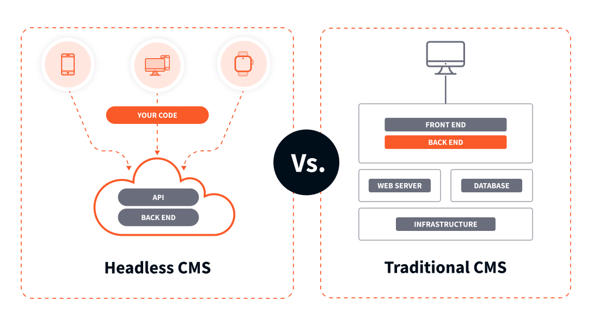
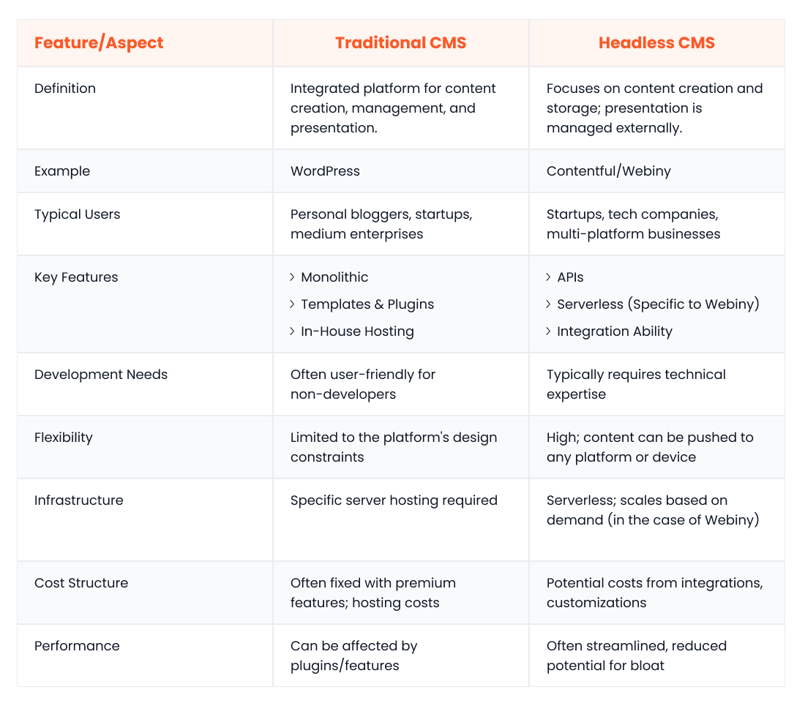
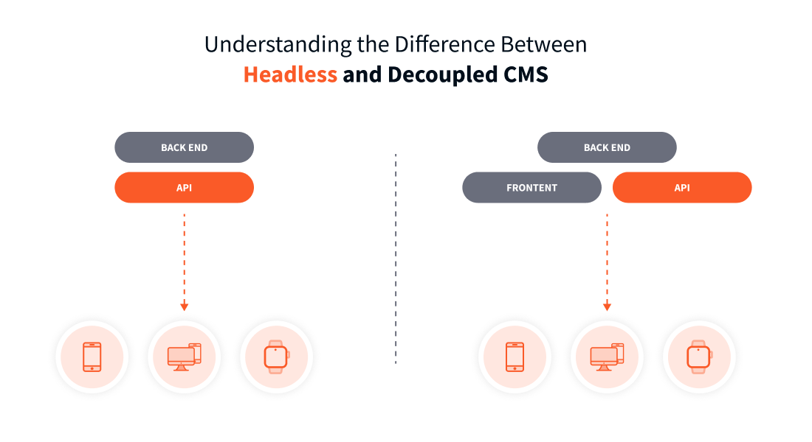

Traditional Content Management Systems (CMSs) were designed in an era when the digital landscape was simpler, and omnichannel delivery, agility, and scalability weren’t primary concerns. These legacy systems feature tightly coupled architectures, where the frontend and backend layers are inseparably intertwined within the same monolithic application.

This architectural approach creates limitations for today’s businesses. The modern reality is that businesses need to be agile and adaptable. Getting content to users across all channels, from websites and mobile apps to watches and smart displays, demands a [CMS that's built for speed](https://www.webiny.com/enterprise-serverless-cms/headless-cms).

This is where headless content management systems come into play. They offer decoupled architectures that enable businesses to boost productivity, support new touchpoints via the same backend infrastructure, and adapt to evolving digital trends and customer needs with ease.

<iframe width="560" height="315" src="https://www.youtube.com/embed/-KWwVtRUhOQ" frameborder="0" allow="accelerometer; autoplay; clipboard-write; encrypted-media; gyroscope; picture-in-picture" allowfullscreen></iframe>

## What is a headless CMS?

A headless CMS is a backend-only system designed specifically for today’s multi-channel digital world. It doesn’t come with a built-in frontend layer, but can be used to simultaneously deliver content to several frontends.

Here are the defining characteristics of a headless CMS:

- The headless CMS backend acts as the central repository for all your content. You can create, edit, and manage all your text, images, videos, and other assets in one place. However, as mentioned above, the CMS doesn’t dictate how this content is presented, giving you complete control over user experience
- The decoupled frontend and backend layers communicate via APIs. The same APIs can be leveraged to connect the headless CMS with other tools and applications, like your marketing automation or e-commerce platforms
- Content stored in a headless CMS can be reused and repurposed across multiple channels and platforms, enabling you to build truly immersive omnichannel experiences
- The decoupled architecture grants developers the freedom to use their preferred frontend frameworks or languages for UI development
- Headless CMSs allow you to treat your content as data, with the ability to create flexible models that reflect the unique relationships and hierarchies within your content. This makes it easier to manage large content volumes, personalize content delivery, and ensure consistency across channels

## How does a headless CMS work?

Next, let’s explore how a content workflow looks like in a headless CMS:

1. The process starts with the creation of content models, which specify the structure and organization of your content. You can define various content types, such as blog posts, product pages, or event listings, along with components and reusable elements like text boxes, images, or call-to-action buttons
2. Once the models are in place, your marketers and content creators can leverage them to create and manage content through a user-friendly editing interface
3. While the content resides in the headless backend, the frontend development happens independently. Developers can build UI apps for various channels, like websites, mobile apps, kiosks, and even smartwatches
4. Each frontend app makes API calls to the same headless CMS to fetch content. This approach is perfectly aligned with the Content as a Service (CaaS) model in which content is treated as a standalone service decoupled from the presentation layer
5. The frontend apps receive the structured API response and render it according to the specific needs of the channel and user interface.

## Headless CMS vs. traditional CMS at-a-glance

[Headless and traditional CMSs](https://www.webiny.com/blog/headless-cms-vs-traditional-cms) are two fundamentally distinct types of software.

A traditional CMS takes a monolithic approach, where the backend and frontend are intertwined. A headless CMS decouples these layers.

Headless CMSs offer greater flexibility in frontend development, allowing developers to use any technology stack or framework. Traditional CMSs, on the other hand, limit frontend customizability due to their monolithic architectures.

Traditional CMSs can be expensive due to licensing fees and vendor lock-in. Headless CMSs can be more cost-effective due to open-source options and API-based integrations.

Headless CMSs can offer better performance, especially for high-traffic websites, as all the resource-intensive tasks happen on the decoupled server-side. Traditional CMSs may struggle with performance issues, especially as the complexity of the website increases.

Headless CMSs are inherently more scalable, as you can scale the frontend and backend components independently. Traditional CMSs often run into scalability challenges, especially when managing growing traffic and expanding data volumes.

Here’s a tabular overview of the differences between headless and traditional CMSs.

## Benefits of Using a Headless CMS

Businesses in today's digital age are sometimes hampered by just how many instances, or actions, a CMS takes. It can number in the dozens to the hundreds. While this is necessary, it certainly makes it difficult to track and harder to manage.

Organizations can use content infrastructure to merge all of their material into a single location, decreasing the need for manual copying and pasting. Companies that need to quickly [create new landing pages](https://www.webiny.com/enterprise-serverless-cms/page-builder), software, and microsites can benefit from a headless CMS.

Finally, the content infrastructure in a CMS must encourage reusability, which is vital for maximizing content creation resources. Let's take a quick look at some pros of headless CMS:

- Platform independence
- Replaceable tech
- Omnichannel support
- API first approach
- Code maintainability

Anything else? Absolutely. A headless CMS also has a high level of functionality, flexibility, integration, and scalability.

### High-Level Flexibility

A headless CMS doesn't limit your usage of layouts or themes, unlike traditional commerce sites. It allows businesses to customize their websites considerably more quickly because the front end and back end are independent of one another.

This means it's easier to make modifications to the display layer without affecting the back end.

### Seamless Integration

Headless commerce systems allow for seamless integration of various third-party technologies and platforms. You can link any existing systems with your eCommerce site, using your preferred technologies and a robust API.

What is an example of headless CMS? You could seamlessly integrate new functionalities into your eCommerce website without changing the full eCommerce stack. This is a lot less work and is better for overall customer satisfaction.

### Scalability

Headless commerce allows you to adapt your brand to new trends and technologies without having to replatform your backend. APIs and frameworks can add functionality to your existing system as needed, so you don't have to create a new website from scratch when using a headless solution.

Instead, you can add additional features as your company expands, easily scaling up the website as needed.

### Short Time to Market

Customer behavior is rapidly evolving, and if you can't keep up with their expectations, you'll struggle to stay afloat. Because you can make changes so quickly and efficiently, feature updates and adjustments can happen with the snap of a finger.

A headless commerce organization may easily introduce new functionalities to match the preferences of clients, resulting in a [reduced time to market](https://www.webiny.com/features/development-framework).

### Omni Channel Experience

The customer journey has become more complicated, with [74% of customers](https://www.martechalliance.com/stories/customer-experience-stats-trends) starting transactions over multiple channels, depending on the situation. As a result, businesses can no longer rely on a single-channel strategy.

With headless commerce, you can provide a superior buying experience to your clients regardless of the shopping channel they use. You can also customize your front end and create an eCommerce website that operates across several channels without strange bugs or weird formatting.

## The difference between headless and decoupled CMSs

Headless and decoupled CMS architectures are often confused with each other. Despite having some functional overlap, they represent different architectural approaches to content management.

Think of a decoupled CMS as a traditional CMS with added flexibility.  While it maintains the core structure of a traditional system (with tightly coupled frontend and backend), it also provides APIs for connecting to external frontends. This means the built-in frontend, while present, becomes optional.

On the flip side, a headless CMS lacks any built-in frontend, making it inherently more lightweight, performant, and scalable than a decoupled counterpart.

## Use cases for headless CMS

Let’s look at a few ways headless CMSs can power real-life business use cases:

- **Multi-platform content deliver**y: Headless CMS allows you to break free from siloed content. You can manage everything in one place and deliver it seamlessly across an ever-expanding array of platforms and channels
- **Personalized experiences**: Using APIs, you can integrate a headless CMS with a marketing automation tool to tailor content delivery based on user data and preferences
- **Content localization and internationalization**: Most headless CMSs come with built-in tools to manage and deliver content in multiple languages
- **E-commerce content management**: With a headless CMS, you can deliver product content across your online stores, mobile apps, and other sales channels. You can also personalize the storefront to match your brand identity
- **Dynamic landing pages at scale**: Marketers can use headless CMSs to create and deploy [dynamic landing pages](https://www.webiny.com/enterprise-serverless-cms/page-builder) at scale tailored to specific campaigns, target audiences, or marketing segments

## Choosing a headless CMS

Moving away from a traditional CMS to a headless is a big decision for any organization. It’s important to weigh up the needs of the business versus what a headless CMS can offer.

Consider the following factors when [choosing an enterprise headless CMS](https://www.webiny.com/blog/choosing-the-best-enterprise-cms-for-your-business) for your business:

### Scalability

Consider your future content growth and traffic volume.  The chosen headless CMS should be able to scale seamlessly to meet your evolving needs. Opting for a platform with a [serverless architecture](https://www.webiny.com/features/aws-serverless-infrastructure) allows your website to scale as required.

### Security

Evaluate the security features, compliance certifications, and intrusion detection capabilities of the CMSs under consideration. You’ll want to choose a platform/provider with features that include encryption at rest and in transit, regular updates to fix bugs, and subscribes to industry-standard security protocols.

### Ease of use

The chosen CMS should be user-friendly for all members of the digital team, including marketers, content creators, and developers. This may include starter kits for developers, or no code, [drag and drop functionality](https://www.webiny.com/enterprise-serverless-cms/page-builder) for marketing teams.

### Community support

Look for a headless CMS with a large and active user base that can provide helpful resources, tutorials, and troubleshooting assistance.

### Customizability

Prioritize [open-source](https://www.webiny.com/features/open-source), enterprise-ready headless CMSs – like [Webiny](https://www.webiny.com/) – that offer limitless customizability and [self-hosted functionality](https://www.webiny.com/features/self-hosted-headless-cms). This will allow you to tailor both the frontend and backend per your specific needs.

### Pricing

The pricing models of headless solutions can vary.  Some offer freemium plans, while others charge based on features or storage.  Choose a model that aligns with your budget and project requirements. SaaS-based applications generally fall foul of charging clients when looking to scale, we cover this in our article ‘[Webiny vs Contentful](https://www.webiny.com/blog/webiny-vs-contentful)’ if you wish to explore this further.

## Best practices when implementing a headless CMS

Here are some guidelines and best practices to ensure a smooth and successful implementation of a headless CMS:

1. Before you dive in, take a step back. Evaluate your current content needs, goals, and existing technology stack. Answer questions like: what are the limitations of my current content platform? What business goals am I planning to achieve? Are there any specific integration points or dependencies to consider? This will help you choose a platform that delivers the most value to your team
2. A headless CMS empowers your non-technical colleagues to work independently of developers. However, they will still require training to learn the new system and its functionalities. Training sessions should cover content modeling, creation, editing, [publishing workflows](https://www.webiny.com/enterprise-serverless-cms/advanced-publishing-workflow), and other features of the platform
3. Similarly, provide your development team with all the tools and resources they need to harness the full potential of the platform. This will include SDKs, starter kits, [documentation](https://www.webiny.com/docs), [user guides](https://www.webiny.com/docs/user-guides/overview), tutorials, a [developer community](https://www.webiny.com/slack), API explorers, and source code access (if the headless CMS is open-source)
4. Next, invest time in defining clear, structured content models that reflect your content types and their relationships
5. Leverage APIs to establish smooth communication between your headless CMS and other tools in your tech stack
6. Start creating, editing, and publishing content for your various digital channels
7. No project is complete without thorough testing. Formulate and enforce a testing strategy to ensure seamless content delivery across all your chosen channels. Be prepared to iterate and fine-tune your approach based on testing results.

## Why choose Webiny as your headless CMS platform

The headless CMS landscape is brimming with options, each vying for your attention. Some cater specifically to large enterprises, offering robust features and scalability at a premium. On the other hand, there are more affordable options, but they often lack the feature set or scalability needed for complex projects.

In this crowded space, [Webiny](https://www.webiny.com/) stands out as a true outlier. It shatters the traditional mold by being the only enterprise-ready headless CMS that is [open-source](https://www.webiny.com/features/open-source), [cost-effective](https://www.webiny.com/pricing), and deployable within your own [AWS infrastructure](https://www.webiny.com/features/aws-serverless-infrastructure).

Here are a few reasons why modern enterprises are choosing Webiny over the likes of [Sanity](https://www.webiny.com/blog/webiny-vs-sanity), [Contentful](https://www.webiny.com/blog/webiny-vs-contentful), [Contentstack](https://www.webiny.com/blog/webiny-vs-contentstack), [Strapi](https://www.webiny.com/blog/webiny-vs-strapi), and Storyblok:

### Self-host with confidence

With Webiny, you can [self-host](https://www.webiny.com/features/self-hosted-headless-cms) on your own terms, enjoying full control over your content and infrastructure. This eliminates vendor lock-in and ensures compliance with even the most stringent data security regulations.

### Scale automatically with serverless

Webiny is built on top of [serverless infrastructure](https://www.webiny.com/features/aws-serverless-infrastructure), allowing it to scale automatically based on demand. This eliminates the need for manual server provisioning and reduces infrastructure costs, all while delivering optimal performance, even during traffic spikes.

### Native multi-tenancy

A standout Webiny feature is its native support for [multi-tenancy](https://www.webiny.com/features/multi-tenancy-site-management), complete with data segregation and per-tenant customizability. This means that you can manage multiple projects or clients within a single deployment.

### Extensible by design

Webiny is available as an [open-source software](https://www.webiny.com/features/open-source) under the MIT license. Moreover, it comes with an [easy-to-use development framework](https://www.webiny.com/features/development-framework) that allows you to extend or customize the platform according to your unique operational needs.

### More than a headless CMS

Webiny is an [all-in-one digital solution](https://www.webiny.com/features/cms-plus) that goes beyond traditional headless CMS offerings. You can build dynamic landing pages using the [page builder](https://www.webiny.com/enterprise-serverless-cms/page-builder), manage all your assets with the [file manager](https://www.webiny.com/enterprise-serverless-cms/file-manager), streamline content review processes with the [advanced publishing workflow](https://www.webiny.com/enterprise-serverless-cms/advanced-publishing-workflow), and create customized forms with the [form builder](https://www.webiny.com/enterprise-serverless-cms/form-builder).

## Future Proof Your Content Management

Companies looking for more from their CMS systems should seriously investigate the potential of a headless CMS. They not only make your content more flexible but are easier to update and maintain.

Plus, that separation between content and code is key. Without it, you run the risk of tying your content into a single infrastructure and rooting it into a single, stationary system.

This could easily lead to delays. When there is consistent demand, you can't afford to have anything stalling on the back-end. A headless CMS solves that.

Sound interesting? Why not [try a headless CMS](https://www.webiny.com/pricing) for free and see if you like what you find? It could be a game-changer. To find out more about Webiny, get in touch today. Our team is on hand to walk you through how Webiny can benefit your organization.