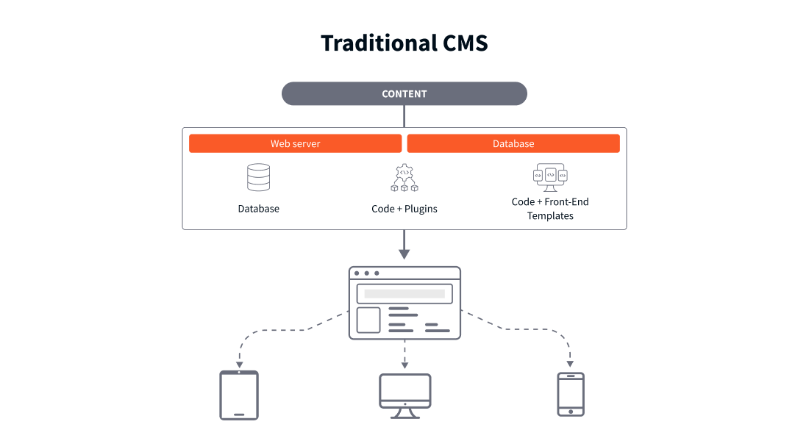
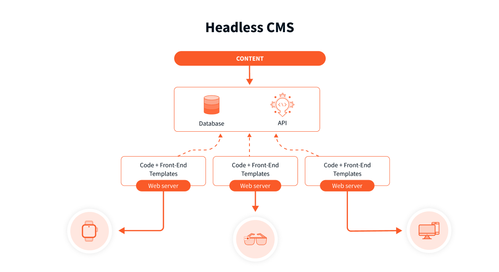
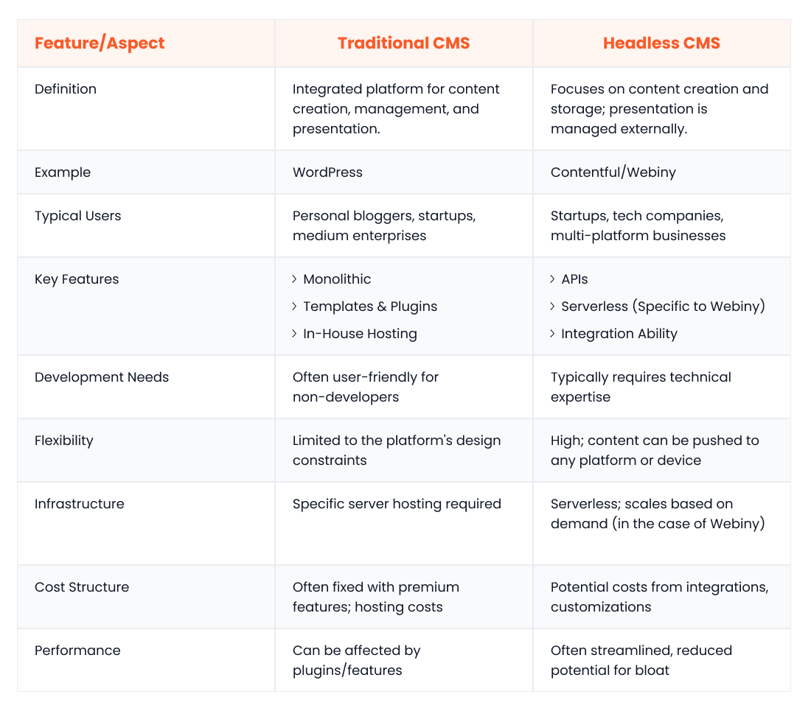
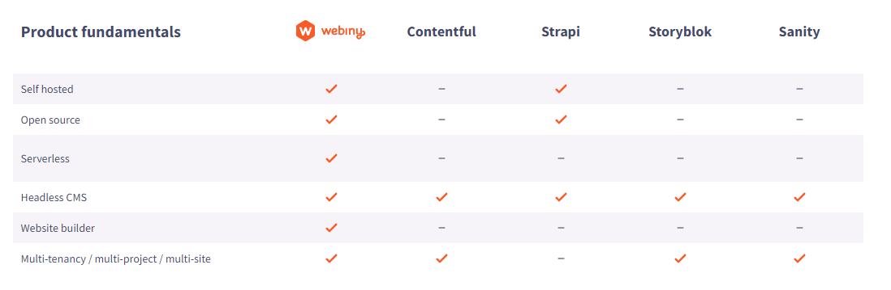

A CMS, or content management system, is a software application that allows users to create, manage, and edit content on a website without deep technical knowledge. Its purpose is to reduce the gap between technical and non-technical users and help non-technical users use and distribute digital content more efficiently.

In its most basic form, content management systems are used for:

- Providing tools to easily create web pages, blog posts, and multimedia content
- Protecting content in a database for smooth retrieval and updates
- Allowing users to publish content, making it accessible to the audience
- Facilitating timely updates, revisions, and deletions based on changing needs

However, there is a shift in how content management systems are used, which is the focus of this article.

A traditional CMS- also known as a First-generation content management system or a legacy CMS- combines both the front and back end into a single system.

This setup worked well during the days when desktop browsing was the norm. But as more digital devices like smartphones, smartwatches, and voice assistants emerged, these integrated CMS systems faced the headache of consistently distributing content across multiple channels without hours of input on the backend across various CMS platforms.

Enter the headless CMS, a back-end-only system that acts as a centralized content bank easily connected to front-end platforms responsible for displaying content using an API. One instance of content disseminated across varying digital channels.

In this article, we'll look at traditional CMSs and headless content management systems, understanding the key differences between the two. Armed with this information, we'll discuss what a business should consider when picking a CMS and advise whether your business would benefit from a powerful headless CMS solution like [Webiny](https://www.webiny.com/).

Let's read on to find out more.

## Traditional CMS Explained

A traditional CMS is a software system in which content creation, management, and presentation are integrated into a single platform. It is also known as a coupled or monolithic CMS.

A real-world software example of a traditional CMS is WordPress. When you create a blog post or a page in WordPress, you do so in the backend. Once you hit 'publish', that content is immediately displayed to viewers on the front end of the website, using themes and templates you've chosen within the same platform.

This approach works well for businesses of various sizes, from startups and personal blogs to SMEs and potentially larger organizations that don't need to disperse content across different digital channels.

### Features of a Traditional CMS

Core features of a traditional CMS include:

- **Monolithic** - A traditional CMS is often called monolithic because the backend content management and the front end are unified and operate within the same system
- **Templates & Plugins** - In traditional CMS platforms, templates & plugins are integral features. These pre-designed templates allow pre-defined customization options when displaying content. In contrast, plugins provide additional functionality that doesn't necessarily come standard with the out-of-the-box CMS solution
- **In-House Hosting** - These systems usually require specific server hosting conditions. Often, the CMS vendors themselves will offer this hosting. However, users also have the option to set up the hosting independently if they have particular requirements or preferences -- think security or regulatory compliance
- **Content Management Tools** - These systems have built-in tools for content creation, editing, and organization to simplify the web management process
- **Out-of-the-Box Solution** - Many traditional content management systems are immediately ready for use once installed, requiring little effort in the way of setup

### Pros

#### User-Friendly

Traditional CMS platforms are designed with the user experience in mind. Even those without technical expertise can use their interfaces without much difficulty. Overall, this ease of use reduces the need for specialized training or hiring a specialized team to manage the website.

#### Integrated Solution

With a traditional CMS, you benefit from an integrated solution where content creation, management, and presentation are all under one roof. This increases your workflow's efficiency and eliminates the complexities and potential hiccups of merging separate systems. This unified approach often results in quicker response times when actioning site changes, be it content updates or design modifications.

#### Vast Support

Popular traditional CMS platforms like WordPress have established extensive online communities. Users can tap into countless online tutorials, forums, and resources to troubleshoot or enhance their sites. Many platforms offer official support channels or extensive documentation, simplifying problem-solving.

### Cons

#### Limited Flexibility

When using a traditional CMS, you might find its intertwined nature of content and presentation limiting. This can pose challenges when adapting content for various digital platforms or devices, like smart devices and AR/VR platforms.

For example, think about a local news site that looks great on a computer but doesn't fit on a mobile phone or tablet. Internal teams might have to redo much of the work to make it look good across varying digital channels, which takes time and resources to achieve.

This example demonstrates the limitations of a traditional CMS and how it can sometimes be too rigid to cater for the demands of the modern digital world, where people use many devices to access content.

#### Potential Overheads

As websites grow and more plugins or features are added to a traditional CMS, there can be a noticeable decline in performance and speed. These platforms might also have unnecessary built-in features, contributing to site bloat and maintenance challenges. Another issue of these platforms is the over-reliance on plugins for extra functionalities, which can lead to compatibility issues.

As websites grow and the need for customization increases to ensure content consistency across varying channels, the need for a larger team to manage this rigid ecosystem grows. Costs often increase across employee resources, licencing fees, and technical elements such as server hosting fees.

#### Maintenance Requirements

With traditional CMS platforms, you'll often need regular updates to keep them secure and aligned with the latest web standards. Neglecting these updates can leave your site vulnerable to security threats or lead to malfunctioning features. Moreover, themes and plugins also demand attention, requiring updates. However, they might not always sync -- or exist -- with the latest version of the CMS, which poses additional challenges.

## Headless CMS Explained

A [Headless CMS](https://www.webiny.com/knowledge-base/headless-cms) is a content management system that focuses solely on the backend content creation and storage, leaving the content presentation or front end to be handled elsewhere. Essentially, the front end, often referred to as the "head," is removed, giving rise to the term "headless."

Take [Webiny](https://www.webiny.com/) as a real-world example of a Headless CMS. Webiny users can create and store content and then, through APIs, deliver this content to various digital platforms like websites, apps, IoT devices, and more.

If you're a business seeking flexibility across multiple platforms or aiming to future-proof your content delivery, a headless CMS like Webiny is an excellent choice.

It's suitable for various companies, from startups to larger organizations. A [headless CMS thrives for larger enterprise clients](https://www.webiny.com/enterprise) requiring a centralized system to manage thousands of digital projects.

### Features of a Headless CMS

- **APIs** - Unlike a traditional CMS that directly renders content, a headless CMS uses APIs to deliver content wherever needed. This offers flexibility, allowing content to be pushed to any platform or device.
- **Serverless** - Currently, most headless CMSs are not serverless. However, Webiny operates in a [serverless environment](https://www.webiny.com/features/aws-serverless-infrastructure). This reduces infrastructure costs and scales automatically based on demand, contrasting the in-house hosting of many traditional CMSs.
- **Integration Ability** - When content is separated from presentation, it is easier to integrate with other platforms, tools, or systems. This offers more agility for organizations than traditional CMS's monolithic structure.
- **Open-Source** - Many headless CMS platforms, like Webiny, are [open-source](https://www.webiny.com/features/opensource). Being open-source means you can customize extensively for your needs, integrating them as part of an existing tech stack. Given the size and complexity of enterprise tech stacks, utilizing a CMS that allows true customizability and integration is essential.
- **Smaller Dev Team** - With reduced front-end complexities and A standardized backend, a smaller development team is often sufficient for managing and maintaining a headless CMS. This can also offer potential cost savings. Webinys platform – serverless in nature – means that businesses are able to reduce DevOps costs by as much as 60-80%.
- **Ability to Run Multi-Tenanted Projects** - This feature [serves multiple sites](https://www.webiny.com/features/multitenancy) or platforms from a single backend setup. This is often a clear benefit over traditional CMSs, which often require separate configurations for each instance. Please note, some traditional CMSs do support multi-tenanted projects.

### Pros of Headless CMS

#### Flexibility Across Platforms

Headless CMS is inherently adaptable, allowing content delivery across multiple devices and platforms without redesign. This makes it easier to ensure consistent content experiences everywhere, from websites to mobile apps to IoT devices. It offers a marked advantage over traditional CMS when targeting diverse target audiences.

#### Future-Proofing Content

With a Headless CMS, you're future-proofing your content. Thanks to its decoupled nature, any updates or alterations to the presentation layer won't impact the content. This means you face less risk of obsolescence compared to traditional CMSs. Moreover, adapting to new technologies or platforms becomes straightforward.

#### Streamlined Operations

With Headless CMS, you benefit from streamlined operations. Since it concentrates on core content management and has fewer in-built features, you won't encounter unnecessary complexities or bloat, both technically and from a human resource perspective. This approach simplifies operations and often outperforms traditional CMS setups riddled with excess features.

### Cons of Headless CMS

#### Requires Technical Expertise

When you opt for a headless CMS, you'll often find it requires more profound technical expertise than a traditional CMS's ready-to-use solutions. Integrating it with the presentation layer, whether a website or app, demands specific development skills. This might make it challenging if you're a non-technical user or running a small business without a dedicated tech team.

#### Increased Initial Setup Time

Setting up a headless CMS can take longer initially, given that content and presentation are handled separately. This often means you'll spend more time getting things up and running, especially when compared to the all-in-one solutions offered by traditional CMS. For you, this could result in extended project timelines initially.

#### Potential Cost Implications

While some headless CMS platforms are open-source and free, you might face costs from integrations, customizations, or opting for premium features. When you compare this to traditional CMS options that provide a suite of features for a set price, a headless CMS may make it hard to forecast expenses when running the system.

## How to pick a CMS for your Business?

There are several factors that one should consider when picking a new CMS for your business. We boil it down to 8 main points to consider.

### Project Requirements

Before selecting a CMS, understanding your project's core needs is essential. What type of content will you manage? Is it mostly text, images, videos, or a combination of all? Will you serve it to a website, mobile app, or even IoT devices?

A traditional CMS like WordPress will be adequate for more straightforward content needs directed primarily at a website. However, for a more dynamic range of content, especially if it's intended for multiple platforms, a headless CMS becomes a more fitting choice, offering flexibility in content delivery.

### Size & Scalability

The size of your organization and the anticipated growth play an essential role in CMS choice.

Small teams with limited content needs might find traditional CMS more straightforward and cost-effective. However, a headless CMS's scalability can be extremely helpful for businesses or individuals managing several online projects. It's perfect for companies with long growth trajectories because its decoupled design simplifies content scalability.

### Flexibility and Customization

Flexibility is vital for businesses anticipating frequent changes or having unique requirements. While traditional CMSs have many plugins and themes, they can sometimes be restrictive.

On the other hand, headless CMS, being open-source and decoupled, often allows for deeper customization. This will help you to alter your website to specific business needs without significant overhauls.

### Content Management and Editorial Needs

The efficiency of content creation and management can impact your business significantly. With its user-friendly interfaces, a traditional CMS is often a perfect fit for editorial teams that might not be tech-savvy. On the other hand, if you have a larger team or require advanced workflows across different platforms, a headless CMS could be the way to go. While it might have a steeper learning curve, it offers a more efficient backend operation.

### Multi-platform Delivery

Nowadays, the very nature of being an enterprise business demands a presence across multiple digital platforms. With its API-driven approach, a headless CMS effortlessly pushes content to websites, mobile apps, smart devices, and more. If your strategy involves multi-platform content delivery, a headless CMS is a more adept choice over a traditional CMS.

### Performance

User experience, greatly influenced by performance metrics like page load times and SEO, can't be compromised. While traditional CMS can sometimes get bogged down with plugins, affecting performance, a headless CMS often promises better load times and optimized performance, given its reduced front-end complexities.

### Security

It's a non-negotiable to ensure the security of your content and user data. Traditional CMSs pose increased security risks due to the self-contained nature of the front end and back end.

A Headless CMS has the advantage of being decoupled. This can offer better security as content delivery and management are separate. For example, even if a cyber attack compromises the presentation layer of a headless CMS, they don't automatically gain access to the backend where content and critical business information are stored and managed.

### Integration with Existing Systems

It's vital to ensure compatibility when considering integration with your existing systems, whether it's CRM, e-commerce platforms, or analytics tools.

Traditional CMS typically features a wide range of plugins designed explicitly for integrations. However, you gain an edge with a headless CMS and its API-centric approach. You're provided greater flexibility to meld with various third-party systems, often leading to more robust integration experiences.

### Future-proofing

Future-proofing is essential in our fast-paced technological world. When you choose a CMS, it's important to pick one ready for upcoming changes in various technologies from a cost and performance perspective. Traditional CMS platforms do roll out updates to meet new demands. However, a headless CMS, thanks to its decoupled design, ensures that the way you deliver content is future-proofed from the point of view that it is easily customizable.

Choosing a suitable CMS is a balance of understanding your current needs and anticipating future requirements. While the decision isn't always black and white, weighing these factors will guide businesses toward a choice that aligns best with their goals.

## Signs that your business might be due a Headless CMS Upgrade

When evaluating whether your business needs to shift from a traditional CMS to a headless one, there are definitive signs to look out for.

### Multi-Platform Content Delivery

A headless CMS is a wise choice if your business aims to deliver content across various platforms such as websites, mobile apps, IoT devices, and other digital channels.

With its API-first approach, a headless CMS ensures consistency across these diverse channels. Moreover, when dealing with multiple platforms, the backend of a headless CMS handles the intricacies, resulting in quicker deployments and resource optimization. Instead of managing multiple code bases for various platforms, you can centralize your efforts, which is cost-effective and efficient.

### Future-Proofing

If you expect to future-proof your content delivery, a headless CMS offers several advantages:

- It provides an adaptable framework that makes integrating new front-end technologies less challenging
- By choosing a CMS that can quickly adapt, you safeguard your significant technology investments for the long term
- As technology evolves, so do user expectations. To deliver an improved user experience that both meets and surpasses these growing expectations, you need a CMS that is easy to modify

### Developer Flexibility

A headless CMS can be the best option for your enterprise if you want to let your developers work with the technologies they know -- and are comfortable with -- rather than compelling them to use a platform they may not be as familiar with.

This decision allows your development team to select the tools and technologies that best align with your project's needs. With this increased flexibility, your developers can rapidly prototype and iterate based on feedback more efficiently. Moreover, you will notice greater project efficiencies by reducing the learning curve and allowing your developers to work with what they already know.

### Performance Optimization

Another signal that a headless CMS might be in your business's best interest is if you're keen on optimizing your website's performance. A headless CMS can offer advantages such as faster load times, better SEO application, reduced stress on backend servers, and scalability to handle growing traffic demands.

These performance-related benefits can significantly enhance your users' experience while maintaining consistent and reliable website performance.

### Scalability

If your online presence is experiencing growth, you're likely to encounter occasional traffic spikes. The flexibility of a headless CMS allows it to handle these fluctuations, ensuring your website remains responsive and reliable, even during high-traffic periods. Moreover, as your content library expands, transitioning from a few hundred pieces of content to thousands or more, a headless CMS can effortlessly accommodate this growth without operational hitches.

If your business is expanding globally, latency can be a concern. Many headless CMS solutions utilize CDNs that ensure content is delivered quickly, no matter where the audience is.

### Customization and Personalization

Consider a change if you aim to offer your audience more personalized content based on their preferences or behaviours. A headless CMS could be the answer you're looking for.

With features like audience segmentation, you can effortlessly create content for different groups without diving deep into backend changes. Moreover, dynamic content rendering can allow you to present content in varied ways, depending on how users interact with your site.

### Microservices Architecture

A headless CMS may be suitable if you consider using a microservices architecture for content. In microservices, one service's issue doesn't affect the whole system. Similarly, a headless CMS offers consistent uptime and reliability because it's decoupled.

You can change one part without impacting others, making updates faster and safer. You can also allow different parts of the system to utilize the technology that suits them best. Finally, you can scale isolated sections, saving you money in the long term.

### Cost Efficiency

Ideally, these cloud-based headless CMS platforms would work on a pay-as-you-go model – something Webiny does exclusively. This means you only pay for the resources you use. With less infrastructure involved, you don't necessarily need specialized hosting, which can also lead to lower development costs.

Furthermore, because the backend is separate from the front end, any updates, patches, or changes become simpler and might not need to happen as often, saving you more money.

### Content Reusability

With a headless CMS, you can efficiently deliver consistent content across various platforms and channels. This means you don't have to recreate or reformat content every time. You maintain one version, which helps reduce mistakes and inconsistencies during updates or revisions. This cuts down on extra work for content teams, as there's no need to produce the same content multiple times for different outputs. It's a time-saver and ensures consistency.

### Global Content Delivery

A headless CMS might be the right move for your company if you're targeting a global audience.

Many headless CMS solutions integrate well with CDNs, which helps to deliver content rapidly irrespective of user location. With a headless system, you can adjust content for different regions without changing the setup. Moreover, many headless CMSs have built-in multilingual support and tools to address regional nuances.

### Enhanced Security

Since the front end is separated from the back end, vulnerabilities in one don't necessarily compromise the other. Content access and modifications occur through APIs, providing tighter control over who or what can modify or access content.

Many headless CMS platforms are cloud-based and frequently receive security updates. A significant reason for the enhanced security of a headless CMS is that the backend, where content is stored and managed, isn't directly exposed to the public internet, reducing potential attacks.

### Streamlined Workflows

Front-end developers can work on the user interface, while back-end developers focus on content structures and integrations. This parallel approach means that even if the front end isn't ready, content teams can still draft, review, and get approvals, speeding up content readiness.

Developers and content creators can also set up modular content components, which helps to assemble new pages or layouts faster. Plus, with features like real-time editing, comments, and versioning commonly found in many headless CMS platforms, collaboration between teams becomes more effective.

## Webiny: A Best-in-Class Headless CMS Solution

<iframe width="560" height="315" src="https://www.youtube.com/embed/-KWwVtRUhOQ?si=rx43seXmDj5yMoFI" title="YouTube video player" frameborder="0" allow="accelerometer; autoplay; clipboard-write; encrypted-media; gyroscope; picture-in-picture; web-share" allowfullscreen></iframe>

####

If you're steering your enterprise business toward a headless CMS, it's crucial to pick a platform that aligns with current needs and future scalability. Webiny offers precisely that and more.

Webiny stands out for several reasons. First, it promises a unified development experience, making it easier for developers to collaborate and innovate. This is further supported by pre-configured integrations, simplifying the onboarding process and reducing project launch times.

Importantly, Webiny's ready-made [serverless architecture](https://www.webiny.com/features/aws-serverless-infrastructure) ensures that as your website traffic grows, the platform can handle the increased load without any downtime. This is a significant advantage for businesses looking to scale quickly, as it reduces the technical challenges often associated with growth.

Furthermore, with Webiny, users can define content structures through a UI, GraphQL API, or directly in the code. The platform's built-in [page builder](https://www.webiny.com/enterprise-serverless-cms/page-builder), [form builder](https://www.webiny.com/enterprise-serverless-cms/form-builder), and [file manager](https://www.webiny.com/enterprise-serverless-cms/file-manager) offer a comprehensive suite for content management.

Above all, Webiny's [multi-tenant architecture](https://www.webiny.com/features/multitenancy) supports multiple sites or applications within one instance, drastically cutting down management overheads.

To find out more about Webiny, [get in touch today](https://www.webiny.com/forms/product-demo).

## Conclusion

The shift to a headless CMS is not just a trend but a strategic move for businesses looking to stay ahead of the competition.

The signs we've discussed emphasize the benefits and flexibility of adopting such a system, from developer freedom and content reusability to global content delivery and streamlined workflows. Making the right choice for your business is essential, and this involves picking a platform that aligns with your current and anticipated needs.

Webiny stands out as a top-tier headless CMS solution created for modern enterprise businesses. Webiny provides businesses with complete control over their data and offers unparalleled customizability and scalability benefits.

So, whether you're a small business or a large enterprise anticipating massive growth, Webiny is ready to support and grow with you. [Get in touch today](https://www.webiny.com/forms/product-demo).