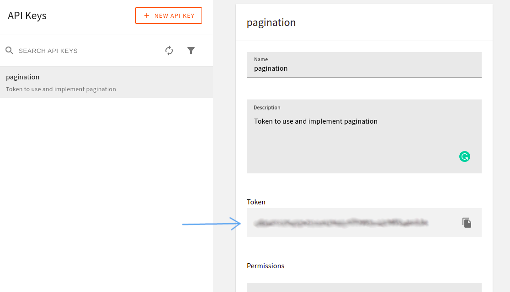

import OnPagePromo from "../components/ui/on-page-promo/on-page-promo"

Fetching data and rendering it in a UI built with React is fantastic … until your blog starts to run into tens, or even hundreds of articles. Once it does, you’ll notice your API calls will slow down to a crawl, and rendering will start to become unresponsive. Let’s look at how you can eliminate these issues using Pagination. What is pagination? How do you fetch data using pagination with Apollo Client in a React application? These questions will be answered as we dive into building a paginated blog with React and [Webiny Headless CMS](https://www.webiny.com/enterprise-serverless-cms/headless-cms).


## Prerequisites

To follow along with this tutorial, you need to have the following:

- [AWS account and user credentials](https://www.webiny.com/docs/infrastructure/aws/configure-aws-credentials) are set up on your system
- Basic knowledge of React and GraphQL
- Node.js >=14 and yarn ^1.22.0 || >=2 installed in your system
- Star our [GitHub Repo](https://github.com/webiny/webiny-js) 😉

## Introduction to Webiny Headless CMS

A headless CMS is one that deals strictly with the content. It is a backend-only CMS where the content repository is separated from the presentation layer. Once created its content is served via an API giving front-end developers full control over the user experience using tools they are most familiar with.
The Webiny Headless CMS is GraphQL based, with a powerful content modeling feature and it’s serverless, so optimized for scalability by default. To learn more about headless CMS checkout our [headless CMS guide](https://www.webiny.com/knowledge-base/headless-cms).

## What is pagination

Pagination is the method of splitting digital content into different pages where site visitors can navigate between these pages by clicking on links often located at the bottom of a page.

This pattern is used so site visitors do not get overwhelmed by a mass of data on one page which would make it difficult for identifying a target item. By splitting large data sets into chunks, it can also help solve performance issues both on the client and server side.

There are two strategies mainly used to achieve pagination and they are:

- Offset-based pagination
- Cursor-based pagination

In this article, we are only going to cover the cursor-based pagination since it’s the one implemented on Webiny headless CMS.

## Cursor-based Pagination

Cursor-based pagination works by returning a pointer (cursor) to the last items on a page which will then be used on subsequent requests to get the next result after the given pointer. The returned cursor must be unique and sequential for all items in the dataset.

Let’s look at an example of how cursor-based pagination works using ID as the cursor. Say we have the following datasets:

```json
[
  { id: 1, author: 'author1'},
  { id: 2, author: 'author2'},
  { id: 3, author: 'author3'},
  { id: 4, author: 'author4'},
  { id: 5, author: 'author5'},
  { id: 6, author: 'author6'},
  { id: 7, author: 'author7'},
  { id: 8, author: 'author8'},
]

```

To get only four results for every page the first request will look like this:

```json
cursor: 0
limit: 4

// OR

after: 0
limit: 4

```

Which will return four (4) results starting with an ID of one (1)

```json
[
  { id: 1, author: 'author1'},
  { id: 2, author: 'author2'},
  { id: 3, author: 'author3'},
  { id: 4, author: 'author4'},
]

```

The next request will be:

```json
cursor: 4
limit: 4

// OR

after: 4
limit: 4

```

With results:

```json
[
  { id: 5, author: 'author5'},
  { id: 6, author: 'author6'},
  { id: 7, author: 'author7'},
  { id: 8, author: 'author8'},
]

```

IDs are often used as the cursor because they are sequential and unique. However when objects can be sorted or filtered in some way, APIs are better suited to using a different method. This is why Webiny's cursors are located in a separate property. We will see how that works shortly.

## Create And Deploy a new Webiny Project

To get started, we need to first create a Webiny project, deploy it, and then model our content in the headless CMS using the generated Admin app.

To deploy a new Webiny project, enter the following command in the terminal:

```bash
npx create-webiny-project webiny-pagination
```

After running the above command you will be asked several questions one of which is to choose a database, for that, select **DynamoDB** which is suitable for our use case. The above command will create a Webiny project called **webiny-pagination** which consists of three applications: a GraphQL API, an Admin app, and also a React website.

Once the new project has been created, it’s time to deploy it into our [AWS account](https://www.webiny.com/docs/infrastructure/aws/configure-aws-credentials). We can do this with the following commands.

```bash
cd webiny-pagination

yarn webiny deploy
```

If it’s our first deployment it will take over 20 minutes. After it’s done the URL to the Admin App, GraphQL API endpoints and website would be printed out in the terminal. We will use them shortly.

## Defining Content Model in the Admin app

A content model defines the structure of the content we want to store in the CMS. For our use case, we will define a Book model which will hold the book entries we will use to implement pagination.

To access the Admin app we can click the URL which was printed in the terminal earlier when we deployed our project.


(Perhaps you have closed the terminal, to view the URLs you can run the `yarn webiny info` command.)

The first time you access the Admin app you will be be prompted to create a default user with our details. After doing that, we will be taken to the welcome page:


Next, navigate to the **Content Models** page by clicking on the **New Content Model** button within the **Headless CMS** card. On the next page click on **New Modal** at the top of the page and we will see a prompt with a form to add some information for the new Content Model.


In the name input enter **Book,** then click on the **CREATE MODEL** button. On the next page, we will see different field types we can add for our **Book** model:


To add a field, we need to drag and drop it in the drop zone, then in the prompt that appears supply a Label(required) and click on the **SAVE FIELD** button. Below is a GIF showing how a **TEXT** field labeled **title** is added:

<video width="800px" height="auto" controls autoplay>
  <source src="./assets/implement-pagination-webiny-headless-cms-react/title-field-dnd.mp4" type="video/mp4" />
</video>

Now following the process in the GIF above let’s create **TEXT** fields with labels: **authors, image, previewLink, publishDate, publisher, subtitle, title,** and **LONG TEXT** field with a label of **description**. For the field with a label of **authors** make to turn on the **Use as a list of texts** switch. We are doing this so that it can hold more than one (an Array of strings).


Below are all the fields for the Book model. After creation, click on the **SAVE** button at the top right of the page.


Here is what the object of the fields we created will look like:

```jsx
{
    authors: ['Accomazzo Anthony', 'Murray Nathaniel'],
    description: "LEARN REACT TODAY The up-to-date, in-depth, complete guide to React and friends. Become a ReactJS expert today",
    image: "http://books.google.com/books/content?id=ppjUtAEACAAJ&printsec=frontcover&img=1&zoom=1&source=gbs_api",
    previewLink: "http://books.google.com/books?id=ppjUtAEACAAJ&dq=React&hl=&cd=1&source=gbs_api",
    publishDate: "2017-03",
    publisher: "Fullstack.IO",
    subtitle: "The Complete Guide to ReactJS and Friends",
    title: "Fullstack React"
}
```

Now that we have added fields to define the structure of contents for our Book model, we can start adding content to it. To add the object above as content to our model, in the sidebar, expand the **Headless CMS** tab, under the **UNGROUPED** section click on **Books** and we will see a page like this:


Next, click on the **NEW ENTRY** button, and on the prompt that appears enter the value of the properties of the above object in the corresponding input like this:


After that, click on **SAVE & PUBLISH** at the top-right of the page, then click **CONFIRM** on the pop-up that appears. With this, we have added our first content to our Book model.

To test and introspect GraphQL queries and mutations on our content models before using them from a client-side application we can use the GraphQL playground. To access the playground, click on **API Playground** in the sidebar of the Admin app.

Now that we have set up a Webiny project and created our Content model, we are left with consuming the GraphQL API in the front-end and using it to create the pagination functionality.

<OnPagePromo />

## Implementing Pagination

We will start by setting up our React app, then using the GraphQL API we will fetch our book data to be used for the pagination functionality.

### Setting up React

I have already created a starter repo containing the template and data to be added to Webiny which I fetched from the Google book API. The next step is to clone the GitHub repo. We can do this with the following commands:

```bash
git clone https://github.com/webiny/write-with-webiny.git

cd write-with-webiny/tutorials/pagination-react
```

For working with GraphQL in our frontend we will be using [Apollo client](https://www.apollographql.com/docs/react/), I have included `@apollo/client` and `graphql` in the dependency object of the `package.json` file. So by running the `npm install` command the needed packages will be installed.

Now when we start the app with `npm start`, we should see the following screen in our browser:


Right now we are getting our book data from the **data.js** file in the **src** directory of the cloned app. We will be moving it over to Webiny and fetching it from there shortly.

### Initialize Apollo Client
Before initializing Apollo we need to first get an API token to enable us to gain access to our GraphQL API and the correct Headless CMS GraphQL API URL.

To get the API token, head over to the Admin app, and in the sidebar expand the **Settings** tab and we will see **API keys** under the **ACCESS MANAGEMENT** section.


Select **API keys,** and on the next screen click on **New API key.** we will see a prompt where we can set the name, description, and access control options for our KEY.


Enter a name and description then scroll down the page, expand the **Content** tab and select **All locales.**


Next, expand the **Headless CMS** tab which contains options to control which operations the API token can, or cannot, perform.


For our use case we only need read access to the Headless CMS GraphQL API to perform queries on the Book model so here is how we will set the controls.


After setting the controls, click on the **SAVE API KEY** button at the bottom of the page and our API token will be created.



Now we can copy the token and store it in a **.env** file in our React app.

Next, to get the URL, go to the API playground in the Admin app, click on the **Headless CMS - Read API** tab at the top of the page and copy the URL directly below the tab.


After copying the URL we should also store it in the **.env** file in our React app.

Now, to initialize Apollo client, modify **index.js** file in the **src** directory to look like this:

```jsx
import React from 'react';
import ReactDOM from 'react-dom/client';
import './index.css';
import App from './App';
import { ApolloClient, InMemoryCache, ApolloProvider, gql } from '@apollo/client';

const client = new ApolloClient({
  uri: process.env.REACT_APP_WEBINY_GRAPHQL_URL,
  cache: new InMemoryCache(),
  headers : {
    Authorization : `Bearer ${process.env.REACT_APP_WEBINY_GRAPHQL_TOKEN}`
  }
});

const root = ReactDOM.createRoot(document.getElementById('root'));
root.render(
  <ApolloProvider client={client}>
    <App />
  </ApolloProvider>
)

```

Notice we have passed the **URL** and **API token** to the configuration object of `ApolloClient`. This will enable us to start working with our CMS in our React app.

### Implement Cursor-based pagination

For implementing Cursor-based pagination Webiny Headless CMS GraphQL API includes a `limit` and `after` argument. `limit` takes an integer that indicates the number of contents with which to return in every request. `after` takes a string which is the cursor of the last content returned. By specifying a cursor in the `after` argument, the returned result will be the contents after the specified cursor.

Using the above, we need to create a query that will be able to receive a `limit` and `after` argument and also return the cursor of the last returned content.

In the **App.js** file, first add the following imports:

```jsx
import { useQuery, gql } from '@apollo/client';
import { useEffect } from 'react';
```

Next, add the following query before the `App` component.

```graphql
// src/App.js
const LIST_BOOKS = gql`
  query GetBooks ($limit: Int, $after: String){
    listBooks (limit: $limit, after: $after){
      data {
        id
        authors
        description
        image
        previewLink
        publishDate
        publisher
        title
        subtitle
      }
      meta {
        cursor
        hasMoreItems
      }
      error {
        message
        data
      }
    }
  }
`
```

Above, we have requested the **data** field for getting content in our Book model, **meta** for working with pagination, and **error** for handling errors.

Next, in the `App` component, add the following state and the `useQuery` hooks for sending query requests and returning the result and properties needed for working with GraphQL.

```js
// src/App.js
const [cursors, setCursors] = useState([null])
const [page, setPage] = useState(0)

const {data, loading} = useQuery(LIST_BOOKS, {
  variables: {
    limit: 10,
    after: cursors[page]
  }
})
```

With the above code when we are on the first page (`page` = 0) `after` will equal `null` making our request return only the first ten(10) contents. On subsequent pages (`page` > 0) `after` will be equal to the cursor needed to get the appropriate contents.

Next, lets render the data coming from our CMS and also handle errors which might occur.

```jsx
// src/App.js
<div className="app">
  {!loading && data?.listBooks.data
    ? <div className='books'>
        {data?.listBooks.data?.map((book) => (
            <Book
              key={book.id}
              title={book.title}
              image={book.image}
              authors={book.authors}
              publisher={book.publisher}
              publishDate={book.publishedDate}
              id={book.id}
            />
          ))}
      </div>
    : <>
      {loading
        ? <div className='center'>Loading...</div>
        : (
            <span className='center'>
              {data?.listBooks.error.message} {data?.listBooks.error.data.reason}
            </span>
          )
      }
      </>
    }
</div>
```

Now to set the `cursors` array state with the cursors needed to get subsequent pages, add the following lines of code after the `useQuery` hook:

```jsx
// src/App.js
useEffect(() => {
  const pointer = data?.listBooks.meta?.cursor
  if(!loading && pointer !== cursors[page]){
    setCursors([...cursors, pointer])
  }
}, [data])
```

Next, let’s add the button needed to navigate between pages. Add the following lines of code before the closing tag (`</>`) of the div with a `className` of `app`.

```jsx
// src/App.js
{!loading &&
  <div className='buttons'>
    <button
      onClick={() => {setPage(page - 1)}}>Prev</button>
    <button
      onClick={() => {setPage(page + 1)}}>Next</button>
  </div>
}
```

In the above code, we have included a previous button that decreases the `page` state by one and a next button to increase it by one. By modifying the `page` state the `useQuery` responsible for sending our request will re-run with the `after` property been equal to the cursor needed to fetch the appropriate data.

Now, when we head over to our app in the browser we will see the following button for navigating between pages:


Although the pagination feature works right now, we will notice that when we are on the first page, the previous button is still enabled and doesn't indicate that there is no previous page. This is the same for the next button when we are on the last page.

To fix this, modify the `div` with the `className` of `buttons` to look like this:

```jsx
// src/App.js
{!loading &&
  <div className='buttons'>
    <button
      disabled={page === 0 && true}
      style={{backgroundColor: `${page === 0 ? 'gray' : '#6796ec'}`}}
      onClick={() => {setPage(page - 1)}}>Prev</button>
    <button
      disabled={!data?.listBooks.meta?.hasMoreItems && true}
      style={{backgroundColor: `${data?.listBooks.meta?.hasMoreItems ? '#6796ec' : 'gray'}`}}
      onClick={() => {setPage(page + 1)}}>Next</button>
  </div>
}
```

With this, the buttons should now be working properly.

## Conclusion

In this tutorial, we have covered how pagination can be implemented with Webiny headless CMS in a React app. The entire code for this tutorial is available on GitHub:

**Full source code:** https://github.com/webiny/write-with-webiny/tree/main/tutorials/pagination-react

---

This article was written by a contributor to the Write with Webiny program. Would you like to write a technical article like this and get paid to do so? [Check out the Write with Webiny GitHub repo](https://github.com/webiny/write-with-webiny/).