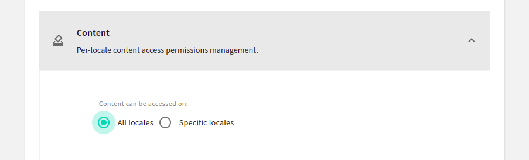

import OnPagePromo from "../components/ui/on-page-promo/on-page-promo"

Working with large data sets from an API, fetching and rendering them at once could cause negative effects you want to avoid, for example, your components could start loading very slowly. Your users might not stay long enough to see the content you wish them to, causing higher bounce rates, and of course, a bad user experience.

Pagination mitigates this problem by splitting digital content up into separate requests. It means that you fetch a much smaller data set initially. You get a faster render time and your users get a much better experience.

In this tutorial, we are going to learn how to implement pagination when using [Webiny Headless CMS](https://www.webiny.com/docs/overview/applications/headless-cms) in Svelte.

## Prerequisite

To follow along with this tutorial, you need to have the following:

- [AWS account and user credentials](https://www.webiny.com/docs/infrastructure/aws/configure-aws-credentials) are set up on your system.
- Basic knowledge of Svelte and GraphQL.
- Node.js >=14 and yarn ^1.22.0 || >=2 installed in your system.

## Introduction to Webiny Headless CMS

A headless CMS is one that deals strictly with the content. It is a backend-only CMS where the content repository is separated from the presentation layer. Once created its content is served via an API giving front-end developers full control over the user experience using their native tools.
The Webiny [Headless CMS](https://www.webiny.com/enterprise-serverless-cms/headless-cms/) is GraphQL based, with a powerful content modeling feature and it’s serverless, so optimized for scalability by default.

## What is pagination

Pagination is the method of splitting digital contents into different pages where site visitors can navigate between these pages by clicking on links often located at the bottom of a page.

This pattern is used so site visitors do not get overwhelmed by a mass of data on one page which would make it difficult to identify a target item. By splitting large data sets into chunks, it can also help solve performance issues both on the client and server side.

There are two strategies mainly used to achieve pagination and they are:

- Offset-based pagination
- Cursor-based pagination

In this article, we are only going to cover the cursor-based pagination since it’s the one implemented on Webiny Headless CMS.

## Cursor-based Pagination

Cursor-based pagination works by returning a pointer (cursor) to the last items on a page which will then be used on subsequent requests to get the next result after the given pointer.

The returned cursor must be unique for all items in the dataset for this, IDs are often used as the cursor because it is sequential and unique although this is not the case for Webiny’s headless CMS. We will discuss more on this shortly.

Let’s look at an example of how cursor-based pagination works using ID as the cursor. Say we have the following datasets:

```bash
[
  { id: 1, author: 'author1'},
  { id: 2, author: 'author2'},
  { id: 3, author: 'author3'},
  { id: 4, author: 'author4'},
  { id: 5, author: 'author5'},
  { id: 6, author: 'author6'},
  { id: 7, author: 'author7'},
  { id: 8, author: 'author8'},
]

```

To get only four results for every page the first request will look like this:

```bash
cursor: 0
limit: 4

// OR

after: 0
limit: 4

```

which will return four (4) results starting with an ID of one (1)

```bash
[
  { id: 1, author: 'author1'},
  { id: 2, author: 'author2'},
  { id: 3, author: 'author3'},
  { id: 4, author: 'author4'},
]

```

The next request will be:

```bash
cursor: 4
limit: 4

// OR

after: 4
limit: 4

```

With results:

```bash
[
  { id: 5, author: 'author5'},
  { id: 6, author: 'author6'},
  { id: 7, author: 'author7'},
  { id: 8, author: 'author8'},
]

```

## Create And Deploy a new Webiny Project

To get started, we need to first create a Webiny project, deploy it and then model our content in the headless CMS using the generated Admin app.

To deploy a new Webiny project, enter the following command in the terminal:

```bash
npx create-webiny-project webiny-pagination
```

After running the above command you will be asked several questions, one of which is to choose a database, for that, select **DynamoDB** which is suitable for our use case. The above command will create a Webiny project called **webiny-pagination** which consists of three applications: a GraphQL API, an Admin app, and also a React website.

Once the new project has been created, it’s time to deploy it into our AWS account. We can do this with the following commands:

```bash
cd webiny-pagination

yarn webiny deploy
```

If it’s our first deployment it will take over 20 minutes. after it’s done the URL to the Admin App, GraphQL API endpoints and website will be printed out in the terminal. We will use them shortly.

## Defining Content Model in the Admin app

Content model defines the structure of the content we want to store in the CMS. We can do this using the generated Admin app. For our use case, we will define a Book model which will hold the book entries we will use to implement pagination.

To access the Admin app, we can click on the URL that was printed in the terminal earlier when we deployed our project.

Perhaps you have closed the terminal? To view the URLs you can type the `yarn webiny info` command.


For the first time accessing the Admin app we would be prompted to create a default user with our details. After doing that, we will be taken to the welcome page:


Next, navigate to the **Content Models** page by clicking on the **New Content Model** button within the **Headless CMS** card, and on the next page click on **New Modal** at the top of the page and we will see a prompt with a form to add some information for the new Content Model.


In the name input enter **Book,** then click on the **CREATE MODEL** button. On the next page, we will see different field types we can add for our **Book** model:


To add a field, we need to drag and drop it in the drop zone, then in the prompt that appears supply a Label (required) and click on the **SAVE FIELD** button. Below is a video showing how a **TEXT** field labeled **title** is added:

<video width="800px" height="auto" controls autoplay>
  <source src="./assets/implement-pagination-webiny-headless-cms-svelte/add-field.mp4" type="video/mp4" />
</video>

Now following the process in the Video above let’s create **TEXT** fields with labels: **authors, image, publishDate, publisher, and title**. For the field with a label of **authors** make to turn on the **Use as a list of texts** switch. We are doing this so that it can hold more than one text (Array of strings).


Below are all the fields for the Book model. After creation, click on the **SAVE** button at the top right of the page.


Here is what the object of the fields we created will look like:

```jsx
{
    authors: ['Accomazzo Anthony', 'Murray Nathaniel', 'Ari Lerner'],
    image: "<http://books.google.com/books/content?id=ppjUtAEACAAJ&printsec=frontcover&img=1&zoom=1&source=gbs_api>",
    publishDate: "2017-03",
    publisher: "Fullstack.IO",
    title: "Fullstack React"
}
```

Now that we have added fields to define the structure of contents for our Book model, we can start adding content to it. For example to add the object above as content to our model, in the sidebar, expand the **Headless CMS** tab, under the **UNGROUPED** section click on **Books** and we will see a page like this:


Next, click on the **NEW ENTRY** button, and on the prompt that appears enter the value of the properties of the above object in the corresponding input like this:


After that, click on **SAVE & PUBLISH** at the top-right of the page, then click **CONFIRM** on the pop-up that appears. With this, we have added our first content to our Book model.

To test and introspect GraphQL queries and mutations on our content models before using them from a client-side application we can use the GraphQL playground. To access the playground, click on **API Playground** in the sidebar of the Admin app.

Now that we have set up a Webiny project and created our Content model. We are now left with consuming the GraphQL API in the front-end and using it to create the pagination functionality.

## Implementing Pagination

We will start by setting up our Svelte app, then using the GraphQL API we will fetch our book data to be used for the pagination functionality.

### Setting up Svelte

I have already created a starter repo containing the template and data to be added to Webiny which I fetched from the [Google book API](https://developers.google.com/books/docs/v1/using). The next step is to clone the GitHub repo. We can do this with the following commands:

```bash
git clone https://github.com/Tammibriggs/webiny-svelte-pagination.git
```

For working with GraphQL in our frontend we will be using [svelte-apollo](https://www.npmjs.com/package/svelte-apollo). I have included it and other need dependencies like `@apollo/client` and `graphql` in the dependency object of the `package.json` file. So by running the `yarn` command all packages will be installed.

Now when we start the app with `npm run dev`, we should see the following screen in our browser:


Right now we are getting our book data from the **data.js** file in the **src** directory of the cloned app. We will be moving it over to Webiny and fetching it from there shortly.

### Initializing Apollo Client

Before initializing Apollo, we need to first get an API token to enable us to gain access to our GraphQL API and the correct Headless CMS GraphQL API URL. After getting the above we will be storing them in a **.env** file in our app which will look like the following:

```bash
VITE_WEBINY_GRAPHQL_TOKEN = your-token-here
VITE_WEBINY_GRAPHQL_URL = your-url-here
```

To get the API token, head over to the Admin app, and in the sidebar expand the **Settings** tab and we will see **API keys** under the **ACCESS MANAGEMENT** section.


Select **API keys,** and on the next screen click on **New API key.** we will see a prompt where we can set the name, description, and access control options for our KEY.

.png)

Enter a name and description then scroll down the page, expand the **Content** tab and select **All locales.**



Next, expand the **Headless CMS** tab which contains options to control which operations the API token can, or cannot, perform.


For our use case we only need read access to the Headless CMS GraphQL API to perform queries on the Book model so here is how we will set the controls, namely read-only access to the models in "Ungrouped" in the EN-US locale content model:


Only the content model "Book" in the EN-US locale under "Ungrouped" content models.


After setting the controls, click on the **SAVE API KEY** button at the bottom of the page and our API token will be created.


Now we can copy the token and store it in a **.env** file in our React app.

Next, to get the URL, go to the API playground in the Admin app, click on the **Headless CMS - Read API** tab at the top of the page and copy the URL directly below the tab.


After copying the URL we should also store it in the **.env** file in our React app.

Now, to initialize Apollo client, head over to **src/App.svelte** and add the following lines of code after the imports in the script tag:

```jsx
import { ApolloClient, InMemoryCache, gql } from "@apollo/client/core";
import { query, setClient } from "svelte-apollo";

const client = new ApolloClient({
  uri: import.meta.env.VITE_WEBINY_GRAPHQL_URL,
  cache: new InMemoryCache(),
  headers: {
    Authorization : `Bearer ${import.meta.env.VITE_WEBINY_GRAPHQL_TOKEN}`
  }
})

setClient(client)
```

Notice we have passed the **URL** and **API token** to the configuration object of `ApolloClient`. This will enable us to start working with our CMS in our Svelte app.

Now, what we need to do is populate our Book model with content that we will use for the pagination. In the **data.js** file in the **src** directory of our app, there are over 54 book data. We can move them over to our CMS by manually adding them as entries to our Book model on the Admin page.

### **Implement Cursor-based pagination**

For implementing Cursor-based pagination Webiny headless CMS GraphQL API includes a `limit` and `after` argument. `limit` takes an integer that indicates the number of contents we wich to return in every request and `after` take a string which is the cursor of the last content returned. By specifying a cursor in the `after` argument, the returned result will be the contents after the specified cursor.

Using the above, we need to create a query that will be able to receive a `limit` and `after` argument and also return the cursor of the last returned content.

In the **App.svelte** file, add the following query after the `setClient` function:

```jsx
const LIST_BOOKS = gql`
  query GetBooks ($limit: Int, $after: String){
    listBooks (limit: $limit, after: $after){
      data {
        authors
        image
        publishDate
        publisher
        title
      }
      meta {
        cursor
        hasMoreItems
      }
    }
  }
`
```

Above, we have specified the data and meta information to be returned. The porperties specied in meta are what's required for implementing the cursor-based pagination.

Next, to start sending request to retrieve book entries from our CMS add the following lines of code after the `LIST_BOOKS` query.

```jsx
let page = 0
let cursors = [null]

const books = query(LIST_BOOKS, {
 variables: {
  limit: 10,
  after: cursors[page]
 }
})
```

Above we have set `limit` to 10 and `after` to `null`. By doing this, when our app loads which means we are on the first page(`page` = 0), the returned results will be the first ten(10) contents in our Book model.  To get the appropriate results on subsequent pages (`page` > 0) we will be setting `after` to the cursor returned in the request which can be accessed with `$books.data.listBooks.meta.cursor`.

Next, let's replace the currently displayed data in our app with the one coming from our CMS and also handle errors that might occur. To do this, modify the `<main>` element to look like the following:

```jsx
<main>
  {#if $books.data}
    <div class='books'>
      {#each $books.data?.listBooks.data as book}
        <Book
          title={book.title}
          image={book.image}
          authors={book.authors} 
          publisher={book.publisher}
          publishDate={book.publishedDate}
        /> 
      {/each}
    </div>
  {:else if $books.loading} 
    <div class="center">Loading...</div>
  {:else }
    <div class="center">Unable to fetch data</div>
  {/if}
</main>
```

Now to set the `cursors` array with the cursors needed to get the data for paginated pages and send another request to fetch the appropriate for a page, add the following lines of code after the `books` variable:

```jsx
let cursor = null

$: if($books.data) cursor = $books.data?.listBooks?.meta?.cursor

$: if(cursor && cursor !== cursors[page]){
  cursors = [...cursors, cursor]
}

$: books.refetch({after: cursors[page]});
```

Next, let’s add the button needed to navigate between pages. Add the following lines of code before closing `</main>` tag:

```jsx
<div class='buttons'>
  <button on:click={() => page--}>Prev</button>
  <button on:click={() => page++}>Next</button>
</div>
```

In the above code, we have included a previous button that decreases the value of the `page` variable by one and a next button to increase it by one. By increasing `page` by one, the reactive statements defined above will run modifying the `cursors` array with the cursor needed to get the next results and our GraphQL query request will be refreshed with the `after` variable set to the next page cursor. The same thing also happens when `page` is decreased except the `cursors` array won’t be modified again since it will already contain the cursor for the previous pages.

Now, when we head over to our app in the browser we will see the following button to navigate between pages:


Although the pagination feature works right now, we will notice that when we are on the first page, the previous button is still enabled and doesn't indicate that there is no previous page. This is the same for the next button when we are on the last page.

To fix this, modify the `div` with `class='buttons'` to look like the following:

```jsx
<div class='buttons'>
  <button 
    disabled={page === 0 && true}
    style="background-color: {page === 0 ? 'gray' : '#6796ec'}"
    on:click={() => page--}>
    Prev
  </button>
  <button 
    disabled={!$books.data?.listBooks.meta?.hasMoreItems && true}
    style="background-color: {$books.data?.listBooks.meta?.hasMoreItems ? '#6796ec' : 'gray'}"
    on:click={() => page++}>
    Next
  </button>
</div>
```

With this, the buttons should now be working properly.

## Conclusion

In this tutorial, we have learned about pagination — a way of handling large data sets, and how it can be implemented when working with Webiny Headless CMS in a Svelte.

**Full source code:** https://github.com/webiny/write-with-webiny/tree/main/tutorials/svelte-pagination

---

This article was written by a contributor to the Write with Webiny program. Would you like to write a technical article like this and get paid to do so? [Check out the Write with Webiny GitHub repo](https://github.com/webiny/write-with-webiny/).