Imagine you are building a nuclear power plant. All the design documents have to be carefully reviewed by two, three, in some cases dozens of reviewers to ensure various elements of the design are fit for purpose and safe. This process could take weeks, if not months, before the documents are ready to be released to manufacture or building contractors. Collaborating and commenting on the same document could be difficult to manage with so many reviewers. Changes to design could happen at any point in time, and have to be addressed before the documents receive final approval. Compromising with the quality and safety of the design is simply unthinkable. 

## Why Did We Build the Advanced Publishing Workflow?
Creating engaging digital content, quality control, approval and publishing could take a long time too. This is a luxury which organizations, operating in the fast-paced digital world, cannot afford. The ever more sophisticated needs of their customers put the price of delayed delivery way too high, especially if you want to be at the forefront of your industry. But how one can get the speed and not compromise on quality?

We have created the Advanced Publishing Workflow to help you tackle this - streamline the numerous content reviews and approvals which are required to ensure the high quality of the final published content.

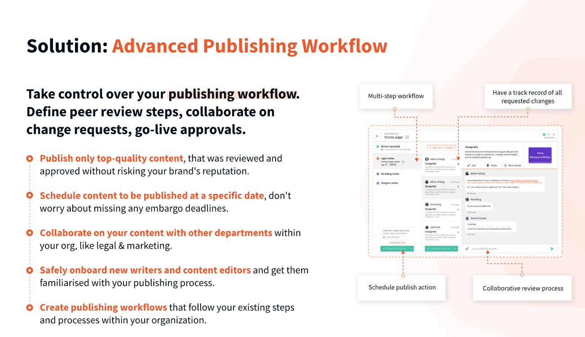

## In this blog, you will find out how to:
- **Set up the publishing workflow**
- **Submit a record for review**
- **Review, submit changes and provide sign off**

## Set up the Publishing Workflow
A power user is able to create multiple workflows for the Headless CMS and the Page Builder in Webiny. All they need is a clear understanding of the steps within the review and approval procedure, the involved parties for each step, and which new entries need to undergo this approval flow.

Here is how you can set this up in the system:

### 1) **Open the “Workflows”**

You can access it from the main menu on the left hand side **Publishing Workflows > Workflows**:

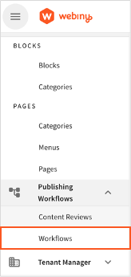

### 2) **Set up a workflow title**

If you are planning on having multiple approval workflows, e.g. “Main review process”. You can always change this later.

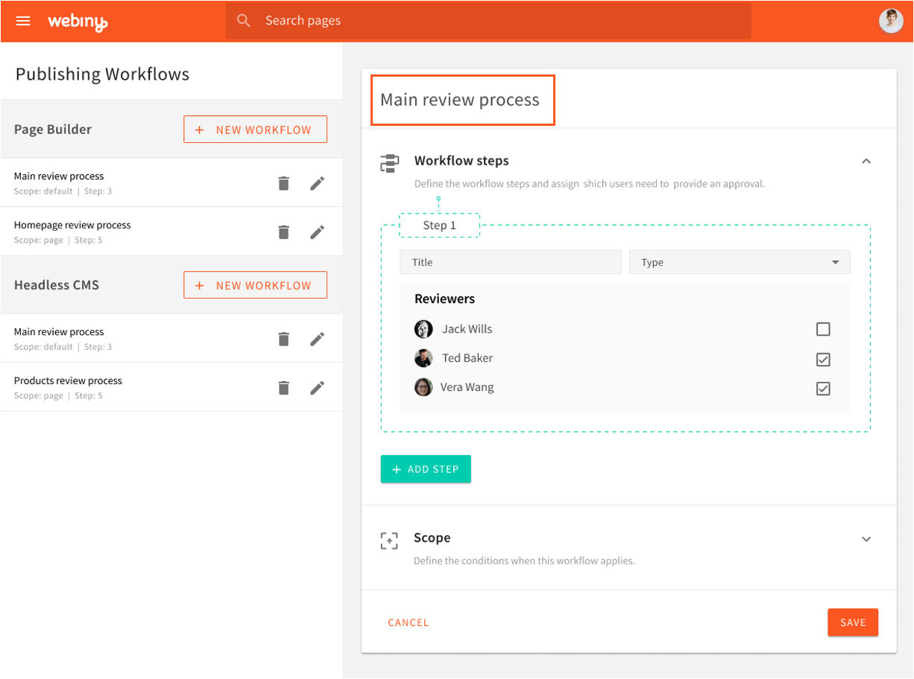

### 3) **Define the steps for the review and approval**

Steps could be ordered in a sequential order to fit the organizational procedure, e.g. Legal Team always review first, then Marketing. To avoid unnecessary delays, however, the review process steps could be running concurrently, i.e. multiple steps at the same time, by using the “**mandatory, non-blocking**” or the “**optional**” step.

A step can be marked as "mandatory, blocking", "mandatory, non-blocking" or "optional":

- If a step is "**mandatory, blocking**" that means that the review process can't go to the next step until this step has finished.
- If a step is "**mandatory, non-blocking**" that means that the next step in the review process is unlocked, but the item may not be published until all mandatory, "**non-blocking"** steps have been completed.
- If a step is "**optional**" that means the page can be published regardless of if a sign-off was provided on this step. This step also doesn't block the review process, so the next step in line is also unlocked.

Each step has one or more people that can provide the necessary sign-off.
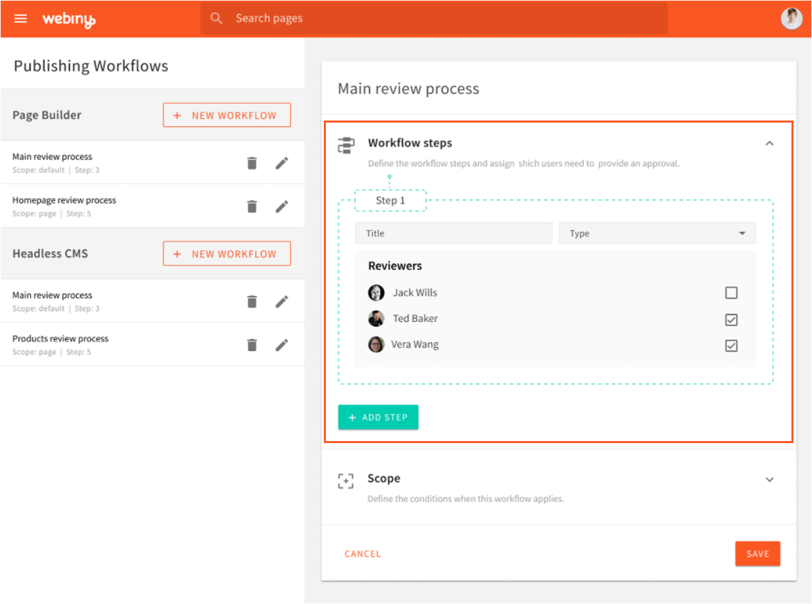

### 4) **Define the “Scope” when this particular workflow applies**

A scope can have the following options:

- "**default**" - if no other workflow applies, this workflow will apply
- "**category**" or "**content model**":
    - "**category**" as in this workflow applies to all pages inside a certain PB page category.
    - "**content model**" as in this workflow applies to all content entries inside a certain Headless CMS content model.
- "**content**" - This workflow applies only to a specific page, or a specific content entry.

When checking which workflow applies to a particular publish action, the highest priority is the workflow with the "**content**" scope, then the workflow with "**category/content model**" scope, and finally the "**default**" scope.

If no scope defined in the workflow matches the current publish action, the user is allowed to publish the content without a review request.

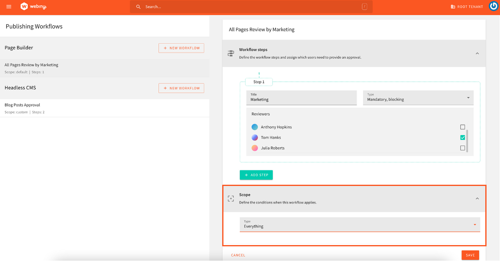

Each content item in the review process can be in one of these 3 statuses: 

- “**Under Review”**
    - One or more sign offs are missing and the content can't yet be published.
    - While the content is in this state, the content can be edited
- “**Ready to be Published”**
    - All the required sign off are provided and the content can be published.
    - The content is automatically moved into this stage when the last required sign off has been provided.
    - Once the content is in this stage it can no longer be edited. In case any changes  need to be made, the user needs to create a new revision and start the process all over again.
- “**Published”**
    - The content is published, or has been scheduled to be published

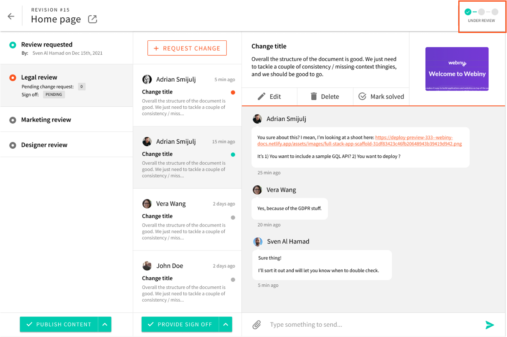

## 2. **Submit a Record for Review**

Once the content creator is ready with the Page or Headless CMS entry, they click on the “**Publish**” button.

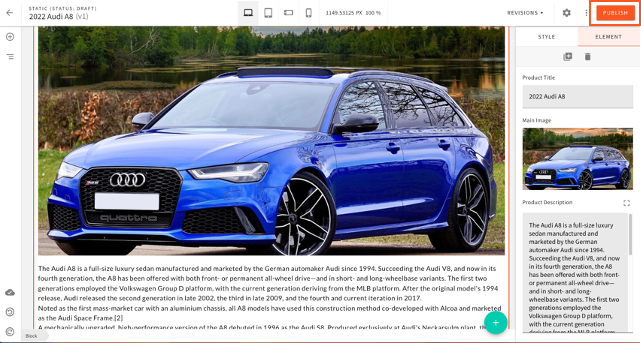

If the record meets at least one of the entry criteria for one of the approval workflows then the record will be submitted for review automatically. the author will receive a warning message to confirm that.

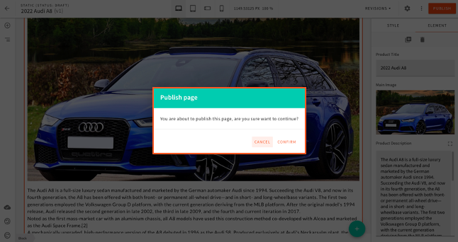

The status will change to “**Under Review**” and the relevant reviewers will be able to see the record in their Content Review Dashboard. They will also receive an email notification if they have provided a valid email in the system.

## 3. **Review, Submit Changes and Provide Sign off**

Each user will have access to a content review dashboard where they can see all the records which are relevant to them, either as a reviewer or as an author. This dashboard can be accessed from the main menu on the left hand side under **Publishing Workflows > Content Reviews**.

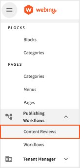

In the Content Review Dashboard, the user can see comments from others and check the status of each record. They can also search, filter and sort to find specific items.

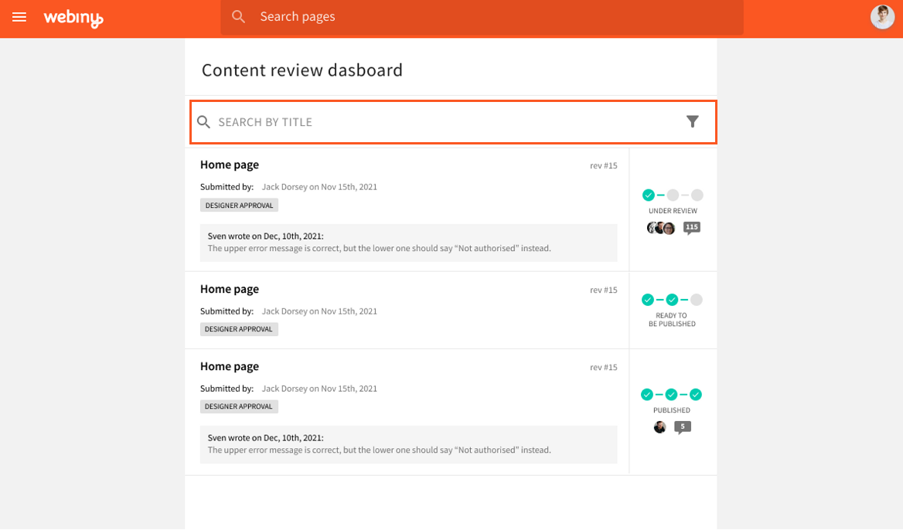

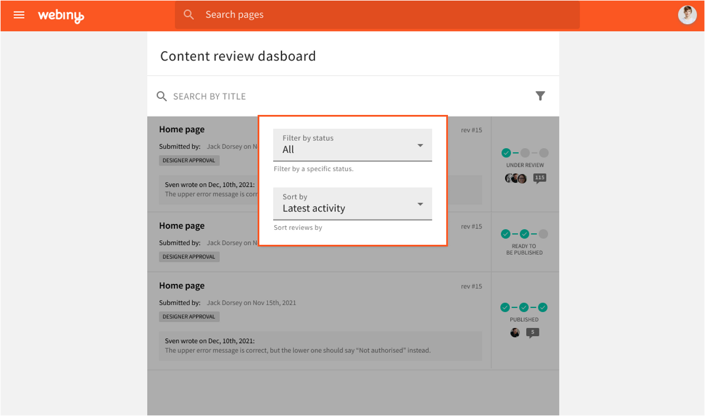

The reviewer can view the record under review by clicking on the icon next to the title which will open the Page or Headless CMS record into a new tab. 

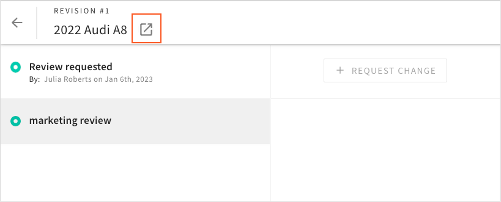

The reviewer can request changes using the “Request Change” button, which will then notify the author that they need to take action before their record is published.

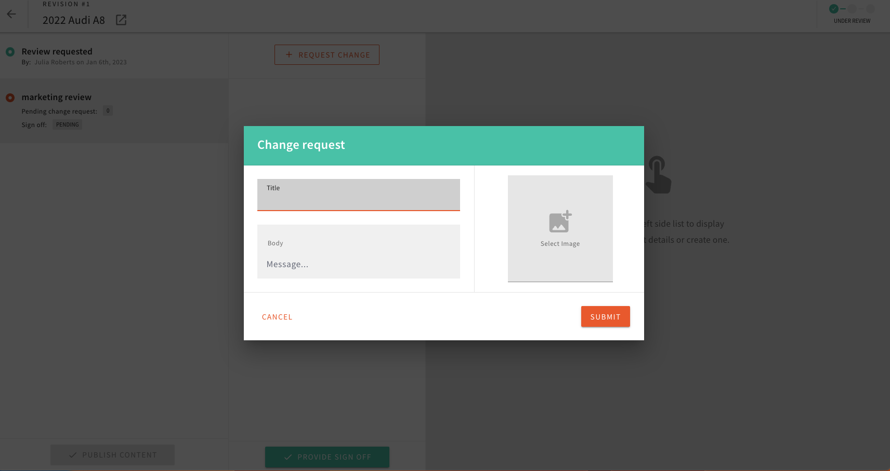

Once the reviewer is happy with the content, they can provide sign off for that record by clicking on “Provide Sign off” button.

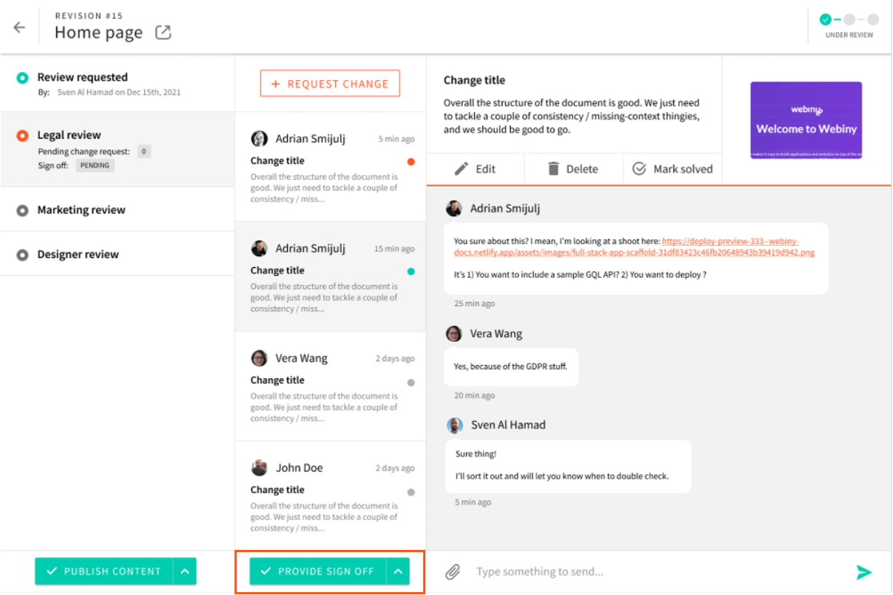

There is also an option to “Retract Sign Off” in case circumstances have changed and additional tweaks are required. This action will push back the record into “Under Review” status.

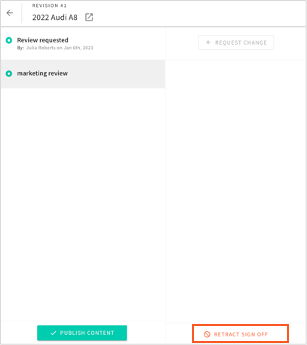

Once all reviews are completed, the “Publish” content button will be available and the record can be published or scheduled. If the user choses “Publish Now” the content will go live immediately and the status will change to “Published”

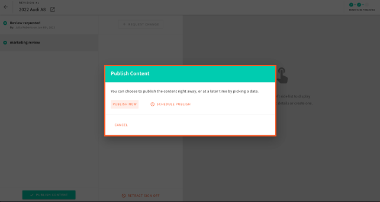

If the user chooses to schedule the content, they need to provide Date and Time for publishing and that record will go live as specified in this form. The status of the record will change to “Published”.

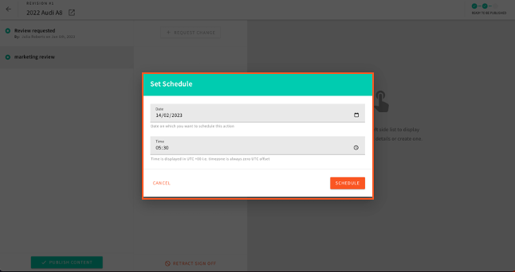

If any changes to the scheduling are required, the user can use the “Unset Schedule” button and make the necessary changes.

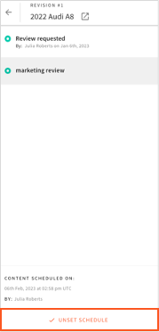

If you want to find out more about the Advanced Publishing Workflow check out our [video tutorial](https://youtu.be/NNRghN1yY_g) and [feature overview](https://youtu.be/LybyaJZ_3x8).

If you have any feedback or you have used similar workflows in your organization, please get in touch on [Slack](http://webiny.com/slack) or sign up for our [Webiny LAB program](https://site.webiny.com/webinylab) which will allow you to provide your highly valued feedback to our Product and Engineering team.

