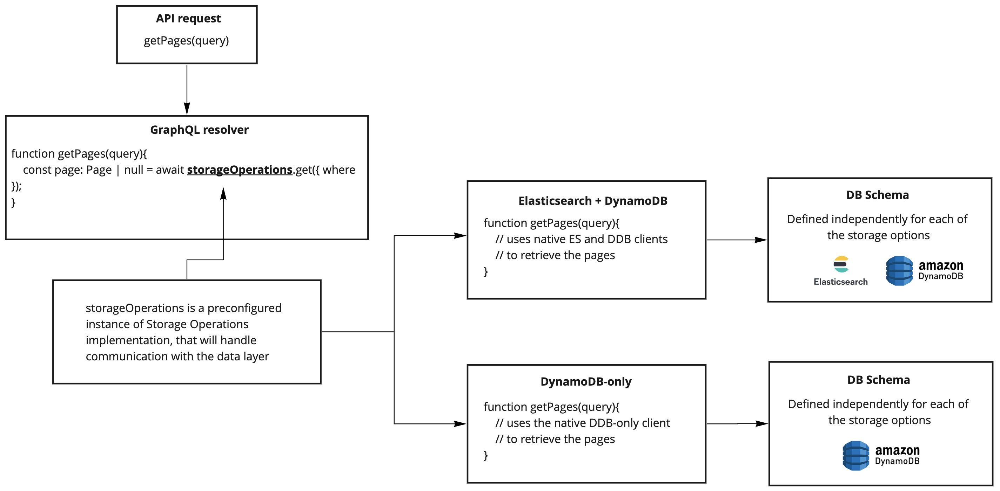

> Is there a way to install Webiny without Elasticsearch?  
Webiny is too expensive for smaller projects because of Elasticsearch!  
AWS doesn't have Elasticsearch as a serverless service. 

These are just some of the many comments we've been getting over the past months. Today we're happy to announce that Webiny now comes with two database setups. We recommend the current Elasticsearch + DynamoDB for larger projects and a new DynamoDB-only setup for small to medium projects.

Just run `npx create-webiny-project my-new-project` to get started, or follow this [installation tutorial](/docs/tutorials/install-webiny).

Fyi, we plan to support even more serverless databases in the future. Webiny's database layer doesn't use an ORM. We found ORMs to be very restrictive, and they come with a big performance hit. So instead, we're using native clients. Now, every data storage implementation can have a completely different table design, but also utilize more than one storage service, or even use a combination of several services at the same time.". It was a big challenge we wanted to solve, and if you want to learn more about it, continue reading.

## Goals

We set ourselves several goals going into this project:

☑️ Build a foundation we can reuse for other databases

☑️ Use the native client that each database offers for performance reasons

☑️ Ability to use the best features each database has to offer - eliminating the lowest denominator problem

☑️ Ability to support both SQL and NoSQL schema designs - each database can have a different schema

☑️ No direct dependency between the business logic and the storage layer.

## Implementation

We introduced a new concept called Storage Operations. Each API in Webiny consists of resolvers, your typical GraphQL. Resolvers contain business logic, functions like getPage, publishPage, createUser, and similar. The storage operations now provide the data storage functionality, separated from the business logic itself. For each database option, we now have a matching set of storage operations plugins. So when you call getPage, if you're using ES+DDB, we'll use that storage operations plugin to retrieve the content. And the same process applies in case you're using the DDB-only. Inside the actual function that does the content retrieval, we can use the native DB client and store data in different ways between each DB implementation.

This is an ORM/ODM free implementation. This approach probably takes a lot more time than if we were to use or build an ORM/ODM layer, but the tradeoffs are massive. Here are some of the pros and cons:

**👍 Pros:**

- Better performance
- Ability to tune the database schema to the very smallest detail
- Ability to use advanced querying capabilities each database offers
- Improved security as you can now use many of the natively supported encryption options
- Better developer experience as you can now use the native client instead of wrappers
- Less abstraction in the communication between the code and the database, much easier to debug, and performs a lot better

**👎 Cons:**

- It takes more time to implement
- Maintainability

Most developers only need support for one specific database. They know that database very well, and they want to use all of its capabilities to the fullest. Giving them an ORM puts restrictions on what they can do with a database, very often sacrificing the features they chose that database for in the first place.

## Scope

To illustrate the scope of the required changes: we had to rewrite all the Webiny applications, including the Admin system, security layer, Page Builder, Headless CMS, File Manager, and Form Builder. There's a lot of code in there.

Secondly, we also had to rewrite all the tests, to make them storage agnostic. Then we had to find a way to enable the tests to run with multiple storage options, and any future storage operations. Finally, when the tests were done, the CI/CD pipelines had to be rebuilt and optimized as some of the runs took close to 1 hour to complete.

Thirdly we needed to support the project creation and create the required infrastructure files for each option.

The good thing is that we have now solved all the technical challenges and built a solid foundation for adding even more databases to the platform.

## Elasticsearch + DynamoDB vs DynamoDB-only

There are a couple of main differences the DynamoDB-only edition introduces:

- much faster deploy times (just a few minutes), on both first deploy, and when redeploying due to configuration changes
- record filtering is done in the Lambda that fetches records from DynamoDB, to support various filtering conditions that are otherwise not supported by native DynamoDB querying capabilities. This might cause performance issues on larger projects.
- quick and easy to set up, test our built-in applications, and prototype your own

## Why does this release matter so much?

There are four main points why this release is essential to us and to the future of Webiny:

**Truly 100% serverless stack** - by eliminating the Elasticsearch from the stack, developers can enjoy a maintenance-free stack with consumption-based pricing. All the services in the stack are now either fault-tolerant or highly-available. Scaling in and out is also fully automatic. 

**Contributor friendly** - Our community is super important to us, and we believe we can show that every day on our [community slack](/slack). However, many people that thought of contributing to Webiny decided not to do so because it comes at a dollar-cost due to the Elasticsearch dependency. Now, this is no longer the case.

**Hobby projects** - People often want to test drive a new solution on smaller projects before building anything more significant. Unfortunately, the steep cost, again, was a gatekeeper, and it blocked people from seeing how great a product Webiny is. We hope to change that with this release.

**Multi-cloud** - Having a robust storage layer that supports many different schemas and clients is one of the key milestones we had to achieve to move one step closer to supporting other cloud providers.

---

We haven't yet tested it, but I have a hunch that Webiny is the most cost-efficient open-source CMS on the market → although I doubt anyone will type that into google :) 

Give Webiny a spin, let us know how you find the new DynamoDB-only version in terms of performance, and please share any other feedback that could help us improve the product even more.

Run `npx create-webiny-project my-new-project`  to get started, or follow this [installation tutorial](/docs/tutorials/install-webiny).

In case you love what we're doing, please consider giving us a ⭐️ on [GitHub](https://github.com/webiny/webiny-js), it helps other developers discover Webiny.