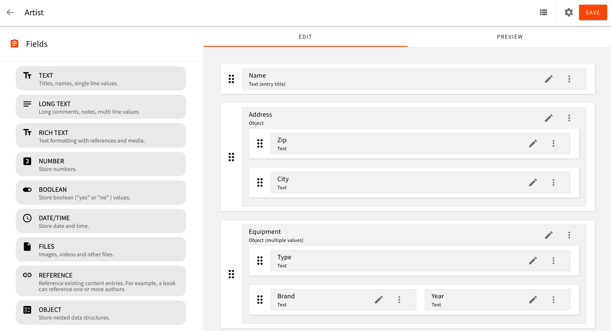
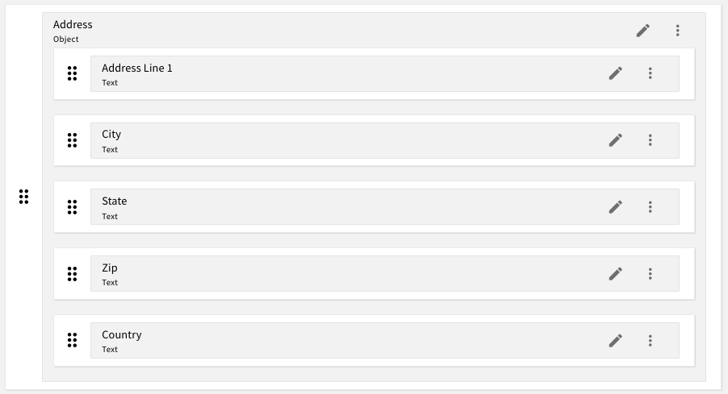
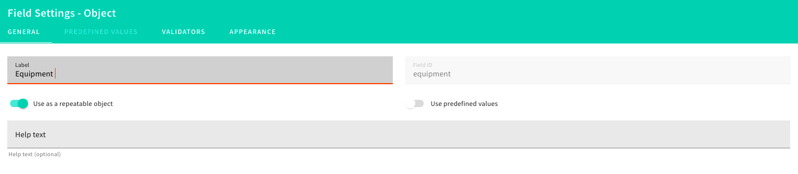
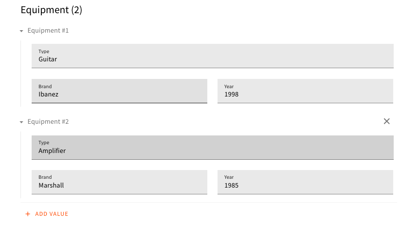

⚡️Seamlessly create nested and repeatable data structures with the new Object field.

With the latest <ExternalLink href="https://www.webiny.com/docs/changelog/5.11.0/?utm_source=Webiny-blog&utm_medium=blog-post&utm_campaign=Regular-content&utm_content=introducing-new-object-field&utm_term=W00691">Webiny 5.11.0</ExternalLink> release, we are glad to introduce the new Object field in Headless CMS.  
The nested and repeatable data structures was one of the hot topic discussed in the Webiny community. With the new Object field now, you can create complex data structures with ease. Huge thanks to our community members for their suggestions and contributions.

Let's quickly dive into the highlighting capabilities of the Object field.

### Build nested data structures

The new Object field allows you to build nested data structures. You can create an object and add various existing fields (`ref`, `richText` field, etc.) to it. Along with this, you can also nest objects within other objects.

 

### Repeatable structure

The icing on the cake is, the data structure created with Object fields can be repeatable (like an array of nested objects).  
The `Use as a repeatable object` property allows creating the repeatable object. E.g. setting the 'Use as a repeatable object' property to true on the Equipment model will make it multi-valued.

Below is the model view for the multi-valued Equipment field.

And the preview of the model will look like this:

### GraphQL Schema auto-complete support

Object field respects all the rules and behaviors of all the other existing fields (`ref`, `richText` field, etc.). You also get a full GraphQL Schema auto-complete on your nested fields.

Alright, let's see the demo in action!

Try the new Object field and please <ExternalLink href="https://www.webiny.com/slack/?utm_source=Webiny-blog&utm_medium=blog-post&utm_campaign=Regular-content&utm_content=introducing-new-object-field&utm_term=W00692">let us know</ExternalLink> your valuable feedback!