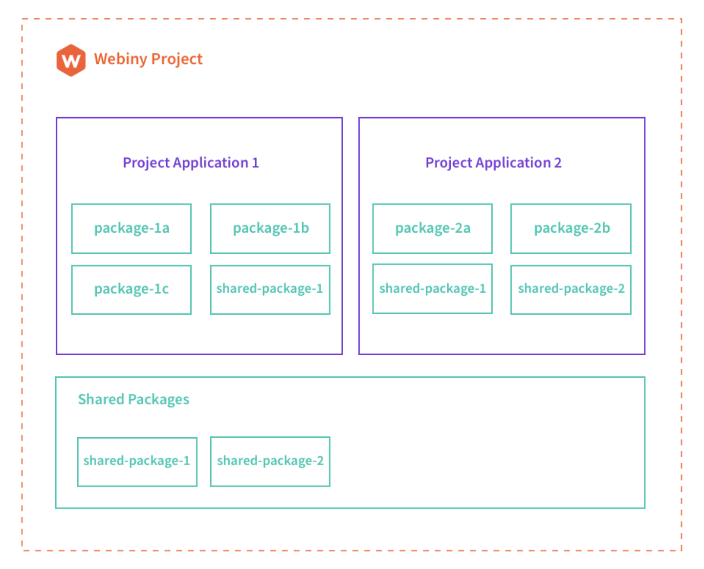

You may already have heard about monorepos, in case you haven't, monorepos stand for keeping all of an organization's code in one repository — you might be wondering what is the reason we picked the open-source to talk about monorepos? Because monorepos are also known to be used from open-source projects such as Babel, React, Jest, Vue, Angular, and more.

In this article, you'll learn what are monorepos, the advantages, and disadvantages, tools you can use to easily set up monorepos for your system.

Last but not least, we'll get hands-on for a review on the webiny-js monorepo project, by going through the project and application organization with Lerna and Yarn workspaces. 

Let's dive in.

---

At Webiny we develop our open-source <ExternalLink href="https://www.webiny.com/serverless-application-framework?utm_source=Webiny-blog&utm_medium=webiny-serverless-framework-website&utm_campaign=webiny-weekly-tech-blog-feb-23&utm_content=webiny-serverless-framework&utm_term=W00575">serverless application framework</ExternalLink> using the monorepo architectural pattern. Besides Webiny, in the past few years, there are engineering-led companies like Google, Facebook, Microsoft, and more who are embracing the usage of monorepos in their codebase when it comes to the infrastructure. 

It's not a matter of how large the organization is, it's a matter of the strategic architectural choice for your organization and how you with your team decide in what way to organize your code, build, and maintain using monorepos.

The purpose of this article is to embrace the usage of monorepos, but if you're  interested to learn why not to use monorepos, then this blog is for you. — <ExternalLink href="https://medium.com/@mattklein123/monorepos-please-dont-e9a279be011b">Monorepos please don't</ExternalLink>.

## What are Monorepos?

Managing product repositories can be a bit tricky, knowing that many organizations will have multiple products on development, the decision on how to approach the development is affected by many factors. 

Some of which we mentioned earlier is the strategic architectural choice by following the organization culture on how to code, build, and maintain product development. Here comes the monorepo architectural pattern.

We learned that using monorepos you can develop multiple projects in the same repository, the projects can depend on each other and can share code in between. When doing changes on the repo, the rebuild and testings will happen to only the packages you change. 

But, it's not only the build or testing systems that benefit from running on a monorepo. For example, there can be cross-project integrations and code searches that are greatly simplified, and from these, the reuse of code can be pretty much easier to be done.

Without going any further, let's look at some specific advantages and disadvantages of using monorepos.

## Advantages

- **One source of truth, common configuration** — With a monorepo there is a single configuration to manage all of the projects or packages, resulting in a much easier approach to manage. A **top-level configuration** for *linting*, *building*, *testing*, and *releasing,* more on those later.
- **Ease of code reuse** — Having the whole project in one repo, means there can be shared components between different packages.
- **Easier dependency management** — You'll not download and build third-party dependency multiple times — with monorepos the built will be optimized, for the referenced dependencies all exist in the same codebase.
- **Atomic commits** — Having multiple projects in one place, we mentioned that there is one source of truth, meaning you can do changes in multiple projects at once, those can be checked together at once automatically.

    At the <ExternalLink href="https://www.youtube.com/watch?v=rdeBtjBNcDI">ReactNext 2018 Monorepos for the Masses</ExternalLink> presentation, the author noted: 

    - One PR for multi module features
    - One PR for review with full context
    - One PR to revert if it goes wrong
- **Large-scale <ExternalLink href="https://en.wikipedia.org/wiki/Code_refactoring">code refactoring</ExternalLink>** — With the entire project in one place, for every code refactor process, developers will be sure that every part of the project will function after the big changes.
- **Collaboration across organization** — When the whole organization has access to the monorepo, the collaboration across different teams increases, leading to flexible code ownership.

Last but not least

- **A developer environment** — The developers will have everything in one place, a single source of truth as we mentioned earlier. Just run `yarn && yarn start` and you are good to go.

## Disadvantages

- **Loss of version information** – Although not required, some monorepo builds use one version number across all projects in the repository. This leads to a loss of per-project <ExternalLink href="https://en.wikipedia.org/wiki/Semantic_versioning">semantic versioning</ExternalLink>.
- **Uncontrollable access** — A monorepo allows read access to all software in the project, possibly presenting new security issues.
- **More storage space** — With a monorepo, you check out all projects by default. This can take up a significant amount of storage space. While all versioning systems have a mechanism to do a partial checkout, doing so defeats some of the advantages of a monorepo.
- **Longer build times** — Having the monorepo to manage, the build time will take much longer, based on the fact of a large codebase.
- **Git performance** — To track a large code base as a monorepo, there'll be a lot of commits to be tracked by Git. As the history  slow as the history deepens.

If you need more resources to decide if you would use Monorepos or not, here are the data from <ExternalLink href="https://github.com/babel/babel/blob/master/doc/design/monorepo.md">Babel</ExternalLink> on pros and cons for Monorepos. 

**Pros:**

- Single lint, build, test and release process.
- Easy to coordinate changes across modules.
- Single place to report issues.
- Easier to setup a development environment.
- Tests across modules are run together which finds bugs that touch multiple modules more easily.

**Cons:**

- Codebase looks more intimidating.
- Repo is bigger in size.
- You can't `npm install` modules directly from <ExternalLink href="https://github.com/npm/npm/issues/2974">GitHub</ExternalLink>
- ???

— <ExternalLink href="https://github.com/babel/babel/blob/master/doc/design/monorepo.md">Source</ExternalLink>

## Monorepo tools

In order to build monorepo projects, there are some tools that make it pretty handful and simple. The most known are Lerna and Yarn workspaces. 

When coupled together, Lerna and Yarn Workspaces can ease and optimize the management of working with multi-package repositories.

### Lerna

Lerna is a tool that optimizes the workflow of multiple packages or projects that operate on a single repository. Lerna offers solutions for independent versioning and publishing packages to an NPM organization, and the utility commands to handle execution of different tasks across multiple packages. 

Some of the processes in software development like *linting*, *building*, *testing*, and *releasing*, a single place to report issues, etc, these are all important bits on setting up a development environment. All of these processes are optimized for multiple packages in one repository, you have a single source of truth.

Setting up Lerna is just a few commands away, it offers a completely manageable workflow with a couple of handful commands.

Below we listed the key commands on getting started with Lerna and their importance when developing.

**Lerna Key Commands**

- Install: `npm install --global lerna`
- Create a repo: `git init lerna-repo && cd lerna-repo`
- Turn the repo into Lerna: `lerna init`
    - Result:
    ```jsx
    lerna-repo/
        packages/
        package.json
        lerna.json
    ```
---
**Lerna Commands**

The first four Lerna commands have an important role when you start to use the tool for managing multiple packages.

- `lerna bootstrap` — Handles the install and publishing of packages respectively. Does the same thing as `lerna link` but, as an addition it does a `yarn` run, to download anything it needs to be downloaded.
- `lerna link` — As soon as we have interdependencies between our packages, we'd want to have some of our packages discoverable in the node_modules folder of another package. `Link` creates the symlinks that make that work.
- `lerna run <script>` — Handling custom scripts. Usually, this command runs the build, which means it finds the build script of each package in the monorepo and builds them. With this process, Lerna analyses who depends on who, meaning it will first build the lowest level packages, and then after building the necessary packages, it continues to build the packages that depend on the first ones. It builds from the bottom up.
- `lerna exec <script>` — It operates as `lerna run` - but with the `exec` you can run commands such as `ls`, `mkdir` — It's like running some shell command.

---

- Some of the scripts run on all of the packages by default, but there are custom flags such as `--since` and `--include-merged-tags` together to target only the packages that have changed.
- `lerna import` — Doing the heavy lifting for you, when you move from multi-repo to a mono-repo, this command will save you tons! Importing from one path to another the packages you want to include in the monorepo.

When creating a <ExternalLink href="https://www.webiny.com?utm_source=Webiny-blog&utm_medium=webiny-website&utm_campaign=webiny-weekly-tech-blog-feb-23&utm_content=webiny-website&utm_term=W00569">Webiny project</ExternalLink>, in the `package.json` — `scripts` tag, you'll find three Lerna commands:

- `lerna run build --stream`

    This command will run the `build` command that's placed on all your packages — `package.json` file, from the inter-package dependencies into consideration.

- `yarn lerna version --conventional-prerelease --force-publish ...`

    The `version` command handles a couple of things such as

    - identifies packages that have been updated since the previous tagged release.
    - prompts for a new version.
    - modifies package metadata to reflect new release.
    - commits the changes and tags the commit.
    - pushes to the git remote.

    The `--conventional-prerelease` releases current changes as prerelease versions.

- `yarn lerna publish from-package --force-publish --dist-tag ...`

    When trying to publish packages to NPM, some of them might succeed and some not. In this case, adding the `from-package` part will try to republish only the failed packages.

### Yarn Workspaces

What are Yarn Workspaces?  — Yarn workspaces manage dependencies, the tool optimizes the installation of dependencies by having one root `node_modules` directory. 

For all the separate packages or projects you'll have only one `node_modules` folder, and a single lock file, rather than a different `node_modules` and lock file for each project, resulting in fewer conflicts and easier reviews. 

Once all the dependencies are installed together, yarn can better optimize them. One of the key features is that when we have one package depending on another package, yarn can link them together, allowing us to always use the most up-to-date code available.

:::info 
You may ask why do projects such as Babel use both Lerna and Yarn Workspaces?
:::

You'll get to see those tools in one place because they are designed to work together. Workspaces focus on the low-level part, which means the linking steps yarn itself provides, and Lerna provides the high-level features.

**Using Yarn Workspaces**

One of the pros of workspaces is that it's part of the Yarn toolchain, no need to download an extra dependency for that. You would want to use yarn workspaces because it offers dependency linking, meaning that one package can depend on another.

To use the `yarn workspaces` you need to add the below changes to the root `package.json` file of your project.

```jsx
{
	"private": true,
	"workspaces": ["worskpace_1", "worskpace_2"]
}
```

Workspaces or packages are not meant to be public, so we keep them private. 

Next, you'll create your the workspaces that we have in the `workspaces` array. 

To create the two workspaces, in that folder where you created your monorepo project, create two other folders, naming as in this example, `workspace_1`, and `workspace_2`.

Run `yarn init` in both of them, this will create the `package.json` files.

Now, move in the `workspace_1` folder, and add the `package.json` file where you'll add the below snippet

```jsx
{
  "name": "workspace_1",
  "version": "1.0.0",
  "main": "index.js",
  "license": "MIT",
  "dependencies": {
    "chalk": "^4.1.0"
  }
}
```
Do the same thing in the workspace_2 folder, and in the package.json file add the below snippet

```jsx
{
  "name": "workspace_2",
  "version": "1.0.0",
  "main": "index.js",
  "license": "MIT",
  "dependencies": {
    "chalk": "^4.1.0",
    "workspace_1": "1.0.0"
  }
}
```

Now, run the `yarn install` in the workspace root, so in my case in the `monorepo_test` folder. 

The `yarn install` will create the `node_modules` folder and the changes as seen image below.

```jsx
/node_modules 
/node_modules/chalk
/node_modules/workspace_2 -> /workspace_1
/node_modules/workspace_1

/workspace_1/package.json
/workspace_2/package.json

/package.json
/yarn.lock
```
And, that's how you set up yarn workspaces.

## Webiny Serverless Framewok Monorepo

We'll use the Webiny serverless framework as a great example of a monorepo. 

The Webiny repository includes 65 separate NPM packages, if Webiny would pick the multirepo way to develop the framework, it would have to maintain every one of those packages separately with an overhead management and in a not so practical way.

When you create a Webiny project, following the guide <ExternalLink href="https://docs.webiny.com/docs/tutorials/install-webiny?utm_source=Webiny-blog&utm_medium=webiny-docs&utm_campaign=webiny-weekly-tech-blog-feb-23&utm_content=webiny-docs&utm_term=W00570">here</ExternalLink>, your webiny project will consists two fundamental organizational units - **packages** and **project applications (applications).**

The **packages** **represent the workspaces we mentioned on the `Yarn Workspaces`. 

Project applications are a higher-level organization units formed from one or more packages that form applications.

### Webiny Project Organization and Applications

How does Webiny manages the 65 NPM pacakges?

Packages are just regular NPM packages, or in other words, folders with their own `package.json` declaration files and some code. 

Below we'll go through a diagram (inspired from Webiny documentation) that shows the project organization in Webiny to understand in a simplified and clear way.



If we were to translate the above diagram into a simplified directory tree, we would end up with the following


As you can see, the packages located in the `packages` folder can be used in both the `Project Application 1` , and `Project Application 2`.

:::info
The name of the packages folder is arbitrary and at this point, not important.
:::

### Key Characteristics

Here are some characteristics on package management.

**Package Scope**

A package can represent literally anything. You can create packages that can do a specific function, example, a REST/GraphQL API, a full React app, a JavaScript function.  

**Limits**

You can set up any number of packages in a single Webiny project.

**Package and project application dependencies**

Packages can be independent, but, can also be dependent on other packages. An example can be the `shared` packages folder, from which the code can be imported by other packages.

In here we can link the one advantage we mentioned earlier — **`Ease of code reuse** — Having the whole project in one repo, means there can be shared components between different packages.`

You can definitely check out the <ExternalLink href="https://github.com/webiny/webiny-js?utm_source=Webiny-blog&utm_medium=webiny-github&utm_campaign=webiny-weekly-tech-blog-feb-23&utm_content=webiny-github-repo&utm_term=W00571">webiny-js</ExternalLink> repo to learn how Webiny handles the monorepo and the packages.

---

With this article, you now understand what are Monorepos, and why you should/shouldn't use this architecture pattern. You learned Lerna and Yarn Wroskpaces that gives you the ability to build libraries and applications in one repository. As an additional fact, you learned that Webiny serverless framework is a monorepo, and the organization of its packages and applications. 

If you enjoyed the article, you can check out the articles below to learn more about the framework, and the tech stack Webiny Serverless Framework uses.

- <ExternalLink href="https://www.webiny.com/blog/serverless-as-a-competitive-advantage-for-your-business?utm_source=Webiny-blog&utm_medium=webiny-blog&utm_campaign=webiny-weekly-tech-blog-feb-23&utm_content=webiny-serverless-as-a-competitive-advantage&utm_term=W00576">Serverless as a Competitive Advantage for Your Business</ExternalLink>

- <ExternalLink href="https://www.webiny.com/blog/what-is-idaas-and-why-use-one?utm_source=Webiny-blog&utm_medium=webiny-blog&utm_campaign=webiny-weekly-tech-blog-feb-23&utm_content=webiny-what-is-idaas-and-why-use-one&utm_term=W00577">What is IDaaS and Why Use One?</ExternalLink>

- <ExternalLink href="https://www.webiny.com/blog/simplifying-your-application-state-management-with-Recoil?utm_source=Webiny-blog&utm_medium=webiny-blog&utm_campaign=webiny-weekly-tech-blog-feb-23&utm_content=webiny-simplifying-your-application-state-management-with-recoil&utm_term=W00578">Simplifying your application state management with Recoil</ExternalLink>

- <ExternalLink href="https://www.webiny.com/blog/lighting-fast-search-with-elasticsearch?utm_source=Webiny-blog&utm_medium=webiny-blog&utm_campaign=webiny-weekly-tech-blog-feb-23&utm_content=webiny-lighting-fast-search-with-elasticsearch&utm_term=W00579">Lighting fast search with Elasticsearch</ExternalLink>

- <ExternalLink href="https://www.webiny.com/blog/5-key-learnings-from-working-with-jwts?utm_source=Webiny-blog&utm_medium=webiny-blog&utm_campaign=webiny-weekly-tech-blog-feb-23&utm_content=webiny-5-key-learnings-from-working-with-jwt&utm_term=W00580">5 Key Learnings From Working With JWTs</ExternalLink>

- <ExternalLink href="https://www.webiny.com/blog/create-github-contributors-plugin-for-gatsby?utm_source=Webiny-blog&utm_medium=webiny-blog&utm_campaign=webiny-weekly-tech-blog-feb-23&utm_content=webiny-create-github-contributors-plugin-for-gatsby&utm_term=W00581">How to Create Github Contributors Plugin for Gatsby</ExternalLink>

## References

- <ExternalLink href="https://leerob.io/blog/monorepo-lerna-yarn-workspaces">Creating a Monorepo with Lerna & Yarn Workspaces</ExternalLink>

- <ExternalLink href="https://css-tricks.com/monorepo/">Monorepo</ExternalLink>

- <ExternalLink href="https://www.smashingmagazine.com/2019/07/yarn-workspaces-organize-project-codebase-pro/">Yarn Workspaces: Organize Your Project’s Codebase Like A Pro</ExternalLink>

- <ExternalLink href="https://danluu.com/monorepo/">Advantages of monorepos</ExternalLink>

- <ExternalLink href="https://medium.com/@mattklein123/monorepos-please-dont-e9a279be011b">Monorepos: Please don’t!</ExternalLink>

- <ExternalLink href="https://fossa.com/blog/pros-cons-using-monorepos/">Pros and Cons of Using Monorepos</ExternalLink>

- <ExternalLink href="https://www.adaltas.com/en/2021/01/05/js-monorepos-project-initialization/">JS monorepos in prod 1: project initialization</ExternalLink>

---

If you learned something new today and are interested to follow up on our blogs, **<ExternalLink href="https://landing.mailerlite.com/webforms/landing/g9f1i1">subscribe</ExternalLink>** to our newsletter and we'll provide you the best content of the serverless world!

---

Thanks for reading! My name is Albiona and I work as a developer relations engineer at <ExternalLink href="https://www.webiny.com?utm_source=Webiny-blog&utm_medium=webiny-website&utm_campaign=webiny-weekly-tech-blog-feb-23&utm_content=webiny-website&utm_term=W00569">Webiny</ExternalLink>. I enjoy learning new tech and building communities around them = ) If you have questions or just want to say hi, reach out to me via <ExternalLink href="https://twitter.com/albionaitoh">Twitter</ExternalLink>.