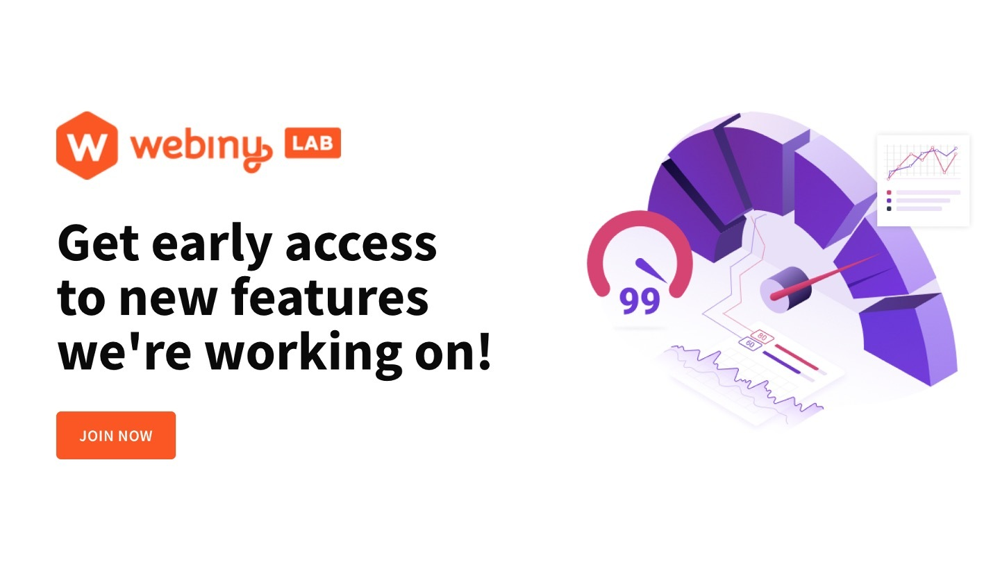
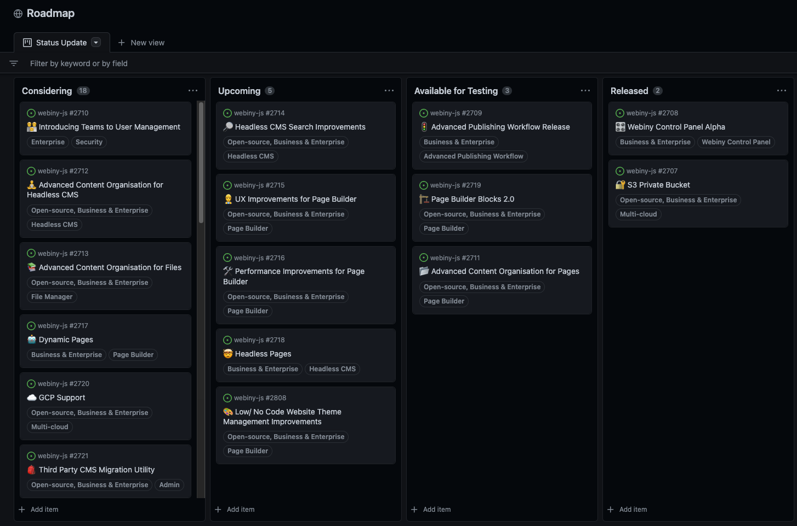

## We need your Feedback!

We’ve seen some of the awesome things you’re building with Webiny, and we want to help you more. We are working on various initiatives to give you a transparent view of what we are preparing in the next releases, and to get your ideas and feedback on these items. It is important to keep improving the product and growing our user base, and we would love to give you an opportunity to share your opinion about Webiny with others. Read on to find out how 🧑‍💻

## Tell us what you think and get a $15 gift card

Webiny recently got listed on Capterra platform. A lot of organizations use it in their software research and it is based on user reviews and comparisons. We are reaching out to you, to help us by offering an honest review on the platform. As an incentive for the Webiny community, the first 50 users that submit a verified review will automatically be rewarded with a $15 gift card (usually Amazon, depends on the country you are from). By sharing your experience with Webiny you are helping others to make the right choice for them. 

🎁 Submit your review [here](https://reviews.capterra.com/new/121388/cd943393-4c1a-4f85-b96f-a0d43e693877?lang=en?utm_source=Newsletter&utm_medium=monthly-newsletter&utm_campaign=Regular-content&utm_content=month-in-review-december&utm_term=W00799) and get your reward. 

**Please Note:** You can choose to stay anonymous or share your profile. If you use your business email or LinkedIn account, the review is automatically validated. If you submit it with your personal email account, Capterra will reach out to you for further verification. Also if you are a technical writers that is part of our Write With Webiny program, you are unfortunately not eligible to receive these rewards to write reviews. Since you are under agreement with Webiny to be paid for your services and therefore have a clear conflict of interest.
## Introducing Webiny LAB

Are you interested in trying out Webiny’s new capabilities before they are released to the general public? The Webiny Lab is an excellent opportunity for selected customers to try and provide feedback on features still in design and development. You will have the power to shape these functionalities with our core team and have your say on what we’ll build next. We want to collaborate with you in an intimate environment and co-create the future of Webiny to ensure that your voice is heard, and your business requirements prioritised appropriately.

🌱 **Sign up [here](https://site.webiny.com/webinylab?utm_source=Newsletter&utm_medium=monthly-newsletter&utm_campaign=Regular-content&utm_content=month-in-review-december&utm_term=W00800) **🌱

## Product Roadmap Launch 🚀

**✨Let's take Webiny to the next level!✨**

We launched our new public product roadmap on GitHub. This is an awesome opportunity for you to provide valuable feedback on the features we are planning. We want to align our priorities with yours and ensure that we tackle the most important things for our users first. The pot of new ideas is constantly growing, but we need your help with identifying what will deliver most value to you and your projects and teams. [Vote and comment on our roadmap items.](https://github.com/orgs/webiny/projects/5?utm_source=Newsletter&utm_medium=monthly-newsletter&utm_campaign=Regular-content&utm_content=month-in-review-december&utm_term=W00801)

To empower you even more, we are bringing new life to our [Ideas Discussion](https://github.com/webiny/webiny-js/discussions/categories/ideas?utm_source=Newsletter&utm_medium=monthly-newsletter&utm_campaign=Regular-content&utm_content=month-in-review-december&utm_term=W00802) on GitHub. Please submit your new feature requests there. Simply tell us what you are after and why do you think it will bring value. Then other users can vote on your suggestion. If your idea get lots of likes, it could be promoted to our roadmap after a discussion with our Product and Engineering team. We will keep you informed with the progress of your suggestion.

**If you have 10-15 minutes it would be awesome if you could fill in the Webiny features prioritization [questionnaire](https://forms.gle/ctARLQzx2JdmocPF8?utm_source=Newsletter&utm_medium=monthly-newsletter&utm_campaign=Regular-content&utm_content=month-in-review-december&utm_term=W00815) and have your say in our Q1 2023 planning activities.**

## New Tutorials

Writing with Webiny is moving forward at full steam! 💨 Thank you all for your contributions. 🫶 We are happy to see our community coming up with original use cases for Webiny and sharing how to create new cool projects with all of you.

#### 🚀 Build a Trello Clone with Next.js and Webiny Headless CMS 
In this [tutorial](https://www.webiny.com/blog/build-trello-clone-nextjs-webiny-headless-cms-1-of-2?utm_source=Newsletter&utm_medium=monthly-newsletter&utm_campaign=Regular-content&utm_content=month-in-review-december&utm_term=W00803) by **Smarpit Shrivastava**, we'll be building an Trello clone with Next.js and Webiny Headless CMS.

#### 🚀 Build a Chat app with NextJS, Socket.io and Webiny 
**Fredrick Emmanuel** shows us how to build a real-time chat application using Webiny, using Socket.io and Next.JS in this [blog post](https://www.webiny.com/blog/build-chat-application-nextjs-socketio?utm_source=Newsletter&utm_medium=monthly-newsletter&utm_campaign=Regular-content&utm_content=month-in-review-december&utm_term=W00804).

#### 🚀 Benefits of Adopting Serverless In Your Business
What are the advantages that come to you as a business from using Serverless? [Here](https://www.webiny.com/blog/benefits-adopting-serverless-in-your-business?utm_source=Newsletter&utm_medium=monthly-newsletter&utm_campaign=Regular-content&utm_content=month-in-review-december&utm_term=W00807) is a brief introduction for the uninitiated brought to you by **Sam Williams**.

Last but not least, we have a couple of really good technical blogs created by our team, which will help you with **testing and debugging** 🐞

#### 🚀 Testing Packages Locally Using Lerna & Verdaccio
**Ben Reads** has put together for you a [tutorial](https://www.webiny.com/blog/testing-packages-locally-with-verdaccio-lerna?utm_source=Newsletter&utm_medium=monthly-newsletter&utm_campaign=Regular-content&utm_content=month-in-review-december&utm_term=W00808) how to use a Leverage Verdaccio's simple set up and Lerna's ability to publish packages quickly to test your Webiny changes efficiently

#### 🚀 How to Debug a Locally Running Node.js/Express App in Webstorm
**Adrian Smijulj** shows us how to quickly set up the Node.js debugger and debug a locally running Express in this [blog post](https://www.webiny.com/blog/debug-locally-running-nodejs-express-app-webstorm?utm_source=Newsletter&utm_medium=monthly-newsletter&utm_campaign=Regular-content&utm_content=month-in-review-december&utm_term=W00809).

Once again a big **THANK YOU** for creating this great content for the rest of the Webiny community.💜 If you want to take part in the Writing with Webiny program, you can find out more [here](https://www.webiny.com/docs/write-with-webiny/write-with-webiny?utm_source=Newsletter&utm_medium=monthly-newsletter&utm_campaign=Regular-content&utm_content=month-in-review-december&utm_term=W00810). We'd love to hear from you: [drop a comment here](https://www.webiny.com/slack/?utm_source=Newsletter&utm_medium=monthly-newsletter&utm_campaign=Regular-content&utm_content=month-in-review-december&utm_term=W00811), or DM Swapnil on Slack.

## The Codebase: v5.33.3 is here

Recently we changed our release strategy. New features are only released in the end of each quarter, but we are always trying to upgrade Webiny and fix bugs for you, so the latest maintenance release v5.33.3 is already out. It is addressing some issues raised by community members, and some we found ourselves as well as offering small upgrades to existing features:

✅ All AWS Lambda Functions Are Now Assigned to VPC

✅ Add Support for Accordion Object Field Renderer

✅ Disable "Ripple" Effect and Minor UI Optimizations

✅ Report Invalid Part of the GraphQL Schema

✅ Show Content Model Field Renderer Name

Here is the detailed [Change Log](https://www.webiny.com/docs/release-notes/5.33.3/changelog?utm_source=Newsletter&utm_medium=monthly-newsletter&utm_campaign=Regular-content&utm_content=month-in-review-december&utm_term=W00812) and [this is how you can upgrade](https://www.webiny.com/docs/release-notes/5.33.3/upgrade-guide?utm_source=Newsletter&utm_medium=monthly-newsletter&utm_campaign=Regular-content&utm_content=month-in-review-december&utm_term=W00813) if you want to take advantage of the new code before the massive quarterly release which we are working on.

## Join us on Slack

Thank you for being part of our amazing community! [Join us on Slack today to connect with other users building cool stuff with Webiny!](https://www.webiny.com/slack?utm_source=Newsletter&utm_medium=monthly-newsletter&utm_campaign=Regular-content&utm_content=month-in-review-december&utm_term=W00798)

