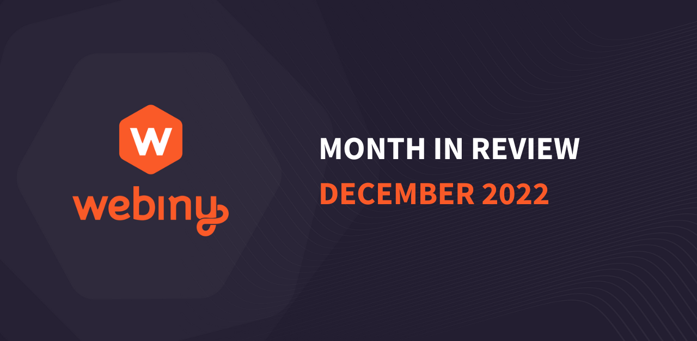

## We need your Feedback

We’ve seen some of the awesome things you’re building with Webiny, and we want to help you more. We are working on various initiatives to give you a transparent view of what we are preparing in the next releases, and to get your ideas and feedback on these items. It is important to keep improving the product and growing our user base, and we would love to give you an opportunity to share your opinion about Webiny with others. Read on to find out how 🧑‍💻

## Tell us what you think and get a $15 gift card

Webiny recently got listed on Capterra platform. A lot of organizations use it in their software research and it is based on user reviews and comparisons. We are reaching out to you, to help us by offering an honest review on the platform. As an incentive for the Webiny community, the first 50 users that submit a verified review will automatically be rewarded with a $15 gift card (usually Amazon, depends on the country you are from). By sharing your experience with Webiny you are helping others to make the right choice for them. 

🎁 Submit your review [here](https://reviews.capterra.com/new/121388/cd943393-4c1a-4f85-b96f-a0d43e693877?lang=en?utm_source=Newsletter&utm_medium=monthly-newsletter&utm_campaign=Regular-content&utm_content=month-in-review-december&utm_term=W00799) and get your reward. 

if you have 10-15 minutes it would be awesome if you could fill in the Webiny features prioritisation questionnaire and have your say in our Q1 2023 planning activities.
