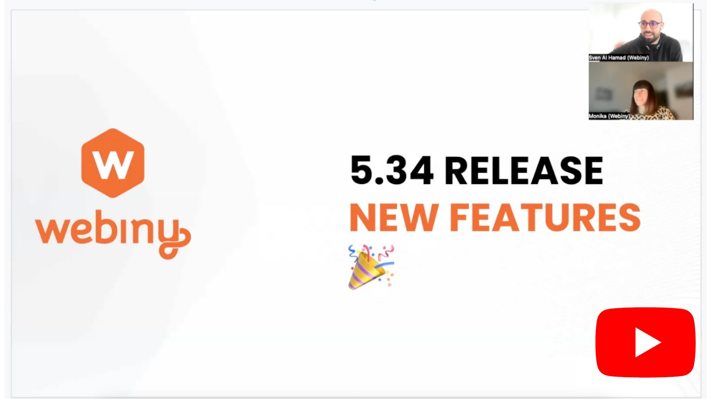
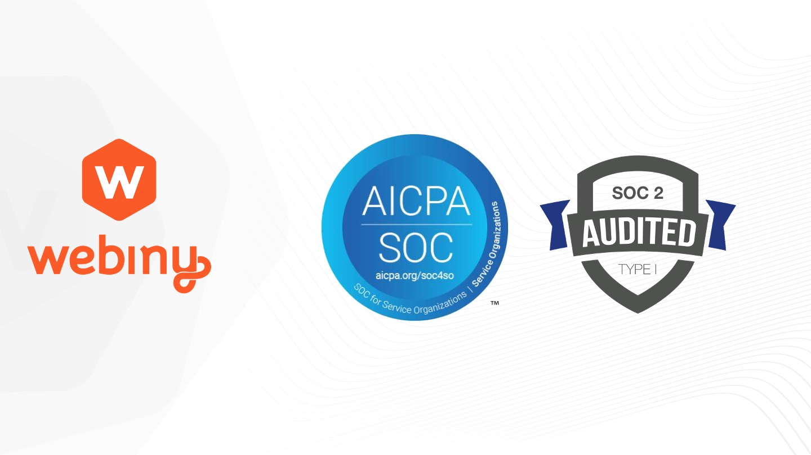
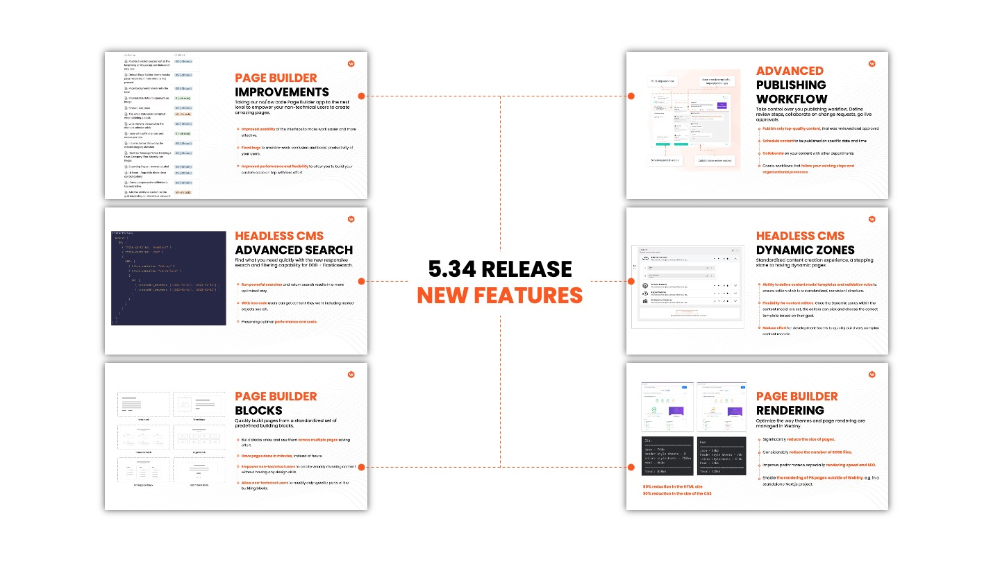

## Webiny v5.34 is Here!

We are delighted to bring to you Webiny v5.34! We've spent the last couple of months working on this major feature release. We are proud of what the team achieved in such a short time. This version is full of great new functionalities. We hope that the enhancements to the Page Builder, the new Blocks feature, our new Rendering Engine, the introduction of Dynamic Zones and the Advanced Search functionality in the Headless CMS will help you tremendously. 

We are also happy to share with you that the we got our SOC 2 certificate! Now all of the hard work which our teams have been putting around our processes and technology to get to high security, privacy and availability is officially rubber stamped.

Read on to find out more 🧑‍💻

## Webiny got the SOC 2 Certificate 🔐

We finally have the official acknowledgement that we are following the right protocols and processes and that Webiny is secure and reliable solution which is fit for purpose for both small businesses and large enterprises. We went through detailed audits and examination to prove that we have the right procedures and tools in place to ensure our clients are safe and secure using Webiny. Big shout out to Sven and Adrian for working tirelessly to answering all the questions we got from the auditors and getting this to a happy end and made us a proud holder of the [SOC2 certificate.](http://www.aicpa.org/soc4so?utm_source=Newsletter&utm_medium=monthly-newsletter&utm_campaign=Regular-content&utm_content=month-in-review-january&utm_term=W00816) 

## Update Roadmap

After our latest major release, we have updated our roadmap with the new features in the pipeline. If you want to find out what is coming up or comment and give us heads up on what is important to you, here is our public roadmap.

✨Check it out [here](https://github.com/orgs/webiny/projects/5?utm_source=Newsletter&utm_medium=monthly-newsletter&utm_campaign=Regular-content&utm_content=month-in-review-january&utm_term=W00817)

## Focus on Documentation 📃

This quarter our team will be spending more time on documentation. We appreciate that we have been too busy with working on new code and refactoring what we already have in the system to bring to you new and optimized functionalities as soon as possible, and sometime we don't give enough love to the documentation. To enable you to build even more complex solutions with Webiny without our Engineering team, we will make sure that we create more video tutorials and detailed documentation for you. If you have any specific requests or you want to contribute, please drop us a line on our Slack channel.

Also here is one that we found particularly helpful. We updated [Create a Page Element tutorial](https://www.webiny.com/docs/page-builder/extending/create-a-page-element?utm_source=Newsletter&utm_medium=monthly-newsletter&utm_campaign=Regular-content&utm_content=month-in-review-january&utm_term=W00819), which now reflects all the changes that the new Page Elements page rendering engine introduced. Be sure to check it out if that's something that sounds interesting to you.

## Release 5.34 is now live 🚀

✨Full of goodness and new features✨

Last year we changed the way we release new features to enable you to easily make upgrades and take bug fixes with our smaller releases which take place ad hoc, and at least in the end of each sprint. With v5.34 we are releasing our new features which will significantly reduce effort and boost productivity across your teams. These features were available for you to try and test in our unstable releases. Massive THANK YOU to all the feedback you provided along the way. This would not be possible without your thoughtful feedback and validation.

With upgrading to this new version you can start using:

✅ [Page Builder Blocks](https://youtu.be/1hRDQnYE8Rs?utm_source=Newsletter&utm_medium=monthly-newsletter&utm_campaign=Regular-content&utm_content=month-in-review-january&utm_term=W00821)  🎥 

✅ [Dynamic Zones](https://youtu.be/YUNjZyNTsdA?utm_source=Newsletter&utm_medium=monthly-newsletter&utm_campaign=Regular-content&utm_content=month-in-review-january&utm_term=W00822) 🎥 

✅ [Advanced Publishing Workflow](https://youtu.be/LybyaJZ_3x8?utm_source=Newsletter&utm_medium=monthly-newsletter&utm_campaign=Regular-content&utm_content=month-in-review-january&utm_term=W00823) 🎥 

✅ New Rendering Engine 

✅ Advanced Search Capability

✅ Improved Page Builder

Here is the [detailed change log](https://www.webiny.com/docs/release-notes/5.34.0/changelog?utm_source=Newsletter&utm_medium=monthly-newsletter&utm_campaign=Regular-content&utm_content=month-in-review-january&utm_term=W00820) and this is how you can [upgrade](https://www.webiny.com/docs/release-notes/5.34.0/upgrade-guide?utm_source=Newsletter&utm_medium=monthly-newsletter&utm_campaign=Regular-content&utm_content=month-in-review-january&utm_term=W00824). We strongly recommend upgrading your non-production environments first to validate that all custom plugins will continue working as expected. If you need any help, do not hesitate to contact us on Slack.

## New Tutorials 🫶

We selected a couple of awesome blog posts to share with you this month. We are still bringing on board new authors, so if you want to contribute and join our Writing with Webiny program, you can find out more [here](https://www.webiny.com/docs/write-with-webiny/write-with-webiny?utm_source=Newsletter&utm_medium=monthly-newsletter&utm_campaign=Regular-content&utm_content=month-in-review-january&utm_term=W00826). We'd love to hear from you: [drop a comment here](https://www.webiny.com/slack/?utm_source=Newsletter&utm_medium=monthly-newsletter&utm_campaign=Regular-content&utm_content=month-in-review-january&utm_term=W00827), or DM Swapnil on Slack.

#### 🚀 Build a Blog with Eleventy (11ty) and Webiny Headless CMS
In this [tutorial](https://www.webiny.com/blog/build-blog-eleventy-webiny-headless-cms?utm_source=Newsletter&utm_medium=monthly-newsletter&utm_campaign=Regular-content&utm_content=month-in-review-january&utm_term=W00828) by **Maurice King**, we will use Eleventy (11ty) and Webiny to create a blog website. We'll learn how to connect to Webiny and use it as a source of data for our front end created with Eleventy.

#### 🚀 Building a Voice Controlled News Application using React, Alan AI, and Webiny CMS
**Christopher Okoro** shows us how to harness the power of Webiny's Headless CMS, React and integrate a Voice User Interface in the mix to get a voice controlled news app in this [blog post](https://www.webiny.com/blog/build-voice-controlled-news-app-alanai-webiny?utm_source=Newsletter&utm_medium=monthly-newsletter&utm_campaign=Regular-content&utm_content=month-in-review-january&utm_term=W00829).

## The Codebase: v5.34.1 is here

While we were busy working on material for the last major release, our Engineering team was focused on fixing small issues with the new code. So here comes [v5.34.1](https://www.webiny.com/docs/release-notes/5.34.1/changelog?utm_source=Newsletter&utm_medium=monthly-newsletter&utm_campaign=Regular-content&utm_content=month-in-review-january&utm_term=W00831) with some small but significant tweaks. It is addressing some issues raised by community members, and some we found ourselves as well as offering small upgrades to existing features:

✅ New Rendering Engine Improvements 
We’ve included a number of smaller fixes reported from early adopters who gave the new rendering engine a try. Thank you!

✅ Website App Now Uses Webiny React Application Framework
[Webiny React application framework](https://docs-webiny-llfnlr0ez-webiny.vercel.app/docs/admin-area/basics/framework?utm_source=Newsletter&utm_medium=monthly-newsletter&utm_campaign=Regular-content&utm_content=month-in-review-january&utm_term=W00832) is something that’s been powering our Admin app for the past year. It allowed us to register plugins as regular React components, by simply dropping them inside the <Admin/> element. With this release, we’ve finally refactored the internals of the Website app, to utilize this same application framework.

✅ Webiny CLI Improvements
Our CLI has also received some love with this release. We've fixed a glitch that some users encountered upon using the [Extend GraphQL API](https://docs-webiny-llfnlr0ez-webiny.vercel.app/docs/core-development-concepts/scaffolding/extend-graphql-api?utm_source=Newsletter&utm_medium=monthly-newsletter&utm_campaign=Regular-content&utm_content=month-in-review-january&utm_term=W00833), and, subsequently, the [Extend Admin Area scaffolds](https://docs-webiny-llfnlr0ez-webiny.vercel.app/docs/admin-area/new-app-tutorial/scaffolding?utm_source=Newsletter&utm_medium=monthly-newsletter&utm_campaign=Regular-content&utm_content=month-in-review-january&utm_term=W00834). We've also made it easier to deploy multiple apps, all within a single command execution! Be sure to check the change log for more information on these.

Here is the detailed [Change Log](https://www.webiny.com/docs/release-notes/5.34.1/changelog?utm_source=Newsletter&utm_medium=monthly-newsletter&utm_campaign=Regular-content&utm_content=month-in-review-january&utm_term=W00831) and this is [how you can upgrade](https://www.webiny.com/docs/release-notes/5.34.1/upgrade-guide?utm_source=Newsletter&utm_medium=monthly-newsletter&utm_campaign=Regular-content&utm_content=month-in-review-january&utm_term=W00835) if you want to take advantage of the new code.

## Join us on Slack

Thank you for being part of our amazing community! [Join us on Slack today to connect with other users building cool stuff with Webiny!](https://www.webiny.com/slack?utm_source=Newsletter&utm_medium=monthly-newsletter&utm_campaign=Regular-content&utm_content=month-in-review-december&utm_term=W00798)

