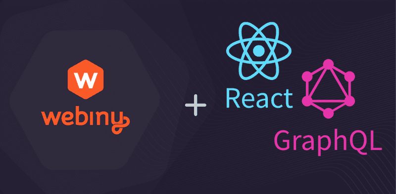

We're announcing today loads of exciting things we've been busily working on, plus feedback from our Product Hunt launch.

## Product Hunt Launch

Webiny has gone from strength to strength this year. As a result of the hard work and innovations of our engineering team, we have improved on our existing benchmarks, become even more customizable, and reached many new audiences.

However. It's still an uphill climb for us. Theres a lot of competition in the market, and these solutions are simpler products without the scaling possibilities and rich features of Webiny.

To help educate and inform our audience, we' launched on Product Hunt with a new campaign around the value we bring to organizations: not just to to engineering teams, but to content authors, management teams and others.

The campaign went really well, we got upvoted 121 times, had a flurry of comments, and reached many new audiences, and found some new fans!

> "I've been tracking Webiny from early on and am really impressed by the project as well as the people behind it. This is a great example of not only a headless CMS but also how you can leverage the ubiquity of javascript for infrastructure as code (thanks to pulumi) as well as developer workflow examples leveraging serverless. If you want to know where web development is headed, this is a great example.

&mdash; Mitch Pirtle, co-founder of Joomla CMS

Although the campaign lasted only 24 hours and has now closed, you can still [visit the campaign on Product Hunt](http://www.producthunt.com/posts/webiny-enterprise-cms) to see how it went.

## Community: Even More New Tutorials

We now have over 30 writers contributing articles on a dizzying array of different technologies. We're really hoping these articles will help more people become familiar with Webiny and build uniquely different things with it. Here's some of this month's highlights:

- [Build a Job Board Application with Vue.js and GraphQL](https://www.webiny.com/blog/create-marketplace-app-vuejs-pinia-webiny-headless-cms) — by **Chrissy**
- [Build a Job Board with React and GraphQL](https://www.webiny.com/blog/build-job-board-react-graphql) — by **Taminoturoko**

The following tutorial is more technical and also covers how to upload documents from a separate application to our File Manager using the `getPreSignedPostPayload()` API:

- [Build a Photo Gallery with Nuxt.js](https://www.webiny.com/blog/build-photo-sharing-app-nuxt-webiny-headless-cms) — by **Miracle**
Thank you to our fantastic community for writing with Webiny!

We've also recieved some requested content via our community: **Brendan** and Daniel both would like to see an article that covers building a monorepo with Webiny and Next.JS, so that teams can share code between Webiny and their frontend, and potentially use the same deployment mechanisms we have.

Can you write this article? We'd love to hear from you: DM Swapnil or Ben in the [community Slack channel](https://www.webiny.com/slack).

## The Codebase: v5.33.0 Out now

Webiny v5.33.0 has just been published. This release will see a massive 30+ PRs merged, addressing some issues raised by community members, and some we found ourselves!

We're carefully planning some pretty exciting major new features to be released over the next quarter, which you'll hear about before anyone else if you [join our Slack channel](https://www.webiny.com/slack).

[Webiny v5.33.0 Changelog](https://www.webiny.com/docs/release-notes/5.33.0/changelog)

## Introducing Webiny Enterprise Headless CMS+

Webiny, as I'm sure you realize by now, is more than a Headless CMS: Not every CMS can scale to tens of thousands of users, serve content for millions of website pages and application interfaces, and be as easily customizable as Webiny is.

We've launched a new campaign to educate our audience about some of the features Webiny contains.

[Read about the campaign here](https://www.webiny.com/blog/introducing-webiny-enterprise-headless-cms-plus).

## So You Wanted a Live Demo?

One of the problems we've been trying to solve is how to open Webiny up to new audiences without having to initialize a new instance locally, then deploy it to AWS.

Well, we're pleased to tell you we've solved it.

Complete the form linked below and you'll have immediate access to your own Webiny demo instance that's persistent, that will allow you to check out our complete product without installing a single thing, or setting up any credentials.

[Access a live demo now](https://webiny.typeform.com/to/VYffkZlR)

## That's it!

Thank you once again for being part of the amazing community we have. 

For us, seeing how you and your teams are not only enabled by the product we build, but also motivated by the support we invest in you, makes all the effort worthwhile.

