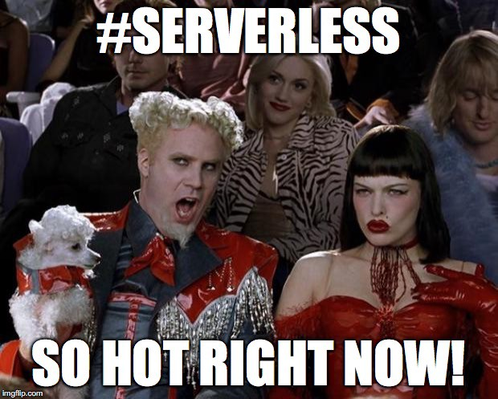
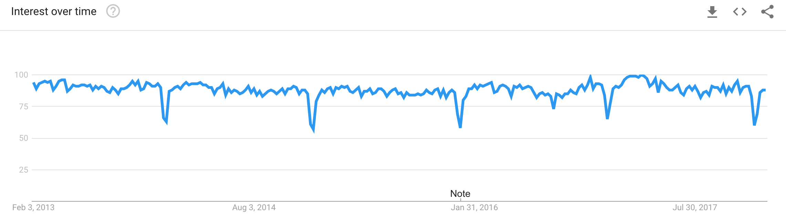
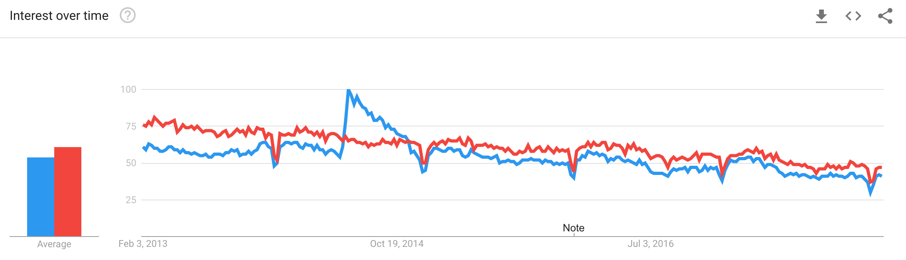

I must admit, I was a very hard advocate of PHP and would never have thought of moving to Node.js or any other language to write server side code. But as the saying goes, never say never, because life slaps you around, and before you know it, you’re neck-deep in Node.Js.

With this blog post I want to announce that **the next release of Webiny will be 100% written in Javascript** and in the sections below I’ll try and give our insight into why and how we’ve reached this decision.

## Node.Js vs PHP

Let’s get this one out of the way first. There will be no comparisons between the languages in terms of their functionality, benchmarks, number of lines of code or anything similar. This text is not about that, and those are not the factors that have led to our decisions.

Our point of view is (still) that most languages are the same, and the main deciding factor is the experience of the developer who is writing the code. A shitty developer and the best language in the world will still produce a shitty result, while a great developer and a shitty language will at least lead to a decent result.

And that’s the reason why there is truly no point in discussing technical differences between the two.

## Non-technical reasons

Today’s trends give us an overview of how the future might look like. Also, today’s problems cater to tomorrow’s solutions.

### Cost

Yes, every language has a cost, and here I’m referring to the cost of resources a language consumes — be it CPU, memory or storage. Languages that are performant consume less, therefore they cost less. However, in terms of Node.Js vs PHP, the cost difference doesn’t play a big role, **BUT **there is also the factor of how you manage the resources. In terms of PHP you have to have a server that is running 24/7, regardless if the server is processing requests or is just being idle.

In terms of Node.Js, well, there is “serverless,” which enables you to basically pay-per-request, which provide a much better utilization and bang for your buck. PHP, on the other hand, is not very well supported by providers such as AWS. This was one of the main reasons for switching to Node.Js.

### Trends

The longevity of an open-source project is greater if the project is in line with the current macro trends on the market. Looking at the PHP adoption across a 5-year period, we notice a consistent drop.

On the other hand, JavaScript has a pretty consistent trend over the same period.

Webiny, while using PHP, still had about 70–80% of the code written in JavaScript, which are React components. Having this trend in mind, moving the remaining code to Javascript just made more sense.

Products created in these languages are also following the language trend. For example, take a look at how Wordpress is closely following the PHP trend:

Data from the past 5 years is hard evidence that the future of PHP is not a bright one. PHP will most likely continue to lose market cap, new companies will most likely chose other languages over it, as well as young developers who will pick other languages to specialize in.

Will PHP die in next 5 years? I would say this is unlikely. There are many BIG companies that are using PHP today and will continue to use it in the future. On that topic, this was shared with me:

> Before PHP “dies”,
> Facebook and Wordpress have to die.
> Wikipedia has to die.
> Yahoo has to die.
> Tesla’s website, Cloudflare, Slack have to die.
> Flickr has to die. Tumblr has to die. Photobucket too.
> Magento and many major world class e-commerce solutions have to die.
> SourceForge has to die.
> MailChimp (millions of commercial mailing lists managed by it) has to die.
> via — https://www.quora.com/Will-PHP-die-in-2018

But, will PHP’s market decrease? Most likely.

### Package Manager

Yes, both PHP and Node.js have a package manager, however, the ecosystem around NPM is way more developed.

If we take a look at our JS github repo [https://github.com/webiny/webiny-js ](https://github.com/webiny/webiny-js), we get an automatic scan via Snyk.io, which is a big deal. Additionally, in the past we had about 25 repos given that Composer doesn’t support a monorepo structure as Node.js does via Lerna or Yarn workspaces (we have also seen a lot of custom monorepo solutions). Before, we were losing so much time updating all the child repos and now this work has been drastically simplified. Even day-to-day development is much faster because it is easier to manage 1 repo split into 20 packages published separately than 20 separate repos.

You might think a package manager doesn’t make a big difference, but trust me, having battled and spent numerous hours with Composer and its dependency management, which often drove me crazy, NPM is a welcome change.

### Management

In terms of the cost and serverless section — there is another big win. Unless you’ve been living under a rock, you’ve heard about the recent Spectre and Meltdown vulnerabilities. You’ve probably received, just as I have, several messages from different hosting providers to update the kernel on your boxes. This is a tiresome and time-consuming task. Before there was Heartbleed, now it’s Spectre and Meltdown, tomorrow there’ll be something else. Running on serverless infrastructure, all of these vulnerabilities are patched and updated automatically for you.

## Conclusion

You might, or might not, agree with what I’ve written here. We at Webiny have spent over 10 years working in PHP and we’ve given this switch a lot of thought. We knew this would take us several steps back, but it had to be done.

Last 2 months were spent on working hard on the new Javascript repo, and in the next several weeks we’ll be ready to deploy the first version. As with the previous version, Webiny will be free, open source and licensed under MIT. You can explore our new repo on our GitHub page:

`https://github.com/webiny/webiny-js`

..and before we go, once we’ve added the [Flow](https://flow.org/) type checker, all of a sudden our experience with server-side Javascript has become something like this:

