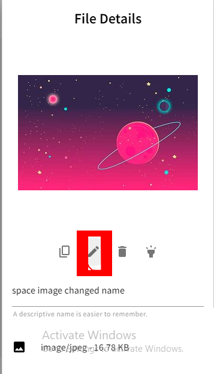

Today we will learn about one of the main features of Webiny, its file manager. We will go in depth about its use and demonstrate why it is superior to file managers in other content management systems. We will talk about how to use its features in detail, along with how to render images using the GraphQL API and in a simple HTML document.

Today we are going to cover the following topics:

- What is the Webiny File Manager and what are its benefits?
- How to do file manipulation in the file manager (uploading, deleting, renaming)
- How to use the Webiny image editor for general tasks (cropping, flipping, filtering, and rotating)
- How to render image data through the GraphQL API
- How to set an image in an HTML file using the `srcset` attribute
- Accessing image data from the API using third-party software like Insomnia
- Mitigating cumulative layout shift (CLS) issues

### What is Webiny?

Webiny is an open-source content management system designed for enterprises. It uses serverless architecture for cost-effective performance and better scalability.

Serverless architecture is a way to develop services without worrying about infrastructure. Simply write your code and deploy it to the cloud. It has lower latency, lower cost, quick deployment, high speed, and less mental fuss. Building on top of those services, Webiny makes building advanced applications easier, quicker, and more enjoyable.

Some features of Webiny which make it a really great CMS for projects:

- [Headless CMS](https://www.webiny.com/docs/overview/applications/headless-cms)
- [Page Builder](https://www.webiny.com/docs/overview/applications/page-builder)
- [Form Builder](https://www.webiny.com/docs/overview/applications/form-builder)
- [Advanced Publishing Workflow](https://www.webiny.com/docs/overview/applications/apw)
- [Admin interface](https://www.webiny.com/docs/overview/applications/admin) dashboard

These features, along with the file manager, make a great starting point for a wide range of uses.

## Introduction to Webiny File manager and its benefits:

Webiny includes a scalable and serverless asset management system. It is a built-in Webiny part that you can easily access directly or via it’s API. While dealing with file data types, the file manager is used for inputting and uploading files. The infrastructure helps to keep a single version of each image in your project or web pages and provide it to different users on the basis of their devices.

Dynamic serverless image editing allows you to create images on the fly and serve them to multiple devices without much headache or issue. You can flip, filter, crop images, and perform many other functions for different use cases.

Let's talk about some features of the Webiny file manager.

### Structure and organization:

You can add different tags to a single image. These tags help you to find that image even if you have hundreds of image assets. Along with tags, you also get a searching feature, which is powered by elastic search in the DynamoDB + ElasticSearch version of Webiny.

Webiny is built to be modified, so you can tweak React components to make changes in the File Manager UI, upload and delete files via the API, and you can also make changes to the GraphQL schema for delivering images.

### Large data handling:

Webiny uses an S3 bucket for storing all files; this architecture is mainly for scalability and easy handling of data. The S3 bucket is Amazon’s cloud storage resource, which is like files and folders and stores simple data and descriptive metadata.

### Image editor:

The built-in image editor is my favorite feature of the file manager. You can crop, flip, rotate, and apply filters to images. It is a collection of features that can help you save time, resources, and effort in a variety of tasks.

### Image API:

The best part of the image API is that the CDN caches the images. So you will be getting a CDN link for images, and by default, every uploaded image is set to some preset sizes.

This is a graphQL API, so you can choose very specific data to render images in a UI.

## How to upload an image in the file manager

I am assuming that you are done with creating your Webiny project and deploying it. I also assume that you also made yourself an admin user, and now you are on the home page of your application.

It will be looking like this:

[https://lh6.googleusercontent.com/6Na7VyQXKKGes0eRoXMLbBpaoJg3GFC5pXBTgWEDEwdWUau1ecxbT10lUQTK2uRs6788LmZjUfjlpeg0io2AM4HCunF5FnT5PTIxOI2M33CGNcooCC_31chmTC71RuY1dGkK0sjLQQ8YM8I6bfzTeVd_S-ZE79GLYaU8ebyfyKfvK-tJjsqKooflEMuccQ](https://lh6.googleusercontent.com/6Na7VyQXKKGes0eRoXMLbBpaoJg3GFC5pXBTgWEDEwdWUau1ecxbT10lUQTK2uRs6788LmZjUfjlpeg0io2AM4HCunF5FnT5PTIxOI2M33CGNcooCC_31chmTC71RuY1dGkK0sjLQQ8YM8I6bfzTeVd_S-ZE79GLYaU8ebyfyKfvK-tJjsqKooflEMuccQ)

Now click on the upper left hamburger icon, and it will open a sidebar. For manageability, we will be creating both "groups" and "models." Click on the hamburger icon, and on the left sidebar, under "Content Model," click on the group:

[https://lh4.googleusercontent.com/NbYeOiocp68DVLF221Rv8uhFNtq6SzPEKO5EN1-OdC906vjQWNf8tA9ObqOAbH63pUyBdfRLzrMqLiQr_ipbqUpgTUwZb6RStGnpCoPSni9obmF7t5dPXoIwYn9XlCjF7tODdK-TTgJYrxq4R9PqGHAhp2nz4g2LwVWyorss6oSV-c6vuCg1GXo0aeBhkQ](https://lh4.googleusercontent.com/NbYeOiocp68DVLF221Rv8uhFNtq6SzPEKO5EN1-OdC906vjQWNf8tA9ObqOAbH63pUyBdfRLzrMqLiQr_ipbqUpgTUwZb6RStGnpCoPSni9obmF7t5dPXoIwYn9XlCjF7tODdK-TTgJYrxq4R9PqGHAhp2nz4g2LwVWyorss6oSV-c6vuCg1GXo0aeBhkQ)

Now you will be redirected to the Group page, where you will see a button that says "Save Group." Enter the data as shown in the photo below and click on "Save content model group":

[https://lh5.googleusercontent.com/ZMaQzdmMPwjspE_7SXQn2Ko9vmH4y6eK_mUg--O-lmth9NgmeH_pp5V2wiJn4qVg10HlKQP3pLqxlCyPtg8Ytd-fidFHn_rvykc_JdSTwNi9SFX2lLvDUnxiZhrPNqg5JZMTJrIgYRmRyui_SCNT7vqowYMF0TXjAUgEzCaTgCWtEBmDKQzmcIEjhk_e1g](https://lh5.googleusercontent.com/ZMaQzdmMPwjspE_7SXQn2Ko9vmH4y6eK_mUg--O-lmth9NgmeH_pp5V2wiJn4qVg10HlKQP3pLqxlCyPtg8Ytd-fidFHn_rvykc_JdSTwNi9SFX2lLvDUnxiZhrPNqg5JZMTJrIgYRmRyui_SCNT7vqowYMF0TXjAUgEzCaTgCWtEBmDKQzmcIEjhk_e1g)

A new group with the name "Photo" will be created; now click on the hamburger icon again and choose models from the option that was below the group:

[https://lh5.googleusercontent.com/lNMiwAVxwKh9EsgdZZ_JqFlqhNJ1r1PfyOT8woYHTliExkpqWj8LoZSjpP6z5UW_IDHJrGw7AzVqq2g75z59d71cteTNRFtM5FBH9K6JuW09F7N_JJwxQMZa4WVkiQFG5Iv-ClQ7R2GngTXX_enHJCCkM3FUaLfh5gHFSLVOMLsrrr-MUajnFshDs7O4oQ](https://lh5.googleusercontent.com/lNMiwAVxwKh9EsgdZZ_JqFlqhNJ1r1PfyOT8woYHTliExkpqWj8LoZSjpP6z5UW_IDHJrGw7AzVqq2g75z59d71cteTNRFtM5FBH9K6JuW09F7N_JJwxQMZa4WVkiQFG5Iv-ClQ7R2GngTXX_enHJCCkM3FUaLfh5gHFSLVOMLsrrr-MUajnFshDs7O4oQ)

You will arrive at the model's page; click the "New model" button, and a popup will appear; fill in the details (in my case, I filled in the name "Image," and chose the group "Photo":

[https://lh6.googleusercontent.com/zMKK982oXtTJl2c4MNmwau5xgDlujTiOara8lwXb6T0grHsmBXWijJvRfIPiX2qkUnieNE5zXgM9kyIy3JaTDqjhrJCIORvFB3yjZNY-NstSidDQxjyGPebwzf7rboexGdrPHzEkdhhpVWhMu5IrVzfN4Q-8cg2Ik6TG6af4T4_ghCBe8Q71sIpLFDN7Fw](https://lh6.googleusercontent.com/zMKK982oXtTJl2c4MNmwau5xgDlujTiOara8lwXb6T0grHsmBXWijJvRfIPiX2qkUnieNE5zXgM9kyIy3JaTDqjhrJCIORvFB3yjZNY-NstSidDQxjyGPebwzf7rboexGdrPHzEkdhhpVWhMu5IrVzfN4Q-8cg2Ik6TG6af4T4_ghCBe8Q71sIpLFDN7Fw)

You will reach the model editing page, where you will see a UI like this:

[https://lh5.googleusercontent.com/L5yGPz_ciW8bRq1U22wYduHogbijZG4wLRnsP1p8f6LZRPhvsS4pge6XiDSlXo4PqI-uwBV0x3POTFrxRJ3cEgPzL1NDhW8zlvC1h3yNF5JGPkcK66nkBJmh9mvQK7HTdverkGPzx8zgPSqamQTemFiDAgnHWccEXeaLlh-LuzyHyo8E-mqOSh89bRaMEA](https://lh5.googleusercontent.com/L5yGPz_ciW8bRq1U22wYduHogbijZG4wLRnsP1p8f6LZRPhvsS4pge6XiDSlXo4PqI-uwBV0x3POTFrxRJ3cEgPzL1NDhW8zlvC1h3yNF5JGPkcK66nkBJmh9mvQK7HTdverkGPzx8zgPSqamQTemFiDAgnHWccEXeaLlh-LuzyHyo8E-mqOSh89bRaMEA)

Now we will be needing to drop the Files and Text data type; hold "FILES" and drop it in the blue dotted box. A new popup will appear as follows:

[https://lh4.googleusercontent.com/LIMJh3BJlo-0hlbCZi_E9a8WXTyH4zyw1DUchxN3kNxuNBVm24iWau-aUgo2o5xGLth-5YS370UkJ50imfDVJ74nPx0_c00HwKdqcCZvGrlSihlkvOkpFZWHBNvyLyBU1NJXMs5VEGB54RBzwl8G1DKr4mb9EXVWxEHt3DM8hz9KDC_RbMnKZJEEs9Krww](https://lh4.googleusercontent.com/LIMJh3BJlo-0hlbCZi_E9a8WXTyH4zyw1DUchxN3kNxuNBVm24iWau-aUgo2o5xGLth-5YS370UkJ50imfDVJ74nPx0_c00HwKdqcCZvGrlSihlkvOkpFZWHBNvyLyBU1NJXMs5VEGB54RBzwl8G1DKr4mb9EXVWxEHt3DM8hz9KDC_RbMnKZJEEs9Krww)

In Label, put "File name," toggle the "Image only" option, and click on the Save Files button.

Now click on the Save button on the top right corner to save the model:

[https://lh3.googleusercontent.com/Ui_MDjxTz9r3GnjtoPJ-pYd1WQ1kGQBUyFYmNHOiUY0MWLwSEecDT0XWGHLtANhyK2sVGGOmJTHUeuu7VGTdeAxAfV1dl_SSu7MAphs5jA2gC759UeGrulDDYO0mgHemHgDlvwKTjPWvUrVOV0LIiqtzBFXoaf-Of9TgImS5TAWsQNWzrUb9B2I1PTS8Aw](https://lh3.googleusercontent.com/Ui_MDjxTz9r3GnjtoPJ-pYd1WQ1kGQBUyFYmNHOiUY0MWLwSEecDT0XWGHLtANhyK2sVGGOmJTHUeuu7VGTdeAxAfV1dl_SSu7MAphs5jA2gC759UeGrulDDYO0mgHemHgDlvwKTjPWvUrVOV0LIiqtzBFXoaf-Of9TgImS5TAWsQNWzrUb9B2I1PTS8Aw)

Now you are ready to start uploading your files. For that, click on the hamburger icon again and scroll down. You will see a star icon and a "PHOTO" group written below it. You will find "Images." Click on it:

[https://lh6.googleusercontent.com/83VAEdlUvpgkjzYLvjPnnfJ2PfMiXO3ER0SYWNSLLdxb6Z9X4RfIHoPr6kp5IyVd5Q3t5dsjU3qanaL8RqU-BH8k_4MpeoDB8DglyuODTZFjtBNtNtHUiqR4VcObyWVGsHfcPfF8RbRWH2zuKlM88olLKWAPmeXYClQKj72AgYPUa45liMjO-GmAOFJPqQ](https://lh6.googleusercontent.com/83VAEdlUvpgkjzYLvjPnnfJ2PfMiXO3ER0SYWNSLLdxb6Z9X4RfIHoPr6kp5IyVd5Q3t5dsjU3qanaL8RqU-BH8k_4MpeoDB8DglyuODTZFjtBNtNtHUiqR4VcObyWVGsHfcPfF8RbRWH2zuKlM88olLKWAPmeXYClQKj72AgYPUa45liMjO-GmAOFJPqQ)

On clicking it, you will reach a new page. Click on the "NEW ENTRY" button, and it will be something like this:

[https://lh6.googleusercontent.com/9vo-uagJrZMmcQ1UOhFV_Qi0zVJEqULzXJ8mb8hKfoKsriCgNTZT-ZXt1rpjPusbh3r7-5IfYIH8BxzkBfa5gOxg8xAX8tunCOu7R3IBv2jHrT_4FPmoHava92PqR1U-MlpNJ0IKnWt0vYc6VTqJ6GH6j400xHZeBwHVAP8hM2Wskv1VIsYEf1ya0WECeQ](https://lh6.googleusercontent.com/9vo-uagJrZMmcQ1UOhFV_Qi0zVJEqULzXJ8mb8hKfoKsriCgNTZT-ZXt1rpjPusbh3r7-5IfYIH8BxzkBfa5gOxg8xAX8tunCOu7R3IBv2jHrT_4FPmoHava92PqR1U-MlpNJ0IKnWt0vYc6VTqJ6GH6j400xHZeBwHVAP8hM2Wskv1VIsYEf1ya0WECeQ)

Click on the area covered in the red box and choose an image; it will open a new window; then click on "Upload":

[https://lh4.googleusercontent.com/n4x8l6uEGrWKrSfUE7GYp5k7CdenZ2DV1omSYEUsdAd8DKaNnlURaaiKdW1XNv3jFrBY7eHeDGclN-OW-9p8VmAHj8-yjJmaeBnkWQ29pQHdeude4XIYeHJoilbpKsfO7f1zMkvwAa7zKD4pAkIwkvpq-CUr4r_ZJk5leofKv0K-jG6x7WL2czHyKwLY6Q](https://lh4.googleusercontent.com/n4x8l6uEGrWKrSfUE7GYp5k7CdenZ2DV1omSYEUsdAd8DKaNnlURaaiKdW1XNv3jFrBY7eHeDGclN-OW-9p8VmAHj8-yjJmaeBnkWQ29pQHdeude4XIYeHJoilbpKsfO7f1zMkvwAa7zKD4pAkIwkvpq-CUr4r_ZJk5leofKv0K-jG6x7WL2czHyKwLY6Q)

Choose the file you want to upload and click on cross, it will be something like this:

[https://lh3.googleusercontent.com/emSndGaXESFh3ji8CnnIMZzzBM0XAYO9aGGATO0Np8hgWMDLJsy93EsnZ_dmSuFGUfjuQOielJ10hDgFkDyvwrMC4tfOpfNwnNZa117z5DSi1BPUwxZ7SGLtL080-Y_N9b4Eq85t1Bi4m2PTJYyI77vSG-pOFegWmyG_HX0HEMOh5wf0Ox1xFK1TFPf95Q](https://lh3.googleusercontent.com/emSndGaXESFh3ji8CnnIMZzzBM0XAYO9aGGATO0Np8hgWMDLJsy93EsnZ_dmSuFGUfjuQOielJ10hDgFkDyvwrMC4tfOpfNwnNZa117z5DSi1BPUwxZ7SGLtL080-Y_N9b4Eq85t1Bi4m2PTJYyI77vSG-pOFegWmyG_HX0HEMOh5wf0Ox1xFK1TFPf95Q)

Now click on “SAVE AND PUBLISH” and you successfully uploaded your first file on Webiny.

### Duplicating, renaming, and deleting file in the file manager:

Now we learned how to upload files now let’s learn about file manipulation. Let’s start with renaming the image.

Come to this page again:

[https://lh3.googleusercontent.com/emSndGaXESFh3ji8CnnIMZzzBM0XAYO9aGGATO0Np8hgWMDLJsy93EsnZ_dmSuFGUfjuQOielJ10hDgFkDyvwrMC4tfOpfNwnNZa117z5DSi1BPUwxZ7SGLtL080-Y_N9b4Eq85t1Bi4m2PTJYyI77vSG-pOFegWmyG_HX0HEMOh5wf0Ox1xFK1TFPf95Q](https://lh3.googleusercontent.com/emSndGaXESFh3ji8CnnIMZzzBM0XAYO9aGGATO0Np8hgWMDLJsy93EsnZ_dmSuFGUfjuQOielJ10hDgFkDyvwrMC4tfOpfNwnNZa117z5DSi1BPUwxZ7SGLtL080-Y_N9b4Eq85t1Bi4m2PTJYyI77vSG-pOFegWmyG_HX0HEMOh5wf0Ox1xFK1TFPf95Q)

Click on the image and a new page will open:

[https://lh5.googleusercontent.com/CHB7gwodMPx4g02KL7HQ4exl6Buo6gZ8N9PHIFXmrTFCAfG-V8LmCqwGMF1HRvyttgYu3jcmKMk8Unhg60j5Cg5Xza2N8U9i4CSLksle0j0UBMM51eFaf2rCwV7xHGbcandQOisJIByHYuM1iFprTwQoQZ9vMVitDeGtrQ1ReR6i82VpMxHRTNXxr-TX7A](https://lh5.googleusercontent.com/CHB7gwodMPx4g02KL7HQ4exl6Buo6gZ8N9PHIFXmrTFCAfG-V8LmCqwGMF1HRvyttgYu3jcmKMk8Unhg60j5Cg5Xza2N8U9i4CSLksle0j0UBMM51eFaf2rCwV7xHGbcandQOisJIByHYuM1iFprTwQoQZ9vMVitDeGtrQ1ReR6i82VpMxHRTNXxr-TX7A)

When you hover over the image you will see a gear icon, click on it and it will open a right sidebar, where you can change the image name:

[https://lh6.googleusercontent.com/8rN9fp0oi7a9DxbIhEBLjmxC7l4H4VrBznwzgSk7569wIMp_AL0up3VPYj63AKC2-MN_yWlFXSn8uop6RwjDl1q5W_lMim8KoQez7-Ub6TAWxVU5v89XMBADCaXJp82-rxgv09pU06LffFD10mQMC1iCjsx33Je-s0az1gSnGGrbAIoYvX1EfwQ-2pQCcg](https://lh6.googleusercontent.com/8rN9fp0oi7a9DxbIhEBLjmxC7l4H4VrBznwzgSk7569wIMp_AL0up3VPYj63AKC2-MN_yWlFXSn8uop6RwjDl1q5W_lMim8KoQez7-Ub6TAWxVU5v89XMBADCaXJp82-rxgv09pU06LffFD10mQMC1iCjsx33Je-s0az1gSnGGrbAIoYvX1EfwQ-2pQCcg)

In the red box, I marked write any name and click anywhere, it will change the name. Like following:

[https://lh4.googleusercontent.com/1eqTCEeNJJ9yoqE-Ox6NCb1XZBfBllXSIhDGI4UZw-jVrqtAzdcIs-q8xhU5-lk17nHO_t_GwkIEq7dSExuXq5FuF_NDVQ_YEcxmEndsws2m14PBWYPiZeMz5kYobZ_CVAP5LJNFZsVxjxpWl1eeYi19k2nPa-atKSmpKkCBqGpmj2hmaDnmAVZrCiaOpg](https://lh4.googleusercontent.com/1eqTCEeNJJ9yoqE-Ox6NCb1XZBfBllXSIhDGI4UZw-jVrqtAzdcIs-q8xhU5-lk17nHO_t_GwkIEq7dSExuXq5FuF_NDVQ_YEcxmEndsws2m14PBWYPiZeMz5kYobZ_CVAP5LJNFZsVxjxpWl1eeYi19k2nPa-atKSmpKkCBqGpmj2hmaDnmAVZrCiaOpg)

Now let's duplicate the image. For that click on the gear icon again and edit image button:

[https://www.notion.so](https://www.notion.so)



It will open a new page and just click on save without doing anything, it will duplicate your file:


It will simply duplicate the image:

[https://lh5.googleusercontent.com/uFwUX7Z8V_9PSSVDNgHc3e9OW59_BUl0uXngl4jcwOKZF_oq5ZO9_cILI9QDeUR-z_W35GxiLCT6V6-1h1zC-I32O2QrCWFUgjATC-EkhUZYQMbsqsnzhV7oXgCQ8b8yDKnGP8RNr2RfEcDasG-7MTuc21gSvkhLbEtT-CnWGB3XWlcKQCoJnjLlGTdjYQ](https://lh5.googleusercontent.com/uFwUX7Z8V_9PSSVDNgHc3e9OW59_BUl0uXngl4jcwOKZF_oq5ZO9_cILI9QDeUR-z_W35GxiLCT6V6-1h1zC-I32O2QrCWFUgjATC-EkhUZYQMbsqsnzhV7oXgCQ8b8yDKnGP8RNr2RfEcDasG-7MTuc21gSvkhLbEtT-CnWGB3XWlcKQCoJnjLlGTdjYQ)

Now for deleting, again click on the gear icon and click on the delete button:


It will delete the image. Now we are all done with basic file manipulation, now let's jump to the image editing part.

### Editing images in the image editor:

Getting back to the same page:

[https://lh5.googleusercontent.com/5ClvGVWqCRn2P8YfGyhvGqgLBgl-Wwb3YkO8U5G61Ets-sjRms0nqnHRDH3c7bL7EBI92CgRJuSCsak_kNqCS3vBEKQSc7GBjIlpkc3YzL8hcwYKsH7J_B76BEBB1jXUfKv_gPYVSKX3lsbyaA0exa50nIkksB37i9ebS2WoWyP1DoZd5rEj_UHN5HeEpQ](https://lh5.googleusercontent.com/5ClvGVWqCRn2P8YfGyhvGqgLBgl-Wwb3YkO8U5G61Ets-sjRms0nqnHRDH3c7bL7EBI92CgRJuSCsak_kNqCS3vBEKQSc7GBjIlpkc3YzL8hcwYKsH7J_B76BEBB1jXUfKv_gPYVSKX3lsbyaA0exa50nIkksB37i9ebS2WoWyP1DoZd5rEj_UHN5HeEpQ)

Click on the gear icon and choose the edit button:

[https://lh4.googleusercontent.com/BbBAWY62F32acABkZ2Y3np7LZFv6xStUz0VXmGKV2i11TYpkVoh3crcRmXDVEVgQnUz2KDUSjJsuIB5qA5fNaqLm8o1MPEzo5uccOr7PdPBRfq-DEXXfLEGqpRWRc9pViwbRiNoGWr3HHyrbjLE5CJADQqBsK0BWVAl2QvFKxTBqfd7AYmtRch-2qPGjAg](https://lh4.googleusercontent.com/BbBAWY62F32acABkZ2Y3np7LZFv6xStUz0VXmGKV2i11TYpkVoh3crcRmXDVEVgQnUz2KDUSjJsuIB5qA5fNaqLm8o1MPEzo5uccOr7PdPBRfq-DEXXfLEGqpRWRc9pViwbRiNoGWr3HHyrbjLE5CJADQqBsK0BWVAl2QvFKxTBqfd7AYmtRch-2qPGjAg)

Click on the pencil icon and it will open a new window, we will start with cropping:

[https://lh4.googleusercontent.com/Ni2XgDzGCDIGkIHN8ewko4JFqAo8ENCwGaCGCrmm1EEVzJNWYfkNHH_7yqwwg1FpIWIlifDEPAG0_HfVuoi7ETh65pto_jKKq06NqJPvacemzjFXvt-ypRQndFIvLSZuiXsuV4mM3pw-fviFx9X6BFhXr32RqMA-LP75WQv1njsKd8lNnnuY88EsRsgf-Q](https://lh4.googleusercontent.com/Ni2XgDzGCDIGkIHN8ewko4JFqAo8ENCwGaCGCrmm1EEVzJNWYfkNHH_7yqwwg1FpIWIlifDEPAG0_HfVuoi7ETh65pto_jKKq06NqJPvacemzjFXvt-ypRQndFIvLSZuiXsuV4mM3pw-fviFx9X6BFhXr32RqMA-LP75WQv1njsKd8lNnnuY88EsRsgf-Q)

Now  click on the cropping option between the red box for cropping the image, now you will be on a new page:

[https://lh4.googleusercontent.com/thMKlgi4veJyZcePloS3gWhQa7I_Wznws14Ao8IuLam1ltVqyYBX36BNtSRgzpukUU_aD5dXzZpERQUEOE1ijbuOu1Ucu3ZphEvjoMIWN2dkVOnhhFsx7-nSXKsS9z1yoXkLFOLEcp_87x3Zinq9Xsit_KjU3YSO9xr0YklB0LyjUbtYIpV7eQ8YCM8hGw](https://lh4.googleusercontent.com/thMKlgi4veJyZcePloS3gWhQa7I_Wznws14Ao8IuLam1ltVqyYBX36BNtSRgzpukUU_aD5dXzZpERQUEOE1ijbuOu1Ucu3ZphEvjoMIWN2dkVOnhhFsx7-nSXKsS9z1yoXkLFOLEcp_87x3Zinq9Xsit_KjU3YSO9xr0YklB0LyjUbtYIpV7eQ8YCM8hGw)

Click on apply button then the save button and it will save the cropped image.

Next, we will do the flip:

[https://lh5.googleusercontent.com/TVYTsYjLr1DQwl53vddejSp4qcZRjjCMlQJIUs9TMEMEl9LMqbPwWnM9WtrEUYSF7kHk3vJ6KFYAsrhMFoUt8l84IXMeIRmYF8tvdBwqMU9HB9jt-m-ri9nTLJYps5IRTb1nxiEnnH214ZW43J_1RqJcsiSUKFTzarPVUGE4kta8GU1Dj6IxLDwAuGM6Zw](https://lh5.googleusercontent.com/TVYTsYjLr1DQwl53vddejSp4qcZRjjCMlQJIUs9TMEMEl9LMqbPwWnM9WtrEUYSF7kHk3vJ6KFYAsrhMFoUt8l84IXMeIRmYF8tvdBwqMU9HB9jt-m-ri9nTLJYps5IRTb1nxiEnnH214ZW43J_1RqJcsiSUKFTzarPVUGE4kta8GU1Dj6IxLDwAuGM6Zw)

Click on the function inbox and you will reach a new page:

[https://lh6.googleusercontent.com/7V2nGinTfd8bdEdwisIPCh6EwpSOQIkuVdunV5vpGgXWMB0FX73MoJSAegNqd9D2zL4tCKLG1D52ix2t8Y7X9yuNIDoj_2mOzdUWpULu-KYpCTLTCQ95s5TpwY152p6h5x1Qf0tlqlsZBqnHeg3kokymZaWj1LoYPEDHN_YgaPuJ-EVjmurTXa2O70LjZQ](https://lh6.googleusercontent.com/7V2nGinTfd8bdEdwisIPCh6EwpSOQIkuVdunV5vpGgXWMB0FX73MoJSAegNqd9D2zL4tCKLG1D52ix2t8Y7X9yuNIDoj_2mOzdUWpULu-KYpCTLTCQ95s5TpwY152p6h5x1Qf0tlqlsZBqnHeg3kokymZaWj1LoYPEDHN_YgaPuJ-EVjmurTXa2O70LjZQ)

Click on “FLIPX” or “FLIPY” and then “APPLY” and hit save. (i do FLIPX, which will show all results in end.)

Let's go with Rotate now, click on the function in the red box:

[https://lh3.googleusercontent.com/6RYsm5EuArTl-QIerBJp9nDS7DzejlVwsInsiSVy-a1MSJbt4ROavwAvNDyjQQww44tIc2jLHyLpwYlKaWwaePaWOuU6XWQQxUXdVT1CVexbd07ZW8MuWzPF-Mo54z9Fvkj-WY_fclf9J6lQ3cEuKIidGSicDKNXb87R5NriQTCCU3_UnD3M872CfH9_Ag](https://lh3.googleusercontent.com/6RYsm5EuArTl-QIerBJp9nDS7DzejlVwsInsiSVy-a1MSJbt4ROavwAvNDyjQQww44tIc2jLHyLpwYlKaWwaePaWOuU6XWQQxUXdVT1CVexbd07ZW8MuWzPF-Mo54z9Fvkj-WY_fclf9J6lQ3cEuKIidGSicDKNXb87R5NriQTCCU3_UnD3M872CfH9_Ag)

Now you will see a new page, you will get a range of input(i am rotating at 90 degrees):

[https://lh5.googleusercontent.com/YhrusIgamkcb-MtI-76JaGqtPVpxNLMmhgG9NZQ-RC414xV4sXQm0vUo7nmQLUDXcWyn_MmRvgUp6QnngF1wo5nAmF3aiPKYaEv94_EQnY9Q-xfhCsrD71YW47hWTCbUBN9giWXhfv6JDBM0ICM2eVR7aANTlxlTh7PdoWeGrHR-QK8lm5LmnamChqZXGQ](https://lh5.googleusercontent.com/YhrusIgamkcb-MtI-76JaGqtPVpxNLMmhgG9NZQ-RC414xV4sXQm0vUo7nmQLUDXcWyn_MmRvgUp6QnngF1wo5nAmF3aiPKYaEv94_EQnY9Q-xfhCsrD71YW47hWTCbUBN9giWXhfv6JDBM0ICM2eVR7aANTlxlTh7PdoWeGrHR-QK8lm5LmnamChqZXGQ)

Now again click on Apply button and then save.

Now let’s move on to the last function and most interesting one, which is the filter, so click on the function between the red box:

[https://lh3.googleusercontent.com/WeCSi3Kg0HqpO3zRk2HbvrCP9A4Q1O-z7J7MlgJdN-0ymR9-2rhQ6eCTeb1ZFjDRfRnKHXXjvnuyOFKXalpDGwR8RU0-P7-oTKjRV_bTRL01saqyZrx-IlTygngw7z5znxDKzZzTYgg_Hf7WVYfIMpyeRAlkx8Ldb45CzwHRHzfCCS7xJKHRjUGvDrTHFg](https://lh3.googleusercontent.com/WeCSi3Kg0HqpO3zRk2HbvrCP9A4Q1O-z7J7MlgJdN-0ymR9-2rhQ6eCTeb1ZFjDRfRnKHXXjvnuyOFKXalpDGwR8RU0-P7-oTKjRV_bTRL01saqyZrx-IlTygngw7z5znxDKzZzTYgg_Hf7WVYfIMpyeRAlkx8Ldb45CzwHRHzfCCS7xJKHRjUGvDrTHFg)

Now you will see a bunch of filters there and you can tweak them and see real-time changes on the image:

[https://lh6.googleusercontent.com/A83PffNOtSH2vZxa5HbU1KPJ3l0CVEapcJlVL_w2ngE5JMK3vMv6ypPqrTHujwWkk1Bu8-uTggN73r5oHcMHZjPjL-305YHBiH11RjklsKZXjD_Z4xo59AD6LaQzITtS5aRdNUqLHm3Njm3BEz43U7Ee_wHWyNMNeYNjhp_eFMgK9yAGD5bhlKc7kIfw2g](https://lh6.googleusercontent.com/A83PffNOtSH2vZxa5HbU1KPJ3l0CVEapcJlVL_w2ngE5JMK3vMv6ypPqrTHujwWkk1Bu8-uTggN73r5oHcMHZjPjL-305YHBiH11RjklsKZXjD_Z4xo59AD6LaQzITtS5aRdNUqLHm3Njm3BEz43U7Ee_wHWyNMNeYNjhp_eFMgK9yAGD5bhlKc7kIfw2g)

Now exactly as before just click on apply and save. (i increase noise, sepia, and clip in my case).

Now let’s see all our results:

[https://lh6.googleusercontent.com/OLbKHglNHeRICrYarxQrjPwgx_o2yaLCq5FIO8poEexIPNRWpxdVEU_UNbJz2K3_ptufv9S_qdQxPxodOgK_bXNJ4yJ_R4drty2r2BycpwXP4G7BlEQ5HwtfYZsMPHMXUcUFaPyrtaOGvGEcBpPo6RVqW_xsVMhSxXJGhqS-ioWwz9WmFEkHglyguxg_bQ](https://lh6.googleusercontent.com/OLbKHglNHeRICrYarxQrjPwgx_o2yaLCq5FIO8poEexIPNRWpxdVEU_UNbJz2K3_ptufv9S_qdQxPxodOgK_bXNJ4yJ_R4drty2r2BycpwXP4G7BlEQ5HwtfYZsMPHMXUcUFaPyrtaOGvGEcBpPo6RVqW_xsVMhSxXJGhqS-ioWwz9WmFEkHglyguxg_bQ)

Here are all our results, hope you understood how each function for image editing work.

## Connecting to and fetching images from the GraphQL API:

Now that we already know about image and file manipulation, let's learn how to get those images through the GraphQL API.

First let’s create the API key for authentication purposes so our third-party software or application can access our models through graphQL APIs, so first click on the hamburger menu icon, and on the left sidebar scroll down and under "settings," find "API keys":

[https://lh4.googleusercontent.com/ctouktWOHzu69WQfGoaNcgBlvGYlhjHmFHcFhxP5rQIHzPIhb2isgz65DFu3YoYBMg3tQmXNkMg_9Sq7rvB5KqhSw93Co_Kkjwr7dpgKqRWE-LyggwULOlvQ6s05SFVkG-a1ELAohOvmSr9-KYyXUoKlyjDUDrMpjrWe9vQjYJZr_aC3wHhTl9ax-lK0VA](https://lh4.googleusercontent.com/ctouktWOHzu69WQfGoaNcgBlvGYlhjHmFHcFhxP5rQIHzPIhb2isgz65DFu3YoYBMg3tQmXNkMg_9Sq7rvB5KqhSw93Co_Kkjwr7dpgKqRWE-LyggwULOlvQ6s05SFVkG-a1ELAohOvmSr9-KYyXUoKlyjDUDrMpjrWe9vQjYJZr_aC3wHhTl9ax-lK0VA)

Now you will be on the API keys page, now click on the “NEW API KEY” button and fill in the following in Name and description:

[https://lh6.googleusercontent.com/6GhmiNNyvhYFdNpyjbKzDbFiP9QlsPJ4sERmPT2SGcEeGwhnYZt9yYeJiINeZsYLagRL3aS3N4RVqo6cj2FdcceJ_uNfxgXzaXugp_JTCTqyoeAsz_BmdB5vUnJb2aTbxIQtawcK62REygyVmiBxQJNyhjra1jja0HxzUTZkhmz-Q0kN9LMBgt0vGBv-Yw](https://lh6.googleusercontent.com/6GhmiNNyvhYFdNpyjbKzDbFiP9QlsPJ4sERmPT2SGcEeGwhnYZt9yYeJiINeZsYLagRL3aS3N4RVqo6cj2FdcceJ_uNfxgXzaXugp_JTCTqyoeAsz_BmdB5vUnJb2aTbxIQtawcK62REygyVmiBxQJNyhjra1jja0HxzUTZkhmz-Q0kN9LMBgt0vGBv-Yw)

Now scroll down and under Permissions and under Content select “All locales”:

[https://lh5.googleusercontent.com/utmF0uJ3Y98o_ntSll0YJTFJ7WahjtwjztLKMApqKH-rYuKAWXZAA2QHIN4Tt2zLUaWrHvtREgmd4XMz-4AGj-5CEWP-BEbRIeXFtdTYOGE-ppzJlESyDHOo3-Wl-xu_lc-6DrCkdI5A4t-k1o1RQ61V5eQgdq9S5If75l37W8s07lYBM84GpC0yWpusWw](https://lh5.googleusercontent.com/utmF0uJ3Y98o_ntSll0YJTFJ7WahjtwjztLKMApqKH-rYuKAWXZAA2QHIN4Tt2zLUaWrHvtREgmd4XMz-4AGj-5CEWP-BEbRIeXFtdTYOGE-ppzJlESyDHOo3-Wl-xu_lc-6DrCkdI5A4t-k1o1RQ61V5eQgdq9S5If75l37W8s07lYBM84GpC0yWpusWw)

Now scroll down and under “Headless CMS” set the access level to “custom access” and select “read”:

[https://lh4.googleusercontent.com/ZIQiIbhjRC0iDvC3TrFkcGWsnBbbqTkqvUFGsNdDnP3m8rkLllqBABJkaj3KHVAnP73ASF5J7oFeubI-_cmpP6WjSznpBF_ryl_YhqvHdvJZhk12OhyQli94WjKk4iUo9_YS5EdVlxiBtB2DHlELW3VeF_IXZyC4TfuXAZFNtwpZhxTPCcoSbvt5HDTdJQ](https://lh4.googleusercontent.com/ZIQiIbhjRC0iDvC3TrFkcGWsnBbbqTkqvUFGsNdDnP3m8rkLllqBABJkaj3KHVAnP73ASF5J7oFeubI-_cmpP6WjSznpBF_ryl_YhqvHdvJZhk12OhyQli94WjKk4iUo9_YS5EdVlxiBtB2DHlELW3VeF_IXZyC4TfuXAZFNtwpZhxTPCcoSbvt5HDTdJQ)

Now scroll down more and click on  “Save API KEY”. After you have done that scroll upward and under the token copy the token:

.png)

Now after it is all done go to the API playground and shift to the Read API tab:

.png)

That link in the red box will be where we are going to send the request.

Now open any API request-sending software like Postman; I am going to use Insomnia.

Now set the POST request to the link and switch to authentication and set it to "Bearer" and paste the token that I asked you to copy:

%201.png)

Now in the data structure set it to graphQL and put these queries:

```graphql
{
  listImages {
    data {
      fileName
		}
 }
}
```

Before making a query, make sure to play in the API playground. I'm not going to explain how to make queries in Playground, but it should be the same as above if you followed exactly like mine, now paste it in as follows:

.png)

Now click on send and you will get the following results:

.png)

Now I think we are done with the connection with API now let’s learn about setting images using `srcset` in HTML.

### Setting image in HTML:

Now let’s create an HTML file where we would render our Webiny pics in our file while using the `srcset` attribute.

Make sure to upload different sizes of images. I am using one image at 499x320 pixels, and the a copy at 998x640 pixels.

We will be needing the URL that we get in our experiment above:

.png)

Copy the given link into the red box and we will use it. Now create an HTML file and write the code below:

```html
<!DOCTYPE html>
<html>
    <head>

    </head>
    <body>
        <h2>IMAGE:</h2>
        <body>        
</body>
</html>
```

We are using `src` because there are some browsers that don’t understand `srcset`.

It is simple to understand we set the width of the image using sizes and etc, here is the result:

[https://lh6.googleusercontent.com/WxCaMPnL2qMVUQiVhIVTEx1XjY0Og5q-1HGJUKAje3q_j5cthz-lrzz3K30P4ryAe1D0en8k67spWg9no3hkiwPqONOlaasttfUwm3ei5Q8dtFBEMJGzWyEhN8F1dOGjWqqHODjrd1_P8DB8eJOyEmt5x1mMnz7SX_FSvDq9M7LMzQcFjHCESViMwwmpmA](https://lh6.googleusercontent.com/WxCaMPnL2qMVUQiVhIVTEx1XjY0Og5q-1HGJUKAje3q_j5cthz-lrzz3K30P4ryAe1D0en8k67spWg9no3hkiwPqONOlaasttfUwm3ei5Q8dtFBEMJGzWyEhN8F1dOGjWqqHODjrd1_P8DB8eJOyEmt5x1mMnz7SX_FSvDq9M7LMzQcFjHCESViMwwmpmA)

Using this method, you can use the file manager to store image for a range of uses, including embedding in online documentation and for use in CRMs or other tools your organization already uses.

## Mitigating Content Layout Shift issues:

First, let's understand what a CLS issue is. It is a layout shift of the image when content like an image or text moves around when it loads in. The simplest way to avoid CLS for images is by adding aspect ratios and using width and height attributes in our HTML.

Now we will simply make some changes to our image model and add the default width and height of the image manually.

First, go to the  model list and choose edit model:

[https://lh3.googleusercontent.com/qOG0zzQ7V-cULGtRPrmrgSMleDH2_E51GFeGpEiFqJoPB6GgLyKg5A-qnAWTE3TzwZsvqXzFBMz28e3Gi2JR_2lxs9g383N3NXjRAo2O8WwJG75yFa_ZJOs-g5aVmP5wRjxanCeQXrQJNc0Nd9rfEfQkzcpWQJeMAXw0STIxgef62eIhOLyPHfbiC5Qv7w](https://lh3.googleusercontent.com/qOG0zzQ7V-cULGtRPrmrgSMleDH2_E51GFeGpEiFqJoPB6GgLyKg5A-qnAWTE3TzwZsvqXzFBMz28e3Gi2JR_2lxs9g383N3NXjRAo2O8WwJG75yFa_ZJOs-g5aVmP5wRjxanCeQXrQJNc0Nd9rfEfQkzcpWQJeMAXw0STIxgef62eIhOLyPHfbiC5Qv7w)

Click on edit model and add two number fields:

[https://lh4.googleusercontent.com/VRwMzhg-VYN6QbjKSoSwdeInihel1I1h-hG69a28I31dE0zHD6ww3ATi8MPxoR7TW04jFBrkMMMRKn7WpgpH3ClwRUVU67j7tnRi4bzS01v-lVtfD7hsBPLVGhA1uoWK4Cp7zK3z5u0Aq8tUAjoim6mGZ-NXWH-ZHxnQpDl0vexf3CmViZ80tfRVXbgW0w](https://lh4.googleusercontent.com/VRwMzhg-VYN6QbjKSoSwdeInihel1I1h-hG69a28I31dE0zHD6ww3ATi8MPxoR7TW04jFBrkMMMRKn7WpgpH3ClwRUVU67j7tnRi4bzS01v-lVtfD7hsBPLVGhA1uoWK4Cp7zK3z5u0Aq8tUAjoim6mGZ-NXWH-ZHxnQpDl0vexf3CmViZ80tfRVXbgW0w)

Add the following details in the field:

[https://lh6.googleusercontent.com/isjNKRZmqYUqA24J9-HWW3ZLIJ62cY5kg1uQ-8E7UHOKYVZ83MX7UcIVxO47MAlzhT4LCDlyPwHvTP9XbpG_cVXL2-0lWXDgBAJP3zObqiKcOjQHs4s4YQ20WSq0ajrexP_AyPMs_uFZUMAoYswG4REmnbUji9NSkF3-S4XiWoWuWvl5hgm8v4sQp-Gyog](https://lh6.googleusercontent.com/isjNKRZmqYUqA24J9-HWW3ZLIJ62cY5kg1uQ-8E7UHOKYVZ83MX7UcIVxO47MAlzhT4LCDlyPwHvTP9XbpG_cVXL2-0lWXDgBAJP3zObqiKcOjQHs4s4YQ20WSq0ajrexP_AyPMs_uFZUMAoYswG4REmnbUji9NSkF3-S4XiWoWuWvl5hgm8v4sQp-Gyog)

Similarly, add one for height and everything will look like the following:

[https://lh4.googleusercontent.com/D-Hy_JfEJznoOsyiGSvoPCb5xJqAsgCfvq59eTIwrbTRgcgSBPuNp0wd0V6qGRs-XB3DULpdPlcQGTZSz9OR9arcCzr0nG_6sFDVS-iJU5oNYUPSB-5gWDvfqBwTzHM9NkzjqbFaE5LCFZASIACcKRchN8iAhiDBsnMcl-bO_QnK1EIkGRBdM9j0ThX6tw](https://lh4.googleusercontent.com/D-Hy_JfEJznoOsyiGSvoPCb5xJqAsgCfvq59eTIwrbTRgcgSBPuNp0wd0V6qGRs-XB3DULpdPlcQGTZSz9OR9arcCzr0nG_6sFDVS-iJU5oNYUPSB-5gWDvfqBwTzHM9NkzjqbFaE5LCFZASIACcKRchN8iAhiDBsnMcl-bO_QnK1EIkGRBdM9j0ThX6tw)

Hit on save and you are done with defining aspect ratios.

Now get to the entry page of the image from the left sidebar:

[https://lh6.googleusercontent.com/83VAEdlUvpgkjzYLvjPnnfJ2PfMiXO3ER0SYWNSLLdxb6Z9X4RfIHoPr6kp5IyVd5Q3t5dsjU3qanaL8RqU-BH8k_4MpeoDB8DglyuODTZFjtBNtNtHUiqR4VcObyWVGsHfcPfF8RbRWH2zuKlM88olLKWAPmeXYClQKj72AgYPUa45liMjO-GmAOFJPqQ](https://lh6.googleusercontent.com/83VAEdlUvpgkjzYLvjPnnfJ2PfMiXO3ER0SYWNSLLdxb6Z9X4RfIHoPr6kp5IyVd5Q3t5dsjU3qanaL8RqU-BH8k_4MpeoDB8DglyuODTZFjtBNtNtHUiqR4VcObyWVGsHfcPfF8RbRWH2zuKlM88olLKWAPmeXYClQKj72AgYPUa45liMjO-GmAOFJPqQ)

And then add the width and height as follow:


Now you can quickly get the width and height of the image to avoid the CLS issue from API:

.png)

Like above we are getting width and height also as the parameter, we can use them when we call API from a JS script and then add default width and height as follows:

```html
<!DOCTYPE html>

<html>
  <head>
  </head>
  <body>
    <h2>IMAGE:</h2>
    
  </body>
</html>
```

Result for this:


By creating a content model for your image we can solve the layout shift issues by defining the aspect ratio of the image. This method can be used to create alternative text for screen readers too.

## Comparing Webiny and Strapi

Strapi, an open-source headless CMS is a name that often comes into my mind when we talk about CMS. Strapi's file manager provides you with some features similar to Webiny, including multiple file uploading, live editing, responsive formatting etc.

Both CMS have many similarities between them along with some key differences in their offerings and working style which can be big factors when deciding the CMS for your project.

 We are going to compare factors like hosting, storage services, CDN, scalability, and multi-tenancy.

Let’s now talk about them in detail.

### 1. Hosting and setting up image storage:**

Webiny is hosted on AWS, making the application completely serverless. Create your project file and deploy it without any configuration by using a simple deployment command. You won’t need to worry about configuring the database or the image hosting. All services are built-in.

Strapi, on the other hand, can be hosted by any provider. With Strapi, setting up different databases and storage services will cost you extra money and time. If we talk about hosting on AWS, you will have to create an S3 bucket separately that stores files that can be served through your application. You will need to connect the AWS RDS service for managing and hosting databases separately. Suppose you want to use another service, like MongoDB. In that case, it will again need extra configuration.

### 2. CDN services:

In Webiny, when you upload any image, it is automatically cached in the CDN as it is a built-in feature of Webiny. With the Webiny image serving API, you can get the CDN link for any image that you upload. It uses Amazon’s CloudFront for this purpose.

To provide efficient image delivery with Strapi, you will need to set up a CDN service yourself, like Cloudinary or CloudFront, separately.

### 3. Multiple project support:

With Webiny, you can host the backend once and use it for many projects. This is because Webiny supports multi-tenancy without extra configuration.

Strapi at the time of writing doesn’t support multi-tenancy. Because of this, you need to host different backends separately for different projects.

### 4. Scalability and other indirect costs:

When you are developing a large project, you will be needing to manage large amounts of data and files. In case of scaling the project, you will be needing to hire DevOps and engineers for handling your infrastructure. This means extra time on human resources and more time building configuration tools. Webiny has the advantage of built-in scaling, both to increase it’s capacity and to reduce it to zero automatically, facilitating efficient use of funds and time. On the other hand, scaling Strapi needs to be managed by your internal team, whether it’s increasing Kubernetes pods, allocating extra resources, or adding extra layers of read/write capacity.

### 5. Security

Webiny utilizes AWS’ battle-tested user authentication system, AWS Cognito, by default. It doesn’t depend on it’s own internal tools, like Strapi does by default. Webiny also has pre-built configuration for Okta and Auth0 which is available on the Enterprise plan.

Leveraging existing systems for authentication means that security is delegated to the experts who work on these issues 24/7, and avoids having to quickly patch a system once a security flaw is detected.

There are other benefits as well, such as AWS CloudFront’s built-in DDoS protection, which means even whilst under attack, the system can still continue to function.

## Summary:

We hope this article has helped you decide why to choose Webiny, the benefits of it’s infrastructure, and how it saves costs and resources. We’ve also learned about the file manager and its built-in tools.

If you would like to learn more about Webiny or talk to one of our advisers, [please contact us today](https://site.webiny.com/forms/enterprise-requirements?_gl=1*q0okcf*_ga*MTMzNzgyMTczMi4xNjY3NDcyNTYy*_ga_7JWHE1EE2Z*MTY3MDQwNTAyMi4yMy4xLjE2NzA0MDU5MzUuMC4wLjA.).