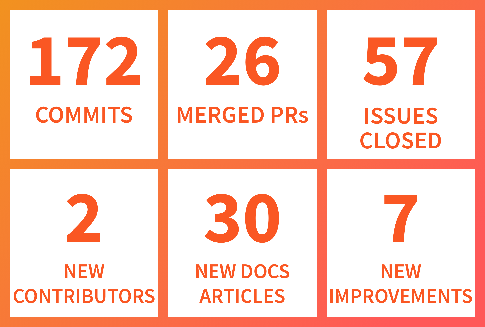
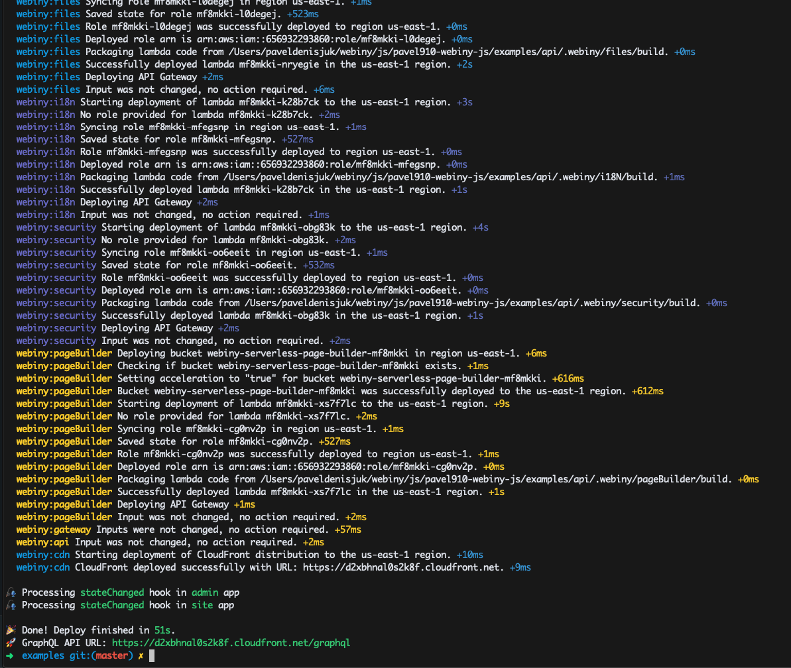

## New contributors

Let’s start off by welcoming our new contributors.

### Jarrett

Jarrett helped us with a PR that addressed spelling and grammar for initial pages, the ones you get when you first install Webiny.

Reach out to Jarrett under the following links:

* Website: [https://jarrett.tk/](https://jarrett.tk/)
* Twitter: [https://twitter.com/JetUni](https://twitter.com/JetUni)
* GitHub: [https://github.com/JetUni](https://github.com/JetUni)

### Furkan

Getting into open-source can sometimes be a challenge. At Webiny, we try to help people that wish to get involved by tagging certain issues for beginners. Furkan took over one of those issues and helped us to get it resolved. It included renaming “Forms” into “Form Builder” throughout the system.

Reach out to Furkan on GitHub: [https://github.com/enmesarru](https://github.com/enmesarru)

We also would like to extend our thanks to [Tyler](https://github.com/12vanblart), [Adam](https://github.com/llwp), and [Dan](https://github.com/danruss) for their support in improving Webiny documentation.

#### Want to become a Webiny contributor?*** We welcome all new members that want to support our project. In case you feel you might need a bit of extra guidance or help with your first issue — we are there for you. Just give us a ping on our *[chat](https://spectrum.chat/webiny)*.*

*Since we’ve started this Spectrum community, we’ve received a lot of valuable feedback, bug reports, etc. So do join us there for a chat :)*

## Product improvements

It’s been busy, to say the least. The numbers show only half the story, so check out the details below to get a better overview of what we have been working on.

### Faster deployments

When we launched the Webiny self-hosted version end of October it took on an average 300 seconds to deploy the Webiny API to AWS. Now we took that time down to ~50 seconds. That’s 600% faster than just a month ago. You still have that long first deploy, but there’s no way around that. However, subsequent deploys are now much faster 🚀.

### Improved support for Windows development

Installing Webiny on Windows machines has proved to have certain edge cases that we hadn’t originally accounted for. Luckily, with the help of a few community members, we got to the bottom of those and released a fix.

### Updates to the database layer

Although Webiny uses MongoDB as the default database, the code in the core never actually works with the database client directly. Webiny has an abstraction layer called `commodo,` and we have now enhanced this layer and enabled the support for additional database adapters. In case you are interested in creating a new adapter, let us know on our [GitHub](https://github.com/webiny/webiny-js).

### Deploying a single component

Initially, you only had the option to deploy all the components at once. As we are working towards supporting a watch function that upon code change rebuilds and redeploys your API automatically, we introduced the option to deploy a single component.

This means that once we’ve completed the work on the watch function, you can expect anywhere between 5s and 20s for your changes to be deployed and available for testing. The time difference is mainly due to the webpack build times and the size of your code bundle.

### Deployment output log improvements

The deployment output log has been completely re-architected since previously it hadn’t been clear what was being deployed and how much time a certain component was taking to deploy. The new output is much clearer and informative.

### Delete file option

The option to delete files from within the File Manager app was not initially available upon the launch of that app. This has now been addressed.

### Fixed/improved handling of large files

Since all the content is served via lambda functions, including the requests for static files, lambdas have to send large payloads back to the API Gateway. In some cases when that payload is over 6MB, it can cause problems as the API Gateway can’t take such a payload.

As a way around this problem, we’ve added a condition inside the lambda function which checks the size of the file it needs to serve. If the file is smaller than 6MB, it’s served via the lambda, but if it’s larger, then the lambda returns a 301 redirect with a location to S3 from where that file can be served.

**Have a feature request or an idea? ***Great, open a new issue on our *[GitHub](https://github.com/webiny/webiny-js)* and let’s discuss it.*

**Stay tuned for more news — two big announcements coming in the upcoming days.

**In the meantime, want some FREE SWAG?** Head over to https://www.webiny.com/swag/