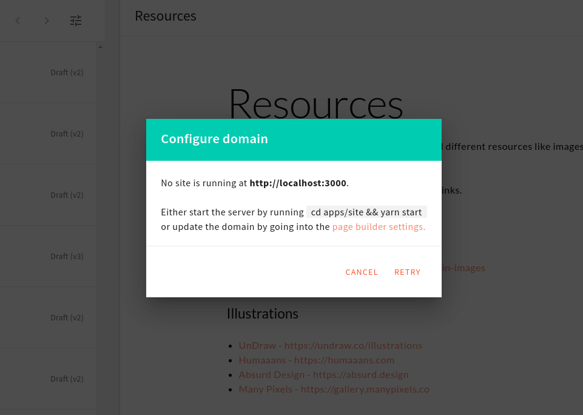

To see the full changelog, visit the [Github release](https://github.com/webiny/webiny-js/releases/tag/v4.3.0) page!

## 🙌 Community Updates

Our first knowledge-sharing session is online. 🎉

In the first session, we’ll go through the Development Overview for contributors. As we mentioned earlier, the purpose of knowledge-sharing sessions is to create a knowledge database. In this way, our community members can get involved in Webiny.

<iframe width="560" height="315" src="https://www.youtube.com/embed/3wlOrcdcxXs" frameborder="0" allow="accelerometer; autoplay; clipboard-write; encrypted-media; gyroscope; picture-in-picture" allowfullscreen></iframe> 

Would you like to test the new features we’ve released this week? 🥁

You can create a new Webiny project by running this command:
`npx create-webiny-project new-project`

If you’re new to Webiny, then you should follow the [Prerequisites](https://docs.webiny.com/docs/get-started/quick-start#prerequisites) before creating a new project. You can follow the YouTube videos for [Getting Started With Webiny below](https://youtu.be/G_du-yE_DL4)☺️

<iframe width="560" height="315" src="https://www.youtube.com/embed/G_du-yE_DL4" frameborder="0" allow="accelerometer; autoplay; clipboard-write; encrypted-media; gyroscope; picture-in-picture" allowfullscreen></iframe>

## 🚀 Features

**Simplified domains management** ([#1039](https://github.com/webiny/webiny-js/pull/1039))

Now the `site` domain will be set up in the installation process. You will no longer need to fill it during the page builder installation.

When you preview the page and encounter an issue, you will receive an appropriate message to resolve that issue.

**Contributions from our Community members** ([#1077](https://github.com/webiny/webiny-js/pull/1077))

Our Community member [Martin King](https://github.com/designreact) added the `Select` component for rendering predefined values.

**Upgrade `CmsEnvironment` type** ([#1079](https://github.com/webiny/webiny-js/pull/1079))

Now you can assign many `aliases` to an `environment`.
In GQL, the schema `CmsEnvironment` now has `environmentAliases` instead of `environmentAlias`.

You can follow the same steps mentioned in [aliases docs](http://docs.webiny.com/docs/webiny-apps/headless-cms/features/aliases)

**The Webiny logo is now linking to the welcome screen** ([1080](https://github.com/webiny/webiny-js/pull/1080))

One of the users noticed that there is no way of going back to the initial welcome screen in the Admin app. As suggested, we’ve made the Webiny logos, located in the header bar and in the main menu, link to the welcome screen, so that it can be easily revisited.

## 🐞Bugs

We’ve received a lot of interest in solving different bugs from our community members 💌 Last week was quite productive in solving a lot of small bugs.

**The “Content” section in the main menu is replaced with the “Page Builder” and “Form Builder” sections** ([#1082](https://github.com/webiny/webiny-js/pull/1082))

The Admin app is easier to use because we’ve removed the single “Content” section in the main menu. The “Content” section held both the Page Builder and Form Builder app links. These apps now have their respective menu sections.

**We’ve improved the UI for the rich text editor** ([1025](https://github.com/webiny/webiny-js/pull/1025)).

Better support for focus in the `Rich Text` editor.
Previously clicking inside the editor did not always bring it in the focus state.
Now with the help of this update, clicking anywhere inside the editor content area brings it in the focus state.

**Now the contact information group in the Form Builder is opening** ([1040](https://github.com/webiny/webiny-js/pull/1040)).

Previously clicking on the `Contact Information` option in the form editor was not working.
We've resolved this issue. Now, a click on the `Contact Information` option will show the relevant form fields.

**The concurrency limit for the DB Proxy lambda function is increased from 15 to 50** ([#1081](https://github.com/webiny/webiny-js/pull/1081))

For the DB Proxy Lambda function, which is handling everything database-related (more information in [this](/blog/using-aws-lambda-to-create-a-mongodb-connection-proxy-2bb53c4a0af4) blog post), we had the default Lambda function concurrency limit set to 15. Basically, this means that we can have 15 concurrent invocations of the DB Proxy Lambda function, which, as it turns out, is not hard to reach, even in local development. To prevent this, we’ve decided to increase this value to 50, which will significantly help in preventing the concurrency limit to be reached again.

Note that the `concurrencyLimit` parameter can still be found in `api/resources.js` and `apps/resources.js` files. So, if further adjustments are needed, they can be made there.

**Headless CMS — update locked field** ([#1072](https://github.com/webiny/webiny-js/pull/1072))

The platform will not allow you to change the format type setting of a `DateTime` field if it’s used in created content. The same goes for the Reference field, you can’t change `modelId` if it’s already being used in created content. This helps in preventing nasty bugs 🐛

**Referenced models can’t get deleted anymore** ([#1051](https://github.com/webiny/webiny-js/pull/1051))

Before this update, content models were deletable even if they were being referenced by other content models, which caused an invalid GraphQL schema to be generated (in other words — the GraphQL server would immediately get inaccessible). Now, this is no longer the case. In order to delete a content model that is being referenced in other content models, you will first need to make sure no ref fields are referencing it. Otherwise, the Headless CMS API will respond with an error.

---

## ⬇️ Try the Latest Release

If you’d like to give Webiny a try, feel free to check our [Quick Start](https://docs.webiny.com/docs/get-started/quick-start) article which will guide you through the initial setup steps.

And, just in case you’ve missed it, if you’d like to check out the full changelog, you can do that [here](https://github.com/webiny/webiny-js/releases/tag/v4.3.0).
