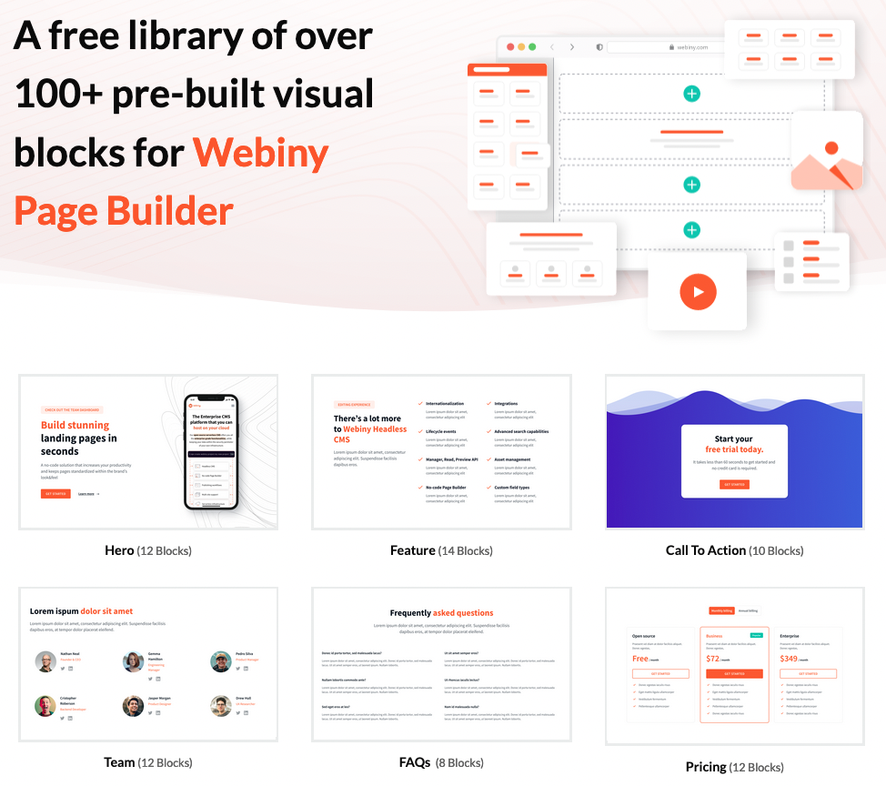

Webiny's Page Builder received some love over the last few releases to improve the user experience, but also to offer our users more powerful solutions like the upgraded Grid functionality and Page Templates. In this way, we enabled our users to build custom designs quicker. 

We understand that sometimes the lack of knowledge or not enough design experience can cause significant challenges when building custom pages. We decided to save you some time and offer a wide selection of built-in Blocks. These blocks are pre-designed layouts that users can easily add to their Pages or Page Templates, providing a foundation for designing and structuring their content.
To get started, please follow <ExternalLink href="https://blocks.webiny.com">blocks.webiny.com</ExternalLink> link. 

In the first iteration of our built-in selection, we have focused on offering you flexibility and convenience in creating visually appealing and functional web pages with some of the most common page blocks:

1. **Hero Blocks** provide various styles and sizes for creating headings or titles on your web page, also allowing you to highlight important sections or break up content.
2. **Feature Blocks** is a collection of page Blocks that you can use to describe your features, products, solutions, services, and benefits.
3. **Call-to-Action Blocks** are designed to draw attention to specific actions you want your visitors to take, such as signing up for a newsletter, making a purchase, or filling out a form. They often include a combination of text, buttons, and images.
4. **Team Blocks** provides a few layouts through which you can introduce your team to your audience, and add names, roles, social media links, photos, etc.
5. **FAQ Blocks** offer a few simple elements layouts to answer the frequently asked questions in a visually pleasing, easy-to-read design.
6. **Pricing Blocks** help you with presenting different pricing plans or packages for your products or service offerings, pricing table blocks allow you to display them in a visually appealing and organized manner. These blocks include columns, feature lists, pricing details, and call-to-action buttons.
7. **Testimonial Blocks** provide pre-designed layouts for showcasing customer testimonials or reviews. They may include elements like text, images, ratings, and styles to add credibility and trust to your website.
8. **Stats Blocks** enable you to create pages that contain mind-blowing stats that will stand out and make your numbers pop.
9. **Logo Cloud Blocks** are designed to allow organizations to showcase the list of their clients, partners, and associated brands in a visually pleasing way using company logos.
10. **Banner Blocks** are usually shown along the top, side, or bottom of a website to present an ad or highlight an important message to your users.

All of these come with variables built-in, which you can use to populate your content without significantly changing the visual style.

<video width="800px" height="auto" controls autoplay>
  <source src="./assets/pre-built-visual-blocks-for-webiny-page-builder/block-variables.mp4" type="video/mp4" />
</video>

If you want to find out more about how you can use Webiny Page Builder [Blocks](https://youtu.be/_tbU3tu58v4?si=w9AVvWYDMuPBxquv) and [Templates](https://youtu.be/GAiFpHGk_Ok?si=2vtSX23WTj2r7Wkg)  check out the embedded links.

By leveraging the pre-built visual Blocks, users can save time and effort in creating professional-looking web pages with ease, even without extensive coding experience. 

If you have any feedback or want to request a new block / report an improvement or bug, please use this [GitHub repository](https://github.com/webiny/predefined-blocks). 
