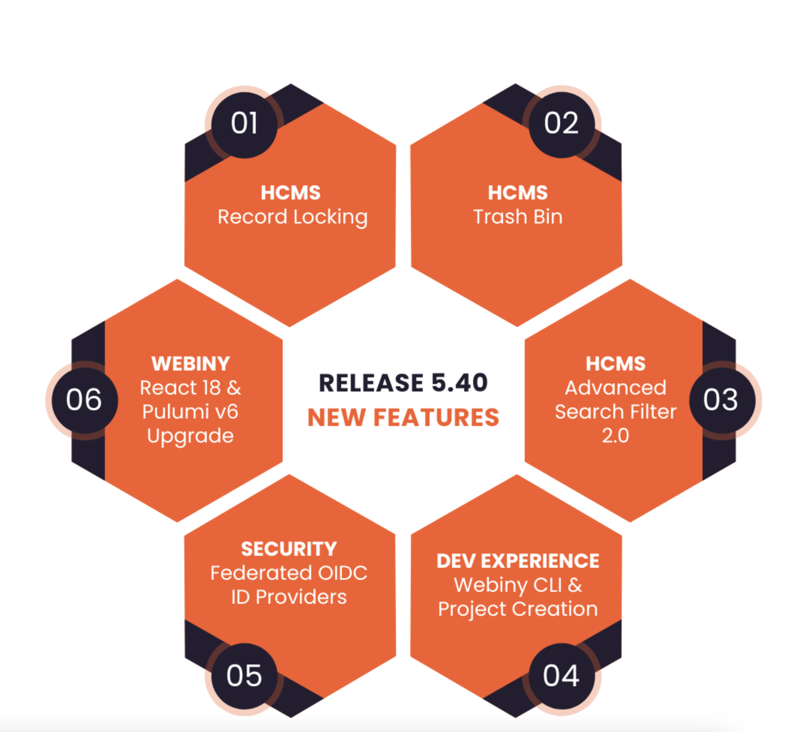
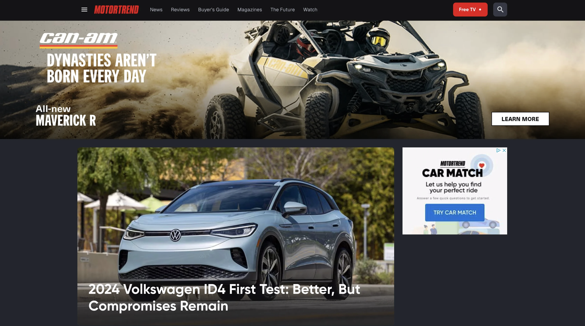
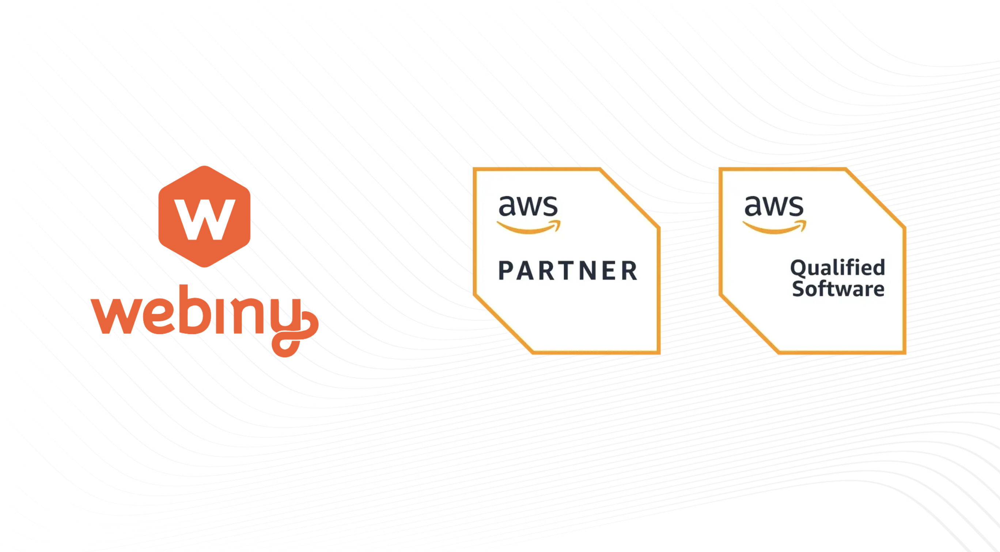
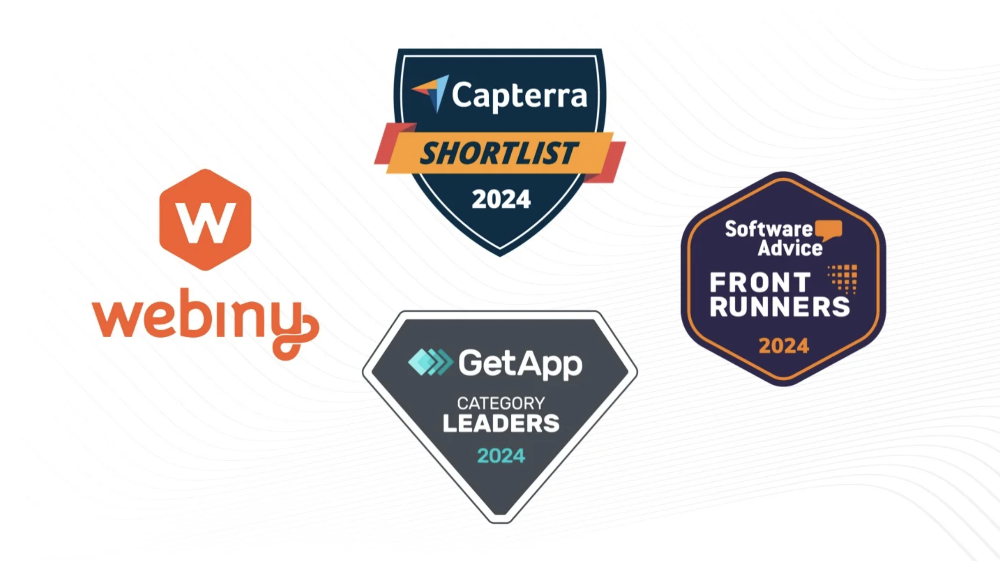

## Discover What's New in Webiny 5.40 🌱 

We're super excited to unveil the latest Webiny update- release 5.40! This one is again packed with awesome features and enhancements to take your Webiny journey to the next level.

** HEADLESS CMS **

✅ **Record Locking:** Keep your data safe and sound with our new Record Locking feature. Prevent accidental overwrites and conflicts, make collaborating with your peers a breeze.

✅ **Trash Bin:** Data recovery has never been easier! Our Trash Bin feature lets you safely delete content and restore it with ease, and you can customize the retention period to your needs.

✅ **Reference Field is now available for Filters:** Searching just got smarter! Advanced Search Filters now support Reference Fields, making it easier to find what you're looking for.

** DX **

✅ **Webiny CLI & create-webiny-project:** We've revamped our CLI to make your development experience smoother. Enjoy better readability and graceful error handling during project creation and project deployments.

** SECURITY **

✅ **Support for Federated OIDC ID Providers:** Boost security and user experience with support for external identity providers. Simplify user management and keep your system secure with centralized authentication.

** DEPENDENCIES UPGRADES **

✅ **React 18 Upgrade:** We're stepping up our game with the React 18. Experience a smoother UI and faster page reloads for an even better user experience.

✅ **Pulumi 6 Upgrade:** We're moving from Pulumi v5 to v6 to be able to take advantage of some of the new features and optimizations the Pulumi team has cooked.

This release is all about making your Webiny journey easier and more secure. So why wait? Get the latest v5.40 now and let us know what you think.

Stay tuned for more updates as we continue to grow and innovate 🌸

## Webiny Customer Success Story: MotorTrend 🚀

** MotorTrend are live with Webiny!! ** 🎉🎉🎉

[MotorTrend](https://www.motortrend.com/) are the largest automotive media company in the world owned by [Warner Bros Discovery](https://www.warnerbros.com/?utm_source=Newsletter&utm_medium=monthly-newsletter&utm_campaign=Regular-content&utm_content=quarter-in-review-june&utm_term=W00890). They tested several CMSes, but none, other than Webiny, could meet their demanding requirements in terms of scale and customization. They trusted Webiny as a headless CMS to manage their core car database with over 90M data points.

> It was a pleasure working with MotorTrend Group, the largest automotive media company in the world, on launching their new website, powered by Webiny of course. As you can imagine, such an undertaking is quite a challenge. From migrating a massive content portfolio with a large amount of assets, to putting in place a highly customizable publishing experience. The team at Motortrend pushed Webiny to deliver and helped us make the product better through this experience. But the success of such a project goes beyond just the right technology. It’s the people on both sides that collaborated and worked super hard in making the project a success.

&mdash; Sven Al Hamad

## We are now officially an AWS Partner 🤝🏻

We're excited to share that Webiny has officially joined the AWS Partner Network (APN)! It is one more stamp of approval that we are moving in the right direction. This partnership opens up a world of possibilities as we leverage AWS technologies even further, take part in their partner programs, and boost our AWS expertise to enhance the solutions that we build for you.

Together, we're committed to innovating, solving technical challenges, and delivering exceptional experiences, let see what’s next.

## Official recognition from Gartner Digital Markets 🚀

If this is not enough good news, we also recognition from the Gartner Digital Markets platform:

⭐ We are one of the 2024 category leaders in the Content Management category on GetApp.

⭐ We’re honored to be shortlisted for the 2024 Content Management quadrant on Capterra.

⭐ We’ve been recognized as a Frontrunner for the Top Content Management Software for 2024 on Software Advice.

## Latest Tutorials from Our Blog 🫶

We've handpicked a pair of fantastic blog posts to present to you this month. As we continue to welcome new authors to our Writing with Webiny program, if you're interested in contributing and becoming part of it, you can explore further details [here](https://www.webiny.com/docs/write-with-webiny/write-with-webiny?utm_source=Newsletter&utm_medium=monthly-newsletter&utm_campaign=Regular-content&utm_content=quarter-in-review-november&utm_term=W00884). We're eager to engage with you, so feel free to leave a comment [here](https://www.webiny.com/slack?utm_source=Newsletter&utm_medium=monthly-newsletter&utm_campaign=Regular-content&utm_content=quarter-in-review-november&utm_term=W00883) or send a direct message to Swapnil M Mane.

#### 🚀 Build a News App With Webiny, Next.js, and News API by **Kevine Nzapdi**
In this [tutorial](https://www.webiny.com/blog/build-news-app-with-webiny-and-nextjs-1-of-2?utm_source=Newsletter&utm_medium=monthly-newsletter&utm_campaign=Regular-content&utm_content=quarter-in-review-june&utm_term=W00896), we will build a news application with Webiny, Next.js and NewsAPI. We will get and store data from a NewsAPI into Webiny, and finally deploy our news application on Netlify.

#### 🚀 5 Adobe Experience Manager (AEM) Alternatives & More by **Mislav Streicher**
In this [guide](https://www.webiny.com/blog/adobe-experience-manager-alternatives?utm_source=Newsletter&utm_medium=monthly-newsletter&utm_campaign=Regular-content&utm_content=quarter-in-review-june&utm_term=W00897), we explore the top 5 AEM alternatives for digital experience management. Discover cost-effective, flexible CMS options suited for various business needs.

## Join us on Slack

Thank you for being part of our amazing community! [Join us on Slack today to connect with other users building cool stuff with Webiny!](https://www.webiny.com/slack?utm_source=Newsletter&utm_medium=monthly-newsletter&utm_campaign=Regular-content&utm_content=month-in-review-december&utm_term=W00798)
