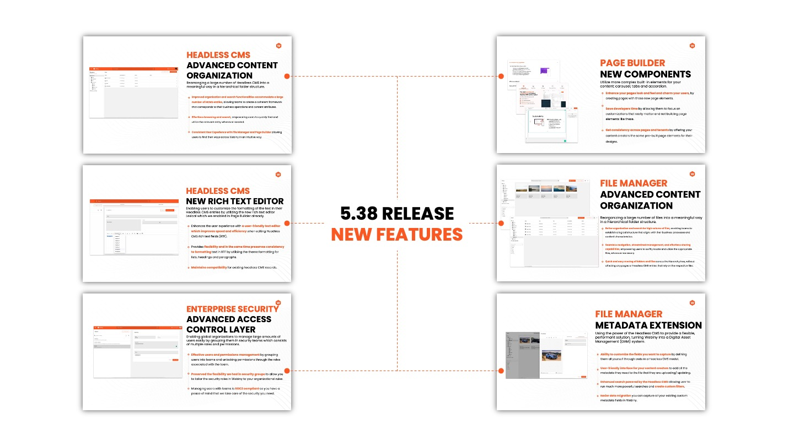
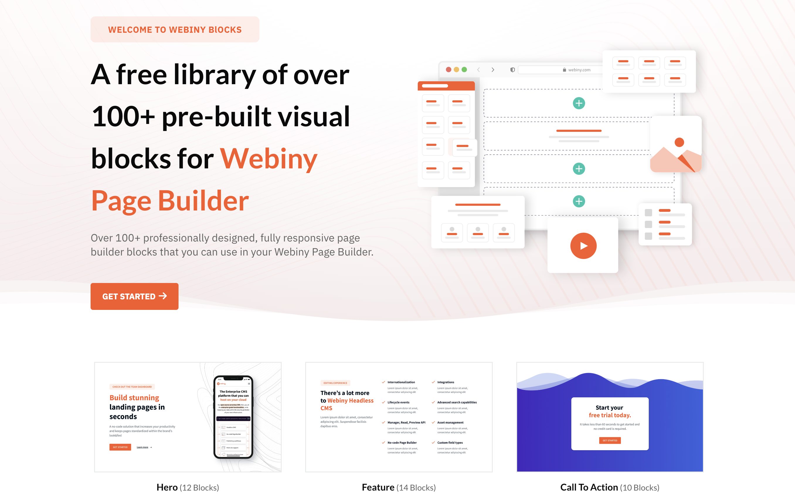

## Check out the Webiny 5.38 Release! 

This release is packed with valuable new features inspired by our customers. Bringing on board new and more sophisticated clients has prompted us to reimagine some of the functionalities we provide in Webiny. 

We've bolstered our security management, introducing **Folder Level Permissions** for Enterprise clients to exercise finer-grained access control over their data. Additionally, we've introduced **Audit Logs**, an Enterprise feature that helps organizations track changes made across all Webiny applications. Webiny upgraded to **Node.js v1**, with v18 scheduled for next quarter. 

End users can now streamline their tasks with **Bulk Actions**, saving them valuable time. Furthermore, we've enhanced our search capabilities, allowing non-developers to execute and save complex queries with the **Advanced Search Filters** in the Headless CMS. 

Headless CMS received additional upgrades. We've added the ability to export and import models and **enhanced the Dynamic Zones (DZ)** by offering users the ability to create elaborate nested structures, e.g. adding Reference Fields, Objects, and Dynamic Zones in DZ Templates. We've introduced an **Entry Partial Save** option, allowing users to Save HCMS entries before they complete all the mandatory fields and validations. This is especially useful for complex models with hundreds of fields.

For Lexical, which is Webiny's default WYSIWYG editor, we've developed useful tools to facilitate **the conversion of HTML to Lexical and vice versa**, which proves handy when transferring data to and from Webiny.

Form Builder has received a new functionality - **Multi-step Forms**. This feature enables users to divide long questionnaires into several steps, thus maintaining simplicity and ease of completion. It serves as a stepping stone for us to offer you conditional logic in building your questionnaires and taking your customer interactions to the next level. 👩‍🚀

## Pre-Built Blocks are Now Available 🚀

We created a collection of **100+ pre-built blocks** to help you accelerate your page design process. You can control the overall look and feel of your site using the theme and all of the pre-built blocks which you import in your system will use these guidelines by default. The beauty of it is that you can still take advantage of the pre-made designs, but also edit the pre-built blocks to your liking and ensure they are in alignment with your brand identity.  

To download and import the initial collection of our blocks follow this  [link](http://www.aicpa.org/soc4so?utm_source=Newsletter&utm_medium=monthly-newsletter&utm_campaign=Regular-content&utm_content=month-in-review-january&utm_term=W00816). If you have any feedback or special requests for new Block categories, please get in touch with us on  [Slack](http://www.aicpa.org/soc4so?utm_source=Newsletter&utm_medium=monthly-newsletter&utm_campaign=Regular-content&utm_content=month-in-review-january&utm_term=W00816).

## We Need YOUR Help 🫵

** We Are Looking for Cool Projects Built with Webiny **

We would love to showcase your project. If you have used Webiny to build something cool, please get in touch with @Swapnil M Mane on  [Slack](http://www.aicpa.org/soc4so?utm_source=Newsletter&utm_medium=monthly-newsletter&utm_campaign=Regular-content&utm_content=month-in-review-january&utm_term=W00816). He is creating a collection of solutions that used Webiny as part of their digital landscape. It would be great to share with us and the rest of our community your use case. 🙏

## Release 5.38 is now live 🚀

✨**Packed with enhancements and fresh functionalities**✨

✅ Bulk Actions for Advanced Content Organization

✅ Advanced Search Filters in HCMS

✅ Export-Import for HCMS Models

✅ Ability to Save Drafts of Entries in HCMS

✅ Audit Logs

✅ Multi-step Form for Form Builder

✅ Folder Level Permissions for File Manager, Page Builder, and HCMS

✅ Advanced Publishing Workflow UX improvements

✅  Support for Nested Dynamic Zones, Objects, and Reference Fields in Dynamic Zones

✅ Lexical Toolkit to parse data from HTML to Lexical and vice versa

✅ Improved the Watch Command Output 

✅ Node.js v16 Upgrade

This list is much much longer. Here is the  [detailed change log](https://www.webiny.com/docs/release-notes/5.38.0/changelog?utm_source=Newsletter&utm_medium=monthly-newsletter&utm_campaign=Regular-content&utm_content=quarter-in-review-november&utm_term=W00880) and this is how you can  [upgrade](https://www.webiny.com/docs/release-notes/5.38.0/changelog?utm_source=Newsletter&utm_medium=monthly-newsletter&utm_campaign=Regular-content&utm_content=quarter-in-review-november&utm_term=W00880). 

This time, the required migrations are only for Page Builder Blocks and Form Builder. Nevertheless, we strongly recommend upgrading your non-production environments and testing the new Webiny version with data mimicking your Production. If you need any help, do not hesitate to contact us on  [Slack](http://www.aicpa.org/soc4so?utm_source=Newsletter&utm_medium=monthly-newsletter&utm_campaign=Regular-content&utm_content=month-in-review-january&utm_term=W00816). 

## Latest Tutorials from Our Blog 🫶

We've handpicked a pair of fantastic blog posts to present to you this month. As we continue to welcome new authors to our Writing with Webiny program, if you're interested in contributing and becoming part of it, you can explore further details [here](https://www.webiny.com/docs/write-with-webiny/write-with-webiny?utm_source=Newsletter&utm_medium=monthly-newsletter&utm_campaign=Regular-content&utm_content=quarter-in-review-november&utm_term=W00884). We're eager to engage with you, so feel free to leave a comment [here](https://www.webiny.com/slack?utm_source=Newsletter&utm_medium=monthly-newsletter&utm_campaign=Regular-content&utm_content=quarter-in-review-november&utm_term=W00883) or send a direct message to Swapnil M Mane.

#### 🚀 Build a Multilingual Blog with Webiny Headless CMS and Vue.js by **Kevine Nzapdi**
In this [tutorial](https://www.webiny.com/blog/build-a-multilingual-blog-with-webiny-headless-cms-and-vue?utm_source=Newsletter&utm_medium=monthly-newsletter&utm_campaign=Regular-content&utm_content=quarter-in-review-november&utm_term=W00885), we will learn how to build a multilingual blog. We use Vue.js for the frontend of the app, Tailwind CSS for styling, and Webiny Headless CMS as the backend.

#### 🚀 Implement Pagination with Webiny Headless CMS in Svelte by **Taminoturoko Briggs**
In this [guide](https://www.webiny.com/blog/implement-pagination-webiny-headless-cms-svelte?utm_source=Newsletter&utm_medium=monthly-newsletter&utm_campaign=Regular-content&utm_content=quarter-in-review-november&utm_term=W00886), our focus will be on acquiring the skills to use pagination when using Webiny Headless CMS in Svelte.

## Join us on Slack

Thank you for being part of our amazing community! [Join us on Slack today to connect with other users building cool stuff with Webiny!](https://www.webiny.com/slack?utm_source=Newsletter&utm_medium=monthly-newsletter&utm_campaign=Regular-content&utm_content=month-in-review-december&utm_term=W00798)