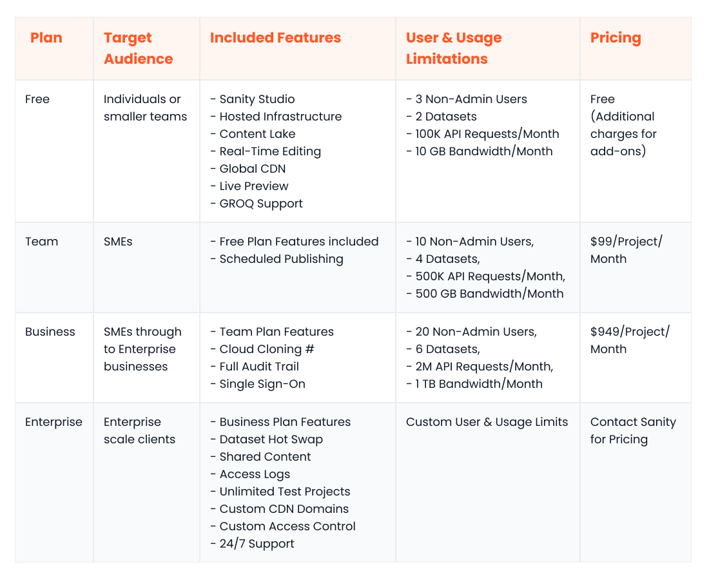

Traditional content management systems (CMSs) no longer cut it in the modern business landscape. They come with inherent limitations, make your marketers dependent on your developers, and hinder scalability across new digital touchpoints.

That’s why the headless approach is the way to go if you are looking for a CMS to meet modern content management needs. A [headless CMS](https://www.webiny.com/knowledge-base/headless-cms) offers the limitless flexibility and agility that modern businesses yearn for. It is a backend-only CMS that can seamlessly connect to multiple frontends through APIs.

This decoupled architecture empowers businesses to design fully customisable frontends using their preferred technologies. It also enables them to establish a centralized, data-driven content repository that seamlessly delivers content to a range of digital channels.

Nowadays, businesses have a range of different headless CMS platforms to choose from, all of which offer varied technical solutions, product offerings and use cases.

In this article, we take a look at two established players in the headless CMS space: Sanity vs Contentful. We’ll provide an overview of the two and go on to compare the solutions against defined criteria of what we believe to be important when choosing your business’ next CMS platform.

Beyond this, we’ll provide [Webiny](https://www.webiny.com/) as an alternative headless CMS option that brings together the best of both Sanity and Contentful whilst providing a range of additional features that redefine the idea of a headless enterprise CMS altogether.

## Overview of Sanity

Sanity goes beyond typical headless CMS functionality by offering a composable content cloud platform that lets you build customized editing experiences. The fully customizable Sanity Studio allows your content creators to shape their own editing experience. Moreover, being open-source, the Studio can also be extended via third-party or custom-built plugins.

Sanity's Graph-Relational Object Queries, or GROQ, lets developers efficiently search, filter, and organise data across different JSON documents, making data retrieval quick and easy.

Sanity has been created in such a way that it is suitable for businesses of all sizes. Small businesses can get started with Sanity's core features for free but will need to pay for more advanced capabilities as they grow. On the other end, enterprises can leverage Sanity’s inherent scalability and customizability to manage extensive multi-channel content effortlessly.

Moreover, Sanity's wide range of integrations with eCommerce and marketing tools enhances its appeal to businesses across various sectors.

We take a deeper dive into Sanity’s platform functionality below.

## Overview of Contentful

Contentful, think of it like a teamwork hub where your coders, marketing gurus and content creators can all work together to create killer content. With its handy visual modeller, clever AI that generates content types, and multi-brand content support, Contentful is perfect for creating captivating content experiences.

With Contentful Studio's AI power, you get to tailor your editing experience and create reusable content components for different channels and scenarios. The Studio also offers other useful features, including workflows, localized previews, and collaborative editing.

Just like Sanity, Contentful also comes with a free plan for those looking to get started. For enterprise businesses, an all-inclusive plan is on offer that comes packed with features to help with compliance, performance, and security – including PCI DSS compliance, security reporting, dedicated infrastructure, and advanced caching.

## Picking the right CMS: the criteria you should be using

Sanity and Contentful both offer reliability and incredible performance, but they excel in different areas and as such, are suitable for different businesses.

To help you determine the ideal fit for your specific business requirements, we’ve compiled a list of core criteria to assess each platform against which we believe to be core when deciding. The selected criteria focus on core aspects of a Headless CMS, including usability, scalability, performance, functionality, customizability, security, and pricing.

### Ease of Use

#### Sanity

Sanity is generally considered an easy-to-use platform. Sanity Studio offers your content teams an intuitive, mobile-friendly content management experience. They can create and maintain tailored workspaces for different use cases, develop dynamic content models, collaborate in real-time, and leverage the full potential of Portable Text.

Sanity also offers a seamless experience for developers. They can integrate with Sanity using their preferred technology, build plugins for the Studio with the plugin toolkit, write type-safe code thanks to Sanity’s support for TypeScript, and use the Sanity UI library to build dynamic input components in React.

#### Contentful

Contentful has a sleek, interactive user interface that’s loved by both marketers and developers. The Contentful Studio allows digital teams to quickly create reusable components, define workflows for optimal collaboration, leverage built-in localization and omnichannel support, and seamlessly manage multi-project data using spaces and organizations.

Contentful is also regarded as a developer-friendly platform. Client libraries and starter templates for different technologies allow developers to kickstart their projects with ease. A robust API, webhooks support, and extensive documentation further enhance the developer experience.

### Data Query & Content Modelling

#### Sanity

Sanity allows you to create unlimited content types and fields to tailor your content structure to your specific needs. But what really sets Sanity apart from Contentful is its powerful native query language, GROQ.

GROQ lets developers retrieve the exact data they need efficiently and accurately. They can optimise their queries by using filters, projections, sorting, references, joins, and other operators. This boosts the UI performance, as all the heavy lifting gets offloaded to the Sanity backend.

#### Contentful

Contentful also provides the ability to define highly customized content models with different types and fields. The GraphQL API offers some ways to retrieve filtered content, like the AND and OR operators, but it doesn’t match the sheer flexibility and power of GROQ.

### Customizability

#### Sanity

Sanity is built with customization in mind. It comes with a fully customizable rich text editor, allowing you to shape your content creation screens per your needs. You can also define models through code, which gives you more fine-grained, programmatic control over content structure and presentation.

Sanity Studio can be adapted to accommodate different teams and workflows, including design, development, and content creation. The Sanity Studio customization framework makes extending or customising components a breeze.

#### Contentful

In contrast, Contentful offers a pre-configured interface with relatively less room for customization. You will find limited options while creating content types on the Contentful UI.

However, Contentful has a more developed marketplace than Sanity, with a greater choice for third-party integrations. It also provides an app framework to help developers build custom apps to extend the CMS platform.

### Performance and Scalability

#### Sanity

Sanity’s real-time API and collaboration features, expansive content modelling, dedicated and fault-tolerant infrastructure, and GROQ support make it a top choice for businesses that need high performance and scalability.

The fully managed content lake acts as a safe and optimized storage layer for all your content. Moreover, Sanity offers an optional CDN-based API for the lake that uses intelligent caching for even faster responses.

#### Contentful

Contentful’s cloud-first, fully-managed infrastructure also scores high in the performance and scalability departments. Contentful leverages intelligent load balancing and resharding techniques for their microservices-based architecture. This ensures optimized content delivery for all users.

They also use a globally distributed CDN to power their content delivery API, which further amplifies performance and scalability.

### Integration Ecosystem

#### Sanity

Sanity provides a flexible API and plugin system which acts as a foundation for seamless integrations with different tools and services. However, it's worth noting that compared to Contentful, the range of integration options for Sanity is somewhat limited.

#### Contentful

Contentful boasts a mature ecosystem of apps and integrations for extensibility and improved efficiency. You can seamlessly integrate the Contentful CMS with apps across several categories, including collaboration, commerce, marketing, and artificial intelligence.

### Community and Support

#### Sanity

Sanity has a growing community of developers, contributors, and problem solvers. You can participate in the community by joining the official channel on Slack.

Additionally, the Sanity knowledgebase offers extensive documentation, including step-by-step tutorials, architectural deep dives, and a GROQ cheat sheet for those eager to master the platform. Sanity only offers dedicated technical support to enterprise customers.

#### Contentful

Contentful has a well-established community of users and developers offering ready support whenever needed. You can access the community forums on the official Contentful website to start or join a discussion.

Contentful also offers documentation and a learning centre for developers and non-technical people to learn more about the platform. Contentful offers varying levels of technical support for customers based on their subscription plans.

### Open-Source

#### Sanity

The Sanity Studio is an open-source single-page application (SPA), and this openness offers several benefits. First, it fosters a collaborative and active community that contributes to the continuous development of the platform. Secondly, it allows your developers to tweak the source code and adapt the underlying platform to your specific business needs.

#### Contentful

In contrast, Contentful is a proprietary Software-as-a-Service (SaaS) CMS. This means that you don’t have access to the source code or the same level of customization as you would with an open-source platform. This is a big drawback for enterprise clients who require a high level of customizability so as to integrate with other business applications.

### Security

#### Sanity

Sanity takes several steps to keep your data secure. It’s hosted on the Google Cloud Platform (GCP), renowned for its stringent security practices. Sanity offers OAuth 2 authentication and the optional Multi-Factor Authentication (MFA) to restrict access to the CMS. Moreover, the platform encrypts data, both at rest and in transit.

#### Contentful

Contentful also takes security seriously. The Contentful infrastructure is hosted on Amazon Web Services (AWS), a cloud solution known for its high-security standards. Users can enhance security by enabling MFA through authenticator apps. Other security highlights include a web application firewall, rest and transit encryption, and periodic backups.

### Pricing

Below, we take a look at the different pricing structures for both Sanity and Contenful and what each package includes.

#### Sanity

#### Contentful

## Webiny – The alternative everyone is talking about

Sanity and Contentful are both great headless CMS solutions, but they have their trade-offs. Sanity is highly customizable but lacks a mature ecosystem. Contentful has a fully managed infrastructure but doesn’t offer the flexibility you get with open-source products like the Sanity Studio.

If you find yourself torn between these two options, you're not alone. Every business wants the best in order to meet its ever-growing business objectives without compromise. Fortunately, with Webiny, you can have it all.

Webiny is a truly serverless, open-source, interoperable, and scalable headless CMS solution that is incredibly easy to set up and doesn’t cost you a thing. It combines the best aspects of both Contentful and Sanity while offering some unique features of its own.

Let’s look at the top 5 reasons why enterprises should consider Webiny:

### Self-hosted

Webiny offers enterprises the ultimate flexibility of deploying and running the CMS [inside their own AWS cloud environment](https://www.webiny.com/features/selfhosted). This deployment model empowers them to manage and safeguard their content with complete anatomy.

It comes with built-in multi-tenancy support and integrates seamlessly with all – yes, all – existing enterprise tools and services.

### Serverless

Webiny leverages the tried-and-true power of AWS services, including Lambda, S3, and DynamoDB, to let you build a highly scalable and fault-tolerant infrastructure for content management.

Going serverless relieves you of manual infrastructure provisioning and enables you to scale effortlessly. This capability, which can become costly when using Sanity or Contentful, allows your organization to expand without breaking the bank.

Webiny comes with pre-configured integrations and an already-optimized [serverless architecture](https://www.webiny.com/features/aws-serverless-infrastructure) that lets you start in minutes. It supports CI/CD out of the box and can be easily deployed to multiple environments. Essentially, all that's left for you to do is add your business logic.

### Open-source

Webiny is released as an [open-source platform](https://www.webiny.com/features/opensource) under the MIT license. This level of openness, which even Sanity can’t match, empowers you to customize every facet of the CMS to align with your unique needs perfectly.

Whether you want to finetune the user experience, modify the data handling, extend functionality, or integrate with legacy tools, the freedom of open source is at your fingertips.

### Cost savings

By going serverless, you further reduce operational and infrastructure costs. The serverless model, paired with Webiny's efficient use of AWS services, can lead to 60-80% cost savings compared to solutions that rely on virtual machines.

### Secure

In today’s increasingly vulnerable world, security is a top concern, and Webiny approaches it diligently. The platform adheres to several best practices to protect your data and infrastructure against even the most sophisticated cyberattacks.

Webiny encrypts data at rest and in transit across all services. It seamlessly integrates with identity providers, like Okta and Cognito, for comprehensive identity and access management (IAM). The Webiny team regularly scans the source code using CodeQL and third-party libraries using Dependabot. This keeps the platform free of security hotspots and vulnerabilities.

## Signing Off

Both Contentful and Sanity offer robust headless CMS solutions with different strengths and weaknesses. Sanity is more affordable for small-to-medium businesses and offers better customizability and developer-friendliness. Contentful is better in terms of ecosystem maturity and scalability. Both are great platforms and offer a range of benefits to business users.

If you’re looking for an enterprise CMS that provides a true serverless experience that allows you to [customize and integrate](https://www.webiny.com/features/opensource) with your existing tech stack whilst scaling at will, then look no further than Webiny.

Promoting internal cost savings and improved internal collaboration between content creation and development teams is just the start. The platform's ease of use and [multi-tenanted hosting capabilities](https://www.webiny.com/features/multitenancy) offer enterprise businesses the opportunity to provide brand consistency across all digital assets while knowing that the self-hosted nature of the platform keeps your data secure.

[More than a CMS](https://www.webiny.com/features/cms-plus), Webiny is the go-to choice for enterprise businesses globally. To find out more, [book a demo call](https://www.webiny.com/forms/product-demo) today.