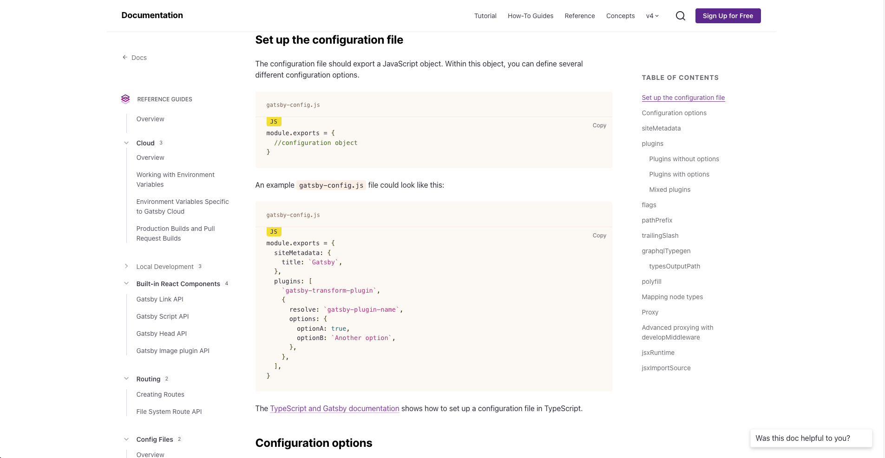
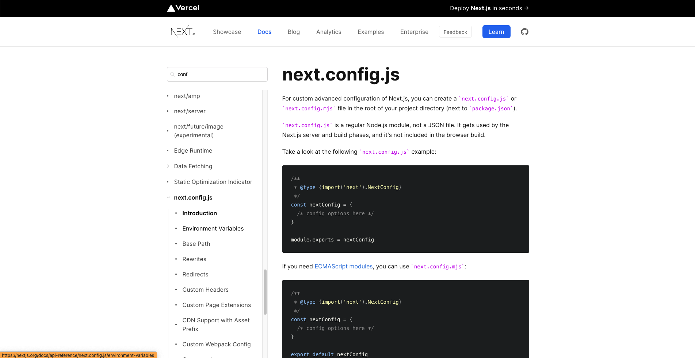

Developers tend to get very passionate about their tools. And rightly so: without the best tools for the job at hand, we couldn't achieve our objectives, make something awesome, or build a better world.

[React](https://reactjs.org/) is still a major player in terms of frontend development. There's currently a competition of sorts going on between the two React heavyweight frameworks [Next.js](https://nextjs.org/) and [Gatsby](https://www.gatsbyjs.com/). Which one is better? Which should you learn? Is Gatsby better, or Next.js, for building your next project?

At Webiny, we're interested in providing developers a backend Headless CMS to compliment your frontend, so it's of deep interest to us which tools are popular. Knowing which ones you're using ... even which ones you are _preferring_, influences our product decisions. We think about it when we talk about marketing. And we consider it when we're planning what we build into our open source CMS.

So we decided to do a bit of critical thinking about whether Next.js or Gatsby is better. We came up with these criteria to match them against. Even so, we're going to leave it up to you as to which one you're going to use!

## Server Generation and Configuration

Generating React code, or any JavaScript, when an application is built, is a critical metric when it comes to frontend frameworks like Gatsby and Next.js. But we don't think it's _speed_ that's critical. It's certainly important, but it's one of those metrics that the developers of these frameworks are acutely aware of, so they're going to make sure they keep making advancements in this area.

What's more interesting is what APIs you have access to on server generation. Does the tool make it easier or more difficult to do what you need to? That's what we're assessing here.

Whilst Next.js allows access to customize headers, page initialization, add rewrites and redirects with it's [config](https://nextjs.org/docs/api-reference/next.config.js/introduction) file and custom [`_App.js`](https://nextjs.org/docs/advanced-features/custom-app) component, Gatsby has a [config](https://www.gatsbyjs.com/docs/reference/config-files/gatsby-config/) file, [a custom `html.js` document](https://www.gatsbyjs.com/docs/custom-html/) (which is similar to Next.js). It also has files to directly access the [server-rendered application](https://www.gatsbyjs.com/docs/recipes/pages-layouts/#project-structure) and the [hydrated application in the browser](https://www.gatsbyjs.com/docs/reference/config-files/gatsby-browser/).

Gatsby certainly has a wider variety of configuration open to developers here. But that can also be daunting or unnecessarily complex for someone who just wants to build with React but also have static generation.

Also, sometimes it's not clear what the files are for. For example, the [gatsby-node.js](https://www.gatsbyjs.com/docs/reference/config-files/gatsby-node/) file isn't specifically for APIs that run in the server environment (which would be using Node.js), instead, this is where the internal node transformation happens, allowing you to create dynamic pages and custom GraphQL resolvers to your application.

Admittedly, once you know that, it's great to have access to all of these APIs to customize your data. But we'll get to that a bit more later.

## Documentation

Whether Gatsby or Next.js documentation is good or bad seems highly subjective. But sometimes documentation can inadvertently hide things developers need to know under generalizations or by accidentally missing things out. Sometimes an API badly explained is worse than not having it documented at all.

We all know this, which is why we looked at documentation as a marker on whether you should choose Next.js or Gatsby to build your next project.

Whilst Next.js documentation has a cleaner, focused look, Gatsby's is busier with a 3-column layout. Though sometimes that's a good thing. Developers probably won't get as lost contextually in the Gatsby docs as they might in Next.js.

We generally prefer the darker code blocks and higher contrast on the Next.js website. But it could be because we're just getting old and our eyes aren't as good as they used to be. 

Next.js' strengths come out clearly in it's focused approach towards lower-level APIs such as the `getStaticProps()` and `getServerSideProps()` functions, and these are explained very well. But there are also some things that are not mentioned except succinctly in an ["unsupported features" section](https://nextjs.org/docs/advanced-features/static-html-export#unsupported-features). This can be frustrating when you find out you've built your application to use a certain feature, only to realize it's not supported in the environment you intended to deploy to.

## Routing

Both frameworks take advantage of file-based routing. [Next.js](https://nextjs.org/docs/routing/dynamic-routes) and [Gatsby](https://www.gatsbyjs.com/docs/how-to/routing/creating-routes/#dynamic-and-authenticated-routing) have the ability to define dynamic routes as  well, but Gatsby doesn't clearly explain how this works, perhaps assuming you're only looking for this feature if you've already used Next.js.

What is great about Next.js is the ability to create [API Routes](https://nextjs.org/docs/api-routes/introduction), making it a truly isomorphic application. This could be really useful in a lot of situations, especially if you have a sprawling REST API endpoint and want a minimal set of data returned from it, you could massage that data down to only the content you need on your frontend. In fact, Next.js has it's [own express-like server-side framework called Micro](https://github.com/vercel/micro).

This turns Next.js into a truly isomorphic application, which is meant to have components server side and on the client, working in tandem to produce a single application.

On the other hand, Gatsby seems to keep these concerns clearly separated, even with their own [Gatsby Functions](https://www.gatsbyjs.com/products/cloud/functions), the emphasis is on a separate backend that communicates with the hydrated frontend application.

Do you like to mix these concerns? Or keep them separate? It depends slightly on what kind of developer you are, and what kind of project you're building, as to which you'll prefer from this point of view.

## Conclusion

Gatsby and Next.js are two very different tools with unique value propositions: either low-level tools to provide fundamental APIs and free developers from unnecessary tooling, or an ecosystem full of plugins of varying quality, together with a data layer to stitch your content together.

As we said at the start, this isn't a full roundup of all of their features. Maybe what you're building needs something more specific like [Astro](https://astro.build/), [Nuxt](https://nuxtjs.org/) or [SvelteKit](https://kit.svelte.dev/). We only know what we've encountered when building our starters for Next.js and Gatsby.

Oh we didn't tell you? We've built 1-click deploy starters for Webiny headless CMS.
 
👉 [1-click starter for Next.js and Webiny Headless CMS on Vercel](https://github.com/webiny/nextjs-starter-webiny)

👉 [1-click starter for Gatsby and Webiny Headless CMS on Gatsby Cloud](https://www.gatsbyjs.com/dashboard/deploynow?url=https://github.com/webiny/gatsby-starter-webiny)

Make sure you check those out. Maybe it'll help you make your mind up ... should you use Gatsby or Next.js? The choice is ultimately yours.