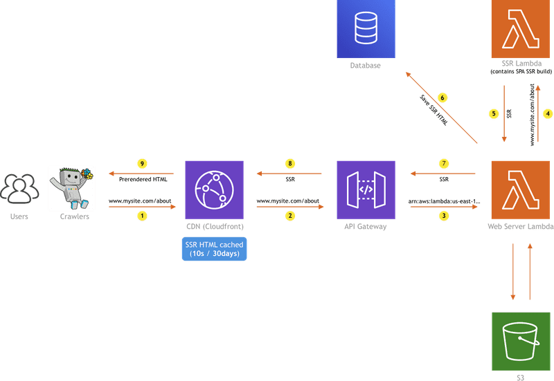

Webiny v5 brought [many significant changes](/blog/webiny-v5-the-big-update), one of which is the way we approached rendering of pages created with the [Webiny Page Builder](/serverless-app/page-builder).

> In case you didn't know, the Webiny Page Builder application enables users to easily create static and dynamic websites - all within a single page editor.

EXPAND ON THIS, GIVE MORE CONTEXT
<!-- The point in which things start to get interesting is when a user decides to publish a page he's been working on. The question that immediately pops up is: "How do we serve pages to actual website visitors in the fastest possible way and also with excellent support for search engine optimization (SEO)?". -->

In a nutshell, the **Server-Side Rendering (SSR) with (re)hydration** approach we used prior to the v5 release, was replaced with the **static site generation (SSG) in the cloud**. We decided to do this change because of a couple of reasons, and if I were to give you a TLDR, I would tell you it was simply because the new approach is less error-prone, easier to maintain, and requires a simpler supporting cloud infrastructure. But, if you're interested in getting into the nitty-gritty, then continue reading. 🤓

To kick things off, let's give a quick overview of how the old approach worked and what were the problems we encountered with it.

## The Old Approach and Its Problems

In Webiny v4, rendering of pages created with the Webiny Page Builder was accomplished via an approach called server-side rendering (SSR) with (re)hydration.

Essentially, when a user requested a page from a public website, if nothing was already cached on the CDN ([Amazon Cloudfront](https://aws.amazon.com/cloudfront/)), its HTML would be generated on the backend. When saying "backend", we mean a couple of Lambda functions and a database, which is shown in the following diagram:

So, as we can see, once a user visits our website and an HTTP request reaches Amazon Cloudfront (1), it's being forwarded to the Amazon API Gateway (2), which is responsible for invoking the Web Server Lambda function (3). The function will first check the database if there's an SSR HTML already cached (6). If so, it will simply return that to the API Gateway and this is where its execution ends. On the other hand, if there's nothing in the database, it will synchronously invoke the separate and more powerful SSR Lambda function (4), which starts the SSR process for the given HTTP request. Once generated, the HTML is returned back to the initial Web Server Lambda function (5), which will store it into the database (6) and return it back to the API Gateway (7). And to complete the flow, before returning it to the user, the HTML is always cached on the Cloudfront edge. This makes subsequent HTTP requests almost instant, with response times floating around 100ms.

> Check out the [Serverless Side Rendering - The Ultimate Guide](/blog/serverless-side-rendering-e1c0924b8da1) post I wrote some time ago. It's a long one, but it goes really deep into how we approached rendering pages in Webiny v4.

So, what were the problems that we and our users encountered with this approach?

<!--
Prvo, za SSR, potrebno je bilo raditi 2 prod builda od frontend appa i oba uploadati u cloud.

Jedan app koji se koristi na backendu, i executa tamo, i drugi koji se odvija u frontendu.

I ovo je znalo stvarati probleme - sve radi naprijed, a nazad ne radi. Useri su javljali nerijetko tu probleme. Dodas jedan library, koji ne supporta ssr, i devleopas lokalno, sve okay, a backend okinawa.

Uz to, takodjer nesto sto nas je mucilo je kompleksnost infrastrukture. Htjeli smo da bude jednostavnije - doslovno ako je moguce, da se useru servira statican file iz bucketa, a ne da moramo jos neke baze deployat, lambde i slicno.

Kako smo pripremali v5, odlucili smo revisitat ovu bitnu temu, te smo dosli sa do sljedeceg approacha.prerenderingom

-->

## Static Site Generation In the Cloud

---

Thanks for reading! My name is Adrian and I work as a full stack developer at [Webiny](https://www.webiny.com). In my spare time, I like to write about my experiences with some of the modern frontend and backend web development tools, hoping it might help other developers. If you have any questions, comments or just wanna say hi, feel free to reach out to me via [Twitter](https://www.twitter.com/doitadrian).
