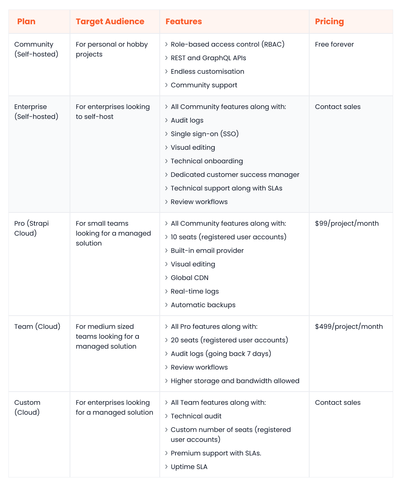

[Headless content management systems](https://www.webiny.com/knowledge-base/headless-cms) (CMSs) afford modern businesses the agility and flexibility they need to survive today’s competitive digital landscape. By decoupling the frontend from the backend, a headless CMS enables your marketers and developers to work independently of each other and simplifies the process of expanding to new digital frontiers.

Strapi and Contentful, two titans of the headless CMS realm, have long dominated the scene. However, a new contender, [Webiny](https://www.webiny.com/), is steadily gaining momentum and posing a formidable challenge to the established duo.

In this comprehensive analysis, we will perform a comparative study of Strapi and Contentful across several key areas that include: ease of use, customisability, performance, scalability, community, and support. We will also introduce Webiny and explore its unique value proposition.

## Overview of Strapi

Strapi is an open-source headless CMS built using JavaScript/TypeScript. It can be self-hosted inside your own setup or deployed within the fully managed Strapi cloud.

Strapi simplifies the process of defining a dynamic content structure and leveraging it to deliver rich omnichannel experiences. The intuitive content types builder enables marketers to define customisable content layouts. Seamless, API-driven interoperability empowers developers to consume the content using the frontend platforms they feel most comfortable with.

Other useful Strapi features include a dedicated asset library, support for multiple databases, strong authentication, role-based access control, auto-generated documentation, built-in localisation, and custom fields.

Strapi is a good fit for businesses of all sizes. If yours is a small company with a limited budget, you can opt for the self-hosted community plan, which is free forever. For larger organisations, Strapi offers tailored enterprise plans for both self-hosted and cloud-based segments.

## Overview of Contentful

Contentful is a composable content management platform with an extensive feature set. It’s a fully managed, proprietary solution that offers much more than a typical headless CMS.

At the heart of Contentful lies the Contentful Studio, an intuitive and customisable application that catalyses the development of reusable content components and editing interfaces. It is packed with numerous tools to boost collaboration, including workflows, team presence, and scheduled publishing.

Other notable Contentful features include a visual modeller, an AI-powered content types generator, starter templates for many frontend technologies, an app framework for extensibility, live preview, and built-in localisation.

Contentful offers free and paid plans to cater to businesses of all scales. Although limited to 5 users and 1 space, the free plan is a good starting point for individual projects. Larger organisations can choose the premium plan, which offers the flexibility to choose a custom number of users and spaces.

## Picking the right CMS: the criteria you should be using

Strapi and Contentful are top headless CMS solutions that accommodate diverse business needs. In the following sections, we will conduct a detailed comparison of these platforms, which will help you choose the optimal fit for your organisation.

### Ease of use

#### Strapi

Strapi has an intuitive, easy-to-use interface for content modelling and creation. It offers business teams a straightforward way to define single types, collection types, custom fields and more. The editing experience is customisable as per the unique needs of your content creators.

Strapi also has several developer-centric features, including multi-database support (MySQL, Postgres, MariaDB, and SQLite), webhooks, the flexibility to choose between REST and GraphQL, and starter kits for many front-end technologies.

#### Contentful

Contentful places a strong emphasis on usability. The Contentful Studio provides a visual interface that empowers users to craft immersive omnichannel digital experiences. The AI-powered features for content and image generation enhance convenience and efficiency.

Contentful is also regarded as a developer-friendly platform. It offers starter kits, a dedicated developer portal, and extensive documentation to make it easier to get started. It uses REST and GraphQL APIs to address different use cases, including images, content delivery, content management, and preview.

### Data query and content modelling

#### Strapi

Strapi helps you build a flexible and composable content model that is easy to scale. Regarding data querying, Strapi’s GraphQL API has built-in filtering, sorting, and pagination support. It also offers a Query Engine API to query the database with greater precision.

#### Contentful

Contentful users can also build highly customisable content models using as many custom fields and types as required. The GraphQL API makes it possible to perform filtered, sorted and ordered retrievals from the content repository.

### Customizability

#### Strapi

As Strapi is open-source, you can fetch its source code from GitHub and customise it to your liking. The Strapi docs offer detailed tutorials on tailoring the admin panel, query engine, middleware, services, APIs, etc, to fit your business needs better. Moreover, the Strapi marketplace is home to several plugins that enable even non-technical teams to extend the core feature set.

#### Contentful

Being a proprietary solution, Contentful doesn’t allow any backend customisation. This means that you can’t change any core functionality of the platform. Even though the Contentful UI is mainly pre-configured, the Contentful Studio offers customisation options to content creators and marketers.

### Performance and scalability

#### Strapi

The performance and scalability of self-hosted Strapi apps depend on the underlying infrastructure. However, the Strapi Cloud is purpose-built to manage substantial traffic loads. It leverages a fine-tuned infrastructure and CDN caching to deliver increased levels of performance, scalability, and resilience.

#### Contentful

Contentful outranks Strapi when considering performance and scalability due to its mature, cloud-native architecture. It leverages advanced caching, auto-scalable and self-healing Kubernetes clusters, a dual CDN approach, and a multi-region delivery infrastructure (MRDI) to ensure robust and efficient content delivery across the globe.

### Integration ecosystem

#### Strapi

Strapi has a rapidly growing marketplace where you can find plugins for different use cases, ranging from SEO to productivity. It also offers several resources and documentation to help you build custom plugins.

#### Contentful

Contentful boasts a more mature and comprehensive integration ecosystem compared to Strapi. You can find plugins and apps across a broader range of categories on the marketplace, including SEO, analytics, commerce, and editing. Moreover, you can leverage the app framework to build your own apps to extend functionality.

### Community and support

#### Strapi

Strapi features an active community of developers and users available on Discord and the official forums.  On the official website, you will find a featured course, extensive documentation, and tutorials to help you familiarise yourself with the platform. Strapi only offers technical support (SLAs included) to its enterprise customers.

#### Contentful

Contentful has a well-established and thriving community. Whether you're seeking advice, troubleshooting issues, or exploring new features, you can connect with the community through the active Discord server or the forums on the official website. Additionally, the website provides access to tutorials, explainer videos, comprehensive documentation, and a regularly updated changelog. Contentful only offers technical support to paid plan users.

### Open-source

#### Strapi

Strapi is available as open-source under the MIT license. This means you can directly access and tweak the source code as needed. Whether you want to rewrite the querying layer, extend the API, implement a new searching feature, or redesign the UI, Strapi’s open-source nature grants you the flexibility to do so.

Moreover, if you choose to self-host Strapi, you get complete control over several key aspects, including how your data is stored and secured and which CDN you use for content delivery.

#### Contentful

Contentful is a fully managed, closed-source SAAS CMS, meaning you can’t access its source code. Additionally, since you don’t have the option to self-host, you can’t store, secure, manage, and deliver data on your terms.

### Pricing

#### Strapi

Strapi offers multiple self-hosted and managed (cloud) plans. The Community plan in the self-hosted category is free; it targets small businesses and individual projects. The Enterprise plan for self-hosted customers targets larger teams; contact sales at Strapi for pricing.

The Pro Plan in the cloud category is priced at $99/project/month; it caters to small businesses. The Team Cloud plan costs $499/project/month and targets medium-to-large companies. The Custom Cloud plan offers enterprise customers the most extensive feature set; contact sales at Strapi for pricing.

Here’s a comprehensive breakdown of Strapi’s pricing:

#### Contentful

Contentful offers three pricing plans. The Free plan targets individual or hobby projects; it’s free forever. The Basic plan is a good fit for small teams, priced at $300/month. The Premium plan caters to enterprises; to get a price for this plan, contact the Contentful sales team.

Here’s a comprehensive breakdown of Contentful’s pricing:

### Security

#### Strapi

When deploying Strapi on-premises, the onus of maintaining security lies with your organisation. However, opting for Strapi's managed cloud hosting shifts this responsibility to the Strapi team.

Some security highlights of the platform include automated backups, SSO, review workflows, audit logs, encryption, and role-based access control.

#### Contentful

Contentful takes platform and data security seriously. Its infrastructure resides within AWS data centres, renowned for their robust security measures and stringent compliance standards.

Notable security features Contentful offers include encryption at rest and in transit, automated backups, annual penetration tests, web application firewalls, two-factor authentication, and DDOS (distributed denial of service) prevention.

## Webiny: The new headless CMS frontrunner

Strapi and Contentful are top-tier headless CMS solutions, yet each has limitations. Strapi is open-source and thus highly adaptable, but it struggles to match Contentful's scalability and security. Contentful has a more mature ecosystem but doesn’t allow you to self-host.

This dilemma of choosing between flexibility and robustness is a common one for businesses searching for the optimal CMS. Fortunately, a compromise is no longer necessary. Enter Webiny.

Webiny is an open-source enterprise CMS that marries flexibility with robustness. It is built on top of highly scalable, fault-tolerant serverless services. With Webiny's serverless architecture, you can experience unparalleled scalability, reliability, and cost-efficiency.

The following sections explore why enterprise businesses should choose Webiny over Strapi and Contentful.

### Self-hosted

Webiny, unlike other enterprise-ready CMSs, allows you to [deploy and run the CMS inside your AWS environment](https://www.webiny.com/features/selfhosted). This flexible self-hosting capability offers unparalleled control over your infrastructure. For example, you can implement custom security controls, fine-tune performance parameters, or integrate with other AWS services.

### Serverless

Webiny has been designed to utilise [AWS Lambda as its architectural foundation](https://www.webiny.com/features/aws-serverless-infrastructure). AWS Lambda enables you to go serverless, which frees you from the burden of managing, optimising, or scaling your infrastructure. Contentful offers a similar capability but at a significantly higher cost and without providing any access to the infrastructure.

Webiny allows you to leverage Pulumi IaC (infrastructure as code) to define or adapt your infrastructure via TypeScript code if needed. Moreover, it seamlessly integrates into your CI/CD pipelines, supports [multi-tenancy](https://www.webiny.com/features/multitenancy) out-of-the-box, and can be deployed to multiple environments via a CLI.

### Open-source

Webiny, like Strapi, is available as [open-source software under the MIT license](https://www.webiny.com/features/opensource). This means that you can customise any aspect of the platform. Whether you want to perform a design overhaul, implement new API endpoints, or rewrite navigation, you can tweak the Webiny source code to do so.

### Cost savings

Webiny is free to use, so you get savings right away. Moreover, its serverless infrastructure guarantees substantial reductions in operational IT costs. You can expect up to an 80% decrease in infrastructure expenses compared to VM-based architectures, alongside up to 60% savings in DevOps-related efforts.

### Secure

Webiny takes several steps to maintain high levels of security:

- The Webiny team regularly scans source code and third-party libraries for vulnerabilities and bugs
- Webiny offers users the ability to integrate with their preferred identity providers
- Webiny stores data in encrypted form inside DynamoDB and Elasticsearch. DynamoDB data is also encrypted while in transit
- Webiny supports two built-in deployment modes: development and production
- It can also be configured to run inside an existing Amazon Virtual Private Cloud (VPC)

## Conclusion

Contentful and Strapi are leading headless CMS platforms with different strengths and weaknesses. Strapi is more customisable and can be self-hosted. Contentful offers more scalability and boasts a better-developed ecosystem.

However, if compromise isn’t on your agenda, Webiny is a compelling alternative. As Webiny is built on highly scalable, fault-tolerant serverless services, it provides unparalleled scalability, reliability, & cost-efficiency and is just as customisable as Strapi, if not more so. Moreover, it also offers some unique features that both Strapi and Contentful lack, such as multi-tenancy and IaC capabilities.

To find out more about Webiny, [book a demo](https://www.webiny.com/) with our team today.