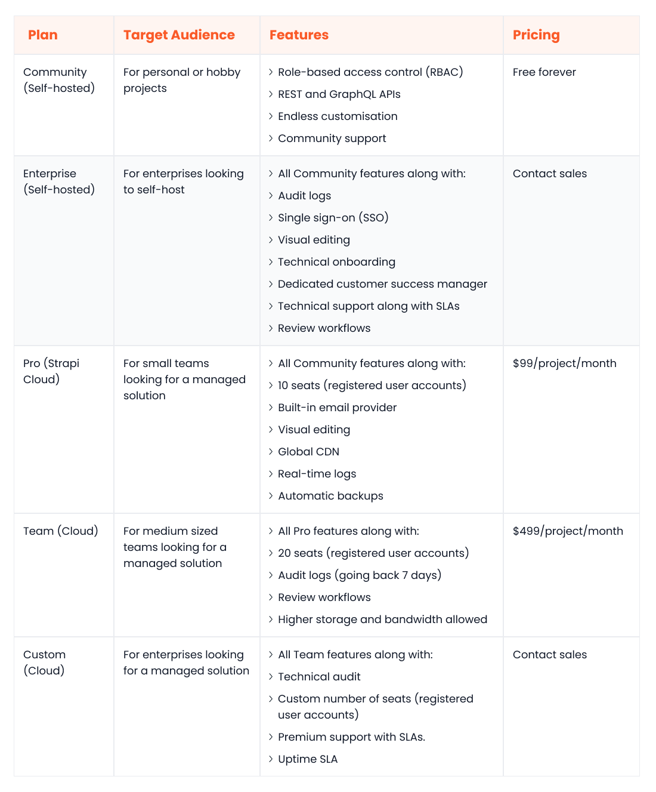

In general, Headless CMSs lack a built-in frontend but boast an interoperable backend that seamlessly integrates with various external frontends. This unique characteristic unlocks unprecedented flexibility and agility, empowering businesses to create content-rich omnichannel experiences.

If you are in the market for a [headless CMS](https://www.webiny.com/knowledge-base/headless-cms), a Strapi vs Sanity comparison is inevitable. Both platforms offer extensive feature sets that cater to a wide array of use cases. In this article, we will be conducting a detailed comparison between these two industry players.

We will also introduce [Webiny](https://www.webiny.com/), an emerging alternative gaining significant traction amongst the headless CMS community. We aim to provide insights into each platform's strengths, weaknesses, and unique features, empowering you with the information you’ll need to choose the best headless CMS for your business.

## Overview of Strapi

Strapi is an open-source headless CMS that offers users the flexibility to deploy on-premise or in the Strapi cloud.

Its content types builder allows you to craft robust and dynamic content structures. The well-documented, customisable REST and GraphQL APIs make it easy for developers to build tailored frontends using their preferred technologies.

Beyond these capabilities, Strapi boasts several notable features: built-in localisation, a dedicated media library, TypeScript support, role-based authorisation, JWT authentication, built-in emailing, and the ability to create interlinked content types.

Strapi's community edition, a 100% JavaScript-based CMS, is a cost-effective option for smaller companies looking for a reliable headless CMS. However, for businesses with stringent security and compliance needs, Strapi also provides an enterprise edition with additional features for control and monitoring.

## Overview of Sanity

Sanity is a composable content cloud solution designed with scalability and flexibility in mind. Its architecture is built on top of a fully managed content lake, allowing for seamless management of even the most complex content structures.

The Sanity Studio provides an intuitive platform for marketers to build tailored content templates for diverse use cases. Moreover, developers can leverage the studio’s customisation framework to easily tweak different areas of the interface.

Other useful Sanity features include real-time collaboration, revision control, scheduled publishing, portable text, data mutations and patching, CI and deployment integrations, webhooks, and an extensible asset management UI.

Sanity caters to businesses of all sizes and industries. The free plan is a good fit for small organizations seeking a cost-effective entry point. Meanwhile, enterprises can benefit from Sanity’s customisable premium plans that offer dedicated support and an expanded feature set.

## Strapi vs Sanity: The criteria you should use to decide

In the following section, we'll compare Strapi and Sanity across key areas to help you choose the platform that aligns best with your business content goals.

### Ease of Use

#### Sanity

The Sanity Studio prioritizes ease of use for all digital team members. Marketers can custom-build dedicated "workspaces" tailored to different content needs, be it specific regions, channels, or languages.

Content creators can collaborate in real-time and create visually stunning content experiences using Portable Text. Moreover, developers can embed the studio within the frontend app, leverage the Sanity UI to fast-track frontend development in React and extend functionality through third-party or custom plugins.

#### Strapi

Strapi has a sleek and intuitive user interface for content modeling and creation. Whether you're defining individual content types, creating collections, building reusable components, or combining components together to form “dynamic zones”, Strapi offers a straightforward way to do so.

Strapi also boasts valuable features to streamline development workflows. Multi-database support allows developers to integrate with popular databases like Postgres, MariaDB, or SQLite. Webhooks simplify communication with external applications.

### Data Query and Content Modelling

#### Sanity

With Sanity, you can create unlimited content types and fields tailor-made to your specific needs. You can also add custom attributes to your content types, create conditional fields, and connect types to build relational content models. For data querying, Sanity offers GROQ (Graph-Relational Object Queries), a powerful query language.

GROQ enables developers to query data with unparalleled granularity. They can use advanced filters, sorting, projections, joins, and other operators to create optimized queries that retrieve precise data sets. This reduces the number of HTTP requests required, significantly improving UI efficiency and dynamism.

#### Strapi

Strapi also has powerful content modeling features, including relational and custom fields. In addition to a well-documented GraphQL API that supports filtering, pagination, and sorting, Strapi also offers a dedicated query engine API for precise data querying.

However, it's worth noting that the query engine API doesn't match the versatility and sophistication of Sanity's GROQ.

### Customizability

#### Sanity

The open-source Sanity Studio simplifies the process of customizing key aspects of content management. Whether you want to customize content previews, add custom sources for your assets, tweak the modeling, edit the interface, or build your own plugin, you can leverage built-in features to do so.

#### Strapi

As a fully open-source platform, Strapi grants you unparalleled control and customisation. Every facet of the CMS, from the admin panel and models to middleware, webhooks, and request processing, is open for modification. This empowers developers to tailor Strapi to the exact needs and preferences of the business.

### Performance and Scalability

#### Sanity

Sanity’s scalable cloud infrastructure and a globally cached CDN make it a great choice for organizations that need on-demand scalability. Leveraging GROQ, fast APIs, efficient webhooks and the fully managed content lake, developers can build performant applications capable of efficiently managing content at scale.

#### Strapi

Strapi's performance and scalability depend on the deployment method you choose. If you go the self-hosted route, both aspects are directly tied to the infrastructure you provision and configure. While Node.js inherently offers good scalability, the performance ultimately hinges on your chosen hardware/resources.

However, choosing Strapi Cloud frees you from the burden of managing your own infrastructure. Strapi utilizes a robust cloud infrastructure, coupled with an efficient CDN, to deliver high levels of performance and scalability.

### Integration Ecosystem

#### Sanity

The Sanity Exchange is home to 200+ tools and plugins, across different categories, like marketing, collaborative editing, optimisation, artificial intelligence, and publishing. Moreover, the flexible API and plugin system simplifies the process of integrating with third-party services and building custom plugins.

#### Strapi

The Strapi marketplace features a wealth of plugins and integrations catering to diverse needs. Whether you need plugins for custom fields, monitoring tools, deployment solutions, or integrations with external services like AWS S3, Cloudimage, Firebase, and DeepL, the marketplace provides readily available solutions. Moreover, you can also build your own plugin for custom integration needs.

### Community and Support

#### Sanity

Sanity has a rapidly growing community of developers and enthusiasts. You can create your own community profile on the Sanity website. To ask any questions or engage with the community, you can join the official channel on Slack.

Moreover, you will find several learning resources on the website, including the blog, documentation, step-by-step guides, API reference, a GROQ cheat sheet, and templates.

Technical support from the Sanity team is only available to enterprise customers.

#### Strapi

Strapi thrives on its active community, comprised of developers, contributors, and partners dedicated to its continuous improvement. To interact with the community, you can join the Discord server or access the forums on the official website.

You can explore tutorials, documentation, and the API reference available on the Strapi site for deeper insights into the platform. Like Sanity, Strapi provides technical support (with SLAs) exclusively to enterprise users.

### Open-Source

#### Sanity

The Sanity Studio is an open-source application available for use under the MIT license. This means your developers can fetch the source code from the official GitHub repository and customize any aspect of the application. For example, they can change the layout, add custom validations, or build more intuitive editing interfaces.

#### Strapi

Strapi's source code is fully open-source under the MIT license. This provides developers with complete transparency and unfettered access. Whether adding new controllers, rewriting the middleware, implementing custom database layers, or modifying endpoint logic, the possibilities are endless.

### Pricing

#### Sanity

Sanity offers three pricing plans. The Free plan targets those building individual projects. The Growth plan caters to small-to-medium businesses with growing needs; it costs $15/user/month and incorporates a pay-as-you-go model for higher usage. The Enterprise plan targets large organizations with complex security, compliance and performance needs; contact Sanity’s sales team for a quote.

#### Strapi

Strapi provides a range of pricing plans across both self-hosted and managed (cloud) options.

The self-hosted Community plan is designed for small businesses and individual projects; it’s completely free. Meanwhile, the Enterprise plan within the self-hosted category caters to larger teams; contact the Strapi sales team for pricing details.

In the cloud category, the Pro plan, priced at $99/project/month, targets small businesses. For medium-to-large companies, the Team Cloud plan is a better fit, costing $499/project/month. The Custom cloud plan is geared towards enterprise customers; contact Strapi’s sales team for pricing specifics.

### Security

#### Sanity

Sanity takes security seriously. Administrators can define fine-grained, role-based access controls. The platform’s infrastructure is SOC 2, GDPR, and CCPA compliant. Moreover, it’s also possible to integrate with an external authentication provider.

#### Strapi

If you deploy Strapi in-house, your organization is responsible for maintaining security. If you wish to transfer this duty to the Strapi team, you can opt for a cloud plan. The platform offers key security features: automated backups, Single Sign-On (SSO), review workflows, audit logs, encryption protocols, and role-based access control.

## Webiny: Taking headless CMS in a new direction

Strapi and Sanity are both feature-rich headless CMS solutions, each with its strengths and limitations. Strapi is customisable but falls short compared to Sanity’s powerful GROQ-based querying and scalability. On the other side of the coin, Sanity boasts greater robustness and scalability yet lacks full open-source capabilities like Strapi.

This comparison often forces businesses to weigh scalability against customizability when evaluating Strapi and Sanity. However, with the introduction of Webiny, this trade-off is no longer necessary.

Webiny is an open-source, enterprise-ready, scalable-by-default headless CMS that offers the best of both worlds. It is built on top of a serverless infrastructure that scales better than Sanity while offering an enhanced level of customizability compared to Strapi. Moreover, its extensible GraphQL API provides many valuable data querying features out of the box, such as filtering, sorting, and pagination.

Below we cover a few more reasons why Webiny should be the go-to headless CMS choice for modern enterprises.

### Self-hosted

Webiny is arguably the only enterprise-grade CMS that can be deployed inside a [self-managed AWS environment](https://www.webiny.com/features/self-hosted-headless-cms), with support for other cloud platforms on the horizon. This unique feature grants you unparalleled control and governance over the infrastructure. For example, you can enforce your own security controls, meet specific compliance requirements, and customize the deployment layout as needed.

### Serverless

Webiny is built on top of the [serverless offerings of AWS](https://www.webiny.com/features/aws-serverless-infrastructure). This architectural choice means that users don’t have to worry about configuring or scaling their infrastructures, even in a self-managed setup. Moreover, Webiny allows you to use Pulumi IaC to configure and modify your infrastructure per your personalized needs, using TypeScript code.

Take a look at our guide to find out more about the [benefits of a serverless headless CMS](https://www.webiny.com/value/serverless) as well as the [value to your business](https://www.webiny.com/resources/benefits-of-a-serverless-cms).

### Open-source

Webiny, like Strapi and the Sanity Studio, is an [open-source software](https://www.webiny.com/features/open-source) available for use under the MIT license. You can tweak any backend functionality you want. For example, you can extend the APIs, rewrite the search algorithm, add new features, or customize the admin panel.

Webiny sets itself apart from Strapi and Sanity – and all available headless CMS platforms – because it is truly customisable, allowing you to integrate with all existing 3rd party applications and providers. Ideal for enterprises with complex tech stacks and legacy systems.

### Cost savings

Webiny offers a diverse pricing plan, ranging from free-to-use plans to custom enterprise models, enabling you to tailor pricing to your organizational needs. Additionally, its serverless foundation leads to significant reductions in overall IT expenses. As there are no servers to manage, you can anticipate a potential 80% drop in infrastructure costs compared to VM-based deployments, coupled with up to 60% decrease in DevOps workload.

### Security

Webiny takes the secure-by-default approach to security. Here are some noteworthy security-centric features:

- The Webiny team uses state-of-the-art tools to regularly scan source code and third-party dependencies for vulnerabilities, security hotspots, and bugs
- As the infrastructure is serverless, the risk of security vulnerabilities arising from misconfigured servers is significantly reduced
- Webiny uses AWS Cognito for authentication and access management. However, you can also integrate with external identity providers to implement custom authentication flows
- Deploy Webiny within an Amazon Virtual Private Cloud (VPC) for increased security and governance

## Conclusion

Strapi and Sanity are prominent headless CMS platforms catering to wide-ranging business use cases. However, they each have their limitations. Strapi lacks the scalability of Sanity, while Sanity falls short in customisation compared to Strapi.

If you seek both scalability and flexibility without compromise, Webiny is a compelling alternative. It delivers unparalleled scalability and customizability while enabling you to host on your own terms and unlock substantial cost savings.

To find out more, [book a demo](https://www.webiny.com/forms/product-demo) with the Webiny team today.