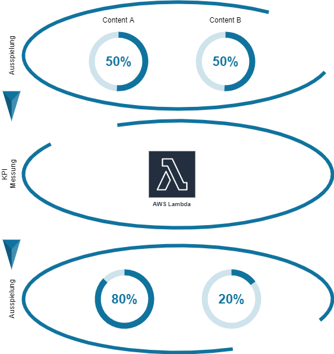

## Beyond MVP

The goal was to develop an MVP as a value-added module in the care sector in
cooperation with the Versicherungskammer Bayern, S-Markt & Mehrwert and Reha Assist.

The internet presence as part of the entire project was designed and implemented
by the OEV. The agile way of working and the resulting requirements, which only
manifested themselves over time, demanded the greatest technical flexibility.
It was necessary to be able to react quickly to changing conditions at any time
during the development phase. Even if it is „only“ an MVP at first, it was important
for us to choose an architecture from the outset that would still be suitable after
the MVP.

---

## The Cloud was set

"We knew that requirements could change at any time, that the front-end had to be
flexible and the content had to be easily modifiable.“ said Nico Schönnagel, our
solution architect, who has been designing and implementing applications in the AWS
Cloud with his team for six years. What could not be predicted were the number of
accesses to the site and thus the resources required. For these reasons, it was
immediately clear that only a cloud solution was an option.

Since „servers are somehow also from yesterday“, says Nico Schönnagel, a serverless
architecture should be used. The AWS Cloud offers various possibilities here. Static
content should be mapped via object storage S3.

The last major element of an application is the database, which should also be a
database that does not need to be actively managed. Aurora as a serverless SQL database
or DynamoDB were available for selection.

:::note S3
S3 combined with CloudFront offers unlimited storage and performance.
Content versioning and encryption is also possible. Instead of an Apache web server,
an endpoint can be defined quite easily via this service. CloudFront maps the necessary
caching, so that the application can be accessed with high performance regardless of
the number of users.
:::

:::note Lambda
Lambda Services offer the possibility to implement source code in Python, nodeJS,
Java etc. without the need of an application server. This way developers can take
care of the development without the need to manage and understand server infrastructures.
The API- Gateway is the interface from the net. It allows the business logic to be
separated from the interface and offers further possibilities to cache requests.
:::

---

## Content Management System (CMS)

The initial consideration was to develop an application on the basis of the
architectural considerations itself. An Angular or React application on S3 for
full flexibility and in the backend a micro service architecture with nodejs.
For the management of the content a separate solution would have been used.
Various CMS systems such as the top dog WordPress were available as alternatives.
However, WordPress is not serverless and has some limitations in the area of
flexible adjustment of the frontend. It was therefore not the right solution for
the required MVP. Another alternative was Webiny. Webiny is a relatively new CMS,
which is serverless on the one hand and headless on the other. Thus this system
fulfilled the requirements exactly and gave the development team the possibility
not to concentrate on the reproduction of a CMS system but to implement the
requirements for the customers.

:::note Headless CMS
A headless CMS essentially means that the complete added value of a CMS is available, i.e. versioning, editorial backend, etc., but the GUI representation is missing. Instead, the system offers interfaces and content models that need to be operated. The advantage is that in the frontend with React, Gatsby, Vue, etc. frameworks, editors\* can only fill defined content models. However, these models do not only have to be used in the web presence, but can also be used for further distribution, for example in apps or social media.
:::

:::note Serverless
Serverless means: without server. Of course, it doesn’t really work without sheet metal in the background, but it is encapsulated over several abstraction layers. Developers\* only have to take care of the actual implementation of the source code or the database, the underlying server infrastructure itself takes care of issues such as scaling, performance or, in the example of the database, replication.
:::

---

## Webiny

Webiny is an OpenSource project for a headless CMS that works natively and serverless in AWS. Thus the system fulfils exactly the requirements for a modern architecture. The CMS comes with GraphQL APIs, which are used to communicate with the backend. The CMS is based on a MongoDB, but should support other databases like DynamoDB by the end of the year. The development in the frontend was done with Angular, with dynamic content retrieved via GraphQL APIs. The advantage of this is that editors only have to maintain the content in models. The design is thereby brought back to the development level (unlike with a classic CMS). On the one hand, this allows for more dynamic graphic design, on the other hand, content can be produced more quickly. When asked about the challenges of such a system, Nicolas Kumnick (Frontend Engineer) answers: „The price for speed and simplification in maintenance is that editors no longer have the direct possibility to influence or design content through CSS or HTML injection“. It’s a new way of thinking about content that also means close collaboration between developers and designers.

In the following figure the connection between content and model is shown. An element of the page is shown in the middle. The corresponding content comes from the defined models, which are shown above and below. The example of the testimonial shows that it is relatively easy to add new elements. The live page can also be found at <ExternalLink href="https://s-pflegepartner.de/home">s-pflegepartner</ExternalLink>

---

## A-B Tests

The content models also enable relatively simple automated A-B testing. In this case, two or more models can be created in parallel, which can then be played out differently. This allows the UX of a website to be tested in parallel. Even better is that it is not even necessary to decide on a variant (A, B or C), but that the system can decide on the basis of defined KPIs alone which content model fits best at the moment and plays it out. This could even change over time.

---

## Adjustments and performance boost by 300 %

Essentially, our team relies on standards in development: AWS, Webiny and Angular in the frontend. Nevertheless, some small adjustments had to be made. For example, until the release of DynamoDB support, we use a MongoDB on an EC2 instance. The background here was that the native atlas DB should not be used outside AWS and a native document DB as a managed service in AWS is relatively expensive.

Furthermore, we tightened the performance screw a bit. Basically all dynamic content is queried via the database. In a CMS, however, the dynamic content is mostly very durable, so that not every query of the content model has to go directly back to the database. The standard caching with Cloudfront did not bring any noticeable effects, because the Graph-QL requests were POST requests. With a few adjustments and the API caching we were able to solve the problem and achieve an enormous performance boost (300%).

---

## Conclusion

Even if it is only a matter of designing a small MVP for the time being, it is worth thinking bigger. In the example of <ExternalLink href="https://s-pflegepartner.de/home">s-pflegepartner</ExternalLink>, an MVP was developed whose architecture, with the use of Function as a Service (FaaS), is thought beyond the MVP.
