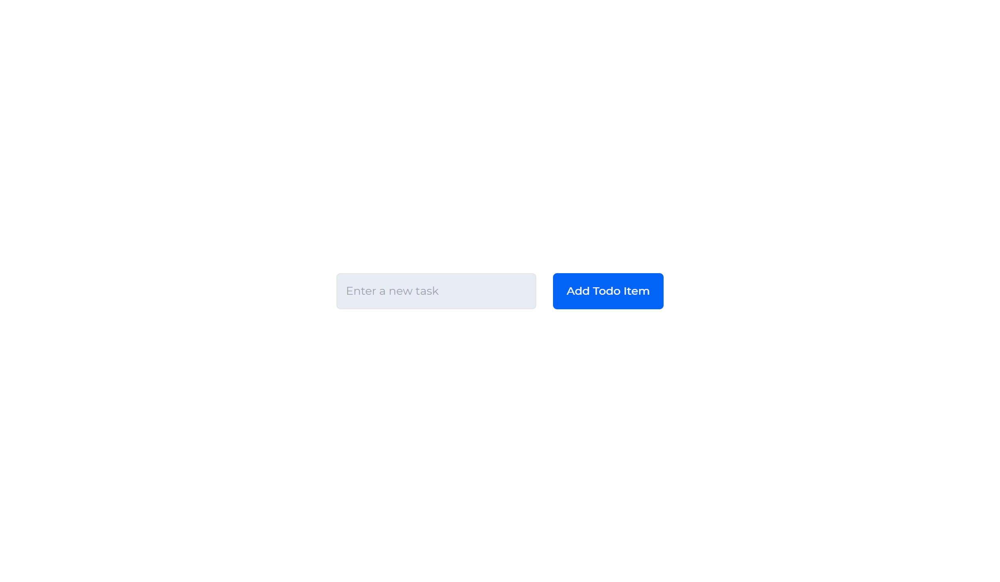
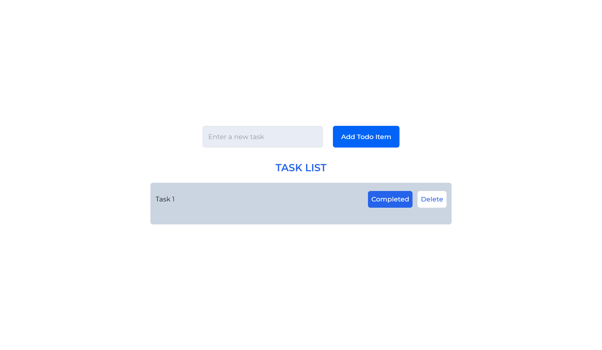
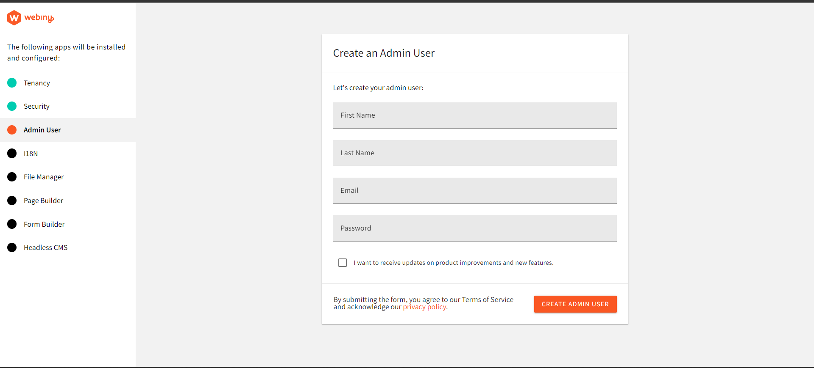
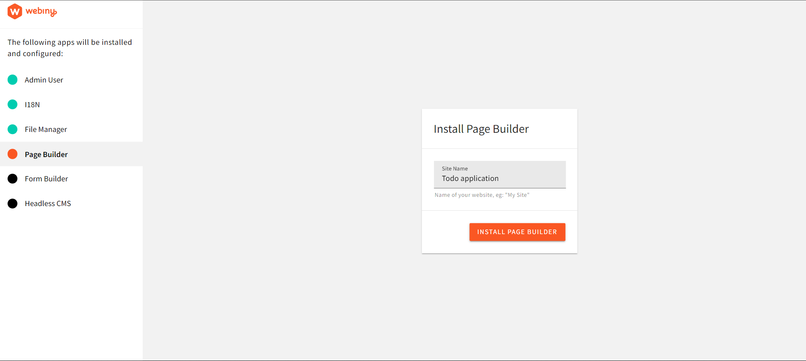
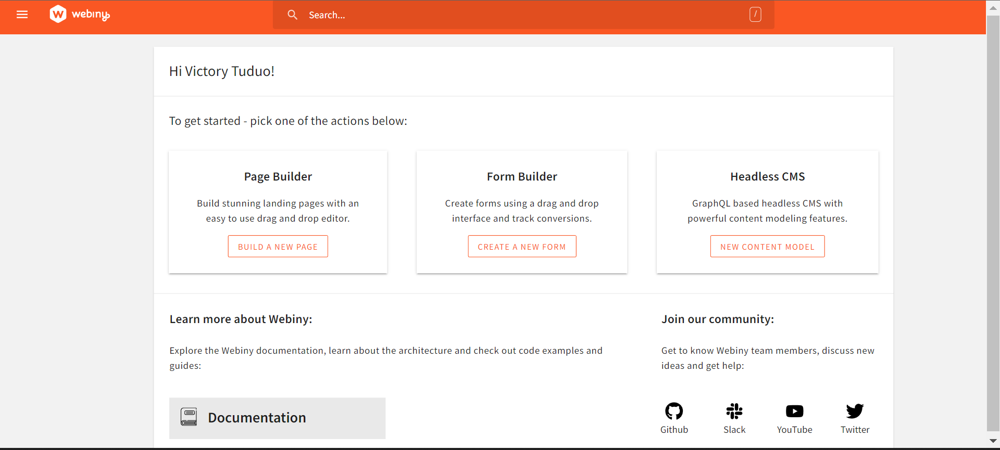
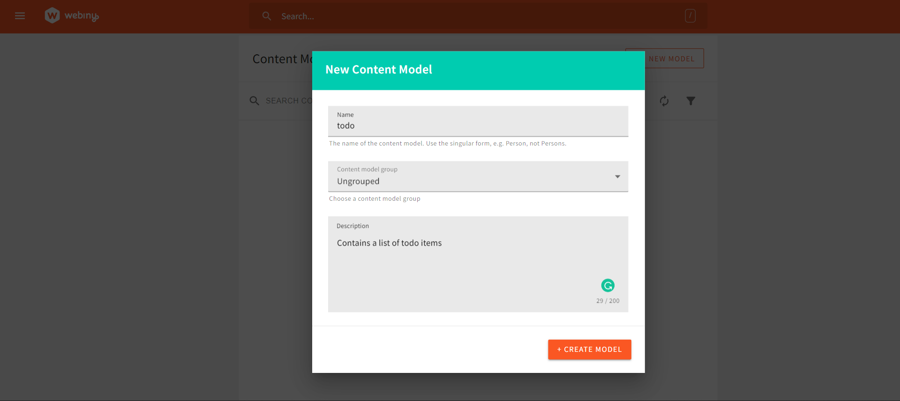
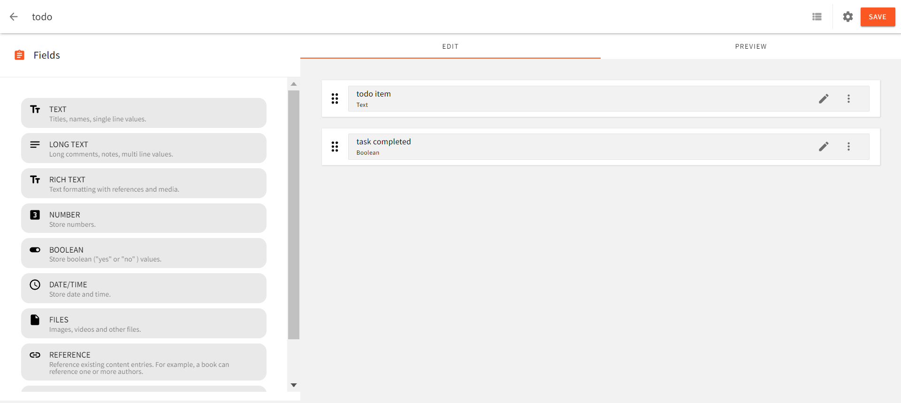
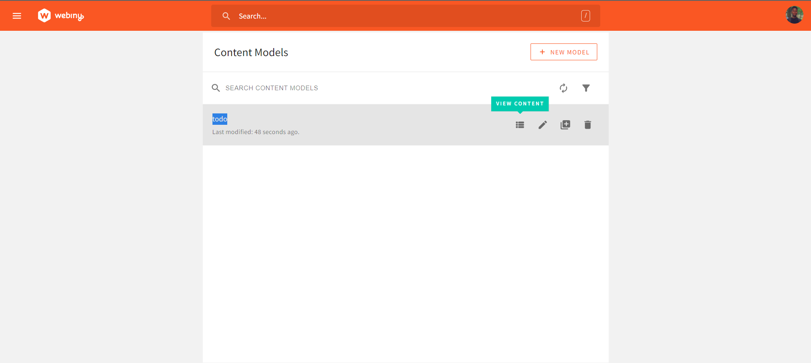
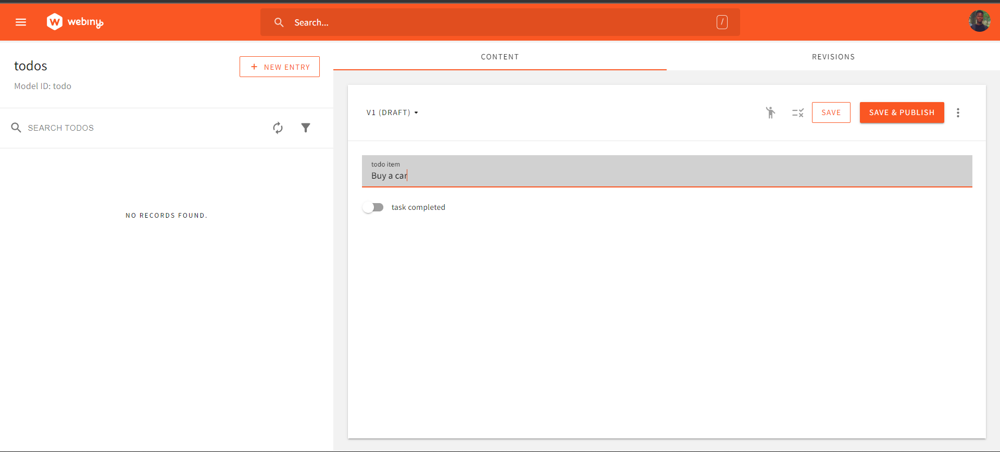
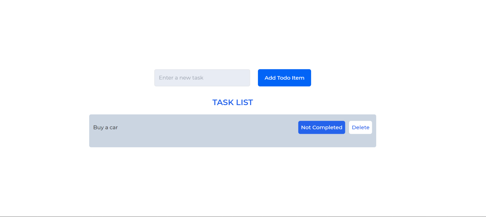

To-do applications are a way of organizing things to do or achieve in the form of a list. This list allows us to write down tasks, prioritize tasks more efficiently, and manage them for increased productivity. While a ToDo application can easily be developed using a front-end development framework such as React.js, viewing and managing its content is not feasible if it's hard coded. 

This brings about the need for a structure to easily manage and manipulate site contents. A good implementation that can seamlessly handle this task is using a Content Management System such as the Webiny Headless CMS. Webiny provides an administrative panel to manage an application, can restrict specific access such as read and write access to an application, and also provide a window to easily oversee all contents available in the CMS.

## Goals

In this article, we will learn about the Webiny CMS and how we can use this in a React application by working on building a to-do app.

## Prerequisites

To follow along with this tutorial, you need to have the following:

- Basic knowledge of React and GraphQL
- An [AWS account](https://www.webiny.com/docs/infrastructure/aws/configure-aws-credentials) with credentials set up on your system
- Have a version of Node.js and yarn installed
- Star our [GitHub Repo](https://github.com/webiny/webiny-js) 😉

## What is a Headless CMS?

A Headless CMS is a Content Management System in which content is stored at a back-end and is made available via APIs (Application Programming Interfaces) to be displayed on the front-end in any device, thus providing flexibility in the display of information. The term “Headless” represents where the content is to be displayed, in this case, the front-end. The body is the back-end repository where the content is stored. Headless CMS provides users an interface to manage their content and allows them to determine what content gets displayed, and how.

## Why use Webiny Headless CMS?

[Webiny](https://www.webiny.com/) is an open-source headless CMS tailored to meet the needs of enterprises. It allows users to easily build and manage content and provides support for a collaborative content management structure. Some benefits of Webiny as a headless CMS include:

- Webiny provides different application features to meet different user needs. These features include a headless CMS, a form builder, a file manager, a control panel, an advanced publishing workflow for collaborative content management, and an admin interface application.
- Webiny has support for any development framework or static site builder of your choice.
- Webiny supports developers and non-developer users to manage content and build applications, by providing No-code, low-code, and code-code interfaces.

## Building a ToDo Application

To build the ToDo application, we will be using the React JavaScript framework. To install this, on your system, navigate to a project of your choice and open a CLI. Within the CLI, enter the following bash commands:

```bash
npx create-react-app todo_application
```

The above command sets up a React application in the chosen directory. In order to easily style our application, we will be using [TailwindCSS](https://tailwindcss.com/). We can install this in the CLI with the following command:

```bash
npm install -D tailwindcss postcss autoprefixer
npx tailwindcss init -p
```

After installation is complete, open this folder in a code editor. To use `TailwindCSS` in the application, we need to add support for `JSX` in the `tailwind.config.js` file as shown below:

```tsx
module.exports = {
  content: [
    "./src/**/*.{js,jsx,ts,tsx}",
  ],
  theme: {
    extend: {},
  },
  plugins: [],
}
```

Finally, add the tailwind directives to the top level of `index.css`:

```css
@tailwind base;
@tailwind components;
@tailwind utilities;
```

## Creating an Input Section

For the to-do application, we will need an input field where we can add new tasks to our ToDo list. For this, we will create an input field and handle changes in the text field with the `useState` hook in `App.js` as shown below:

```tsx
import "./App.css";
import { React, useState } from "react";

function App() {
  //state to manage input field
  const [todo, setTodo] = useState("");

  return (
    <div className="h-screen flex justify-center items-center flex-col gap-8">
      <div className="flex justify-center items-center gap-6">
        <input
          className="w-72 border-2  rounded-md px-3 py-3 bg-[#E8ECF4] backdrop-blur-lg"
          //set value of input field
          value={todo}
          onChange={(e) => {
            //update state on changes to text
            setTodo(e.target.value);
          }}
          placeholder="Enter a new task"
        />
        <button
          className="h-full px-5 py-2 bg-[#0264F6] text-white font-medium rounded-md"
          onClick={() => {
            //execute function to add new todo to the list
          }}
        >
          Add Todo Item
        </button>
      </div>
    </div>
  );
}
export default App;
```

In the code above, we have a state to manage ToDo inputs from a text field, an input field, and a submit button. If we run our application with the `npm start` command, we will get a result in our browser similar to the image below:



## Display ToDo List Items

To display the ToDo list items we will create a separate component. To achieve this, in your project directory create a folder called `components` and a file `TaskList.js` within it. Next, we will define the structure for our to-do items with the following code in `TaskList.js`:

```tsx
import React from "react";
const TaskList = () => {
  return (
    <div className="w-full text-center flex items-center flex-col gap-5">
      <h1 className="text-blue-600 uppercase font-semibold text-2xl">Task List</h1>
      <div className="w-1/2 bg-slate-300 backdrop-blur-lg px-3 py-5 rounded-md">
          <div className="flex justify-between items-center mb-5">
            <li className="list-none w-2/3 text-left break-normal">Task 1</li>
            <div className="flex gap-3">
                <button className="bg-blue-600 text-white px-2 py-2 font-medium rounded-md">Completed</button>
                <button className="bg-white text-blue-600 px-2 py-2 font-medium rounded-md">Delete</button>
            </div>
          </div>
      </div>
    </div>
  );
};
export default TaskList;
```

The code above defines the structure of our ToDo list. Each ToDo item will have two buttons `Completed` and `Delete`. We can import this component into `App.js`:

```tsx
//Add an import for the TaskList component in App.js
import TaskList from "./components/TaskList";
  // Then add the TaskList component just below the "Add Todo Item" button
  //...
  <button>
     Add Todo Item
  </button>
</div>
<TaskList />
```

Running the code now will produce a result similar to the below image:



## Setting up Webiny CMS

To get started with Webiny, you will need an AWS account. If you do not already have one, you can follow [this guide](https://www.webiny.com/docs/infrastructure/aws/configure-aws-credentials) to create one. After creating an account and s[etting up the AWS credentials on your device](https://docs.aws.amazon.com/cli/latest/userguide/cli-configure-files.html), you can create a Webiny project with the following CLI command:

```bash
npx create-webiny-project todocms
```

Once the installation is complete, we will deploy the Webiny project with the following command:

```bash
yarn webiny deploy
```

After deployment, we get a preview URL that directs us to the admin area of our application.



Here, fill-out the form and create a new admin user account. Next, sign in with the created account credentials on the next page. Follow through the steps to finish the setup. Install `|18N`, enter the application name in the page builder and click on the ”install” button:



Once installation is completed, we are redirected to the dashboard:



Here, click on the `New content model` button under headless CMS and create a new model called “todo”.



## Content Structure

For the content structure of our application, we will add two fields: a text field, and a `Boolean` field. After creating the fields, click on the `Save` button on the top left to add these changes.



Next, click on the arrow at the top left to return to the content models screen, and click on `view content` on the created model `todo`:



Here, create a new entry:



Click on the `save and publish` button to add the new item to the to-do collection.

## Connecting the CMS to the Application

To connect Webiny CMS to our application, we will need to create an API key. This can be done by navigating to `access management` in the settings tab of the left navigation window. Fill in the form to create a new API key, in the content section select `all locales`, and in the headless CMS drop-down, choose `Custom Access`. In the content-model section, select `Only specific models` in the access scope and choose the `model` to be accessed, in this case, the “todo” model. Finally, allow `Read, write and delete` actions, then click on the `save API key` button at the bottom of the page and copy the generated token. Note that, keys created with `write` and `delete` access should be used server-side to better secure your application, as storing them in the code itself is a potential risk factor.

## Fetching, Creating, and Deleting To-dos

For our Webiny CMS access token, we will create a `.env` file in our project directory and key in the following:

```bash
REACT_APP_ACCESS_TOKEN=your access token here
REACT_APP_WEBINY_URL=your Webiny URL instance here
```

To get the Webiny instance URL, you can use the `yarn webiny info` command in the CLI of the Webiny project folder. The URL to be used looks similar to this format: `https://{your CMS URL}/cms/manage/{Local region}`.

We will be making use of [Apollo](https://www.apollographql.com/) client to interact with the Webiny CMS using GraphQL in our application. This can be installed with the following CLI command:

```bash
npm install @apollo/client graphql
```

Once the installation is complete, we will initialize `ApolloClient` in our `index.js` file:

```tsx
import { ApolloClient, InMemoryCache, ApolloProvider, gql } from '@apollo/client';

const client = new ApolloClient({
  uri: process.env.REACT_APP_WEBINY_URL,
  cache: new InMemoryCache(),
  headers: {
      Authorization: `Bearer ${process.env.REACT_APP_ACCESS_TOKEN}`,
    },
});
```

Next, we wrap the `App` component with the `ApolloProvider`:

```tsx
<ApolloProvider client={client}>
  <App />
</ApolloProvider>
```

**Fetching To-do Items** 

With the `Apollo` setup complete, we can create a query in `App.js` to fetch data from the CMS:

```tsx
import { useQuery, gql } from "@apollo/client";

//query to fetch to-dos
const GET_TODOS = gql`
  query {
    listTodos {
      data {
        todoItem
        taskCompleted
        id
      }
    }
  }
`;
```

The query `GET_TODOS` runs a query `listTodos` which returns an array of our to-do items with each to-do item containing the properties defined in the `data` object: `todoItem`, `taskCompleted`, and an `id`.

Next, we use the `useQuery` hook from `Apollo client` to execute the `GET_TODOS` query in the `App` component:

```tsx
const { loading, error, data } = useQuery(GET_TODOS)
  if (loading) return <p>Getting to_dos...</p>;
  if (error) return <p>An error occurred :(</p>;
```

In the code above, we have defined three states for the data. When the data is in the loading state or an error occurs, the corresponding component will be returned.

To display the data returned by this query, we will pass the `data` value to the `TaskList` component and return it:

```tsx
{/* passing data to TaskList */}
<TaskList todos={data}/>
```

In `TaskList.js`, we can map through this prop and return our data:

```tsx
const TaskList = ({ todos }) => {
  return (
    <div className="w-full text-center flex items-center flex-col gap-5">
      <h1 className="text-blue-600 uppercase font-semibold text-2xl">
        Task List
      </h1>
      <div className="w-1/2 bg-slate-300 backdrop-blur-lg px-3 py-5 rounded-md">
        {todos &&
          todos.listTodos.data.map(({ id, todoItem, taskCompleted }) => (
            <div className="flex justify-between items-center mb-5" key={id}>
              <li className="list-none w-2/3 text-left break-normal">
                {todoItem}
              </li>
              <div className="flex gap-3">
                <button className="bg-blue-600 text-white px-2 py-2 font-medium rounded-md">
                  {taskCompleted? "Completed" : "Not Completed"}
                </button>
                <button className="bg-white text-blue-600 px-2 py-2 font-medium rounded-md">
                  Delete
                </button>
              </div>
            </div>
          ))}
      </div>
    </div>
  );
};
```

Here, we map through the `data` and return the `todoItem` and `taskCompleted` properties. When we view the application in the browser, we can see the data from the CMS:



**Creating New ToDo Items** 

To create new ToDo items, we will use the `useMutation` hook from the `Apollo client`. With it, we will pass the value from the input field when the `Add Todo item` button is clicked to create new ToDos. We will do this in `App.js`:

```tsx
import { useQuery, gql, useMutation } from "@apollo/client";

// then we define the query to create a todo
const ADD_TODOS = gql`
mutation AddTodo($todoItem: String!){
  createTodo(
    data:{
      todoItem: $todoItem
    }
  )
  {
    data {
        todoItem,
        taskCompleted
    }
  }
}
`;
```

The `ADD_TODOS` query defined above executes a mutation `createTodo`. This mutation will take in the `todoItem` in the data object, execute the mutation and return the data. For the item to be added to the ToDo list, we defined a variable `$todoItem` of data type string. We will pass a value to this variable when executing the mutation.

We will execute the `ADD_TODOS` mutation in the `App` component using `useMutation`:

```tsx
const [addTodo] = useMutation(ADD_TODOS);
```

The `useMutation` hook above depends on the `addTodo` function to execute the `ADD_TODOS` mutation. When this function is called, the mutation gets executed. We will call this function in the button to `Add new Todo`:

```tsx
<button
  className="h-full px-5 py-2 bg-[#0264F6] text-white font-medium rounded-md"
  onClick={() => {
    //execute function to add new todo to the list
    addTodo({ variables: { todoItem: todo } });
    refetch();
    setTodo("");
  }}
>
```

To re-fetch the `to-dos` when a new ToDo item is added, we will use the `refetch()` hook provided by `useQuery`:

```tsx
const { loading, error, data, refetch } = useQuery(GET_TODOS)
```

Now, we can create new ToDo items in our application:

<video width="800px" height="auto" controls autoplay>
  <source src="./assets/todo-application-react-tailwind-webiny-headless-cms/create-a-new-todo.mp4" type="video/mp4" />
</video>


**Deleting a ToDo Item** 

To delete ToDo items, we will create a new mutation `DELETE_TODO` in `TaskList.js`. Then we will use the `useMutation` hook to execute this mutation when the `Delete` button is clicked:

```tsx
import { gql, useMutation } from "@apollo/client";
const TaskList = ({ todos, gettodo }) => {
  const DELETE_TODO = gql`
    mutation DeleteTodo($id: ID!){
      deleteTodo(revision: $id) {
        data
      }
    }
  `;
  const [deleteTodo] = useMutation(DELETE_TODO);
```

In the code above, we defined the mutation to delete a ToDo item. The ToDo item to be deleted is referenced by an `id` variable. We will call the `deleteTodo` function to execute the mutation, and also pass the `id` to the mutation using the `onClick` event handler of the `delete` button:

```tsx
<button className="bg-white text-blue-600 px-2 py-2 font-medium rounded-md"
  onClick={() => {
    deleteTodo({ variables: { id: id } });
  }}
  >
    Delete
</button>
```

Within the `onClick` event handler above, we called the `deleteTodo` function and passed the data of the `id` to the variable we defined.

To re-fetch our data to reflect the changes caused by deleting a ToDo item, we will add a property `refetchQueries` provided by the `useMutation` hook:

```tsx
const [deleteTodo] = useMutation(DELETE_TODO, {
    refetchQueries: [
      {query: gettodo},
    ],
  });
```

the `query` property will take in the query we want to execute, in this case, is the `GET_TODOS` query defined in `App.js`. To make use of it here, we just need to pass the variable to the `TaskList` component as a prop:

```tsx
<TaskList todos={data} gettodo={GET_TODOS}/>
```

Then we can get this prop in the `TaskList.js` file:

```tsx
const TaskList = ({ todos, gettodo }) => {
//....
```

With this done, our delete functionality should work properly:

<video width="800px" height="auto" controls autoplay>
  <source src="./assets/todo-application-react-tailwind-webiny-headless-cms/delete-todo-item.mp4" type="video/mp4" />
</video>

**Updating ToDo Completion Property** 

For the final feature of our ToDo application, we want to be able to update the task when it has been completed. We will create a new mutation for this in our `TaskList.js` file:

```tsx
const UPDATE_TODO = gql`
    mutation UpdateQuery($id: ID!, $completed: Boolean!) {
      updateTodo(
        revision: $id
        data: { taskCompleted: $completed }
      ) {
        data {
          todoItem
          taskCompleted
        }
      }
    }
  `;

  const [updateTodo] = useMutation(UPDATE_TODO, {
    refetchQueries: [
      { query: gettodo },
    ],
  });
```

Here the update mutation references the todo item by the `id`. Then we update the `taskCompleted` data by passing a `Boolean` value to it using the `$completed` variable. We also have our `useMutation` hook which executes the mutation when the `updateTodo` function is called, and also re-fetches the `gettodo` query to update the application.

For the `updateTodo` function, we will call it in the `Task Completed` button and pass in the `id` and `Boolean` values:

```tsx
<button className="bg-blue-600 text-white px-2 py-2 font-medium rounded-md"
  onClick={()=>{
    updateTodo({ variables: { id: id, completed: !taskCompleted } });
  }}
  >
    {taskCompleted ? "Completed" : "Not Completed"}
  </button>
```

In the code above, we pass in the `id` and the opposite value of our `taskCompleted` property from our CMS. This will set a not completed task to completed and vice-versa when the button is clicked.

Lastly, we will add a style to apply a `strikethrough` property to to-do items that have been completed:

```tsx
 <li className={` ${taskCompleted? "line-through": "" } list-none w-2/3 text-left break-normal`}>
  {todoItem}
</li>
```

Now, if we run our code and open the result in our browser, we have the following result:

<video width="800px" height="auto" controls autoplay>
  <source src="./assets/todo-application-react-tailwind-webiny-headless-cms/final-video.mp4" type="video/mp4" />
</video>


## Conclusion

We have come to the end of this tutorial. In this tutorial, we learned about the Webiny Headless CMS, and how we can build a CRUD app with it, through working on a ToDo application.


**Full source code:** https://github.com/webiny/write-with-webiny/tree/main/tutorials/todo-react-tailwind

---

This article was written by a contributor to the Write with Webiny program. Would you like to write a technical article like this and get paid to do so? [Check out the Write with Webiny GitHub repo](https://github.com/webiny/write-with-webiny/).