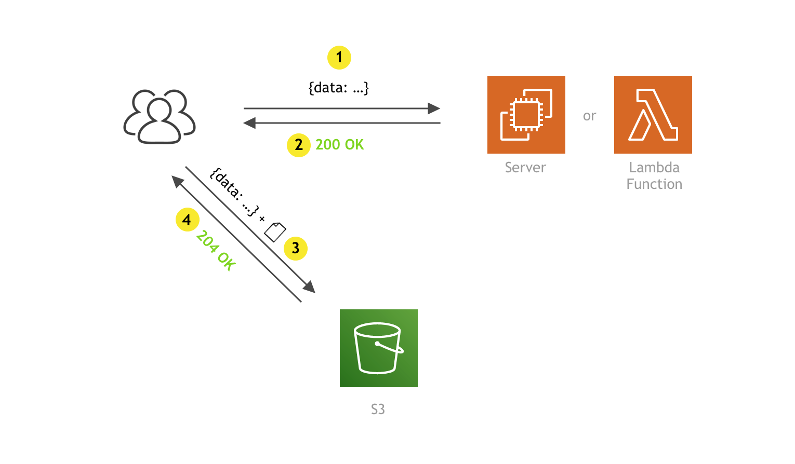
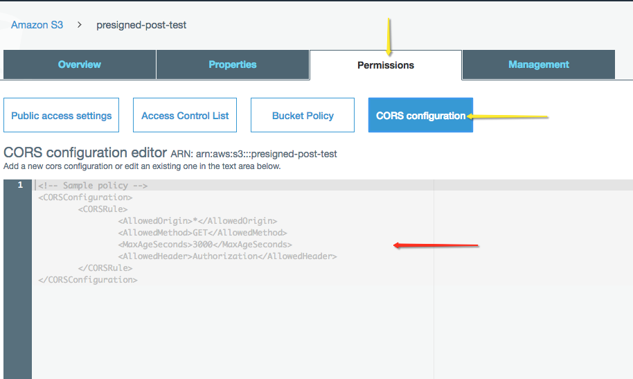

When it comes to file uploads performed by client apps, “traditionally,” in a “serverful” world, we might use the following approach:

1. on the client side, the user submits a form and the upload begins
2. once the upload has been completed, we do all of the necessary work on the server, such as check the file type and size, sanitize the needed data, maybe do image optimizations, and then, finally, move the file to a preferred location, be it another storage server or maybe [S3](https://aws.amazon.com/s3/).


Although this is pretty straight forward, there are a few downsides:

1. Uploading files to a server can negatively impact its system resources (RAM and CPU), especially when dealing with larger files or image processing.
2. If you are storing files on a separate storage server, you also don’t have unlimited disk space, which means that, as the file base grows, you’ll need to do upgrades.
3. Oh, yeah, and did I mention backups?
4. Security — there are never enough preventive steps that you can implement in this department.
5. We constantly need to monitor these servers in order to avoid downtime and provide the best possible user experience.

Woah! 😰


But, luckily, there’s an easier and better way to perform file uploads! By using **pre-signed POST data**, rather than our own servers, S3 enables us to perform uploads directly to it, in a controlled, performant, and very safe manner. 🚀

You might be asking yourself: “What is pre-signed POST data and how does it all work together.” Well, sit back and relax, because, in this short post, we’ll cover everything you need to know to get you started.

For demonstration purposes, we’ll also create a simple app for which we’ll use a little bit of React on the frontend and a simple Lambda function (in conjunction with API gateway) on the backend.

Let’s go!

## How does it work?

On a high level, it is basically a two-step process:

1. The client app makes an HTTP request to an API endpoint of your choice (1), which responds (2) with an upload URL and pre-signed POST data (more information about this soon). Note that this request does not contain the actual file that needs to be uploaded, but it can contain additional data if needed. For example, you might want to include the file name if for some reason you need it on the backend side. You are free to send anything you need, but this is certainly not a requirement. For the API endpoint, as mentioned, we’re going to utilize a simple Lambda function.
2. Once it receives the response, the client app makes a `multipart/form-data` POST request (3), this time directly to S3. This one contains received pre-signed POST data, along with the file that is to be uploaded. Finally, S3 responds with the 204 OK response code if the upload was successful or with [an appropriate error response code](https://docs.aws.amazon.com/AmazonS3/latest/API/ErrorResponses.html) if something went wrong.



Alright, now that we’ve gotten that out of the way, you might still be thinking what pre-signed POST data is and what information it contains.

It is basically a set of fields and values, which, first of all, contains information about the actual file that’s to be uploaded, such as the S3 key and destination bucket. Although not required, it’s also possible to set additional fields that further describe the file, for example, its content type or allowed file size.

It also contains information about the file upload request itself, for example, security token, policy, and a signature (hence the name “pre-signed”). With these values, the S3 determines if the received file upload request is valid and, even more importantly, allowed. Otherwise, anybody could just upload any file to it as they liked. These values are generated for you by the AWS SDK.

To check it out, let’s take a look at a sample result of the`createPresignedPost` method call, which is part of the [Node.js AWS SDK](https://aws.amazon.com/sdk-for-node-js/) and which we’ll later use in the implementation section of this post. The pre-signed POST data is contained in the “fields” key:

```
{
    "url": "https://s3.us-east-2.amazonaws.com/webiny-cloud-z1",
    "fields": {
        "key": "uploads/1jt1ya02x_sample.jpeg",
        "bucket": "webiny-cloud-z1",
        "X-Amz-Algorithm": "AWS4-HMAC-SHA256",
        "X-Amz-Credential": "A..../us-east-2/s3/aws4_request",
        "X-Amz-Date": "20190309T203725Z",
        "X-Amz-Security-Token": "FQoGZXIvYXdzEMb//////////...i9kOQF",
        "Policy": "eyJleHBpcmF0a...UYifV19",
        "X-Amz-Signature": "05ed426704d359c1c68b1....6caf2f3492e"
    }
}
```

As developers, we don’t really need to concern ourselves too much with the values of some of these fields (once we’re sure the user is actually authorized to request this information). It’s important to note that all of the fields and values must be included when doing the actual upload, otherwise the S3 will respond with an error.

Now that we know the basics, we’re ready to move onto the actual implementation. We’ll start with the client side, after which we’ll prepare our S3 bucket and finally create our Lambda function.

## Client

As we’ve mentioned at the beginning of this post, we’re going to use React on the client side, so what we have here is a simple React component that renders a button, which enables the user to select any type of file from his local system. Once selected, we immediately start the file upload process.

Let’s take a look:

`gist:doitadrian/e93dc8b06d5e30ca0ce89f2f0e71c717`

For an easier file selection and cleaner code, we’ve utilized a small package called [react-butterfiles](https://github.com/doitadrian/react-butterfiles). The author of the package is actually me, so if you have any questions or suggestions, feel free to let me know! 😉

Other than that, there aren’t any additional dependencies in the code. We didn’t even bother to use a 3rd party HTTP client (for example [axios](https://github.com/axios/axios)) since we were able to achieve everything with the built-in XMLHttpRequest API.

Note that we’ve used [FormData](https://developer.mozilla.org/en-US/docs/Web/API/FormData) for assembling the request body of the second S3 request. Besides appending all of the fields contained in the pre-signed POST data, also make sure that the actual file is appended as the last field. If you do that before, S3 will return an error, so watch for that one.

## S3 bucket

Let’s create an S3 bucket, which will store all of our files. In case you don’t know how to create it, the simplest way to do this would be via the [S3 Management Console](https://s3.console.aws.amazon.com/s3).

Once created, we must adjust the [CORS](http://s/Web/HTTP/CORS) configuration for the bucket. By default, every bucket accepts only GET requests from another domain, which means our file upload attempts (POST requests) would be declined:

```
Access to XMLHttpRequest at 'https://s3.amazonaws.com/presigned-post-test' from origin 'http://localhost:3001' has been blocked by CORS policy: No 'Access-Control-Allow-Origin' header is present on the requested resource.
```

To fix that, simply open your bucket in the S3 Management Console and select the “Permissions” tab, where you should be able to see the “CORS configuration” button.



Looking at the default policy in the above screenshot, we just need to append the following rule:

```
<AllowedMethod>POST</AllowedMethod>
```

The complete policy would then be the following:

```
<CORSConfiguration>
    <CORSRule>
        <AllowedOrigin>*</AllowedOrigin>
        <AllowedMethod>GET</AllowedMethod>
        <AllowedMethod>POST</AllowedMethod>
        <MaxAgeSeconds>3000</MaxAgeSeconds>
        <AllowedHeader>Authorization</AllowedHeader>
    </CORSRule>
</CORSConfiguration>
```

Alright, let’s move to the last piece of the puzzle and that’s the Lambda function.

## Lambda

Since it is a bit out of the scope of this post, I’ll assume you already know how to deploy a Lambda function and expose it via the API gateway, using the [Serverless framework](https://serverless.com/). The `serverless.yaml` file I used for this little project can be found [here](https://gist.github.com/doitadrian/80cf3182ba1b60181a461eb7f2b6acca).

To generate pre-signed POST data, we will utilize the AWS SDK, which is [by default](https://docs.aws.amazon.com/lambda/latest/dg/current-supported-versions.html) available in every Lambda function. This is great, but we must be aware that it can only execute actions that were allowed by the role that is currently assigned to the Lambda function. This is important because, in our case, if the role didn’t have the permission for creating objects in our S3 bucket, upon uploading the file from the client, S3 would respond with the `Access Denied` error:

```
<?xml version="1.0" encoding="UTF-8"?>
<Error><Code>AccessDenied</Code><Message>Access Denied</Message><RequestId>DA6A3371B16D0E39</RequestId><HostId>DMetGYguMQ+e+HXmNShxcG0/lMg8keg4kj/YqnGOi3Ax60=</HostId></Error>
```

So, before continuing, make sure your Lambda function has an adequate role. For this, we can create a new role, and attach the following policy to it:

```
{
    "Version": "2012-10-17",
    "Statement": [
        {
            "Sid": "VisualEditor0",
            "Effect": "Allow",
            "Action": "s3:PutObject",
            "Resource": "arn:aws:s3:::presigned-post-data/*"
        }
    ]
}
```

A quick tip here: for security reasons, when creating roles and defining permissions, make sure to follow the [principle of least privilege](https://en.wikipedia.org/wiki/Principle_of_least_privilege), or in other words, assign only permissions that are actually needed by the function. No more, no less. In our case, we specifically allowed `s3:PutObject` action on the `presigned-post-data` bucket. Avoid assigning default `AmazonS3FullAccess` at all costs.

Alright, if your role is ready, let’s take a look at our Lambda function:

`gist:doitadrian/bdb9a4b42bf9fd7df7d8dde4e41142b6`

Besides passing the basic`key` and `Content-Type` fields (line 18), we also appended the `content-length-range` condition (line 17), which limits the file size to a value from 100B to 10MB. This is very important, because without the condition, users would basically be able to upload a 1TB file if they decided to do it.

The provided values for the condition are in bytes. Also note that there are [other](https://docs.aws.amazon.com/AmazonS3/latest/API/sigv4-HTTPPOSTConstructPolicy.html) file conditions you can apply if needed.

One final note regarding the “naive” `ContentType` detection you might’ve noticed (line 49). Because the HTTP request that will trigger this Lambda function doesn’t contain the actual file, it’s impossible to check if the detected content type is actually valid. Although this will suffice for this post, in a real-world application you would do additional checks once the file has been uploaded. This can be done either via an additional Lambda function that gets triggered once the file has been uploaded, or you could design custom file URLs, which point to a Lambda function and not to the actual file. This way, you can make necessary inspections (ideally only once is enough) before sending the file back to the client.

## Let’s try it out!

If you’ve managed to execute all of the steps correctly, everything should be working fine. To try it out, let’s first try to upload files that don’t comply with the file size condition. So, if the file is smaller than 100B, we should receive the following error message:

```
POST https://s3.us-east-2.amazonaws.com/webiny-cloud-z1 400 (Bad Request)

Uncaught (in promise) <?xml version="1.0" encoding="UTF-8"?>
<Error><Code>EntityTooSmall</Code><Message>Your proposed upload is smaller than the minimum allowed size</Message><ProposedSize>19449</ProposedSize><MinSizeAllowed>100000</MinSizeAllowed><RequestId>AB7CE8CC00BAA851</RequestId><HostId>mua824oABTuCfxYr04fintcP2zN7Bsw1V+jgdc8Y5ZESYN9/QL8454lm4++C/gYqzS3iN/ZTGBE=</HostId></Error>
```

On the other hand, if it’s larger than 10MB, we should also receive the following:

```
POST https://s3.us-east-2.amazonaws.com/webiny-cloud-z1 400 (Bad Request)

Uncaught (in promise) <?xml version="1.0" encoding="UTF-8"?>
<Error><Code>EntityTooLarge</Code><Message>Your proposed upload exceeds the maximum allowed size</Message><ProposedSize>10003917</ProposedSize><MaxSizeAllowed>10000000</MaxSizeAllowed><RequestId>50BB30B533520F40</RequestId><HostId>j7BSBJ8Egt6G4ifqUZXeOG4AmLYN1xWkM4/YGwzurL4ENIkyuU5Ql4FbIkDtsgzcXkRciVMhA64=</HostId></Error>
```

Finally, if we tried to upload a file that’s in the allowed range, we should receive the `204 No content` HTTP response and we should be able to see the file in our S3 bucket.


## Other approaches to uploading files

This method of uploading files is certainly not the only or the “right” one. S3 actually offers a few ways to accomplish the same thing. You choose the one that mostly aligns with your needs and environment.

For example, [AWS Amplify client framework](https://aws.amazon.com/amplify/) might be a good solution for you, but if you’re not utilizing other AWS services like Cognito or AppSync, you don’t really need to use it. The method we’ve shown here, on the client side, consists of two simple HTTP POST requests for which we certainly didn’t need to use the whole framework, nor any other package for that matter. Always strive to make your client app build as light as possible.

You might’ve also heard about the [pre-signed URL approach](https://docs.aws.amazon.com/AWSJavaScriptSDK/latest/AWS/S3.html#getSignedUrl-property). If you were wondering what is the difference between the two, on a high level, it is similar to the pre-signed POST data approach, but it is less [customizable](https://docs.aws.amazon.com/AWSJavaScriptSDK/latest/AWS/S3.html#getSignedUrl-property):

> **Note:** Not all operation parameters are supported when using pre-signed URLs. Certain parameters, such as `SSECustomerKey`, `ACL`, `Expires`, `ContentLength`, or `Tagging` must be provided as headers when sending a request. If you are using pre-signed URLs to upload from a browser and need to use these fields, see [createPresignedPost()](https://docs.aws.amazon.com/AWSJavaScriptSDK/latest/AWS/S3.html#createPresignedPost-property).

One notable feature that it lacks is specifying the minimum and maximum file size, which in this post we’ve accomplished with the `content-length-range`condition. Since this is a must-have if you ask me, the approach we’ve covered in this post would definitely be my go-to choice.

## Additional steps

Although the solution we’ve built does the job pretty well, there is always room for improvement. Once you hit production, you will certainly want to add the [CloudFront CDN](https://aws.amazon.com/cloudfront/) layer, so that your files are distributed faster all over the world.

If you’ll be working with image or video files, you will also want to optimize them, because it can save you a lot of bytes (and money of course), thus making your app work much faster.

## Conclusion

Serverless is a really hot topic these days and it’s not surprising since so much work is abstracted away from us, making our lives easier as software developers. When comparing to “traditional serverful” architectures, both S3 and Lambda that we’ve used in this post basically require no or very little system maintenance and monitoring. This gives us more time to focus on what really matters, and ultimately that is the actual product we’re creating.

Thanks for sticking until the very end of this article. Feel free to let me know if you have any questions or corrections, I would be glad to check them out!

---

Thanks for reading! My name is Adrian and I work as a full stack developer at [Webiny](https://www.webiny.com). In my spare time, I like to write about my experiences with some of the modern frontend and backend web development tools, hoping it might help other developers. If you have any questions, comments or just wanna say hi, feel free to reach out to me via [Twitter](https://www.twitter.com/doitadrian).
