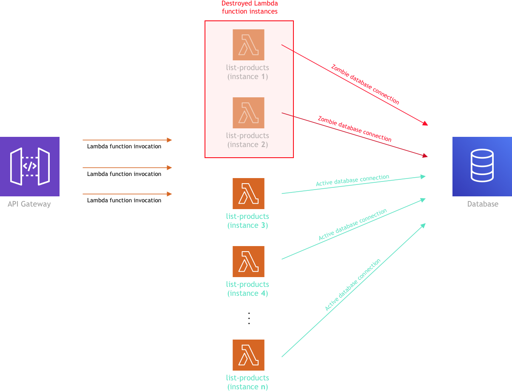
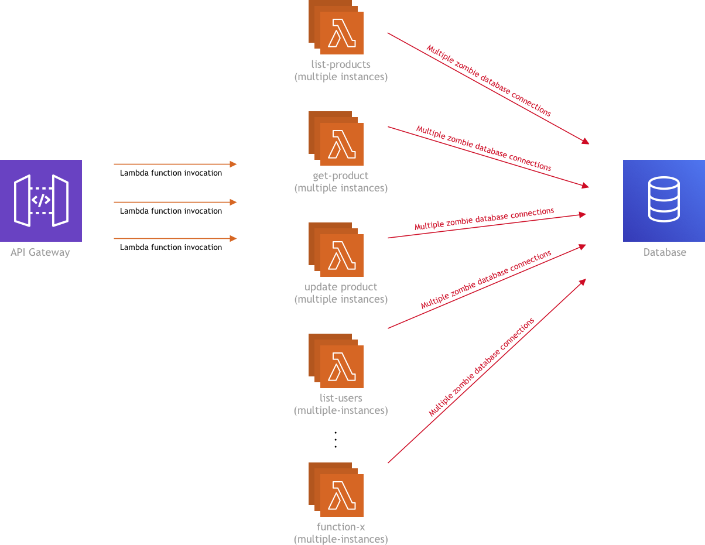
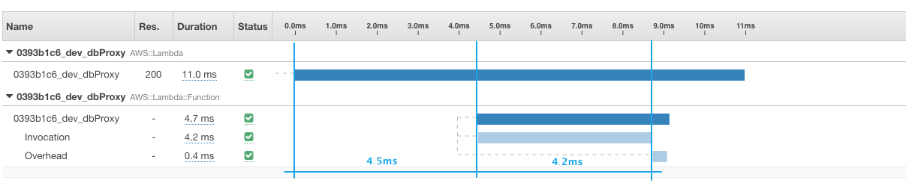
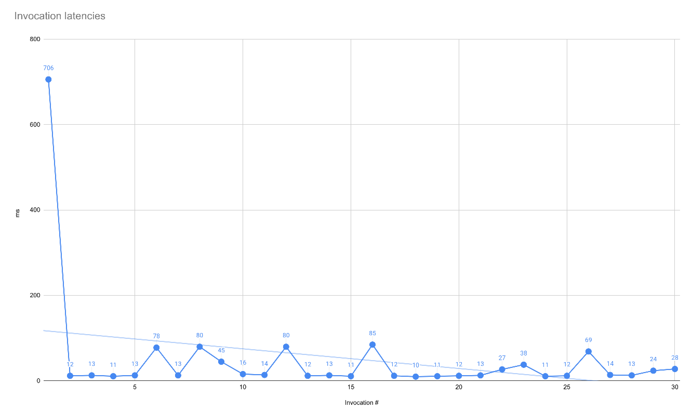
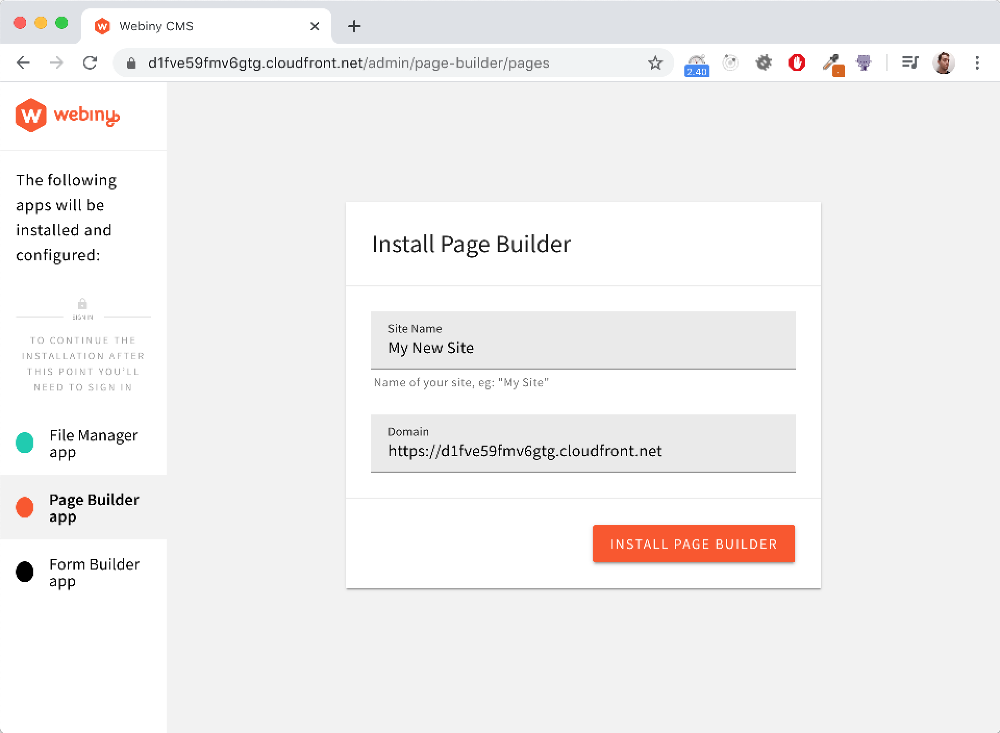

Serverless definitely brings a lot of awesome stuff to the table, but unfortunately, as we’re still in the early days more or less, there are still some rough edges that need to be taken care of.

In our [latest Webiny release](/blog/webiny-january-update-️-a7b8dc7fcb36), we attempted to tackle one of these rough edges and that is the database connection management, which can be non-trivial when dealing with FaaS, or in our case, with Lambda functions.

Don’t know what I’m talking about? Let’s briefly examine the problem.


## The problem

For those who might not be familiar with the problem of database connection management in a serverless environment, let’s explain it briefly.

With Lambda functions (or any FaaS in general), unfortunately, things can get a little tricky when you have a function that works with a “traditional” database, like for example MySQL or MongoDB.

Basically, every time a Lambda function is invoked for the first time (or a new function instance is created because of a [concurrent invocation](https://docs.aws.amazon.com/lambda/latest/dg/gettingstarted-features.html)), we need to establish a new connection to our database. While there is nothing wrong with that, the problem arises when we have to close it.

As some of you may know, after a period of inactivity, Lambda functions get destroyed and when that happens, the database connection, unfortunately, doesn’t get closed, and basically enters the “zombie” mode. In other words, the connection is still there, but no one is using it.

And over time, as this scenario repeats, the number of these “zombie” connections may significantly rise, to the point that you can reach the limit for maximum established connections defined on your database server. Because the database can basically become inaccessible at that point, this can obviously create serious problems for your app.



The above diagram shows multiple instances of a single Lambda function. But in a real-life, there will be more than one Lambda function in the mix, and that’s when it gets even more worrying.



## Any known solutions?

Although there are a few solutions for some databases today, like e.g. AWS Serverless Aurora’s [Data API](https://docs.aws.amazon.com/AmazonRDS/latest/AuroraUserGuide/data-api.html), or recently announced [RDS Proxy](https://aws.amazon.com/rds/proxy/) for AWS’s relational databases, the managed MongoDB hosting service that we are currently mostly relying on, the [MongoDB Atlas](https://www.mongodb.com/cloud/atlas), doesn’t offer a similar solution. They do list some best practices in [this article](https://docs.atlas.mongodb.com/best-practices-connecting-to-aws-lambda/), but it’s an old article, and it doesn’t really solve the problem.

We even tried the [Amazon DocumentDB (with MongoDB compatibility)](https://aws.amazon.com/documentdb/), but because of several reasons, like the fact that you have to put your function into a VPC, and that there is no free tier, we, unfortunately, had to discard it. And most importantly, the same problem exists here too.

Once we’ve realized that there isn’t a proper solution on an infrastructure level, we’ve decided to check if there’s something we can do in our code.

In the past, while we were still using MySQL, we were relying on this package called [severless-mysql](https://github.com/jeremydaly/serverless-mysql), by the great [Jeremy Daly](https://www.jeremydaly.com/), which would basically, behind the scenes, do the connection management for you on function invocations. So naturally, we asked ourselves, is there something similar, but for MongoDB?

The answer is, unfortunately, no. But hey, no problem, this sounds like an interesting problem to tackle, and it would be a useful tool for other developers. Let’s try to do it ourselves.

We basically wanted to use the same basic idea that the mentioned MySQL package had. On function invocation, behind the scenes, get a list of all inactive connections and destroy them. But, here’s the deal-breaker.

While this is possible to accomplish in the MySQL world via queries like [these](https://github.com/jeremydaly/serverless-mysql/blob/master/index.js#L269), unfortunately, the MongoDB Node.js client doesn’t offer similar commands. Yes, there is the `db.serverStatus().connections` command, but other than giving you info about the current status of connections, it doesn’t help you much.

So, unfortunately, the time has come to move on to the last idea we had up our sleeves.


## Introducing DB Proxy Lambda function

So, as we couldn’t find an adequate solution to this problem, we decided to try to create a solution of our own.

Enter “**DB Proxy” Lambda function — **a Lambda function that serves as a database connection proxy (as you can probably tell by its name). In other words, every function that needs to talk to the database, won’t actually establish its own database connection anymore, but will invoke the mentioned DB Proxy Lambda function whenever a database query needs to be made, with all of the query params sent via the invocation payload. Once invoked, the DB Proxy Lambda function will run the query using the standard [MongoDB Node.js driver](https://docs.mongodb.com/ecosystem/drivers/node/), and finally, respond back with the query results.

The following diagram basically shows how it all works together:


One thing to note here is that, as you might have noticed, zombie connections will still exist, because, at some point in time, DB Proxy Lambda function instances will still get destroyed, thus the same problem repeating. We are aware of that, but our goal is not to make the number of these zombie connections go to zero, but to try to make this number as small as possible.

First, we decided to see how all of this performs in terms of speed, because if it turns out that invoking another function to do a simple database query is slow, then there’s no point in further exploration of this idea, wouldn’t you agree?

## Performance

When this idea came up, our immediate concern was that by invoking another Lambda function to execute database queries (instead of doing it like we always did, using the [MongoDB Node.js driver](https://docs.mongodb.com/ecosystem/drivers/node/)), we would introduce significant latencies and thus negatively impact the overall performance.

But as it turned out, it’s not bad at all! Yes, there is the additional latency if we are hitting a function cold start and in that case, function initialization and a new database connection establishment, but other than that, for our needs, we’ve considered the performance to be in the acceptable range.

Let’s check it out!

### Testing results

As mentioned, every time one of your functions needs to talk to the database and a new DB Proxy Lambda function instance needs to be created, you will have an increased initial latency, due to:

1. the cold start
2. function initialization
3. establishment of a new database connection

And this is what the following [X-Ray trace](https://docs.aws.amazon.com/lambda/latest/dg/lambda-x-ray.html) shows:


As we can see, we first have a 185ms long cold start, followed by a 294ms initialization process. This is actually the execution of the code that is located outside of the exported handler function, which happens only on this initial invocation. Finally, we have a 302ms of actual handler execution, in which we probably have ~280ms or more waisted due to the new database connection establishment.

Now, if we take a look at the X-Ray trace of the next invocation, we’ll see that, performance-wise, the breakdown looks very different.



So first, we have the initial 4.5ms, which is something that’s out of our control. This is the time it took the AWS Lambda service to execute the function invocation request.

But after that, there is no initialization step we’ve seen in the previous diagram. We’ve immediately jumped to the invocation, which this time lasted for 4.2ms, which is the actual database query execution. Finally, with the overhead, we are looking at a total of 11ms.

Okay, I admit, maybe the second graph shows a cherry-picked invocation that looks more appealing in terms of the speed performance, but the complete picture also looks fine. Because these measurements tend to be variable, I pulled out the following graph that shows 30 invocations:



Except for the initial cold-start invocation, we can see that most of the time we are dealing with latencies that are in the 10–20ms range. If we would calculate the average, excluding the initial 706ms, we would get 27.24ms.

27.24ms on average for a single database query? Is that fast enough? Well, it depends on your particular use case. For our platform, we’ve considered it to be in the acceptable range.

As for the initial 706ms, if that’s something that’s bothering you, there is this thing called [provisioned concurrency for Lambda functions](https://aws.amazon.com/blogs/aws/new-provisioned-concurrency-for-lambda-functions/), which basically removes cold starts by keeping your function initialized at all times:

> …a feature that keeps functions initialized and hyper-ready to respond in double-digit milliseconds. This is ideal for implementing interactive services, such as web and mobile backends, latency-sensitive microservices, or synchronous APIs.

…a feature that keeps functions initialized and hyper-ready to respond in double-digit milliseconds. This is ideal for implementing interactive services, such as web and mobile backends, latency-sensitive microservices, or synchronous APIs.

Have in mind that it’s not free, so if you’ll be thinking about this, make sure to test it out first and determine if it’s really worth it.

To conclude, with these performance testing results, we decided to continue with the implementation and see what effect will it have on the problem we were trying to solve.

## Database connections

So, after some testing, by checking the MongoDB Atlas dashboard, we’ve noticed that the total number of established database connections really did decrease.

A good example is the Webiny installation process. Every time you deploy a brand new Webiny system, the apps you’ve included (e.g. [Page Builder](https://www.webiny.com/serverless-app/page-builder/) or [Form Builder](https://www.webiny.com/serverless-app/form-builder)) must be installed. And in that process, several Lambda functions are invoked in a very short time interval, possibly multiple times.



As shown, before the DB Proxy Lambda function, every function instantiation would establish a new database connection. So if you were installing let’s say 4 apps, and for each app, we had two Lambda function invocations, that would translate to 4–8 new database connections, depending on how fast the invocations were made and thus the creation of new function instances.

With the DB Proxy Lambda function, instead of the mentioned 4–8 connections, we now have 2–4 connections, which is definitely a significant reduction.

This is just one specific case, but a similar reduction happened in the overall number of connections. Before, by just doing simple content management via the admin UI, over the course of 15–20 minutes, we would reach 30–40 connections, which was very surprising to us. Now, this number is contained in the 15–30 range, which we considered a good drop.

## More benefits

So, with the shown performance and database connection management testing results, we’ve considered this whole experiment to be successful, and that’s why we’ve decided to keep this solution, so our users can utilize it and make their apps more reliable.


But that’s not all actually. This approach added even more benefits than just the database connection management problem we’ve initially set to solve. Let’s check it out!

### Maximum number of connections can be defined

Since connections are now established only from the DB Proxy Lambda function, by utilizing the [reserved concurrency](https://aws.amazon.com/about-aws/whats-new/2017/11/set-concurrency-limits-on-individual-aws-lambda-functions/) (which lets us define the maximum number of concurrent function instances), we now have the ability to control the maximum number of connections that can be established.

For example, if we were to set the reserved concurrency to 100, this means we can have up to 100 concurrent DB Proxy Lambda function instances, which in other words means we can have up to 100 active connections at the same time. Pretty cool right?

In every Webiny installation, by default, we’ve set the reserved concurrency to 15, but you can adjust it to your needs, via your `/api/serverless.yml` file, via the `concurrencyLimit` param:

```
dbProxy:
  component: "@webiny/serverless-db-proxy"
  inputs:
    concurrencyLimit: 15
    env:
      MONGODB_SERVER: ${vars.mongodb.server}
      MONGODB_NAME: ${vars.mongodb.name}
```

But still, as mentioned, do note that the DB Proxy Lambda function instances will be destroyed at some point in time, which will again leave zombie connections behind. So the actual number of total open connections to the database server may be a bit higher than the one set as the function’s reserved concurrency.

Also, except for the fact that the DB Proxy Lambda function instances are destroyed due to inactivity, they are also destroyed upon deployments. For example, if you had 100 active DB Proxy Lambda function instances, redeploying the function would destroy all of these instances, and depending on the actual traffic, create 100 new ones. This means 100 new connection establishment requests! So make sure to have that on your mind if the DB Proxy Lambda function redeployment is necessary.

This also brings me to my next point…

### Redeployments don’t create new connections

Occasionally, we might need to deploy several services, which might be comprised of several functions. If we were to deploy 20 new functions, and if all of them were talking to the database, that would basically mean we’ll get 20 zombie connections after the deployment has finished (assuming we have only one instance of each function), and establish 20 new ones. Things get even worse if you had to repeat the deployment once or twice.

With this approach, this problem basically disappears, because, unless we have to make some changes to the DB Proxy Lambda function, we don’t usually need to deploy it again, which means the same already established connections will be reused by the redeployed functions.

### Smaller functions

Previously, all functions that needed to talk to the database had to include the `mongodb` package, which is actually 1.18MB in size. If you had a function that’s 5MB in size, that would actually represent 23.6% of the function’s total size! Massive percentage if you ask me.

Since functions don’t need to include the `mongodb` package anymore (it’s only included in the DB Proxy Lambda function, which is basically its only dependency), all functions are now lighter in total bundle size, which is also a cool benefit.

## Increase of Lambda function invocations?

Before I wrap this up, I just wanted to quickly cover one more thing.

You might be asking yourself:

> Wait, isn’t this approach going to increase the total amount of Lambda function invocations? Can this impact my monthly costs?

Wait, isn’t this approach going to increase the total amount of Lambda function invocations? Can this impact my monthly costs?

Yes, that’s true, and unfortunately, there is no way around it. Every database query is a new Lambda function invocation. That’s why, if you will be implementing something like this, try to estimate how many invocations you might have, and how it might affect your monthly cost.

The cool thing about the DB Proxy Lambda function is that it doesn’t require a lot of system resources. In fact, you should be just fine with a minimum of 128MB of RAM. And since every invocation should last less than 100ms, the first one million invocations are going to be [free](https://aws.amazon.com/lambda/pricing/) (if we’re not including the invocations of other Lambda functions that you might have).

> The AWS Lambda free usage tier includes 1M free requests per month and 400,000 GB-seconds of compute time per month.

The AWS Lambda free usage tier includes 1M free requests per month and 400,000 GB-seconds of compute time per month.

Also, if you have functions that are doing several database queries in a single invocation, if possible, try to fetch all of the needed data in one invocation. Not only this will generate fewer function invocations, but will also be faster.

All in all, this is definitely something to be mindful of, but for now, we didn’t find it to be a deal-breaker.

## Conclusion

As seen, once we’ve implemented the shown DB Proxy Lambda function solution, we’ve noticed a significant reduction in the number of zombie connections. And not only that, but we’ve also gained some really nice features and optimizations along the way. The following pros and cons basically summarize everything we’ve talked about:


If you ask me, I think it would be super cool to see a more “official” solution to the database connection management problem from the MongoDB Atlas team, like for example something similar to the Data API that the AWS Serverless Aurora offers. I feel it’s kind of a shame that something like that still doesn’t exist, but I do hope they will come up with something in the near future. 🤞

We are aware that there are other serverless-first databases out there that don’t suffer from this problem. For example, the awesome DynamoDB (in fact, there’s [an open issue already](https://github.com/webiny/webiny-js/issues/662)) or maybe even [FaunaDB](https://fauna.com/) (not tried it yet, but heard good things). But for now, we’ve decided to rely on MongoDB as the go-to database, due to its popularity, and the fact that it can be used with every major cloud provider (it’s not a cloud-native database).

We will definitely keep a close eye on this issue, and keep monitoring the serverless space for new solutions that eventually may come up. And because listening to our community is one of our top priorities, if there’ll be more interest/demand, I can definitely see some changes happening in this segment.

I hope I’ve managed to convey some of our experiences, and that you’ve received some value out of this article. If you have any additional questions or just wanna share your thoughts, we all at Webiny would definitely like to hear them!

---

Thanks for reading! My name is Adrian and I work as a full-stack developer at [Webiny](https://www.webiny.com/). In my spare time, I like to write about my / our experiences with some of the modern frontend and backend (serverless) web development tools, hoping it might help other developers in their everyday work. If you have any questions, comments or just wanna say hi, feel free to reach out to me via [Twitter](https://www.twitter.com/doitadrian).
