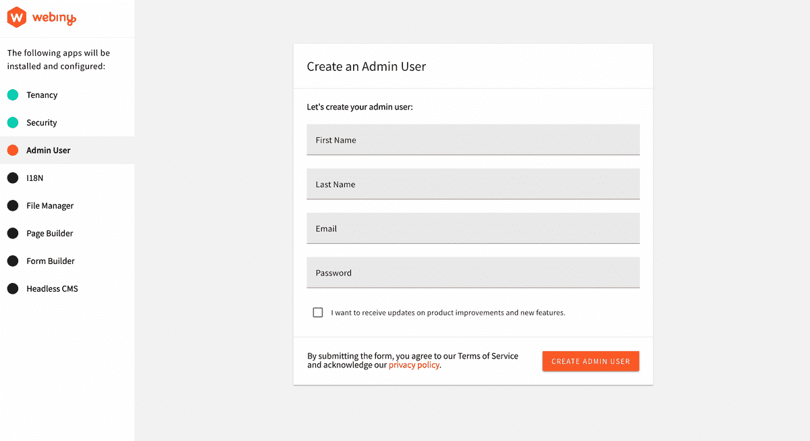
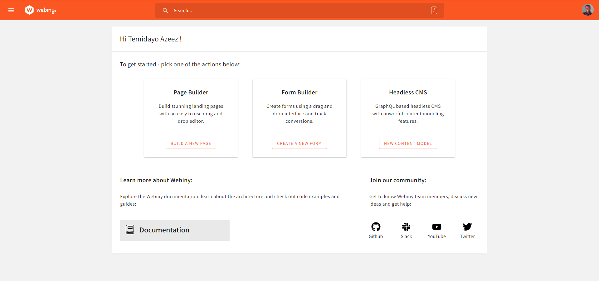
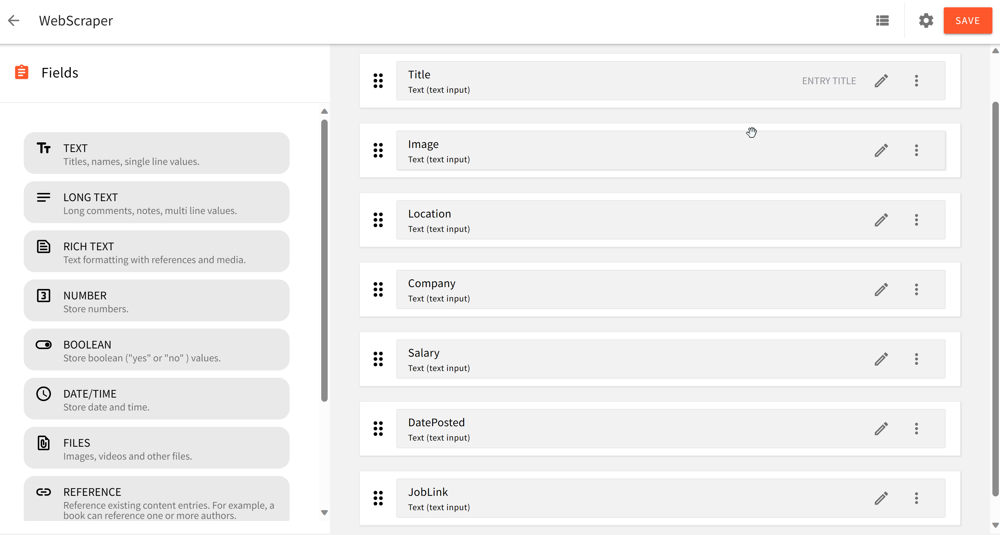
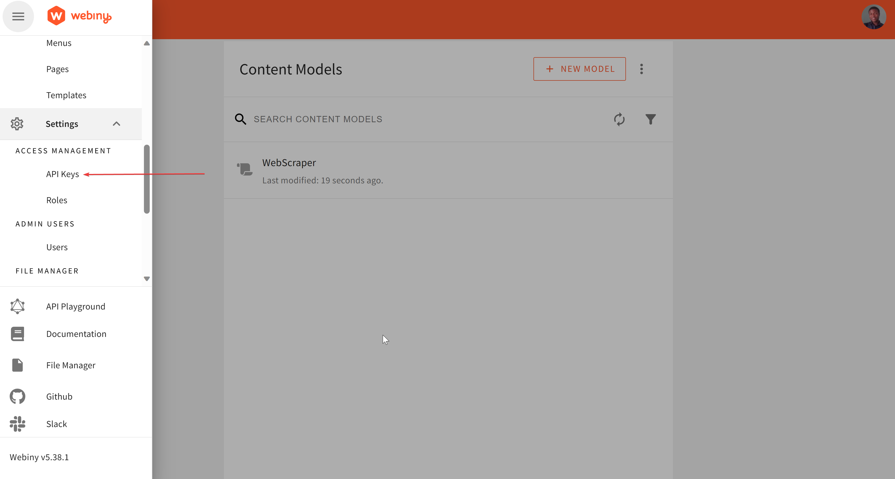
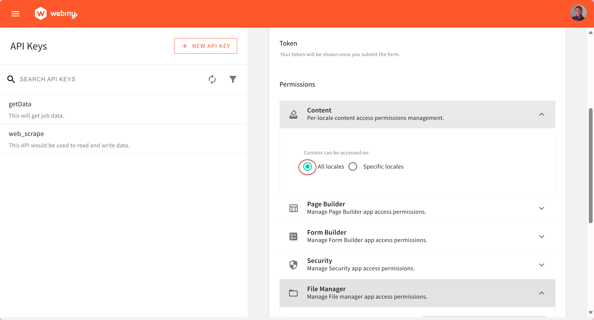
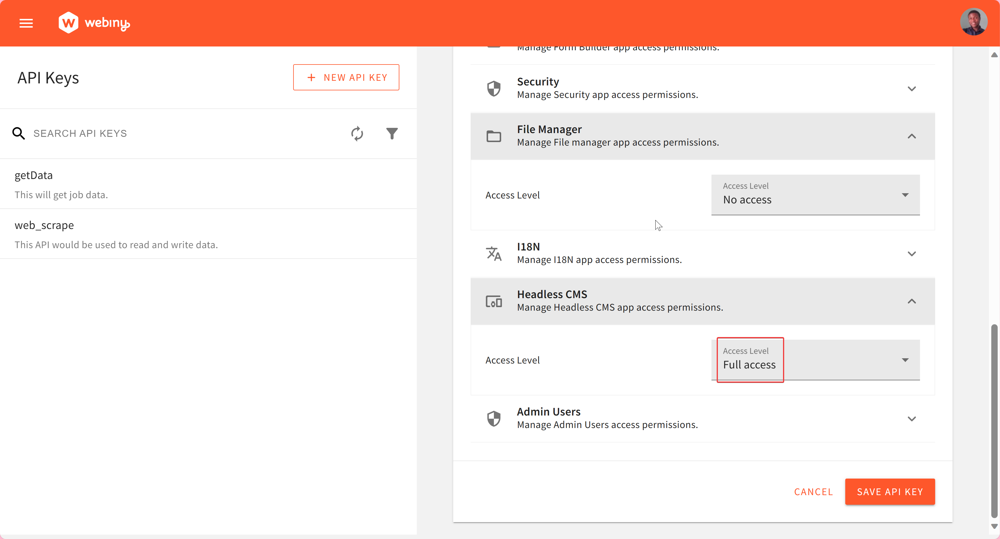
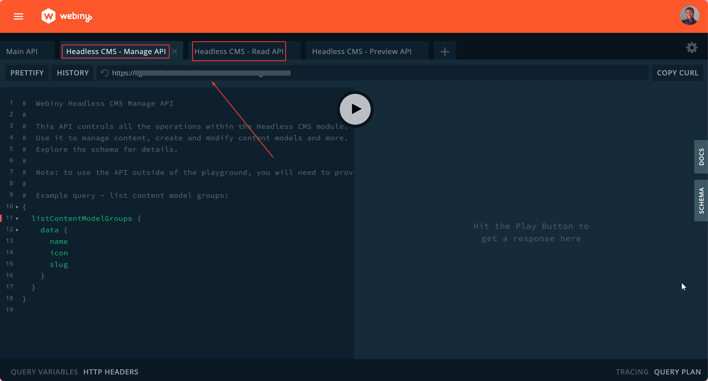
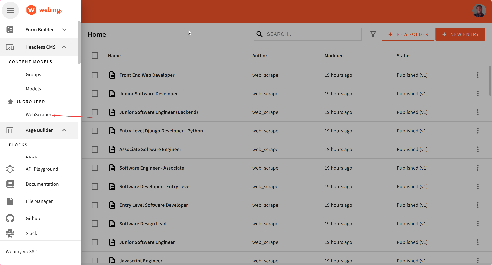

## Introduction

Web scraping is the extraction of information from websites. The process involves retrieving the web page and extracting valuable data from it. It can be used for various purposes like data collection, content aAggregation, monitoring and tracking, price comparison, etc.

In this tutorial, we'll learn how to use Puppeteer to scrape data from [Glassdoor](https://www.glassdoor.com/) website. We'll then save that data in Webiny Headless CMS. Later, we will consume this saved data from a React app. This tutorial is a step-by-step guide to putting Puppeteer, Webiny Headless CMS, and React together for web scraping and building applications with the extracted data.


## Prerequisites

- [Set up your AWS credentials locally](https://www.webiny.com/docs/infrastructure/aws/configure-aws-credentials)
- Ensure that you have [Node.js](https://nodejs.org/en/download/) >= 14.15.0 installed.
- Yarn ^1.22.0 || >=2 - Webiny CMS works with both yarn versions
- Basic understanding of Node.js and React
- [SyncFusion Community License Account or Paid Account](https://www.syncfusion.com/)
- Star our [GitHub Repo](https://github.com/webiny/webiny-js)! 😉

## Set Up a Webiny Project

The first step is to create a new Webiny project by executing the following command:

```jsx
npx create-webiny-project web-scraping
```

Your project ought to be automatically set up as a result. You will be asked to choose the AWS region and the database that your project will use for deployment. We will be utilizing DynamoDB for this project. Once the folder has been created, navigate to the folder and input the command below

```jsx
cd web-scraping && yarn webiny-deploy
```

With this, your project is created, and the application is deployed to your AWS account. Once deployed, you will see some of the URLs listed below in your terminal.

## Creating Content Models

Once you successfully deploy your Webiny project, copy and paste the Admin App link displayed in the terminal into your browser. If you accidentally close the terminal without copying the link, run the command below to access the URLs for your project.

```powershell
yarn webiny info
```

Once the Admin page is loaded in your browser, you will be required to create an Admin user. 



Thereafter, you will be required to install additional services or functions: 18N(Internationalization), File Manager, Page Builder, Form Builder, and the Headless CMS.

Once, the installation is done, you will be redirected to the dashboard:



Now, we can create a content model. Now, click on the **NEW CONTENT MODEL** in the Headless CMS card to create a new content model. For this tutorial, we will be creating one content model called **WebScraper**. You can leave the model as **Ungrouped** for now. This would be used to create and publish the scraped data in Webiny. In the content model interface, we would be creating seven (7) **text** fields under the content model:

- **Title** field for the title. In the Validators tab, set the value of **Title** to required.
- **Image** field for storing image URLs.
- **Location** field for storing geographical location.
- **Salary** field for storing salary range.
- **company** field for storing company name.
- **DatePosted** field.
- **JobLink** field.



## Create API Key

To successfully scrape and store data in Webiny, we need to create an API. Webiny provides an easy way to create an API and generate a token from its admin interface. 



In the API Keys interface, click on **NEW API KEY**. In the API form, type in your desired name and description. To configure the API key for Headless CMS access, scroll to **CONTENT** under **PERMISSIONS** and select `All-locales`. 



Under **HEADLESS CMS**, select  `Full Access` to allow for full read, manage, and preview operations. 

With that done, click **SAVE API KEY**. This would save your API key and generate the API token you will need later on to authorize read and write operations. 



Next, navigate to the **API Playground** This is needed to obtain the **API Endpoint** for manage and read access. 



Note the **Manage** and **Read API URLs**. They would be required later. With that said, we can now start writing our web scraping script!

## Writing the Web Scrape Script with Python and Nodejs Puppeteer

Create a parent directory, `webscraper`, to hold all code files. In `webscraper` create two sub-directories, namely, `backend` and `frontend`. The `backend` would hold our web scraping script, while the `frontend` would hold the frontend application that would be built using React. The frontend application would be used to consume the scraped data.

## Setting Up Backend

For this tutorial, we will be scraping job data from [Glassdoor](https://www.glassdoor.com/). First, create an account with Glassdoor as your `email` and `password` would be needed when scraping job data off Glassdoor.

### Prerequisites

The following dependencies are needed:

- Node ≥ v16.14
- Puppeteer
- Axios
- Dotenv

For the best result, ensure you are using the latest version of Node. In the `backend` directory, initialize a Node.js project using this command.

```powershell
npm init -y
```

Next, run this command, to install the project dependencies.

```powershell
npm install puppeteer axios dotenv
```

Next, create your `index.js` and `.env`. `index.js` would be used for the web scraping script, while, `.env` would be used for storing our Webiny API endpoint and authorization token. Your project directory should look like this:

```powershell
backend
.
├── .env
├── index.js
├── node_modules 
├── package-lock.json
├── package.json
```

In the `.env`, store your **Manage API** endpoint and authorization token. They would be loaded into `index.js` using `dotenv`. 

```powershell
GRAPHQL_API_ENDPOINT="YOUR WEBINY MANAGE API ENDPOINT"
API_TOKEN="YOUR AUTHORIZATION TOKEN"
```

In `index.js`, we would import the necessary dependencies and introduce an array of **user agents**. To prevent bot detection and trick Glassdoor into thinking our script is a real user, a list of user agents that rotates with each request would be needed. Also, as a necessary precaution, time delays would be added in to mimic real user interaction with web pages even more. 

```jsx
//index.js
const puppeteer = require('puppeteer');
const axios = require('axios');
require('dotenv').config();

const userAgents = [
    'Mozilla/5.0 (Windows NT 10.0; Win64; x64) AppleWebKit/537.36 (KHTML, like Gecko) Chrome/119.0.0.0 Safari/537.36 Edg/119.0.0.0',
    'Mozilla/5.0 (Macintosh; Intel Mac OS X 10_15_7) AppleWebKit/537.36 (KHTML, like Gecko) Chrome/119.0.0.0 Safari/537.36',
    'Mozilla/5.0 (Windows NT 10.0; Win64; x64) AppleWebKit/537.36 (KHTML, like Gecko) Chrome/119.0.0.0 Safari/537.36',
    'Mozilla/5.0 (Windows NT 10.0; Win64; x64) AppleWebKit/537.36 (KHTML, like Gecko)',
    'Mozilla/5.0 (Windows NT 10.0; Win64; x64) AppleWebKit/537.36 (KHTML, like Gecko) Chrome/119.0.0.0 Safari/537.3',
    'Mozilla/5.0 (Macintosh; Intel Mac OS X 10_15_7) AppleWebKit/537.36 (KHTML, like Gecko) Chrome/118.0.0.0 Safari/537.36'
];

const delayBetweenScrapes = 1000; // Adjust the delay time in milliseconds
const recordsPerDelay = 20; // Adjust the number of records to scrape before the delay
```

Next, we would be loading the API endpoint and token into `index.js`. Modify to include this:

```jsx
//index.js

...
// previous code goes above this
const graphqlApiEndpoint = process.env.GRAPHQL_API_ENDPOINT;
const apiToken = process.env.API_TOKEN;

if (!graphqlApiEndpoint || !apiToken) {
    console.error('Missing GraphQL API endpoint or API token in the .env file');
    process.exit(1);
}
```

Next, we would be adding in the main scraping function. The function loads, scrolls, and scrapes jobs from Glassdoor. Provide your Glassdoor login details here to enable access to the Job page. 

```jsx
//index.js

...
// previous code goes above this
const email = 'YOUR-GLASSDOOR-EMAIL'
const password = 'YOUR-GLASSDOOR-PASSWORD'

(async () => {
    const browser = await puppeteer.launch({ headless: false, args: ['--no-sandbox, '--disable-setuid-sandbox', '--disable-extensions'], });
    const page = await browser.newPage();

    let scrapedCount = 0;
    let jobData = [];
    let jobIdCounter = 1; // Initialize jobData array

    for (userAgent of userAgents) {
        try {

            await page.setUserAgent(userAgent);

            // Navigate to the Glassdoor homepage
            await page.goto('https://www.glassdoor.com/index.htm');
            // console.log(page.title())

            await page.waitForSelector('#inlineUserEmail');

            // Type the email address into the input field
            await page.type('#inlineUserEmail', email);

            // Click on the "Continue with Email" button
            await Promise.all([
                page.click('.emailButton button[data-test="email-form-button"]')
            ]);

            // Wait for the password input element to be present
            await page.waitForSelector('#inlineUserPassword');

            // Type the password into the input field
            await page.type('#inlineUserPassword', password);

            // Click the "Sign In" button
            await page.click('.gd-ui-button[data-size-variant="default"]');

            // Introduce a delay to ensure the sign-in action takes effect
            await delay(3000);

            // Navigate directly to the job page
            await page.goto('https://www.glassdoor.com/Job/index.htm');

            // Wait for necessary elements to load on the protected page
            await page.waitForSelector('#left-column');
            await page.waitForSelector('.JobsList_jobListItem__JBBUV');

            while (jobData.length <= 101) {
                // Scrape job data
                const scrapeJobData = async () => {
                    const jobs = await page.evaluate(() => {
                        const jobsArray = [];
                        const jobElements = document.querySelectorAll('.JobsList_jobListItem__JBBUV');

                        jobElements.forEach((jobElement) => {
                            const titleElement = jobElement.querySelector('.JobCard_seoLink__WdqHZ');
                            const companyElement = jobElement.querySelector('.EmployerProfile_employerName__Xemli');
                            const imageElement = jobElement.querySelector('.EmployerProfile_profileContainer__d5rMb img');
                            const datePostedElement = jobElement.querySelector('.JobCard_listingAge__KuaxZ');
                            const salaryElement = jobElement.querySelector('.JobCard_salaryEstimate___m9kY');
                            const locationElement = jobElement.querySelector('.JobCard_location__N_iYE');
                            const jobLinkElement = jobElement.querySelector('.JobCard_trackingLink__zUSOo');

                            const title = titleElement ? titleElement.textContent.trim() : 'N/A';
                            const company = companyElement ? companyElement.textContent.trim() : 'N/A';
                            const image = imageElement ? imageElement.src : 'N/A';
                            const datePosted = datePostedElement ? datePostedElement.textContent.trim() : 'N/A';
                            const salary = salaryElement ? salaryElement.textContent.trim() : 'N/A';
                            const location = locationElement ? locationElement.textContent.trim() : 'N/A';
                            const jobLink = jobLinkElement ? jobLinkElement.href : 'N/A';

                            jobsArray.push({ title, company, image, datePosted, salary, location, jobLink });
                        });

                        return jobsArray;
                    });
                    return jobs;
                };

                // Scrape initial job data
                jobData = await scrapeJobData();
                scrapedCount = jobData.length;

                // Check if the number of records scraped is a multiple of recordsPerDelay
                if ((scrapedCount - 1) % recordsPerDelay === 0) {
                    console.log(`Waiting for ${delayBetweenScrapes / 1000} seconds before the next batch...`);
                    await page.evaluate(() => {
                        const jobsListElement = document.querySelector('.JobsList_jobsList__Ey2Vo');
                        if (jobsListElement) {
                            const lastChild = jobsListElement.lastElementChild;
                            if (lastChild) {
                                lastChild.scrollIntoView({ behavior: 'smooth', block: 'end', inline: 'end' });
                            }
                        }
                    });

                    await delay(delayBetweenScrapes);
                };

                // Function to load more jobs by clicking the button
                const loadMoreJobs = async () => {
                    const loadMoreButton = await page.waitForSelector('.JobsList_buttonWrapper__haBp5 [data-size-variant="md"]');
                    if (loadMoreButton) {
                        await loadMoreButton.click();
                        // Wait for the additional jobs to load
                        await delay(5000);

                        // Scrape the new job data after loading more content
                        jobData = await scrapeJobData();

                        console.log(scrapedCount);
                    }
                };

                await loadMoreJobs()
            };

            // Map the job data to an object with jobId
            const mappedJobData = jobData.reduce((acc, job) => {
                acc[jobIdCounter++] = {  // Increment jobId for each job
                    title: job.title,
                    image: job.image,
                    location: job.location,
                    salary: job.salary,
                    company: job.company,
                    datePosted: job.datePosted,
                    jobLink: job.jobLink,
                };
                return acc;
            }, {});

            // Send data to GraphQL API
            await sendToGraphqlApi(mappedJobData);
      

            // Close the browser
            await browser.close();
        } catch (error) {
            console.error('An error occurred:', error.message);
        }
    }

})();

function delay(ms) {
    return new Promise(resolve => setTimeout(resolve, ms));
}
```

Next, we would create two functions to create and publish scraped jobs on Webiny. Creating job entries would be handled by `sendToGraphqlApi` while publishing job entries would be handled by `publishWebScraper`.

```jsx
//index.js

...
// previous code goes above this
async function sendToGraphqlApi(data) {
    try {
        for (const [jobId, job] of Object.entries(data)) {
            const response = await axios.post(
                graphqlApiEndpoint,
                {
                    query: `
                        mutation CreateWebScraper(
                            $title: String!, 
                            $image: String!, 
                            $location: String!, 
                            $salary: String!, 
                            $company: String!, 
                            $datePosted: String!, 
                            $jobLink: String!
                        ) {
                            createWebScraper(
                                data: {
                                    title: $title, 
                                    image: $image, 
                                    location: $location, 
                                    salary: $salary, 
                                    company: $company, 
                                    datePosted: $datePosted, 
                                    jobLink: $jobLink
                                }
                            ) {
                                data {
                                    id
                                    title
                                    image
                                    location
                                    salary
                                    company
                                    datePosted
                                    jobLink
                                }
                            }
                        }
                    `,
                    variables: {
                        title: job.title || '',
                        image: job.image || '',
                        location: job.location || '',
                        salary: job.salary || '',
                        company: job.company || '',
                        datePosted: job.datePosted || '',
                        jobLink: job.jobLink || '',
                    },
                },
                {
                    headers: {
                        Authorization: `Bearer ${apiToken}`,
                        'Content-Type': 'application/json',
                    },
                }
            );

            console.log(`JobId: ${jobId}, Id: ${response.data.data.createWebScraper.data.id},GraphQL API response:`, response.data);

            // Now, publish the created web scraper
            await publishWebScraper(response.data.data.createWebScraper.data.id);
        }
    } catch (error) {
        console.error('Error sending data to GraphQL API:', error.message);
        console.error('Error details:', error.response ? error.response.data : 'No response data');
    }
}

async function publishWebScraper(id) {
    try {
        const publishResponse = await axios.post(
            graphqlApiEndpoint,
            {
                query: `
                    mutation PublishWebScraper($id: ID!) {
                        publishWebScraper(revision: $id) {
                            data{
                                id
                            }
                           
                        }
                    }
                `,
                variables: {
                    id: id,
                },
            },
            {
                headers: {
                    Authorization: `Bearer ${apiToken}`,
                    'Content-Type': 'application/json',
                },
            }
        );
        console.log(publishResponse.data)
        return publishResponse.data;
    } catch (error) {
        console.error('Error publishing web scraper:', error.message);
        console.error('Error details:', error.response ? error.response.data : 'No response data');
        return null;
    }
}
```

With that done, we can run the script in the terminal.

```powershell
node index.js
```

Note that you might experience a `navigation timeout` error if you have a slow internet connection. However, this shouldn’t be a problem. Generally, depending on your internal connectivity, you might have to run the script once or a few times to execute it successfully.

Once, the script is successfully executed, you can check your Webiny Admin interface for the published job entries. You can access that by clicking on **WebScraper** in the sidebar.



With that done, we would build the frontend application to consume the scraped data.

## Setting Up Frontend

The frontend application would live in the `frontend` sub-directory. 

### Prerequisites

- Node ≥ v16.14
- SyncFusion
- Tailwind CSS
- Apollo Client

Use the latest version of Node for best results.

```powershell
nvm install 20
```

In the `frontend` directory, create a new React app, using this command:

```powershell
npx create-react-app job_board
```

Next, in `job_board`, we can install the other project dependencies. Run the command below to install the SyncFusion dependencies needed for the project. SyncFusion is a React UI component library that helps in speeding up code development. 

```powershell
npm install @syncfusion/ej2-base @syncfusion/ej2-buttons 
```

You need to create a SyncFusion account and obtain a `license key` to use SyncFusion. You can create a [Free Community Account](https://www.syncfusion.com/sales/communitylicense). It might take up to a week to get a license key. However, SyncFusion would provide you with a temporary license key to use in the meantime.

If your React app doesn’t include out-of-the-box, Tailwind configuration files (`tailwind.config.js` and `postcss.config.js`). Then, you want to install Tailwind and make the configuration.

To install, run this command:

```powershell
npm install tailwindcss postcss autoprefixer
```

To configure, run this command in the project root directory (`job_board`):

```powershell
npx tailwindcss init -p
```

Next, create a `postcss.config.js` in the root directory and add this in.

```jsx
module.exports = {
  plugins: {
    tailwindcss: {},
    autoprefixer: {},
  },
};
```

Next, ensure Tailwind is imported into your `index.css` in the root directory.

```jsx
/* styles/globals.css */
@import 'tailwindcss/base';
@import 'tailwindcss/components';
@import 'tailwindcss/utilities';

/* Your other styles go here */
```

Next, ensure `tailwind.config.css` is configured properly to include the necessary paths.

```jsx
/** @type {import('tailwindcss').Config} */
module.exports = {
  content: [
    './src/pages/**/*.{js,ts,jsx,tsx,mdx}',
    './src/components/**/*.{js,ts,jsx,tsx,mdx}',
    './src/app/**/*.{js,ts,jsx,tsx,mdx}',
  ],
  theme: {
    extend: {},
  },
  plugins: [],
}
```

Next, we would install Apollo Client. This would be used for handling API requests.

```jsx
npm install @apollo/client graphql
```

This is how your finished project directory should look. Throughout this tutorial, our focus will be mostly on the `src` directory. So go ahead and create the `api` , `components`, and `pages` directories, as well as their corresponding JSX files.

```powershell
frontend
└── job_board
    ├── README.md
    ├── .env.local
    ├── node_modules
    ├── package-lock.json
    ├── package.json
    ├── postcss.config.js
    ├── public
    ├── src
    │   ├── App.css
    │   ├── App.js
    │   ├── App.test.js
    │   ├── api
    │   │   ├── client.js
    │   │   └── scraper.js
    │   ├── components
    │   │   ├── HeroSection.jsx
    │   │   ├── JobCard.jsx
    │   │   ├── Search.jsx
    │   │   └── index.jsx
    │   ├── index.css
    │   ├── index.js
    │   ├── pages
    │   │   ├── JobList.jsx
    │   │   └── index.jsx
    │   ├── reportWebVitals.js
    │   └── setupTests.js
    └── tailwind.config.js
```

### Integrating Webiny CMS for fetching data using GraphQL and Apollo Client

In the `api` directory, we would configure the Job Board App for sending get requests to Webiny. In `client.js` , we would set up the API configuration. While `scraper.js` will hold the GraphQL query.

Update `client.js` with the code below. In this case, the API endpoint that would be used is the Webiny **Read API** copied from API playground in the Webiny Admin.

```jsx
//client.js

import { ApolloClient, InMemoryCache, createHttpLink } from '@apollo/client';
import { setContext } from '@apollo/client/link/context';

const httpLink = createHttpLink({
    uri: process.env.REACT_APP_GRAPHQL_ENDPOINT, //endpoint goes in here
});

const authLink = setContext((_, { headers }) => {
    const token = process.env.REACT_APP_GRAPHQL_TOKEN; //token goes in here

    return {
        headers: {
            ...headers,
            authorization: token ? `Bearer ${token}` : '',
        },
    };
});

const client = new ApolloClient({
    link: authLink.concat(httpLink),
    cache: new InMemoryCache(),
});

export default client;
```

Add the **Read API URL** and **Token** to `.env.local` in the root directory.

```jsx
REACT_APP_GRAPHQL_ENDPOINT = WEBINY_READ_API //naming of env variables must start with REACT_APP!
REACT_APP_GRAPHQL_TOKEN = WEBINY_TOKEN
```

Next, update `scraper.js` with the code below:

```jsx
// LIST_WEB_SCRAPERS_QUERY.js
import { gql } from '@apollo/client';

export const LIST_WEB_SCRAPERS_QUERY = gql`
  query webScraper {
    listWebScrapers (limit: 115) {
      data {
        title
        image
        location
        salary
        company
        datePosted
        jobLink
      }
    }
  }
`;
```

Next, we would modify `index.js` in the `src` directory to enable the API configuration we just created.

```jsx
//index.js

import React from 'react';
import ReactDOM from 'react-dom/client';   //import this!
import './index.css';
import App from './App';
import { ApolloProvider } from '@apollo/client'; //import this!
import client from './api/client';                 // import this!
import reportWebVitals from './reportWebVitals';

const root = ReactDOM.createRoot(document.getElementById('root'));
root.render(
  <ApolloProvider client={client}> {/*wrapping react with Apollo*/}
    <React.StrictMode>
      <App />
    </React.StrictMode>
  </ApolloProvider>

);
reportWebVitals();
```

With that done, the app is now ready to send API requests. We would make one last change to `index.js`. We would add in our SyncFusion license key. Update `.env.local` in the root directory by adding your license key.

```jsx
REACT_APP_LICENSE_KEY = LICENSE-KEY  //naming of env variables must start with REACT_APP
```

Then, modify `index.js` to include this:

```jsx
//index.js

....
import { registerLicense } from '@syncfusion/ej2-base';

// Register the license key
registerLicense(process.env.REACT_APP_LICENSE_KEY);

....
```

### Creating Routes for the Application

To create `routes` for our App, we would update the `App.js`.  For this app, we would define only one route. This would be the Job board page for displaying, searching`,` and filtering jobs.

```jsx
import React from 'react';
import { BrowserRouter as Router, Routes, Route } from 'react-router-dom';
import { JobList } from './pages'; //we would implement this!
import { HeroSection } from './components'; //we would implement this!

// Import Syncfusion CSS
import '@syncfusion/ej2-base/styles/material.css';
import '@syncfusion/ej2-buttons/styles/material.css';

const App = () => {
  return (
    <Router>
			<HeroSection />   {/*we would implement this!*/}
      <Routes>
        <Route path="/" element={<JobList />} /> {/*this is the route*/}
      </Routes>
    </Router>
  );
};

export default App;
```

## Creating Components and Pages

### Create a Job List Page

The Job List page displays a list of jobs that can be searched and filtered using job title, job location, company, and date posted. In `pages`, create `JobList.jsx`. It would hold the logic for the Job List page.

```jsx
// JobList.jsx
import React, { useEffect, useState } from 'react';
import { JobCard, Search } from '../components'; //we would implement this!
import { useQuery } from '@apollo/client';
import { LIST_WEB_SCRAPERS_QUERY } from '../api/scraper'; //import this!

const JobList = () => {
    const [jobs, setJobs] = useState([]);
    const [filteredJobs, setFilteredJobs] = useState([]);
    const [uniqueCompanies, setUniqueCompanies] = useState([]);
    const { loading, error, data } = useQuery(LIST_WEB_SCRAPERS_QUERY);

    useEffect(() => {
        if (data) {
            setJobs(data.listWebScrapers?.data || []);
            setFilteredJobs(data.listWebScrapers?.data || []);

            // Extract unique company names
            const companies = [...new Set(data.listWebScrapers?.data?.map((job) => job.company))];
            setUniqueCompanies(companies);
        }
    }, [data]);

    if (loading) {
        return <p>Loading...</p>;
    }

    if (error) {
        return <p>Error: {error.message}</p>;
    }

    const handleSearch = ({ searchTerm, locationFilter, companyFilter, datePostedFilter }) => {
        const filtered = jobs.filter((job) => {
            const titleMatch = searchTerm ? job.title.toLowerCase().includes(searchTerm.toLowerCase()) : true;

            if (titleMatch) {
                const locationMatch = !locationFilter || job.location.toLowerCase().includes(locationFilter.toLowerCase());
                const companyMatch = !companyFilter || job.company.toLowerCase().includes(companyFilter.toLowerCase());

                if (datePostedFilter === 'anytime') {
                    return locationMatch && companyMatch;
                }

                if (job.datePosted.includes('h')) {
                    // If 'h' is present, classify as "Last Day"
                    return locationMatch && companyMatch && datePostedFilter === 'lastDay';
                }

                if (job.datePosted.includes('d')) {
                    // If 'd' is present, convert to number
                    const numericValue = parseInt(job.datePosted);

                    if (numericValue < 1) {
                        return false; // Exclude jobs with non-positive numeric values
                    } else if (numericValue < 7) {
                        // Classify as "Last Week"
                        return locationMatch && companyMatch && datePostedFilter === 'lastWeek';
                    } else if (numericValue < 14) {
                        // Classify as "Last Two Weeks"
                        return locationMatch && companyMatch && datePostedFilter === 'lastTwoWeeks';
                    } else if (numericValue < 30) {
                        // Classify as "Last Month"
                        return locationMatch && companyMatch && datePostedFilter === 'lastMonth';
                    } else {
                        // Classify as "Last Two Months"
                        return locationMatch && companyMatch && datePostedFilter === 'lastTwoMonths';
                    }
                }

                // If no 'h' or 'd', default to numeric value
                return locationMatch && companyMatch;

            }

            return false;
        });

        setFilteredJobs(filtered || []);
    };

    return (
        <div className="container mx-auto px-16 py-8">
            <Search onSearch={handleSearch} uniqueCompanies={uniqueCompanies} />
            <div className="flex flex-wrap justify-start -mx-4 items-stretch">
                {filteredJobs.length > 0 ? (
                    filteredJobs.map((job, index) => (
                        <div key={index} className="w-1/4 mb-8 px-2">
                            <JobCard job={job} className="flex-1 h-full" />
                        </div>
                    ))
                ) : (
                    <p>No matching jobs found.</p>
                )}
            </div>
            <div className="flex justify-center mt-4">
                {/* Pagination component */}
            </div>

        </div>
    );
};

export default JobList;
```

Create an `index.jsx` in the `pages` directory. Add this:

```jsx
export { default as JobList } from './JobList';
```

### Create a Job Card Component

The Job Card component would contain the job data. It would be used to populate the Job List page. In the `components` directory, create `JobCard.jsx`, and modify it as given in the code below:

```jsx
//JobCard.jsx
import React from 'react';
import { ButtonComponent } from '@syncfusion/ej2-react-buttons';

const JobCard = ({ job }) => {
    return (
        <div className="max-w-md mx-auto mt-4 shadow-md rounded-md p-6 bg-white flex flex-col justify-between h-full">
            <div>
                
                <p className="text-xl font-semibold mb-2">{job.title}</p>
                <p className="text-gray-600 mb-2">{job.company}</p>
                <p className="text-gray-600 mb-2">{job.location}</p>
                <p className="text-gray-600 mb-2">{job.datePosted}</p>
                <p className="text-gray-600 mb-2">{job.salary}</p>
            </div>
            <ButtonComponent
                onClick={() => window.open(job.jobLink, '_blank')}
                target="_blank"
                rel="noopener noreferrer"
                isPrimary={true} 
                className="text-blue-500 hover:underline"
            >
                View Job
            </ButtonComponent>
        </div>
    );
};

export default JobCard;
```

### Create Search Component

The search component contains the logic for filtering job data. Create `Search.jsx` in the `components` directory.

```jsx
//Search.jsx
import React, { useState, useEffect } from 'react';
import { ButtonComponent } from '@syncfusion/ej2-react-buttons';

const Search = ({ onSearch, uniqueCompanies }) => {
    const [searchTerm, setSearchTerm] = useState('');
    const [locationFilter, setLocationFilter] = useState('');
    const [companyFilter, setCompanyFilter] = useState('');
    const [datePostedFilter, setDatePostedFilter] = useState('');

    useEffect(() => {
        // Clear company filter when uniqueCompanies changes
        setCompanyFilter('');
    }, [uniqueCompanies]);

    const handleSearch = () => {
        onSearch({
            searchTerm: searchTerm.trim(),
            locationFilter: locationFilter.trim(),
            companyFilter: companyFilter.trim(),
            datePostedFilter: datePostedFilter.trim(),
        });
    };

    return (
        <div className="flex justify-between items-center mb-4 space-x-4 p-4">
            <div className="flex space-x-4">
                <input
                    type="text"
                    placeholder="Search by title"
                    value={searchTerm}
                    onChange={(e) => setSearchTerm(e.target.value)}
                    className="border p-2"
                />
                <input
                    type="text"
                    placeholder="Filter by location"
                    value={locationFilter}
                    onChange={(e) => setLocationFilter(e.target.value)}
                    className="border p-2"
                />
                <div className="w-40">
                    <select
                        value={companyFilter}
                        onChange={(e) => setCompanyFilter(e.target.value)}
                        className="border p-2 rounded-md"
                        style={{ maxWidth: "10rem" }}
                    >
                        <option value="">Select company</option>
                        {uniqueCompanies.map((company, index) => (
                            <option key={index} value={company}>{company}</option>
                        ))}
                    </select>
                </div>
                <div className="w-40 ">
                    <select
                        value={datePostedFilter}
                        onChange={(e) => setDatePostedFilter(e.target.value)}
                        className="border p-2"
                    >
                        <option value="" disabled>Select Date Posted</option>
                        <option value="anytime">Anytime</option>
                        <option value="lastDay">Last Day</option>
                        <option value="lastWeek">Last Week</option>
                        <option value="lastTwoWeeks">Last Two Weeks</option>
                        <option value="lastMonth">Last Month</option>
                        <option value="lastTwoMonths">Last Two Months</option>
                    </select>
                </div>
            </div>
            <ButtonComponent
                onClick={handleSearch}
                cssClass="bg-blue-500 text-white p-2 rounded-md hover:bg-blue-600 focus:outline-none focus:ring focus:border-blue-400 transition"
            >
                Search
            </ButtonComponent>
        </div>
    );
};

export default Search;
```

### Create HeroSection Component

We would have a simple header for the App. Create `HeroSection.jsx` in the `components` directory.

```jsx
//HeroSection.jsx
import React from 'react';

const HeroSection = () => {
    return (
        <div className="bg-blue-500 text-white p-4">
            <div className="container mx-auto">
                <h1 className="text-2xl font-semibold">Web Scraping with Webiny</h1>
            </div>
        </div>
    );
};

export default HeroSection;
```

With that all done, create `index.jsx` in the `components` folder. Add this:

```jsx
export { default as JobCard } from './JobCard';
export { default as Search } from './Search';
export { default as HeroSection } from './HeroSection';
```

With that done, you can now run your Job Board App.

```jsx
npm start
```

## Conclusion

We have successfully built a Web Scraping with Webiny, Puppeteer, React, and SyncFusion. In this article we learn step-by-step how to put Puppeteer, Webiny Headless CMS, and React together for web scraping and building applications with the extracted data.

**Full source code:** https://github.com/webiny/write-with-webiny/tree/main/tutorials/webscraper-webiny
