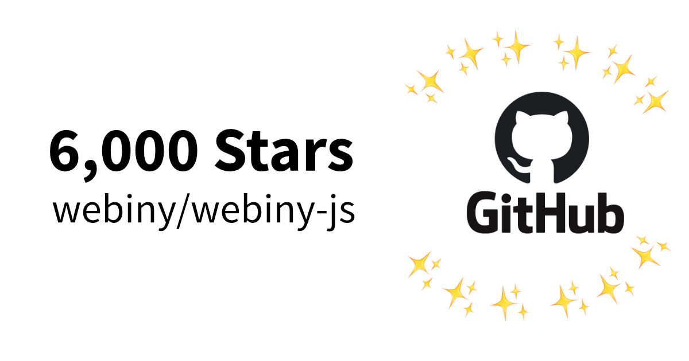
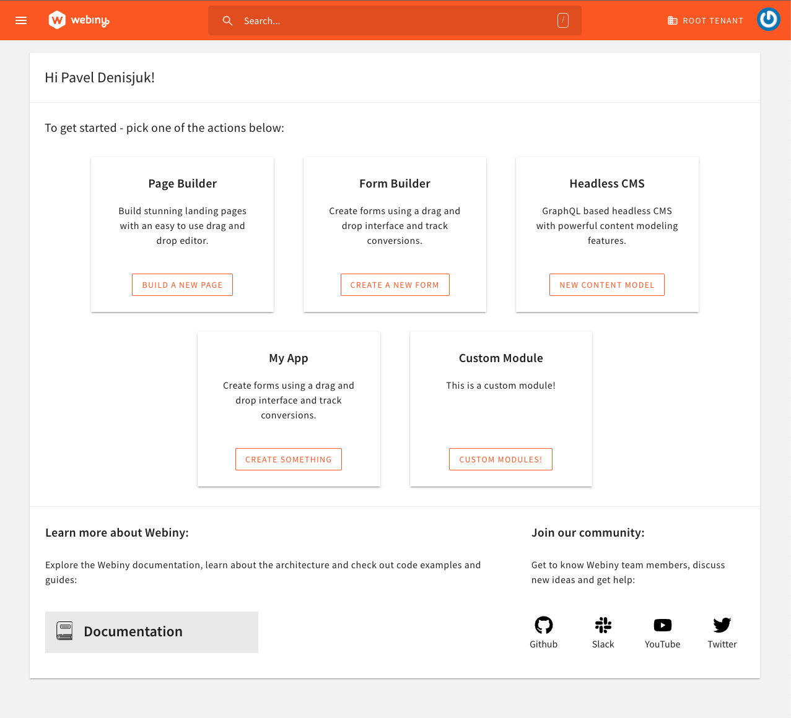
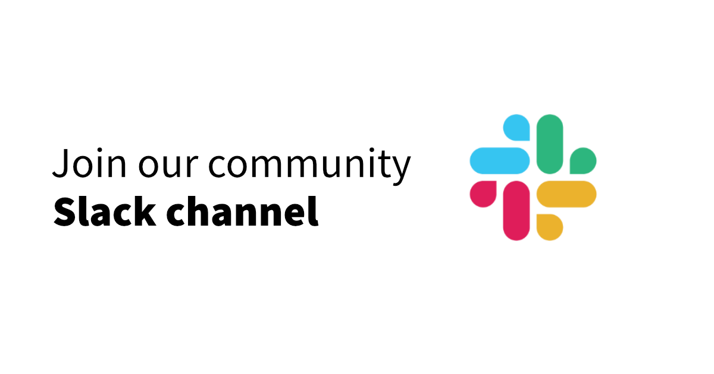

A new release, four new tutorials, and a GitHub star milestone! Welcome to the Webiny Month in Review newsletter.

## Six Thousand GitHub Stars

We did it. 6 thousand stars represents a huge milestone. Thank you to each and every one of you here in our community, you've really made a huge difference to us getting this far. 

Getting this many GitHub stars validates that we've got something really special here, and helps us see that people are really interested in the power of Serverless and in Webiny in particular

It's awesome to have you on this journey with us.

If you haven't already, [why not star our repo?](https://github.com/webiny/webiny-js/) It takes less than a minute and really helps us get noticed by other developers.

## Loads of New, Great Tutorials

Our community writer initiative is still going strong. Over the past 2 months we've featured articles from a variety of authors on a raft of popular frontend technologies. Here's some recent highlights:

- [Build a Blog with Remix](https://www.webiny.com/blog/build-blog-remix-webiny-headless-cms)
- [Build a ToDo app with React and Tailwind](https://www.webiny.com/blog/todo-application-react-tailwind-webiny-headless-cms)
- [Build a Blog with Next.js](https://www.webiny.com/blog/build-blog-nextjs-webiny-headless-cms)
- [Implement Pagination using Vue](https://www.webiny.com/blog/implement-pagination-webiny-headless-cms-vue)

As well as these beginner-friendly tutorials, we also published this more advanced tutorial for those looking to customize Webiny:

- [How to Build a Custom Field Plugin](https://www.webiny.com/blog/build-custom-field-plugin-webiny-headless-cms)

If there are any tutorials you'd like to see, whether it's an integration of your favorite technology, or some other aspect of Webiny, [please tell us by creating an issue in this GitHub repository](https://github.com/webiny/write-with-webiny/issues/new/choose).

## Webiny 5.32.0 was released

While it didn't bring any new features to the table, v5.31 did include a lot of fixes for issues that were reported by our community members and also a couple of issues that we discovered ourselves.

- 🐞 File Manager: Fixed file type plugin
- 🐞 Fixes to the CI/CD Scaffold
- 🐞 Fixed an issue with the webiny destroy command, where, in order for it to work correctly, a Webiny project application had to be previously deployed
- 🐞 Admin Area: Dashboard widgets are now rendered correctly if you have more custom widgets (see image below)

[See the full changelog on the docs site.](https://www.webiny.com/docs/release-notes/5.32.0/changelog)

We're carefully planning some pretty exciting major new features soon, which will probably be first announced [on our Slack channel](https://www.webiny.com/slack).

## YOU CAN HELP: Join our Slack community

Join our community to hear about new releases and product announcements as they happen!

