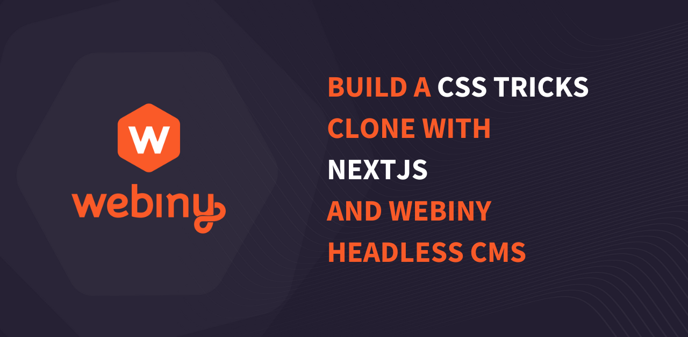
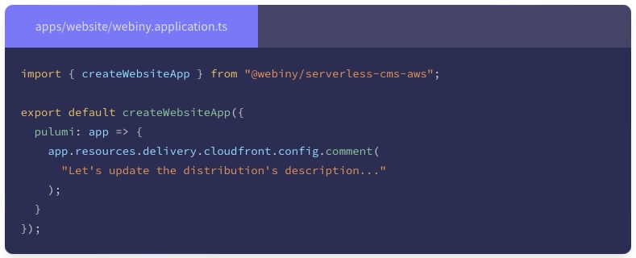
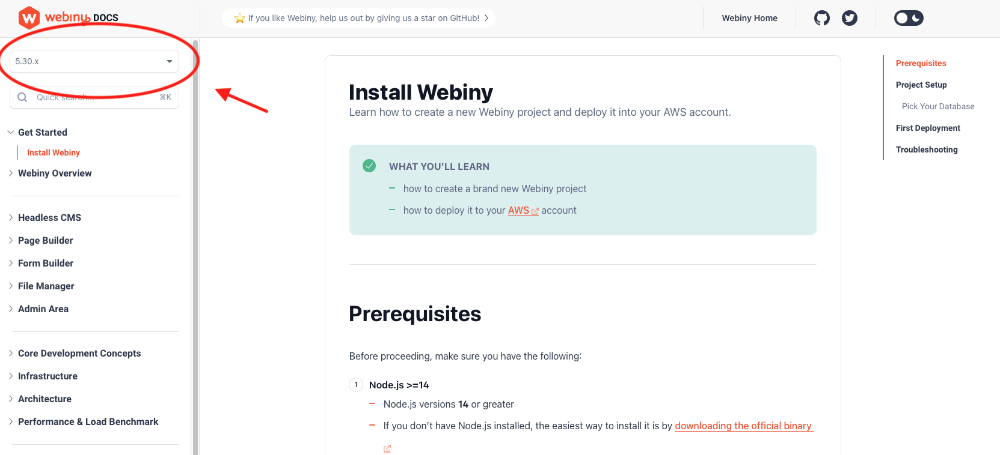

We've been busy. Very busy!! Here's some of the great things that we've been building this month.

## Guest authors contributed 4 new tutorials!

"Write with Webiny", our community writer initiative, has taken off a storm! Within a few days of announcing the scheme we had quite a number of new tutorials in progress. Each one shows how you can use Webiny as a headless CMS for a variety of tools including [Next.js](/blog/build-notes-app-nextjs-webiny-headless-cms), [Astro](/blog/build-blog-astro-webiny-headless-cms) and [Flutter](/blog/build-todo-app-flutter-webiny-headless-cms)!

Is there a technology you'd like to see featured? Is there some aspect of Webiny we haven't covered yet? If so [please suggest an article](https://github.com/webiny/write-with-webiny/issues/new/choose).

## Webiny 5.30.0 was released

This release adds a couple of features and bug fixes that pave the way for even greater things to come!

✅ We upgraded to RMWC V7. The person behind RMWC has reactived the project allowing us to make this update. Hopefully you won't notice too much that's different with this one though it does finally open the door to upgrade to newer versions of React in the upcoming releases.

✅ You can now click to add fields in the Page Builder. Drag and drop is sometimes a bit difficult to use and challenging to test, so we added this functionality to make it easier.

✅ New Projects now use Typescript 4.7.4. This change will only apply to the new projects created starting with version 5.30.0. Existing projects remain intact, and will work just fine.

🐞 We’ve also fixed a bug that would prevent users from amending the default infrastructure (Pulumi) code, so you can now edit your infrastructure like this:

<ExternalLink href="https://www.webiny.com/docs/release-notes/5.30.0/changelog">See the full changelog on the docs site</ExternalLink>

We're planning some really nice features in the near future, so stay tuned for version 5.31.0 which will be out in a few weeks time.

## Docs site version switcher added

We used some cool packages we had already built for use with Webiny to add a version switcher on the docs site. This was a challenge because we didn't want to manually copy all of the files for each version; instead we use our [React Composition](https://npmjs.com/package/@webiny/react-composition) package and a new package called [React Properties](https://www.npmjs.com/package/@webiny/react-properties) to merge the pages and have version-specific navigation. 

Now you can select the version of Webiny you have installed and see all of the documentation content specific to that version. Check it out!

## YOU CAN HELP: Star our GitHub Repo!

Competition in the Headless CMS space is fierce, and even though Webiny is the best CMS out there, even with our earnest efforts, we wouldn't get noticed if it wasn't for your support!

Thank you so much for starring [webiny/webiny-js](https://github.com/webiny/webiny-js) on GitHub, it really helps other people discover us!

