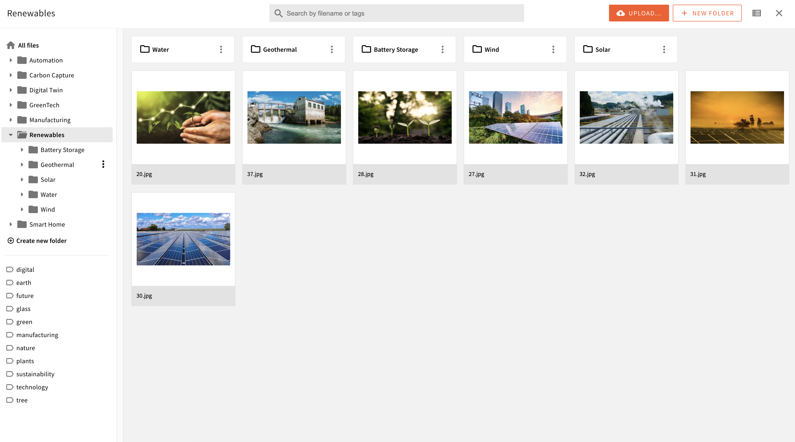

We are thrilled to announce the release of our latest Webiny version 5.36.0. This time we are pushing this major release off-cycle, because we would like to introduce the Advanced Content Organisation (ACO) for File Manager and a few other File Manager enhancements as soon as possible. We have received great feedback on the Page Builder ACO and we would love to offer you this feature before the end of Quarter 2. We believe that version 5.36 represents a significant step forward for File Manager, and we are excited to share it with our customers even though it is not the usual size of our major releases.

**What can you expect from version 5.36.0?** 

Here are the highlights:

- Advanced Content Organization for File Manager allows users to arrange files in folder structures:

We have kept the older Grid View and we have added the Table View which allows users to see more information about the file itself. The users can easily switch between the two views using the button in the top right corner:

<video width="800px" height="auto" controls autoplay>
  <source src="./assets/webiny-v5.36.0-release/switch.mp4" type="video/mp4" />
</video>

We will be developing this Table View further in the following releases, allowing users to sort and filter the records there. At the moment you can sort using the “Name” and “Last Modified” column.

<video width="800px" height="auto" controls autoplay>
  <source src="./assets/webiny-v5.36.0-release/sort.mp4" type="video/mp4" />
</video>

 Users can also move files between folders:

<video width="800px" height="auto" controls autoplay>
  <source src="./assets/webiny-v5.36.0-release/move.mp4" type="video/mp4" />
</video>

Moving files across folders have no impact on the file URL to negate any impact on the SEO.

- File upload progress bar to keep track of the percentage completion:

- Multi-part upload is now in place to enable users to upload larger files in File Manager up to 5 TB!! We still kept a maximum size limit option in the settings in case you would like to stop your Webiny users from uploading gigantic files. You can adjust this limit from the File Manager Settings:

<video width="800px" height="auto" controls autoplay>
  <source src="./assets/webiny-v5.36.0-release/max-size.mp4" type="video/mp4" />
</video>

For the detailed change log click **[here](https://www.notion.so/Introducing-Our-Latest-Release-Version-5-36-0-e88a166399024313a62c341c59ad8c26)**, and for upgrade instructions **[here](https://www.webiny.com/docs/release-notes/5.36.0/upgrade-guide)**.

We're confident that these new improvements will benefit your workflow.  But we're not stopping here - we're already working on new ideas and features for release 5.37 which will take the searching and metadata capture to greater heights. Stay tuned and let us know what you think about our [roadmap](https://github.com/orgs/webiny/projects/5/views/7).

