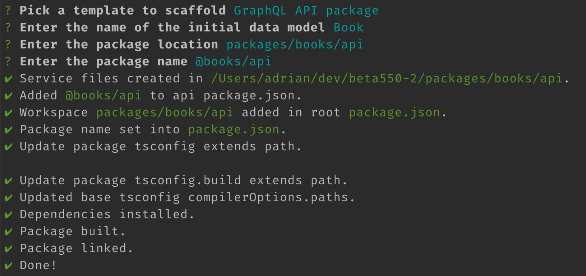
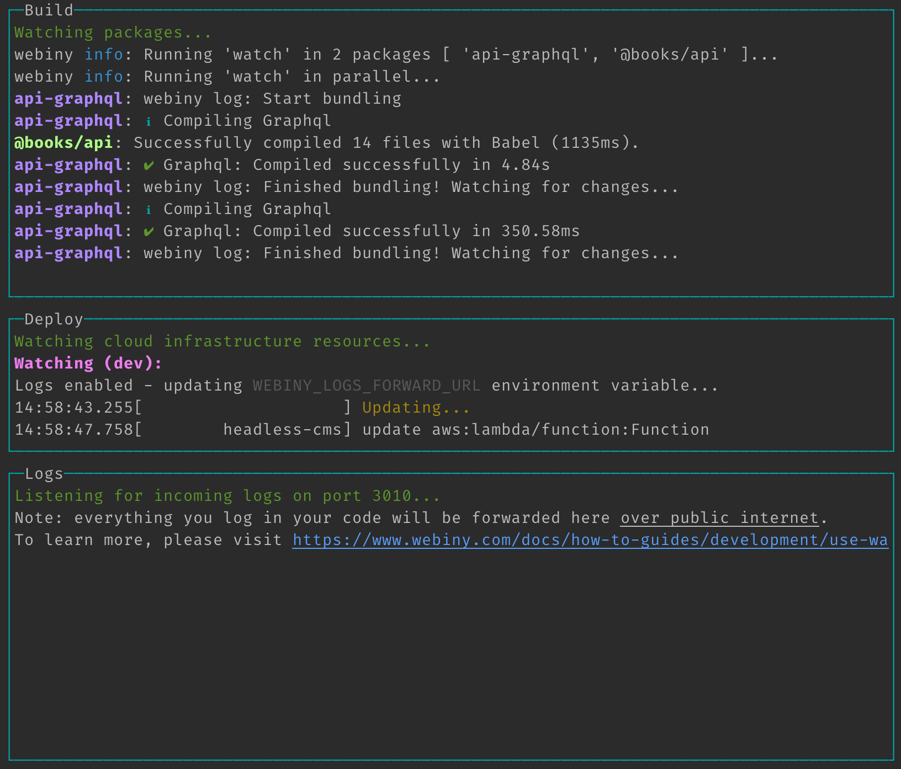
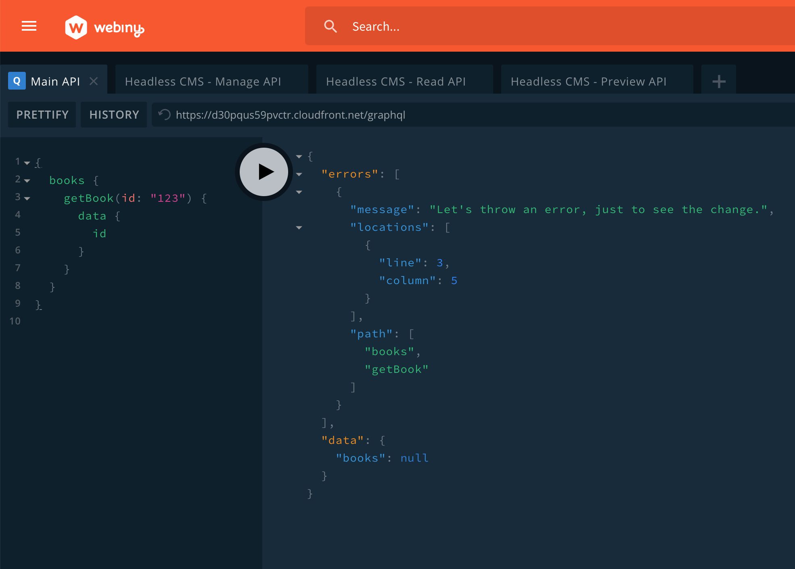

<iframe width="844" height="475" src="https://www.youtube.com/embed/leKEVVUPrEs" frameborder="0" allow="accelerometer; autoplay; clipboard-write; encrypted-media; gyroscope; picture-in-picture" allowfullscreen></iframe>

<br/>

With the new [Webiny 5.5.0 release](https://www.webiny.com/docs/changelog/5.5.0), we introduced the brand new `webiny watch` command, which, we believe, will bring the development experience to a whole new level!

That's why, in this blog post, we wanted to give you a short overview of the command's most important features and also, do a quick demo on an existing Webiny project, so you can get a better feel of how it all works.

So, without further ado, let's dive in!

## Overview

The following is a short overview of the newly introduced `webiny watch` command's most important features.

### One Command To Rule Them All

Prior to **5.5.0** release, when starting up watch processes within a Webiny project, different approaches needed to be used, depending on the type of application we were working with.

For example, if we wanted to expand the default Webiny Admin Area frontend (React) application, we'd have to navigate to its folder (`apps/admin/code`), and run the following command:

```bash
yarn start --env {env}
```

On the other hand, if we were expanding the default GraphQL API, that's deployed as part of the **API** project application (located in the `api` folder in your Webiny project), we'd utilize the `webiny workspaces run` command, upon which we'd specify all of the relevant packages:

```bash
yarn webiny workspaces run watch --scope api-graphql --scope @car-manufacturers/api
```

The question we asked ourselves here is - can we use a single approach (command) in both of these scenarios?

Furthermore, having developers focus their attention on packages, instead of higher-level project constructs - project applications, really isn't the best way to approach application development. This is simply because, as the number of packages starts to grow in a Webiny project, it gets harder and harder for developers to track what are the relevant packages of a project application they're currently developing.

So once again, we asked ourselves - instead of starting watch sessions on particular packages in a Webiny project, wouldn't it be just easier if we could initiate a watch session on a complete project application?

> Every Webiny project consists of project applications and packages. Take a look at our [Project Organization](https://www.webiny.com/docs/key-topics/project-organization/project-applications-and-packages) key topics section to learn more.

The answer to both of these questions is - yes! So, with the new `webiny watch` command, no matter of the type of the application you're working on, you'll always be using the same approach. You simply run the following `webiny watch` command, and from that point, everything is automatically handled for you:

```bash
yarn webiny watch {project-application-folder} --env {env}
```

Having a single command to cover all of the development needs certainly helped in making a better developer experience, but, there were still a few things that we felt were missing here.

### Automatic Re-deployments

While developing backend (serverless) applications, another problem our users faced are continuous code re-deployments.

In short, everytime we wanted to quickly see our code change running in the actual cloud, we'd have to execute a separate [`yarn webiny deploy`](https://www.webiny.com/docs/how-to-guides/deployment/deploy-your-project) command, and wait for it to deploy the new code.

Not only running this command manually can quickly become cumbersome, another problem is that this command was never meant to be used as a way to continuously deploy a subset of cloud infrastructure resources. When executing it, you're actually attempting to deploy the complete cloud infrastructure stack, which is pretty much redundant, because, while developing, essentially we're just changing code of a single AWS Lambda function.

Luckily, with the help of Pulumi, the default infrastructure as code (IaC) framework that is [shipped with every Webiny project](https://www.webiny.com/docs/key-topics/deployment/iac-with-pulumi), we were able to make this operate in a much more efficient and seamless way.

So, from now on, starting a new watch session on one of your project applications and performing code changes will result in only the relevant cloud infrastructure resources to be re-deployed. And of course, everything happens automatically! No need to manually run the mentioned `yarn webiny deploy` command anymore!

### Logs

The last thing we wanted to try to improve is logging.

While watching and developing project applications, it's not unusual to debug certain code issues by checking the values of one or more variables at runtime.

If not using the native Node.js debugger, usually we tend to place one or more `console.log` calls in our code and then run the application again (for example, a specific GraphQL query). And although in serverless environments this is possible, when it comes to actually reading the logged data, the developer experience has shown to be a bit cumbersome and really not that straightforward.

That's why, upon running the `webiny watch` command, by simply appending the `--logs` argument, you can have all of your `console.log` calls stream logged data directly to your terminal. No more digging through [Amazon CloudWatch](https://aws.amazon.com/cloudwatch/) and dozens of AWS Lambda function logs, just to find the output of a single `console.log` call!

## Demo

Alright, now that we've outlined the most important features of the new `webiny watch` command, it's time for a short demo!

Since there are some specifics between the two, we're going to divide this demo into two parts - backend and frontend development.

### Backend Development
 For this part, let's say we wanted to expand the default GraphQL API, that's deployed as part of the **API** project application (located in the `api` folder in your Webiny project).

> Learn more about the **API** project application on the cloud infrastructure level in our [Cloud Infrastructure](https://www.webiny.com/docs/key-topics/cloud-infrastructure/api/introduction) key topics section.

To to that, we can start off by utilizing one of the built-in scaffolding utilities. So, in our project root, let's run the following command:

```bash
yarn webiny scaffold
```

From there, we first need to select the **GraphQL API Package** from the initial menu, and, for the purpose of this demo, we can go with the default **Book** as the initial model name, and also just use the default values for all of the questions that follow.



Once the scaffolding has been completed and we've followed the extra steps that were provided for us, it's time to see the `webiny watch` command in action.

In our terminal of choice, we can run the following command:

```bash
yarn webiny watch api --env dev --logs
```

But, before we do it, let's point out a couple of things.

First, note that we've appended the `--logs` argument at the end of the command. With it, as you might've already guessed, we're enabling the logs forwarding feature, that we mentioned earlier (by default, this feature is not enabled).

Secondly, we should be aware of the fact that the **API** project application contains much more than just the GraphQL API, which we aim to extend in this demo. That's why, running the `webiny watch` command on the whole project application doesn't make much sense here. It is more efficient for us to start the watch session only for the GraphQL API related code.

So, in order to do that, we can specify the exact subfolder within a project application that we want to watch, like so:

```bash
yarn webiny watch api/code/graphql --env dev --logs
```

Once we've run this command, we should receive the following in our terminal:



As we can see in the **Build** pane, two packages are being watched for code changes - the `api-graphql` and `@books/api`. Have in mind that we didn't specify these packages anywhere, it's what the `webiny watch` command automatically detected for us. Next, in the **Deploy** pane, we can see the status of all active deployments, where currently, we're in the middle the `headless-cms` AWS Lambda function update process. Finally, the **Logs** pane is where all of our logs will be streamed.

So, let's try making a simple change in one of the files that were scaffolded for us. Let's open the `getBook` GraphQL resolver function (`packages/books/api/src/resolvers/getBook.ts`), and at the very beginning, do the following:

- try logging some data so that we can see it get streamed to our terminal
- immediately throw an error, which we should receive upon issuing the `getBook` GraphQL query, after our code was automatically re-deployed

```ts
import { Response, NotFoundResponse } from "@webiny/handler-graphql";
import { utils } from "../utils";
import { ApplicationContext, GetBookArgs, ResolverResponse, Book } from "../types";

const getBook = async (
    _,
    args: GetBookArgs,
    context: ApplicationContext
): Promise<ResolverResponse<Book>> => {
    // A simple console.log call - all arguments will be streamed to our terminal.
    console.log("This will be streamed...", "This too...", 123);

    // For demonstration purposes, let's throw an error and, by issuing a new getBook GraphQL query,
    // see if our code change has been detected and automatically re-deployed.
    throw new Error("Let's throw an error, just to see the change.");

    // The rest of the resolver function code has been removed for brevity.
};

export default getBook;
```

And this is where the magic happens! By saving the change, the re-deployment should automatically kick in, and in a couple of seconds, running the `getBook` GraphQL query via the API Playground from the Webiny Admin Area, should give us the following response:



And, in our terminal, we should also see the following output in the **Logs** pane:


Pretty cool, right? It's almost like we're doing the good old local development, where all of the code changes we perform, are immediately reflected on our locally running server.

Now, let's move on to frontend development, and see how we can use the new `webiny watch` command there.

> To learn more about API development, please take a look at our [API Development](https://www.webiny.com/docs/tutorials/create-an-application/api-package) tutorial.

### Frontend Development

With the **API** project application, which we've had the chance to visit in the section above, every Webiny project also contains the **Admin Area** and **Website** project applications, which contain the Webiny Admin Area and public website React applications.

How do we start a new watch session if we wanted to expand these? Well, we use the exact same approach we've used in order to expand the **API** project application.

So, in our terminal of choice, we can just run the following commands:

```bash
# Start watching Admin Area project application and all of the relevant packages.
yarn webiny watch apps/admin --env {env}

# Start watching Website project application and all of the relevant packages.
yarn webiny watch apps/website --env {env}
```

Now, if you were to run one of these, you might notice that there is no **Deploy** nor **Logs** pane in the terminal, only **Build**. For example:


This is because these project applications represent React applications. In order to develop these, we don't need automatic re-deployment nor the logs forwarding feature. Simply put, frontend development can still be performed locally. Then, once we're ready to deploy our application to the actual cloud, we can do that via the [`webiny deploy`](https://www.webiny.com/docs/how-to-guides/deployment/deploy-your-project) command, which we've already mentioned in this post.

But in terms of the overall development process, everything stays the same. Here we could also start off by simply scaffolding a new **Admin Area** module, completing the extra steps that were provided for us, and finally, by running the shown `webiny watch` commands, start developing our application.

> To learn more about expanding the Webiny Amin Area, please take a look at our [Admin Area Development](https://www.webiny.com/docs/tutorials/create-an-application/admin-area-package) tutorial.

## Conclusion

And that wraps it up!

With the newly introduced `webiny watch` command, we really hope we've made it easier for developers to perform both backend and frontend application development.

If you'd like to learn more about it, feel free to check our official [Use the Watch Command](https://www.webiny.com/docs/how-to-guides/development/use-watch-command) guide. Also, if you have any additional questions or comments, feel free to give us a ping over at our official [Slack](https://www.webiny.com/slack) channel.


---

Thanks for reading! My name is Adrian and I work as a full stack developer at [Webiny](https://www.webiny.com). In my spare time, I like to write about my experiences with some of the modern frontend and backend web development tools, hoping it might help other developers. If you have any questions, comments or just wanna say hi, feel free to reach out to me via [Twitter](https://www.twitter.com/doitadrian).
