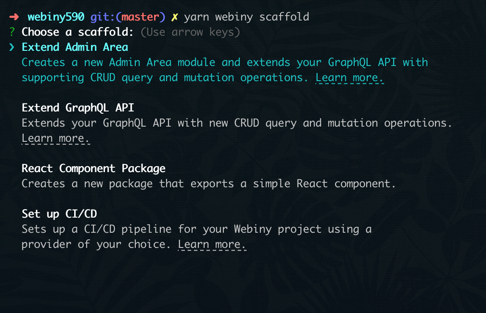
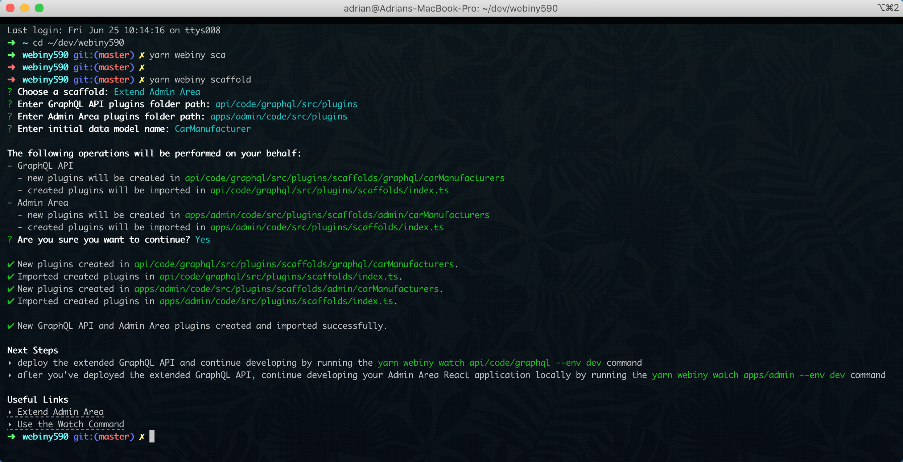

<iframe width="844" height="475" src="https://www.youtube.com/embed/leKEVVUPrEs" frameborder="0" allow="accelerometer; autoplay; clipboard-write; encrypted-media; gyroscope; picture-in-picture" allowfullscreen></iframe>

<br/>

With the recent [Webiny 5.9.0](https://www.webiny.com/docs/changelog/5.9.0) release, we've introduced a number of new fixes and improvements, one of which are the improvements made to the existing scaffolding utilities and development workflows. Revisiting these was something we had on our wishlist for quite some time now, and, with this release, we were finally able to do it.

In this blog post, I wanted to go through some of the more important changes that were introduced. For starters, we're going to take a look at some of the existing issues our users were struggling with and how we've managed to resolve them. Then, in the second part of this blog post, in a short demo, we're also going to see the improved scaffolding utilities and development workflows in action.

So, without further ado, let's dive in!

## Existing Issues

The following issues are listed in no particular order.

### 1. Complex ElasticSearch Setup

Prior to Webiny 5.9.0, the **GraphQL API Package** scaffold (now **Extend GraphQL API**) relied on both [Amazon DynamoDB](https://aws.amazon.com/dynamodb/) and [Amazon Elasticsearch Service](https://aws.amazon.com/elasticsearch-service/) for storing and querying data. And although having Elasticsearch in the mix does provide advanced searching capabilities, in most cases, users actually didn't have a real need for it.

So, we decided to simplify things, by simply removing Elasticsearch, and have the new **Extend GraphQL API** generate application code that relies exclusively on Amazon DynamoDB, while maintaining the same feature set.

Sure, there are certainly times when you have to be a little bit *creative* when it comes to DynamoDB (NoSQL) data modeling. But, for developers that at least have some experience and maybe already have a couple of tricks up their sleeves, we believe that this setup will be enough for a good number of use cases.

Note that developers are still able to utilize Elasticsearch or any other database they might need along the way. This is something we plan to cover with one or more tutorials in the near future.

### 2. Manual Steps

One of the complexities that the existing **GraphQL API Package** scaffold brought with its *dual databases* setup was the additional manual step that needed to be taken. After the scaffolding process has been completed and the new application code has been deployed into the cloud, users were still required to manually execute a special GraphQL `install` mutation. Without completing this step, basically, none of the new GraphQL operations would work.

Furthermore, the application code, or more specifically, the plugins that were generated during both **GraphQL API Package** and **Admin Area Package** scaffolding processes, needed to be manually imported and registered by users, in their existing application code. And even though for many this step wasn't such a big hurdle, we still wanted to see if this is something we could eliminate from the whole process.

All in all, because of the fact that manual steps like these introduce an unnecessary friction in the overall user experience, we decided to try and make the whole process completely automatic. And I'm happy to say that we've managed to accomplish that, for both **GraphQL API Package** and **Admin Area Package** scaffolds!

Once the scaffolding has been completed, all that's left to do is start a new watch session via the [`webiny watch`](https://www.webiny.com/docs/how-to-guides/webiny-cli/use-watch-command) command and that's it! You can immediately start building on top of the generated application code.

We'll see how all of this works in the demo soon, in the second part of this blog post.

### 3. Monorepo Hurdles

Every Webiny project is organized as a [monorepo](https://www.webiny.com/docs/key-topics/project-organization/monorepo-organization):

> Every Webiny project is organized as a monorepo. This essentially means your project is organized as a collection of multiple NPM packages, or, in the context of monorepos, multiple workspaces.

And although this organization does provide a couple of useful capabilities, like creating packages that can be shared across multiple [packages](https://www.webiny.com/docs/key-topics/project-organization/project-applications-and-packages) or even [project applications](https://www.webiny.com/docs/key-topics/project-organization/project-applications) within a Webiny project, it does bring a noticeable amount of complexity.

Specifically, prior to Webiny 5.9.0, existing **GraphQL API Package** and **Admin Area Package** scaffolds would generate new application code as separate packages, by default in the `packages` folder, located in your project root. And while technically this works, in many ways, this approach turned out to be a very cumbersome one.

The first problem with it was that it makes your application code dislocated. In other words, your GraphQL API application code, located in [`api/code/graphql`](https://github.com/webiny/webiny-js/tree/v5.9.0/packages/cwp-template-aws/template/api/code/graphql) folder, would end up importing packages from the outside `packages` folder. For some users, we've seen this can be illogical and sometimes even hard to grasp. The question that was frequently asked was: "Why not have all of the code simply in one place?".

More importantly, this *separate packages* approach also introduced really unnecessary development-related complexity. Numerous times we've seen users scratching their heads and asking themselves "I've made a code change, but it's not reflected in my application, what's happening?". In most cases, this simply happened because of the fact that upon initializing the `webiny workspaces run watch` command, users didn't add their newly generated package to the list of packages that needed to be watched, for example:

```bash
yarn webiny workspaces run watch --scope @car-manufacturers/api --scope @car-manufacturers/utils ...
```

Oh and by the way, on a totally unrelated note, just look at the command itself... that definitely doesn't look very appealing. 😉

On this front, we actually did made some good progress with the [`webiny watch`](https://www.webiny.com/docs/how-to-guides/webiny-cli/use-watch-command), introduced with [Webiny v5.5.0](https://www.webiny.com/docs/changelog/5.5.0) release. But, unfortunately, different `Module not found: Can't resolve 'custom-plugins' in ...` and other monorepo organization-related errors were still giving users headaches.

Based on all of this feedback that we've received from our users, we've come to a conclusion that, where possible, all scaffolds should generate new application code directly within the target project application's package. For example, if we're talking about the **Extend GraphQL API** scaffold, the application code should generate code within the `api/code/graphql` folder. On the other hand, when talking about the **Extend Admin Area** scaffold, the generated Admin Area React application code should be located within the `apps/admin/code/` folder.

By doing this, we've removed all of the mentioned hurdles for our users. No more dislocated code, weird monorepo and yarn-related errors, and probably, other annoying issues that maybe we were not even aware of.

### 4. Two Scaffolds For a Single Task

Previously, because the **Admin Area Package** scaffold would only generate the Admin Area React application code, in order to get a new fully functioning Admin Area module, users also had to run the **GraphQL API Package** scaffold, which was responsible for creating the supporting GraphQL API query and mutation operations.

So, if users forgot or simply weren't aware of the fact that both scaffolds needed to be run in order to complete the puzzle, they would end up with an incomplete or sometimes even broken setups. The latter was especially the case if they just ran the first **Admin Area Package** scaffold.

So, in order to make the whole process more straightforward and improve the overall user experience, we've simply incorporated both pieces into the **Extend Admin Area** scaffold. Once run, it will generate both the Admin Area React application code, and supporting GraphQL query and mutation operations on our GraphQL API.

Oh and by the way, note that if we just wanted to expand the existing GraphQL API, without creating a new in the Admin Area React application, we can still just use the **Extend GraphQL API** scaffold. Fun fact: internally, the **Extend Admin Area** actually relies on the **Extend GraphQL API** scaffold to generate the supporting GraphQL query and mutation operation.

### 5. Complex Testing Workflows

There a couple of different types of tests we can write and perform in order to ensure our application works as expected. And, if we were to single out the three most common ones, we could probably go with unit, integration, and end-to-end tests.

I won't go into the specifics and differences between these in this blog post (we have a brief summary [here](https://www.webiny.com/docs/key-topics/ci-cd/testing)), but I will mention that performing these tests in the serverless applications world can certainly have its challenges. And this is mostly because, in order to achieve the highest level of confidence that our application works, ideally, we would want to perform our tests against real, previously deployed, cloud infrastructure resources. Not against locally running services, mocks, or any other "emulation" tools we can utilize today.

This is something we recognized needs to get more clear with the new **Extend GraphQL API** scaffold and while developing serverless applications with Webiny in general. Previously, the tests that the **GraphQL API Package** generated would be run against locally running [DynamoDB](https://www.npmjs.com/package/jest-dynalite) and [Elasticsearch](https://www.npmjs.com/package/@shelf/jest-elasticsearch) services. Sure, we can do that, but that will only get us so far. What if we wanted to test async workflows, like for example ensure that once a file has been uploaded to our Amazon S3 bucket, a specific AWS Lambda functions gets triggered? What about the differences in behaviour between these local services and the real ones that are running in our cloud? And what about other important aspects like configurations of different cloud infrastructure resources, IAM roles, and other aspects that we may not be aware of? All of these can play an essential role in our serverless application, so we have to make sure our tests are capturing the full picture, not just part of it.

With the new **Extend GraphQL API** scaffold, users will receive three new example tests - one unit, one integration, and one end-to-end (E2E), which they can extend or just use as a reference in further development.

We will take a look at these in the following demo.

## Demo

Alright, let's see everything in action!

In this short demo, we're going to use the new **Extend Admin Area** scaffold to create a new **Car Manufacturers** Admin Area module. Once completed, we should end up with the following:

- a new **Car Manufacturers** section in our Admin Area React application's main menu
- a new **Car Manufacturers** CRUD view that lets us perform basic CRUD operations
- the supporting GraphQL query and mutation operations, added to our existing GraphQL API


### Running the Scaffold

Before running the **Extend Admin Area** scaffold, we will first run the following two [`webiny watch`](https://www.webiny.com/docs/how-to-guides/webiny-cli/use-watch-command/) commands:

```bash
# Watches for changes in our GraphQL API application code and continuously
# builds and deploys them into the cloud (into a specified environment).
yarn webiny watch api/code/graphql --env dev

# Watches for changes in our Admin Area React application code, and makes
# it possible to immediately see them in our browser.
yarn webiny watch apps/admin --env dev
```

Running these two should give us something like this (I'm using [iTerm2](https://iterm2.com/) to have two side-by-side terminal sessions):


Before continuing, note that running these two commands is not a requirement. For this demo, I simply decided to do it so we can see how the changes that the **Extend Admin Area** scaffold performs are immediately built, deployed, and visible in our browser.

Furthermore, note that we've passed `api/code/graphql` as the first argument to the first `webiny watch` command. We could've passed just `api`, but that would initialize a watch session on the whole **API** project application, which is certainly something that we don't need. We only want to watch the GraphQL API application code that's deployed as part of it, located in the `api/code/graphql` path.

OK, now that we have this in place, let's start one more terminal session, and run the `webiny scaffold` command from our project root:

```bash
yarn webiny scaffold
```

If you've already used this command before, the first thing you may notice are a couple of visual improvements that we made to the initial list of all available scaffolds:



Each scaffold in the list is now also accompanied by a short description and, where possible, a **Learn more** link, which takes the user to the relevant documentation article.

So, if we were to select the **Extend Admin Area**, we'd be asked three questions:

1. the path to our GraphQL API's plugins folder ([`api/code/graphql/src/plugins`](https://github.com/webiny/webiny-js/tree/v5.9.0/packages/cwp-template-aws/template/api/code/graphql/src/plugins) by default)
2. the path to our Admin Area React application's plugins folder ([`apps/admin/code/src/plugins`](https://github.com/webiny/webiny-js/tree/v5.9.0/packages/cwp-template-aws/template/apps/admin/code/src/plugins) by default)
3. the name of the initial data model (entity)

For the first two questions, we can just use the default paths by simply pressing the `Enter` key. As the answer to the last question, we'll enter  `CarManufacturer`. This is what actually dictates the labels on menus, buttons, names of the supporting GraphQL query and mutation operation, and so on.

Once we've answered all of the questions, after a quick confirmation step, scaffolding will start and eventually, we should end up with the following output in our terminal:



And, because of the watch sessions we've previously initialized, if we were to return back to our two terminals, we should be able to see additional output, informing us of successful builds in the **Build** panes, and successful deployment in the **Deploy** pane.


Which means, the only step that's left to do is to open the Admin Area React application in our browser, and check out the new Car Manufacturers module. No extra steps needed, everything is immediately good to go!

How easy was that? 🚀


### Further Development

Once we got the initial **Car Manufacturers** Admin Area module working, we can proceed by modifying and extending it to our needs. Usually, we would continue further development by doing one or more of the following steps.

On the GraphQL API side, we'd want to start by expanding the [`CarManufacturer` entity](https://github.com/webiny/webiny-examples/blob/master/blog/webiny-v5.9.0-improved-scaffolds-and-development/api/code/graphql/src/plugins/scaffolds/graphql/carManufacturers/entities/CarManufacturers.ts#L14) and our [GraphQL schema](https://github.com/webiny/webiny-examples/blob/master/blog/webiny-v5.9.0-improved-scaffolds-and-development/api/code/graphql/src/plugins/scaffolds/graphql/carManufacturers/typeDefs.ts) with attributes and fields, respectively. Once we're done, we'd then continue by propagating the same changes on the to the Admin Area React application side, by adding new fields to the [`CarManufacturersForm`](https://github.com/webiny/webiny-examples/blob/master/blog/webiny-v5.9.0-improved-scaffolds-and-development/apps/admin/code/src/plugins/scaffolds/admin/carManufacturers/views/CarManufacturersForm.tsx#L54) React component and updating GraphQL queries and mutations we already had in place.

Initially, the `CarManufacturer` entity only contains two fields: `title` and `description`, which, for each car manufacturer entry, we can set via the the CRUD view in our Admin Area React application. So, for example, let's see how we can add the new `isPopular` boolean attribute to the entity, and then, enable logged-in administrators to modify its value, by adding a simple `Switch` form element.

#### GraphQL API

Starting from the GraphQL API side, let's open our [`CarManufacturer`](https://github.com/webiny/webiny-examples/blob/master/blog/webiny-v5.9.0-improved-scaffolds-and-development/api/code/graphql/src/plugins/scaffolds/graphql/carManufacturers/entities/CarManufacturers.ts#L20) entity and simply define the new attribute on it (parts of code removed for brevity):

```ts
// api/code/graphql/src/plugins/scaffolds/graphql/carManufacturers/entities/CarManufacturers.ts

(...)

export default new Entity<CarManufacturerEntity>({
    table,
    name: "CarManufacturers",
    timestamps: false,
    attributes: {
        PK: { partitionKey: true },
        SK: { sortKey: true },
        id: { type: "string" },
        title: { type: "string" },
        description: { type: "string" },
        isPopular: { type: "boolean" }, // <== Added a new boolean field.
        createdOn: { type: "string" },
        savedOn: { type: "string" },
        createdBy: { type: "map" },
        webinyVersion: { type: "string" }
    }
});
```

Notice how we're passing the [`CarManufacturerEntity`](https://github.com/webiny/webiny-examples/blob/master/blog/webiny-v5.9.0-improved-scaffolds-and-development/api/code/graphql/src/plugins/scaffolds/graphql/carManufacturers/types.ts#L6) interface upon instantiating the `Entity` class. Since the interface is essentially listing all attributes that our entity consists of, let's update it as well:

```ts
// api/code/graphql/src/plugins/scaffolds/graphql/carManufacturers/types.ts

(...)

export interface CarManufacturerEntity {
    PK: string;
    SK: string;
    id: string;
    title: string;
    description?: string;
    isPopular?: boolean; // <== Added a new interface property.
    createdOn: string;
    savedOn: string;
    createdBy: Pick<SecurityIdentity, "id" | "displayName" | "type">;
    webinyVersion: string;
}

(...)
```

Finally, let's update our GraphQL `CarManufacturer`-related types in our schema, located in the [`typeDefs.ts`](https://github.com/webiny/webiny-examples/blob/master/blog/webiny-v5.9.0-improved-scaffolds-and-development/api/code/graphql/src/plugins/scaffolds/graphql/carManufacturers/typeDefs.ts) file:

```ts
// api/code/graphql/src/plugins/scaffolds/graphql/carManufacturers/typeDefs.ts

export default /* GraphQL */ `
    type CarManufacturer {
        id: ID!
        title: String!
        description: String

        # Added a new GraphQL type field.
        isPopular: Boolean

        createdOn: DateTime!
        savedOn: DateTime!
        createdBy: CarManufacturerCreatedBy
    }

    input CarManufacturerCreateInput {
        title: String!
        description: String

        # Added a new GraphQL input field.
        isPopular: Boolean
    }

    input CarManufacturerUpdateInput {
        title: String
        description: String

        # Added a new GraphQL input field.
        isPopular: Boolean
    }

    (...)
`
```

Note that if you've previously run the two shown [`webiny watch`](https://www.webiny.com/docs/how-to-guides/webiny-cli/use-watch-command/) commands, all of the changes should be automatically redeployed into the cloud as you're making them.

Once we've done all of the above shown changes, we're ready to move on to the Admin Area React application.

#### Admin Area React Application

In the [`CarManufacturersForm`](https://github.com/webiny/webiny-examples/blob/master/blog/webiny-v5.9.0-improved-scaffolds-and-development/apps/admin/code/src/plugins/scaffolds/admin/carManufacturers/views/CarManufacturersForm.tsx#L54) form, let's add a new [`Switch`](https://storybook.webiny.com/?path=/story/components-switch--usage) form element, which will enable logged-in users to mark a particular car manufacturer as popular or not popular (parts of code removed for brevity):

```tsx
// apps/admin/code/src/plugins/scaffolds/admin/carManufacturers/views/CarManufacturersForm.tsx

(...)

// We've imported the Switch component from the `@webiny/ui` package.
import { Switch } from "@webiny/ui/Switch";

(...)

return (
    <Form data={carManufacturer} onSubmit={onSubmit}>
        {({ data, form, Bind }) => (
            <SimpleForm>
                {loading && <CircularProgress />}
                <SimpleFormHeader title={data.title || "New Car Manufacturer"} />
                <SimpleFormContent>
                    <Grid>
                        (...)

                        {/* New Switch form element added here. */}
                        <Cell span={12}>
                            <Bind
                                name="isPopular"
                            >
                                <Switch
                                    label={"Popular Car Manufacturer"}
                                    description={"Is this car manufacturer popular?"}
                                />
                            </Bind>
                        </Cell>
                    </Grid>
                </SimpleFormContent>
                <SimpleFormFooter>
                    <ButtonDefault onClick={cancelEditing}>Cancel</ButtonDefault>
                    <ButtonPrimary onClick={form.submit}>Save Car Manufacturer</ButtonPrimary>
                </SimpleFormFooter>
            </SimpleForm>
        )}
    </Form>
);
```

Once we've updated the form, it should look like the following:


But, we're not there yet. There are still two steps that we need to do in order to make this complete.

First, we'll need to add the `isPopular` field in all relevant GraphQL query and mutation operations, in the [`graphql.ts`](https://github.com/webiny/webiny-examples/blob/master/blog/webiny-v5.9.0-improved-scaffolds-and-development/apps/admin/code/src/plugins/scaffolds/admin/carManufacturers/views/hooks/graphql.ts) file. This will ensure that we're both sending and receiving the `isPopulate` value while interacting with the GraphQL API.

Finally, in the [`useCarManufacturersForm`](https://github.com/webiny/webiny-examples/blob/master/blog/webiny-v5.9.0-improved-scaffolds-and-development/apps/admin/code/src/plugins/scaffolds/admin/carManufacturers/views/hooks/useCarManufacturersForm.ts) React hook, we'll just need to [include the value](https://github.com/webiny/webiny-examples/blob/master/blog/webiny-v5.9.0-improved-scaffolds-and-development/apps/admin/code/src/plugins/scaffolds/admin/carManufacturers/views/hooks/useCarManufacturersForm.ts#L42-L45) of the `isPopular` form data property in the `variables` argument upon executing the `CREATE_CAR_MANUFACTURER` and `UPDATE_CAR_MANUFACTURER` mutations.

With all of the changes in place, we should be good to go and be able to set any car manufacturer as popular or not popular.

Which completes this demo and if you made it this far, congratulations! 🥇

### Additional Notes

#### Use the Provided Libraries (or Import Your Own)

On the GraphQL API side, you might have noticed we're using [DynamoDB Toolbox](https://github.com/jeremydaly/dynamodb-toolbox), which is a neat little library that makes interaction with DynamoDB a bit easier. But, note that if you wanted, you could easily replace it with the default [AWS DynamoDB Document Client](https://docs.aws.amazon.com/sdk-for-javascript/v2/developer-guide/dynamodb-example-document-client.html) or maybe some other preferred library.

On the Admin Area React application side, you can utilize the already imported [`@webiny/form`](https://github.com/webiny/webiny-js/tree/next/packages/form) and [`@webiny/ui`](https://github.com/webiny/webiny-js/tree/next/packages/ui) packages in order to expand the initially generated form.

For data validation in general, we recommend you check out the [`@webiny/validation`](https://github.com/webiny/webiny-js/tree/next/packages/validation) library. It's easy to use, provides a plethora of different data validation rules, and also enables you to expand it with your own.

Finally, with the libraries that we mentioned here, of course, you're also free to bring your own favorite ones.

#### Security (Authentication and Authorization)

Probably the most important aspect of any application is security. "Can the currently logged in user access this GraphQL mutation?" or "Can the currently logged in user access read this particular piece of information?", are just some of the rules that a proper security layer needs to handle.

Because this is not something we can effectively predict, the generated application code does not include any authentication and authorization logic. But luckily, with a couple of [built-in utilities](https://www.webiny.com/docs/tutorials/create-an-application/security/introduction), this is not too hard to implement.

#### Testing GraphQL API Application Code

While extending the generated GraphQL API application code, it's often a good idea to write different types of tests which ensure everything works as expected and also that we didn't break anything in the process.

That's why, as mentioned, with the generated GraphQL API application code, the scaffold also generates three example tests that you can expand or simply use as a reference in further development.

##### Different Tests for Different Purposes

###### [`typeDefs.unit.test.ts`](https://github.com/webiny/webiny-examples/blob/master/blog/webiny-v5.9.0-improved-scaffolds-and-development/api/code/graphql/src/plugins/scaffolds/graphql/carManufacturers/__tests__/typeDefs.unit.test.ts)

Unit tests are probably not something you're going to write too often. In theory, these tests should not talk to any external services, and should just ensure that isolated units in your code, like functions, classes, or class methods, work as expected. Because of this narrow scope, other types of tests often provide more value. Personally, I like to use these when I'm working on an important function that has to follow a specific business logic rules, and I want to ensure it works as expected.

The provided [`typeDefs.unit.test.ts`](https://github.com/webiny/webiny-examples/blob/master/blog/webiny-v5.9.0-improved-scaffolds-and-development/api/code/graphql/src/plugins/scaffolds/graphql/carManufacturers/__tests__/typeDefs.unit.test.ts) example test is simple - it ensures that the base `CarManufacturer` GraphQL type exists in your GraphQL schema (defined in [`typeDefs.ts`](https://github.com/webiny/webiny-examples/blob/master/blog/webiny-v5.9.0-improved-scaffolds-and-development/api/code/graphql/src/plugins/scaffolds/graphql/carManufacturers/typeDefs.ts#L2)). Probably not that useful, but still, we decided to include this example test, mainly for awareness purposes.

###### [`crud.integration.test.ts`](https://github.com/webiny/webiny-examples/blob/master/blog/webiny-v5.9.0-improved-scaffolds-and-development/api/code/graphql/src/plugins/scaffolds/graphql/carManufacturers/__tests__/crud.integration.test.ts)

These are the tests that you'll probably write most often, as these interact with real cloud infrastructure resources. This means they are testing a bigger picture, and thus, can provide more value.

Notice the "real cloud infrastructure resources" part. Yes, in order to run these, in the serverless world, we actually have to deploy the needed cloud infrastructure resources, so that our application code can interact with them. Luckily, this is something Webiny can help you with.

You can start with the default setup and simply test against the cloud infrastructure resources that you've already deployed into the `dev` environment. But, down the road, you can also define a new, let's call it, `integration`, environment, and adjust the cloud infrastructure code to only deploy a specific set of resources that are needed for testing purposes. By reducing the number of necessary integration testing-related resources, you can make your tests run faster in your CI/CD pipeline, which is always a nice benefit to have.

And although our application code is interacting with real cloud infrastructure resources during the execution of an integration test, what is interesting here is that the application code is still being run locally on our machine. Which means we can use the native [Node.js Debugger](https://nodejs.org/api/debugger.html) to travel line by line through the application code while it's running and inspect different values we might potentially be interested in. This can be of great help while we're working on a mew feature or if we simply need to debug a newly reported bug.

The provided [`crud.integration.test.ts`](https://github.com/webiny/webiny-examples/blob/master/blog/webiny-v5.9.0-improved-scaffolds-and-development/api/code/graphql/src/plugins/scaffolds/graphql/carManufacturers/__tests__/crud.integration.test.ts) integration example test ensures that the newly generated GraphQL query and mutation operations work as expected, by simply locally invoking our GraphQL API [handler function](https://github.com/webiny/webiny-js/blob/v5.9.0/packages/cwp-template-aws/template/api/code/graphql/src/index.ts). Creation of a new `CarManufacturer` entry, the update of an existing one, or paginating through a list of `CarManufacturer` entries are some of the assertions that are being made.

Note that, as you make changes to the application code, most probably, you will also need to make adjustments in this test as well.

###### [`e2e.integration.test.ts`](https://github.com/webiny/webiny-examples/blob/master/blog/webiny-v5.9.0-improved-scaffolds-and-development/api/code/graphql/src/plugins/scaffolds/graphql/carManufacturers/__tests__/crud.e2e.test.ts)

Last but not least, end-to-end tests enable us not only to ensure our application code works correctly with real cloud infrastructure resources, but also that the resources that are set up around it, are working as expected.

For example, from our integration test, we may get an information that a specific GraphQL query is working as expected, but what good is that if the Amazon API Gateway isn't configured properly and users cannot even execute it?

Serverless development is not just about writing application code. It's also about configuring all of the serverless cloud infrastructure resources and services correctly. That's why, with end-to-end tests, we're essentially using our application as a real user would.

Note that this means the changes we make to our application code need to be deployed into the cloud. This is the opposite of what we had in the integration tests section, where we were running code locally. But again, luckily, with the [`webiny watch`](https://www.webiny.com/docs/how-to-guides/webiny-cli/use-watch-command/) command, you can continuously deploy your changes as you make them, and re-run your end-to-end tests accordingly.

Unfortunately, unlike with our integration tests, here it's not recommended to partially deploy the testing cloud infrastructure resources. It's quite the opposite. Here, the resources should be deployed in a way that is as similar as possible to the setup we're using in production environment. The less difference there is, the higher level of confidence in our application we'll have.

If we were to open the [`e2e.integration.test.ts`](https://github.com/webiny/webiny-examples/blob/master/blog/webiny-v5.9.0-improved-scaffolds-and-development/api/code/graphql/src/plugins/scaffolds/graphql/carManufacturers/__tests__/crud.e2e.test.ts) example test, we could see that we're making very similar assertions to what we already had in the [`crud.integration.test.ts`](https://github.com/webiny/webiny-examples/blob/master/blog/webiny-v5.9.0-improved-scaffolds-and-development/api/code/graphql/src/plugins/scaffolds/graphql/carManufacturers/__tests__/crud.integration.test.ts) integration example test. But, this time, we're issuing HTTP requests with a [`graphql-request`](https://www.npmjs.com/package/graphql-request) GraphQL client, directly to our deployed Amazon CloudFront distribution. This way, we ensure that both Amazon CloudFront and API Gateway are configured properly, and ultimately, that our GraphQL API returns a correct HTTP response to the user.

##### Running Tests

Out of the box, within the `scripts` section in the root [`package.json`](https://github.com/webiny/webiny-js/blob/v5.9.0/packages/cwp-template-aws/template/dependencies.json) file, we provide [four scripts](https://github.com/webiny/webiny-js/blob/v5.9.0/packages/cwp-template-aws/template/dependencies.json#L68-L71) you can run locally (while developing) and in your CI/CD: `test:unit`, `test:integration`, `test:e2e`, and `test`. Respectively, you can use these in order to run unit, integration, end-to-end, and all tests that you have in your Webiny project.

## Want to Learn More?

If you want to learn more, we encourage you to check out the [Extend Admin Area](https://www.webiny.com/docs/how-to-guides/webiny-cli/scaffolding/extend-admin-area) and [Extend GraphQL API](https://www.webiny.com/docs/how-to-guides/webiny-cli/scaffolding/extend-graphql-api) docs that we've also published with the Webiny 5.9.0 release. We also have a couple of general development guides that we're currently working on, so stay tuned for those.

## Conclusion

With the new and improved scaffolds and development workflows, we really hope we've managed to make serverless application development with Webiny easier and faster than ever.

Now it's your time! Give Webiny 5.9.0 try and [let us know](https://www.webiny.com/slack) how you like it! Any kind of feedback, be it a comment, suggestion, or even a critic, would be greatly appreciated. Your feedback is the only way we can ensure that we're navigating Webiny into the brightest  future possible.

---

Thanks for reading! My name is Adrian and I work as a full stack developer at [Webiny](https://www.webiny.com). In my spare time, I like to write about my experiences with some of the modern frontend and backend web development tools, hoping it might help other developers. If you have any questions, comments or just wanna say hi, feel free to reach out to me via [Twitter](https://www.twitter.com/doitadrian).

