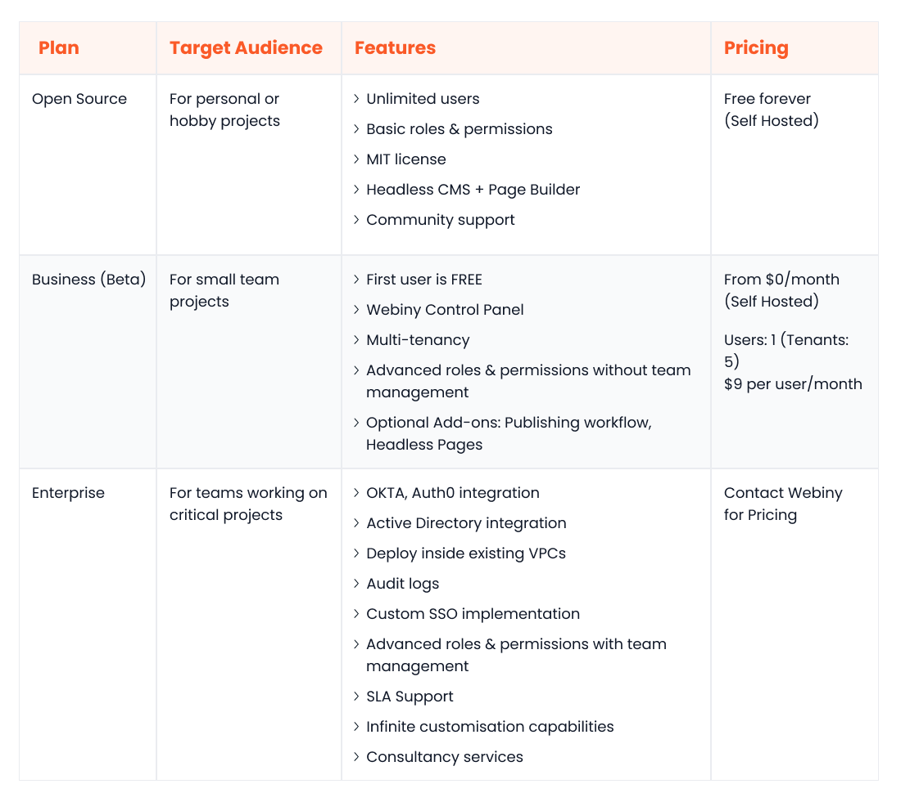
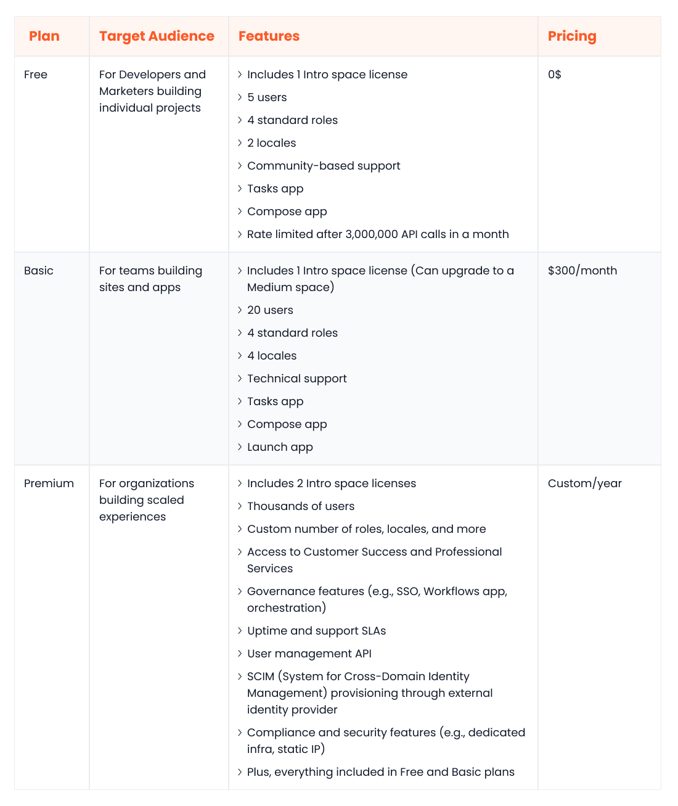

The world of content creation continues to evolve, posing increased challenges for businesses from both creative and technical standpoints. One such challenge is disseminating content across multiple marketing channels, devices, and platforms. This is where a headless content management system (CMS) comes in handy.

For modern businesses that have dynamic content management needs, a headless CMS can use a single instance to deliver personalised content across all customer touchpoints, ranging from websites and mobile apps to conversational interfaces, kiosks, and smartwatches.

Two platforms in the headless CMS space that require a closer evaluation are Contentful and [Webiny](https://www.webiny.com/). Contentful has risen in popularity in recent years for several reasons, including a robust feature set, strong enterprise support, and a mature marketplace.

On the other hand, there’s Webiny, which is considered a more advanced contender where other headless CMSs have failed. Weniny is an open-source, serverless platform that solves many content management challenges that Contentful users struggle with, which we will explore below.

Below, we look at Webiny vs Contentful, comparing these powerhouse headless CMS platforms across various categories, including performance, ease of use, scalability, content modelling, customizability, and integrations. By the end of this article, you will have a clear idea of each platform's benefits, helping you decide which meets your organisational needs.

## Overview of Webiny

Webiny is an open-source enterprise CMS built with a strong focus on performance and customisability. Its [AWS-based serverless architecture](https://www.webiny.com/features/aws-serverless-infrastructure) relieves you of infrastructure-related concerns and offers on-demand scalability, all while preserving the freedom of a self-hosted system.

Webiny redefines the boundaries of customisation. Your developers have the flexibility to tweak any part of Webiny’s source code, allowing for complete integration of your existing tech stack, something that existing headless CMS platforms struggle with. From a marketing standpoint, it allows your marketing teams to build fully customised components and dynamic pages using the interactive, no-code page builder.

A standout feature of Webiny is its robust, built-in multitenancy support. This allows you to create, manage, and serve content for unlimited websites/customers from a single instance without compromising performance. Data for each tenant remains segregated, ensuring data integrity and security.

Other handy Webiny features include Typescript support, a CLI to deploy code to different environments seamlessly, a well-documented and extensible GraphQL API for efficient querying, the ability to integrate with external identity providers, and the power to configure infrastructure using Pulumi Infrastructure as Code (IaC).

Webiny is an excellent fit for businesses of all sizes. Small to medium businesses can get started for free and manage their infrastructure. For larger enterprises with extensive customisation needs, Webiny provides an extensive enterprise package that includes infrastructure management support from the in-house Webiny team and a host of exclusive features, like staged rollouts, audit logs, and VPC endpoint integration.

Overall, Webiny provides a powerful yet flexible headless CMS solution to meet the modern-day [needs of enterprise businesses](https://www.webiny.com/enterprise).

## Overview of Contentful

Contentful is a proprietary SaaS, headless CMS solution designed to harness the full potential of a unified content repository. It has many useful features to streamline content management workflows, including a visual modeller, an AI content type generator, collaborative editing, built-in localisation, and an app framework for extensibility.

As Contentful is a fully managed platform, you don’t have to concern yourself with creating or managing the backend infrastructure. The Contentful team handles the server setups, regular maintenance, scalability, and patch management. This hands-off approach allows your team to focus on what matters most: building immersive content experiences.

Contentful’s flagship feature, the Contentful Studio, offers a customisable editing experience that empowers marketers to build components and create content independently of developers. It can also be seamlessly extended using apps from the Contentful ecosystem.

Contentful caters to a wide range of businesses. It provides a free plan suitable for small teams or individual projects. For enterprises and larger organisations, it offers a customisable premium plan with maximum memory, bandwidth, and space resources and a host of governance and compliance features, like security reporting, fine-grained permissions, and a user management API.

Like most SaaS applications, it is pay-to-play, which needs to be considered extensively when conducting initial platform cost forecasts.

## Webiny vs Contentful: How does each platform match up?

Webiny and Contentful are both strong contenders in the headless CMS industry. However, each solution has its advantages and limitations that require careful consideration. In the following sections, we will compare the two solutions across several key areas, providing a detailed analysis of each.

### Ease of use

#### Webiny

Webiny is easy to use for all members of a digital team, including marketers, content creators, and developers. The no-code, [drag-and-drop page builder](https://www.webiny.com/enterprise-serverless-cms/page-builder) allows marketers to produce dynamic landing pages at scale, create and maintain a library of page templates, and define reusable building blocks without developer input.

Content creators also benefit from several user-friendly features, like [collaborative publishing workflows](https://www.webiny.com/enterprise-serverless-cms/advanced-publishing-workflow), scheduled publishing, instant rollbacks, a customisable editing experience, and role-based access control.

Developers can integrate with the Webiny CMS using their preferred technology and modify the Webiny source code to match personalised business needs. Plus, they can collaborate and discuss changes with a vibrant community of over 2000 developers on [GitHub](https://github.com/webiny/webiny-js) and [Slack](https://www.webiny.com/slack).

#### Contentful

Contentful also scores high in the usability department. The Contentful Studio offers an intuitive interface to define personalised components, collaborate in real-time, and craft engaging omnichannel experiences.

Developers also have their share of user-friendly perks. Starter kits for different languages and frameworks, a comprehensive developer portal, built-in webhooks support, and the flexibility to choose between REST and GraphQL APIs make Contentful a developer-friendly platform.

### Data query and content modelling

#### Webiny

With Webiny, you can define customised content structures within the admin area or through application code. This flexibility allows you to create more dynamic content structures at scale. The GraphQL API enables developers to request the data they need, minimising unnecessary HTTP requests and optimising the efficiency of data retrieval.

#### Contentful

Contentful also offers robust content modelling support, mainly via its visual interface. Regarding data querying, Contentful supports REST and GraphQL and provides dedicated APIs for different use cases, including content management, images, user management, and provisioning.

### Customizability

#### Webiny

Webiny is in a class of its own when it comes to customizability. Its plugin-based architecture enables developers to easily extend functionality by importing third-party plugins or building their own. They can also extend the GraphQL API by adding custom endpoints or modifying core functions like search, authentication, and modelling.

Another notable customizability feature is the ability to set themes on a per-tenant basis. This is a great way to deliver personalised user interfaces tailored to each tenant's/customer's unique needs.

#### Contentful

Being closed-source, Contentful cannot compete with Webiny regarding backend customizability because it doesn’t offer any. The Contentful UI is also largely pre-configured, which limits extensive personalisation. While Contentful allows per-project content categorisation through spaces and organisations, it can’t match Webiny’s robust [multi-tenancy support](https://www.webiny.com/features/multitenancy).

### Performance and scalability

#### Webiny

Webiny is built for enterprise-grade performance from the ground up. Anchored in AWS, its [fault-tolerant serverless architecture](https://www.webiny.com/features/aws-serverless-infrastructure) can scale up or down based on fluctuating traffic demands, resulting in optimal performance, resource utilisation, and cost-effectiveness.

The fully-segregated multi-tenant model enables Webiny to handle large volumes of omnichannel traffic from a single instance. This not only boosts performance and reduces management overhead and cost but also makes it easier and quicker to add new customers/websites into your ecosystem.

#### Contentful

Contentful is also highly regarded for its performance and scalability. Its cloud-native, fully managed architecture uses sophisticated load balancing, resharding, and auto-scaling techniques to deliver exceptional performance and availability. However, the lack of dedicated multitenancy support makes it hard to vertically scale a Contentful instance when serving additional customers.

Moreover, Contentful adopts a dual CDN approach to content delivery: one CDN delivers media files, while the other is reserved for serving JSON documents.

### Integration ecosystem

#### Webiny

Being API-first and open-source, Webiny is a highly interoperable platform that can be integrated with any third-party service. Developers can also leverage community plugins to extend functionalities or write their own.

#### Contentful

Contentful has a mature ecosystem of apps and integrations spanning different categories, including eCommerce, automation, artificial intelligence, collaboration, and productivity. Moreover, developers can leverage Contentful’s App Framework to build custom apps for unique business use cases.

### Community and support

#### Webiny

Webiny has a rapidly growing community of developers, contributors, and enthusiasts. You can join the official channel on Slack to collaborate, share knowledge, and ask questions. Moreover, Webiny has [comprehensive documentation](https://www.webiny.com/docs/get-started/install-webiny) that covers all key areas, including headless CMS, page builder, API, architecture, and infrastructure. Technical support is also provided to enterprise customers.

#### Contentful

With Contentful, you enjoy the benefits of an established and robust community that has evolved over time. To engage with this community, you can visit the forums on the official Contentful website. Additionally, Contentful provides extensive documentation and a dedicated learning centre for users looking to deepen their understanding of the platform. Technical support is only available to paying customers.

### Open source

#### Webiny

[Webiny is fully open-source](https://www.webiny.com/features/opensource), which makes it endlessly customisable and free of the constraints of traditional SAAS CMSs, like Contentful. Your data and resources remain under your control, optimised to fit your personalised business needs, within your own AWS account, and compliant with the regulatory frameworks relevant to your industry.

You have the freedom to choose your own CDN, frontend technology, identity provider, and security standards.

#### Contentful

Contentful is a proprietary SAAS CMS, meaning you can’t access its source code. Moreover, you have no say over key aspects, such as how your data is stored and secured, the choice of CDN for content delivery, and the ability to tailor the platform to your needs.

### Pricing

#### Webiny

Webiny has a [transparent pricing structure](https://www.webiny.com/pricing) without any long-term contract requirements. The Open-source plan is forever free and targets people looking to build personal projects. The price of the Business plan is calculated based on the number of users, at $9/user/month; it targets small teams. The Enterprise plan has the most extensive feature set; contact Sales at Webiny to tailor a pricing plan that suits your budget and needs.

#### Contentful

Contentful also offers three pricing plans. The Free plan is entirely free and targets people building individual projects. The Basic plan is designed to cater to small teams; it costs $300/month. The Premium plan is a good fit for enterprises; contact the sales team at Contentful to get a price for this plan.

### Security

#### Webiny

The Webiny team takes several steps to keep the platform secure. The source code is regularly checked for vulnerabilities using CodeQL, a leading code analysis tool. For identifying potential vulnerabilities in third-party dependencies, the team uses Dependabot.

Moreover, Webiny is designed to run on the serverless offerings of AWS, a cloud platform known for its rigorous security standards. Being serverless also reduces the chances of misconfigurations, as there are no servers to provision or manage. Lastly, the Webiny platform has several security-related features, including encryption at rest and in transit, and fine-grained and role-based access control.

#### Contentful

Contentful also upholds high standards for security. The platform and data reside on AWS. Data is encrypted at rest and in transit. Annual penetration tests and regular backups are performed to enhance security and resilience. Configurable security features include SSO, SCIM provisioning, API key rotation, password security, and HTTPS.

## Webiny – how it is changing the future of headless CMS

Webiny is making waves in the headless CMS world. The true value lies in its open-source, cloud-first, and interoperable nature. As a well-designed open-source headless CMS, it has already fostered a thriving community of developers dedicated to its continual improvement. This allows Webiny users access to a host of new and exciting features.

As a cloud-first, [self-hosted solution](https://www.webiny.com/features/selfhosted), it empowers businesses to build futuristic, inherently scalable content infrastructures that don’t require excessive manual maintenance. The serverless model, coupled with Webiny's efficient usage of AWS services, leads to significant cost savings – reducing infrastructure and operations costs by 60-80% compared to traditional VM-based deployments.

As an API-first, interoperable CMS, it integrates with almost anything, allowing businesses to build cohesive digital ecosystems. For example, you can integrate the Webiny CMS with your marketing automation or sales tools to enhance overall efficiency.

Contentful has been a leader in the headless CMS scene for years, but, as highlighted in our comparisons, it struggles to match the versatility and modernity that Webiny offers, especially at an enterprise level. Looking ahead, we can anticipate this gap widening even further. The Webiny product roadmap shows a range of valuable features on the horizon, such as support for GCP and Azure, multi-region deployments, point-in-time recovery, and cloud cost monitoring.

## Conclusion

Contentful and Webiny are top headless CMS solutions with different strengths and weaknesses. Contentful is fully managed and boasts a mature ecosystem of apps and integrations. Still, it falls short compared to Webiny when we look at customizability, openness, cost-effectiveness, performance, and other key aspects.

For enterprises looking for a fully customisable, stable, scalable, and future-proof headless CMS, Webiny should be the obvious choice over Contentful.

[Book a demo](https://www.webiny.com/forms/product-demo) with our team to learn more about how Webiny can support your enterprise needs.