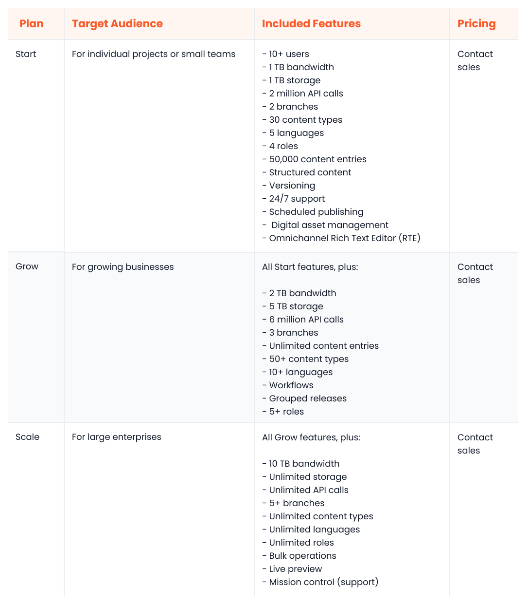

In the age of omnichannel experiences and rapid business growth, traditional content management systems (CMSs) are simply not viable. Their monolithic architectures and siloed workflows hinder agility and innovation. This is where [headless CMSs](https://www.webiny.com/enterprise-serverless-cms/headless-cms) come into play.

Headless CMSs decouple the backend from the front end to streamline content modeling, free marketing teams from technical constraints, and fast-track omnichannel delivery. These undeniable advantages make headless CMSs the obvious choice for businesses looking to outpace the competition.

In this CMS platform comparison, we will compare two frontrunners: [Webiny](https://www.webiny.com/) vs. [Contentstack](https://www.contentstack.com/). Contentstack is a well-established platform with a diverse feature set, whereas Webiny CMS is a rising star purpose-built to meet the evolving needs of modern enterprises.

We will explore their strengths and weaknesses across different key categories like customizability, scalability, and performance. Our aim is to help you choose the headless CMS platform that best aligns with your business’s goals.

## Overview of Webiny

Webiny is a cloud-native, enterprise-ready headless CMS that’s fully customizable and endlessly scalable. Unlike traditional enterprise CMSs that lock you into managed hosting, Webiny runs on top of [serverless infrastructure inside your own AWS account](https://www.webiny.com/features/aws-serverless-infrastructure).

Also, unlike other enterprise CMSs that are mostly closed-source, [Webiny is open-source](https://www.webiny.com/features/open-source), which enables your developers to tweak any aspect of its TypeScript-first codebase. Your marketers are also able to seamlessly customize with a drag-and-drop, [no-code page builder](https://www.webiny.com/enterprise-serverless-cms/page-builder).

Webiny offers native support for [multi-tenancy](https://www.webiny.com/features/multi-tenancy-site-management) with full data segregation. This means that you can seamlessly onboard and manage a vast array of clients, each with their unique content and configurations, without compromising on performance or security.

Other notable Webiny features include:

- A well-documented GraphQL API
- Version control
- A development framework for easy extensibility
- Built-in [asset management](https://www.webiny.com/enterprise-serverless-cms/file-manager) and localization
- A CLI with CI/CD support
- The ability to configure infrastructure via Pulumi Infrastructure as Code (IaC)

Webiny has something in store for businesses of all sizes. Individuals and small teams can get started for free, whereas larger organizations can choose the Enterprise plan that comes with SLA support, consultancy services, and other additional features. It’s worth noting that all Webiny plans are [self-hosted](https://www.webiny.com/features/self-hosted-headless-cms), giving you complete control.

## Overview of Contentstack

Contentstack is a headless CMS that can run on both Microsoft Azure and AWS cloud environments. Its “modular blocks” feature enables marketers to build pages via a drag-and-drop interface without any developer assistance.

Contentstack offers the ability to create and manage different “branches” of a content repository, much like a version control system. Each branch inherits the types, languages, webhooks, and assets from the source branch. Using multiple branches, your teams can manage independent content models and settings for different projects, all from a single instance.

Contentstack also provides built-in support for workflows, which are a great way to streamline the content creation, review, and approval processes. You can create several stages in a workflow, configure workflows for specific content types, and even define branch-specific workflows.

Other useful Contentstack features are:

- An AI assistant
- Built-in localization
- Batch releases
- A CLI with migration support
- Image presets
- A rich text editor
- Live previews
- SOC 2 Type II
- ISO 270001 compliance
- Dynamic content

Contentstack provides multiple [paid packages](https://www.contentstack.com/pricing) to accommodate businesses of different sizes. However, it’s important to note that all plans include bandwidth limitations, and only the top-tier plan offers unlimited storage and API calls. There is also a free trial that lets you play around with the platform for a few days.

## CMS platform comparison: How does each platform match up?

Webiny and Contentstack are both reliable, cloud-first headless CMS solutions, each with several strengths and a few limitations. In the following sections, we will perform a detailed headless CMS comparison of the two platforms across several key areas, like ease of use, content modeling, security, the openness of source code, and scalability.

## Ease of use

#### Webiny

Webiny is highly regarded for its user-friendly interface that caters to the needs of both marketers and developers, making it one of the top Contentstack alternatives.

Marketers can build dynamic components, templates, and [pages for multiple tenants](https://www.webiny.com/features/multi-tenancy-site-management) with ease and efficiency. Meanwhile, developers can leverage APIs to integrate the headless back end with any front-end technology, including React, Gatsby, and Next.js. They can also seamlessly extend the platform using the [serverless development framework](https://www.webiny.com/features/development-framework).

#### Contentstack

Contentstack has a sleek and intuitive user interface that makes it easy to build a scalable content repository. Marketers can build dynamic, appealing pages in real time by adding, removing, or rearranging pre-defined modular blocks.

Moreover, they can utilize the in-platform AI assistant to speed up ideation and content creation.

Contentstack is also a developer-friendly platform that offers features like omnichannel live preview, a developer hub, multi-purpose APIs, sample apps, and ease of integration with any front-end technology, including React, Angular, Vue.js, and Next.js.

## Data query and content modeling

#### Webiny

Webiny simplifies the process of building granular, organized content models through both the admin area and application code. You can create custom fields, add validators to fields, and clone content models as needed. Additionally, the GraphQL API offers built-in support for pagination, filtering, and sorting, so that developers can retrieve data more efficiently.

#### Contentstack

Contentstack also allows you to build a customizable content model using custom fields, global fields, and content types. You can define several properties for a field and create content types via the API by providing their JSON schemas.

Just like Webiny, Contentstack also offers a GraphQL content delivery API that allows you to filter, sort, paginate, and execute batch queries.

## Customizability

#### Webiny

Webiny grants you unparalleled control over your content experience. In addition to having the freedom to build your own front end, you have the flexibility to customize any aspect of the back end. This includes minor tweaks, like adding a new field validator, to rewriting core functionalities, like the search algorithm, content modeling, and authentication.

Moreover, you can also govern every aspect of your infrastructure’s configuration and deployment using Pulumi IaC.

#### Contentstack

As a headless CMS, Contentstack allows you to build a tailored front end that embodies your brand identity. However, due to its closed-source nature, it doesn't provide the extensive customization capabilities found in Webiny. There is no way to change any core back-end functionalities.

Nevertheless, you can use add-ons and extensions to make certain tweaks to the platform’s interface.

## Performance and scalability

#### Webiny

Webiny has been engineered to seamlessly scale up to accommodate hundreds of millions of records. Its fault-tolerant, auto-scalable serverless foundation ensures that the platform performs optimally even under substantial data loads and increasing user demands.

Moreover, its multitenant architecture enables you to provision new customers or sites on the same instance without having to worry about capacity constraints or performance.

#### Contentstack

Contentstack is built on top of a resilient, SOC-2 Type 2 architecture that uses efficient auto-scaling and load-balancing techniques and a CDN to ensure consistent performance even during traffic spikes. However, when it comes to the Contentstack vs Webiny debate, Contentstack doesn’t offer native multi-tenancy support as Webiny does.

Moreover, since there’s a limit to the number of branches that you can create, it can become challenging to manage a large number of distinct content models within a single instance.

## Integration ecosystem

#### Webiny

Since Webiny is an open-source and API-first solution, it can integrate with any third-party service, including identity providers, sales tools, analytics products, and data sources. The plugin-centric architecture makes it easy to use community plugins or build your own.

#### Contentstack

Contentstack has a mature ecosystem of third-party integrations and plugins across many categories, including search platforms, digital asset management, analytics, and artificial intelligence. Moreover, contentstack-express, a Node.js based application framework, makes it easy to build your own plugins.

## Community and support

#### Webiny

Webiny boasts an expanding community of developers, supporters, and problem solvers. You can engage with the community by joining the official Slack channel.

Moreover, the Webiny documentation has everything you need to know about the architecture, the page builder, the admin area, and customization options. It’s important to note that Webiny only offers technical support to [enterprise customers](https://www.webiny.com/enterprise).

#### Contentstack

Contentstack has an established community of users that collaborate via the forums on the official site. You can create your own profile or initiate a discussion by visiting the site.

Like Webiny, Contentstack also has extensive documentation addressing key subjects for developers and content creators alike, including dedicated sections for APIs and [publishing content](https://www.webiny.com/enterprise-serverless-cms/advanced-publishing-workflow). Contentstack offers technical support to customers across all plan tiers.

## Open-source

#### Webiny

Webiny’s headless CMS is available as open-source software under the MIT license, making it a top choice among Contentstack alternatives.

Your developers can fetch the source code directly from GitHub and customize it as needed to suit your specific requirements. You have the flexibility to store your data in a different database, integrate with a CDN, extend the API, or make any performance tweaks.

#### Contentstack

Contentstack is a proprietary headless CMS, which means that you can’t access its source code. Also, since Contentstack is fully managed, you can’t control how your data is stored or how your infrastructure is secured.

## Pricing

#### Webiny

Webiny offers three self-hosted packages.

The Open-Source package is a good fit for personal or hobby projects; it’s free. The Business package targets small businesses, costing $9 per user per month. Lastly, the Enterprise plan targets large organizations that need dedicated support and consultancy from the Webiny CMS team; for pricing details, [get in touch with the Webiny sales team](https://www.webiny.com/contact-us).

Here’s a tabular breakdown of Webiny’s flexible pricing model:

#### Contentstack

Contentstack offers three different packages without publicly available pricing details.

The Start package targets small teams with modest bandwidth, storage, and API call allowances. The Grow package caters to slightly larger teams and offers upgraded limits for bandwidth, storage, and API calls. The Scale package is a good fit for large enterprises that need unlimited storage and API calls (there is still a 10TB limit on bandwidth).

It’s worth noting that to get a price for any of these packages, you’d have to contact the sales team at Contentstack. Here’s a tabular breakdown of Contentstack’s plans:

## Security

#### Webiny

The Webiny team implements several best practices and processes to maintain high levels of security, including:

- CodeQL and Dependabot are used to scan the source code and third-party libraries for any vulnerabilities.
- Webiny can be deployed inside an Amazon Virtual Private Cloud (VPC).
- Webiny uses AWS Cognito for authentication by default but can also be integrated with third-party identity providers.
- It’s SOC2 Type 1 certified.
- All data inside DynamoDB (the primary data store) is encrypted at rest and in transit.
- It also offers the ability to define and assign granular permissions to identities.

#### Contentstack

Contentstack places a strong emphasis on security. Here are some of the platform’s security-centric features:

- Contentstack is SOC-2 Type 2 and ISO 270001 certified
- It uses AES-256 to encrypt all data at rest and in transit
- The platform is hosted inside a VPC
- Several configurable controls are present in the platform, including two-factor authentication, an account lockout policy, and securing asset URLs

## Webiny: Redefining the modern headless CMS

Webiny is a defiant outlier and trailblazer in the headless CMS scene, standing out among other Contentstack alternatives. Its unique blend of enterprise-grade functionality with open-source transparency, [self-hosted control](https://www.webiny.com/features/self-hosted-headless-cms) with effortless autoscaling, and lightning-fast performance with limitless customization rewrites the rules of the game.

The serverless architecture enables businesses to focus on innovation and growth without infrastructure concerns. It also leads to significant savings – an estimated 60-80% reduction in operational costs compared to traditional VM-based architectures.

Since it is self-hosted and IaC-ready, you get full programmatic control over your infrastructure. You can automate deployments, define granular security policies, and orchestrate your infrastructure as per your business needs.

Moreover, its API-first nature makes it highly interoperable out of the box. Not only can your developers integrate it with their preferred front-end technology, but you can also integrate it with other tools in your ecosystem, such as CRM systems, marketing automation platforms, and analytics tools.

Despite the long-standing dominance of Contentstack in the headless CMS sphere, it is no match for Webiny’s flexibility, customizability, and ever-expanding feature set.  And with the Webiny team's relentless dedication to continuous development, it's likely to leave Contentstack far behind in the long-term CMS race.

## Webiny vs Contentstack CMS platform comparison summary: which CMS is best?

In this headless CMS comparison, we have found that Webiny and Contentstack are both solid headless CMS solutions with different strengths and weaknesses.

As one of the better Webiny alternatives, Contentstack has a slight edge over Webiny CMS in the integrations department, but Webiny blows Contentstack out of the water in all other categories, including pricing, scalability, customizability, and openness of source code.

For modern businesses looking for a futuristic, extensible, and reliable content management solution, Webiny’s headless CMS should be the preferred choice over Contentstack and its alternatives.

[Click here to visit the Webiny website and learn more.](https://www.webiny.com/)