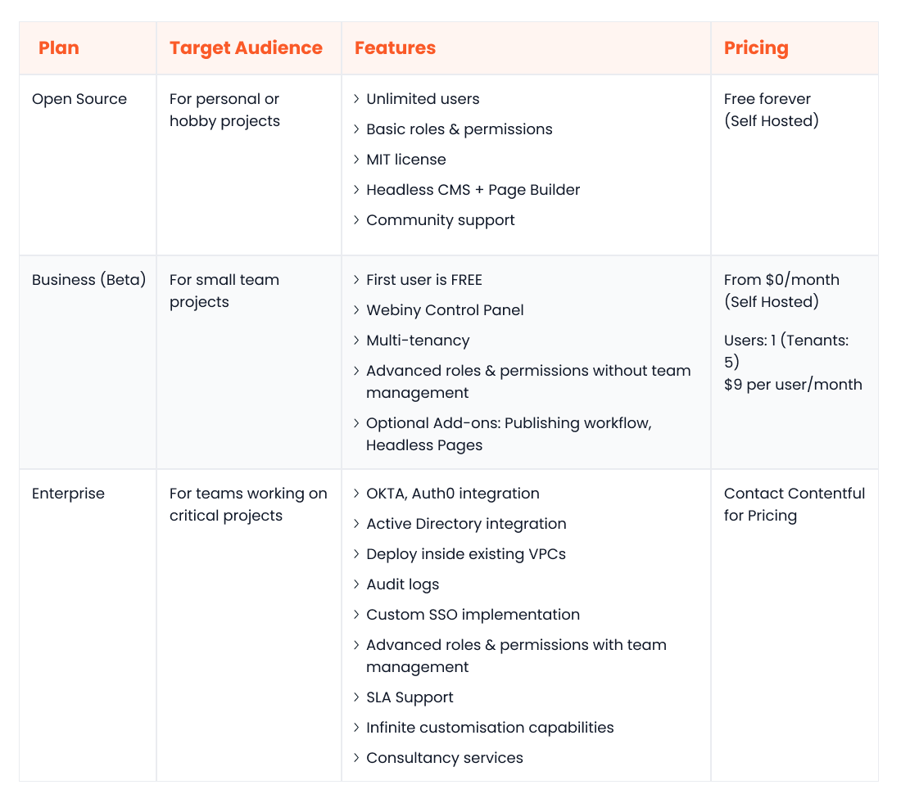
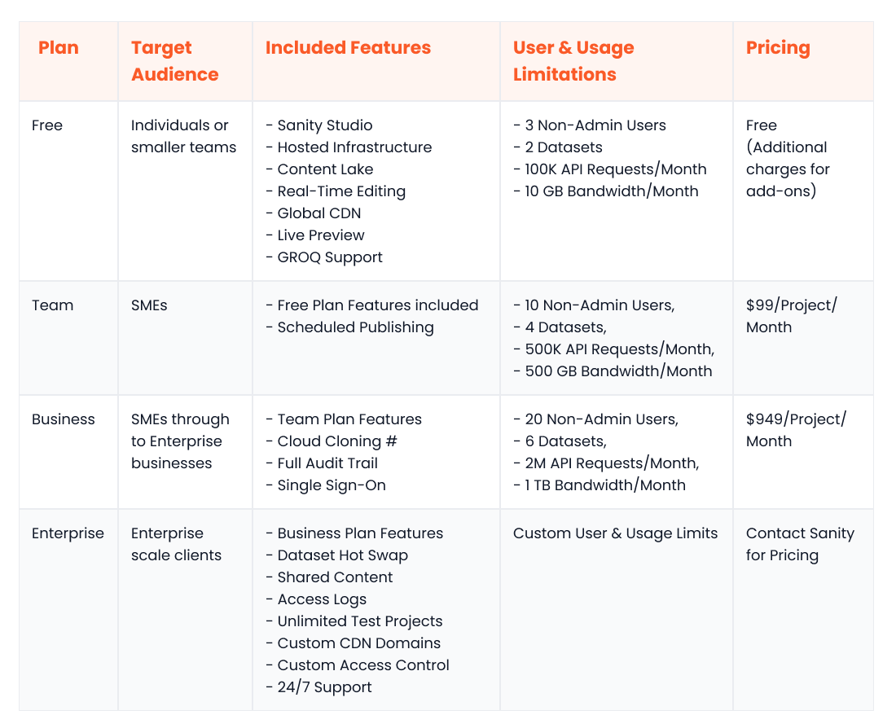

Headless CMSs blow their traditional counterparts out of the water. Their decoupled architecture grants businesses the flexibility, agility, and scalability they need to adapt to changing market dynamics and customer expectations.

Marketers can craft dynamic, aesthetically pleasing landing pages using a [headless CMS](https://www.webiny.com/knowledge-base/headless-cms) at scale without writing a single line of code. Meanwhile, developers can leverage the same backend instance to deliver content across various front-end interfaces.

Two key players in the headless space, Webiny and Sanity, demand a closer examination. Over the years, Sanity has solidified its position as a market leader, lauded for its user-friendly interface and robust data querying.

However, Webiny, a formidable newcomer, is set to challenge the established order. It offers a rich array of enterprise-grade features and the ability to self-host and customize its open-source code— a unique combination that no other headless CMS can match.

In this article, we will compare Webiny and Sanity across several key categories, including ease of use, content modeling, data querying, scalability, security, and pricing. By exploring their strengths and weaknesses, you’ll have the information needed to choose the ideal headless CMS to fuel your organization's digital ambitions.

## Overview of Webiny

Webiny is an open-source, enterprise-ready, headless CMS engineered to seamlessly deploy inside your [AWS environment using a serverless infrastructure](https://www.webiny.com/features/aws-serverless-infrastructure). Serverless eliminates the hassle of configuring, managing, or scaling servers, regardless of fluctuating traffic volumes.

Webiny empowers developers with unparalleled customizability. They can access the source code on GitHub and modify any element of the TypeScript-first codebase. Meanwhile, marketers can use the intuitive [page builder](https://www.webiny.com/enterprise-serverless-cms/page-builder) to build dynamic landing pages seamlessly without any coding expertise.

A standout Webiny feature is built-in [multi-tenancy](https://www.webiny.com/features/multi-tenancy-site-management) with data segregation. This means you can deliver content to multiple digital touchpoints while securely storing data for individual tenants within the same backend instance. This level of on-demand scalability, especially within an open-source, self-hosted CMS, is a rarity in the market.

Other notable Webiny features include integrations with external identity providers, a [development framework to simplify customisation](https://www.webiny.com/features/development-framework), a CLI for code deployment, CI/CD support, an extensible GraphQL API, an asset manager, and the ability to use Pulumi IaC to configure your infrastructure programmatically.

Webiny has something in store for every business, regardless of size and industry. Small-to-medium-sized businesses can leverage its extensive capabilities for free. Meanwhile, larger organizations that need dedicated infrastructure support can opt for the enterprise plan, which includes SLA-backed support and consultancy services.

## Overview of Sanity

Sanity is a composable cloud solution that simplifies the process of building immersive omnichannel experiences. At the core of the Sanity ecosystem lies the Sanity Studio, a browser-ready, open-source application.

Using the Studio, you can build customisable editing interfaces for different use cases. Since it’s open-source, developers can also tweak or extend it to suit specific business needs. Another key component of the Sanity architecture is the fully managed content lake that stores all your content and offers precise querying capabilities.

A few other helpful Sanity features include starter kits and SDKs, AI assistance, real-time editing, portable text support, unlimited locales and content types, CI/CD support, role-based access control, webhooks, and asset management.

Sanity caters to businesses of all sizes and industries. It offers a free plan for small companies, a reasonably priced mid-tier plan for growing businesses, and a customisable premium plan for enterprises with advanced security and compliance requirements.

## Webiny vs Sanity: How does each platform match up?

Now, let's compare Webiny and Sanity head-to-head. We will analyze their key features in core areas so that you can choose the best headless CMS for your personalized needs.

### Ease of use

#### Webiny

Webiny’s user interface is both intuitive and feature-rich. The page builder enables marketers to craft dynamic landing pages for wide-ranging use cases (product pages, blogs etc.) at scale, without requiring developer assistance.

For developers, Webiny offers seamless integration with any front-end technology. Starter kits are available for Next.js, Gatsby, Vue, React, Flutter, and others. Moreover, they can use the development framework to extend the platform functionalities as needed, catering to even the most intricate customisation requirements.

#### Sanity

The Sanity Studio acts as a centralized hub for crafting personalized digital experiences. Marketers can seamlessly build tailored components for different use cases, while content creators can customize the editing interfaces to align with their preferences and workflows.

The Studio also boasts a few developer-centric features. The customisation framework enables developers to adapt or extend any aspect of the studio efficiently. Additionally, they have the flexibility to use their preferred technology to build their application frontends. Starter kits are available for React, Vue, Next.js, Svelte, Astro, Gatsby, and more.

### Data query and content modeling

#### Webiny

Webiny empowers your content teams to model even the most complex content architectures effortlessly. Whether you want to define custom types, clone content models, programmatically define models, or organize them into groups, Webiny provides an intuitive way to do so.

For efficient data retrieval and manipulation, Webiny offers a well-documented GraphQL API that comes equipped with built-in support for pagination, sorting, and filtering.

#### Sanity

Sanity earns high marks for its content modeling capabilities. You can effortlessly define multiple content types with customisable attributes and connect them to create relational content hierarchies.

For precise data querying, Sanity offers GROQ, its native query language.

While GROQ may initially present a learning curve for developers, once mastered, it unlocks powerful querying capabilities. It simplifies the process of building complex queries with advanced filters, projections, and operators.

### Customizability

#### Webiny

Webiny is in a league of its own when it comes to customizability. Whether you want to configure a different theme for each tenant, create a custom field type, change the platform’s layout, re-architect the admin panel, develop a new [form builder](https://www.webiny.com/enterprise-serverless-cms/form-builder), add custom validation, or extend the API, Webiny makes it possible.

#### Sanity

The Sanity Studio customisation framework enables you to build a fully personalized content management dashboard. You can extend the APIs, adjust the block editor, apply brand-specific styling, and install third-party plugins. However, since the data is stored inside the proprietary content lake system, it’s not possible to customize the data storage or querying layers – unlike Webiny, which offers complete control over these aspects.

### Performance and scalability

#### Webiny

Webiny's robust multi-tenant architecture and auto-scalable, [serverless foundation](https://www.webiny.com/knowledge-base/serverless) enable it to handle even the most demanding traffic volumes with ease. Rigorous load testing conducted by the Webiny team provides concrete evidence of the platform's exceptional scalability and performance.

Across diverse test scenarios simulating core operations (insert/retrieve a record, serve a page etc.), Webiny consistently delivered impressive response times. [Visit this page to explore all the results.](https://www.webiny.com/docs/performance-and-load-benchmark/introduction)

#### Sanity

Sanity is built on top of a performant and scalable cloud infrastructure. The fully managed content lake uses advanced caching mechanisms and a global CDN to optimize content delivery. However, it's important to note that Sanity lacks native multi-tenancy support, which can be a challenge for organizations looking to build a centralized repository for a large number of tenants.

### Integration ecosystem

#### Webiny

Webiny's open-source nature and API-first design make it a champion of integration flexibility. For example, if you aim to integrate with an external IAM provider, you can use or extend the APIs to do so. Similarly, if you want the CMS to communicate with a legacy app from your stack, you can customize the source code and/or write an adapter to do so.

#### Sanity

On the Sanity Exchange, you will find an array of handy tools and plugins to extend the Studio. This includes collaborative editing, publishing, APIs, distribution, and optimisation resources. You can also build your own plugin for any specific business needs.

### Community and support

#### Webiny

Webiny's growing community of over 2,000 developers and thinkers actively contributes to improving the platform. You can engage with the community through the official Slack channel for discussions or support. Moreover, the website offers a wealth of resources for those looking to learn or customize the platform, including user guides, tutorials, and extensive documentation. Webiny offers technical support only to its enterprise customers.

#### Sanity

Sanity has a thriving community of developers and enthusiasts collaborating on Slack and contributing to the platform’s growth. You can set up your own community profile on the official Sanity website. The website also provides access to templates, starter kits, guides, API references, and comprehensive documentation. Sanity reserves technical support for enterprise customers.

### Open-source

#### Webiny

Webiny is available as an open-source headless CMS under the MIT license. This gives your developers the freedom to tweak every aspect of the platform. From modifying the admin panel's layout to reimagining the content modeling architecture, the possibilities for personalisation are truly limitless.

#### Sanity

The Sanity Studio also embraces open-source development under the MIT license, giving your developers free rein to shape the platform to your specific needs. However, it’s worth noting that the content lake, Sanity’s data storage layer, is a proprietary solution which limits your direct control over data storage and querying functionalities.

### Pricing

#### Webiny

Webiny adopts a transparent pricing model, void of long-term commitments. Its open-source package caters to individuals developing personal or hobby projects; it’s entirely free of charge. Tailored for small businesses, the Business package is user-based, priced at $9 per user per month. As for the enterprise plan, it boasts the most expansive feature set; for pricing specifics, reach out to the Webiny sales team.

#### Sanity

Sanity offers a trio of packages to accommodate users with varying budgets. The Free plan suits people building MVPs or smaller projects. The Growth plan, priced at $15/user/month, caters to the evolving needs of small-to-medium businesses. Lastly, the Enterprise plan is geared towards enterprises with advanced security and compliance demands; contact Sanity's sales team for pricing details.

### Security

#### Webiny

Security is a top priority for the core Webiny team and its community. Here are key security features and highlights of the platform:

- Every change to the Webiny source code is thoroughly scanned using state-of-the-art tools to ensure it's free from vulnerabilities and bugs
- Webiny is SOC Type 1 Certified, which signifies its adherence to stringent security and operational standards
- Enterprise customers can choose to deploy Webiny inside an Amazon Virtual Private Cloud (VPC)
- Webiny uses AWS Cognito for authentication by default but also gives you the option to integrate with a third-party identity provider

#### Sanity

Sanity has a security-first ecosystem. Here are some of its security-centric features:

- You can define granular role-based access controls to limit access to sensitive features
- Sanity can integrate with external identity providers
- The Sanity documentation outlines several best practices and guidelines for secure API access

## Webiny: How it is changing the future of headless CMS

Despite its standing as a market leader, Sanity falls short in numerous key aspects compared to Webiny. For example, it lacks many useful features present in Webiny, such as native multi-tenancy, Infrastructure as Code (IaC) capabilities, and data layer customizability.

Moreover, it can’t be self-hosted and doesn’t provide the same level of on-demand scalability as Webiny.

This comparison further emphasizes Webiny’s burgeoning prominence in the headless CMS scene. It’s [open-source](https://www.webiny.com/features/open-source) yet enterprise-ready, on-premise yet auto-scalable, and incredibly reliable yet fully extensible. No other headless CMS platforms in the market deliver on all these fronts.

Moreover, Webiny's cloud-native, API-first, and [self-hosted architecture](https://www.webiny.com/features/self-hosted-headless-cms) offer unparalleled freedom and control. This enables you to:

- **Own your infrastructure**: You have full autonomy over your data storage and security controls
- **Optimize costs**: The serverless nature of the platform slashes maintenance costs by an impressive 60-80% compared to traditional VM-based deployments
- **Enjoy scalability**: Webiny effortlessly scales to accommodate fluctuating traffic needs without requiring any manual intervention
- **Embrace flexibility**: You can integrate seamlessly with your existing cloud services and tools to create a cohesive, cloud-native tech stack
- **Empower your developers**: Your developers can use their preferred frontend frameworks to build applications, including React, Angular, or Gatsby

## Conclusion

Choosing the best headless CMS for your business can be daunting, especially with platforms like Webiny and Sanity offering compelling features. To help you navigate this decision, we have comprehensively compared Webiny and Sanity across the most critical categories.

While Sanity has the upper hand in a few areas like ecosystem and data querying, Webiny outshines it in all the other categories, including customizability, performance, cost-effectiveness, and scalability. For companies seeking a cutting-edge, feature-packed, and empowering headless CMS solution, Webiny emerges as the clear and obvious choice over Sanity.

To find out more, [book a demo](https://www.webiny.com/forms/product-demo) call with our team today.