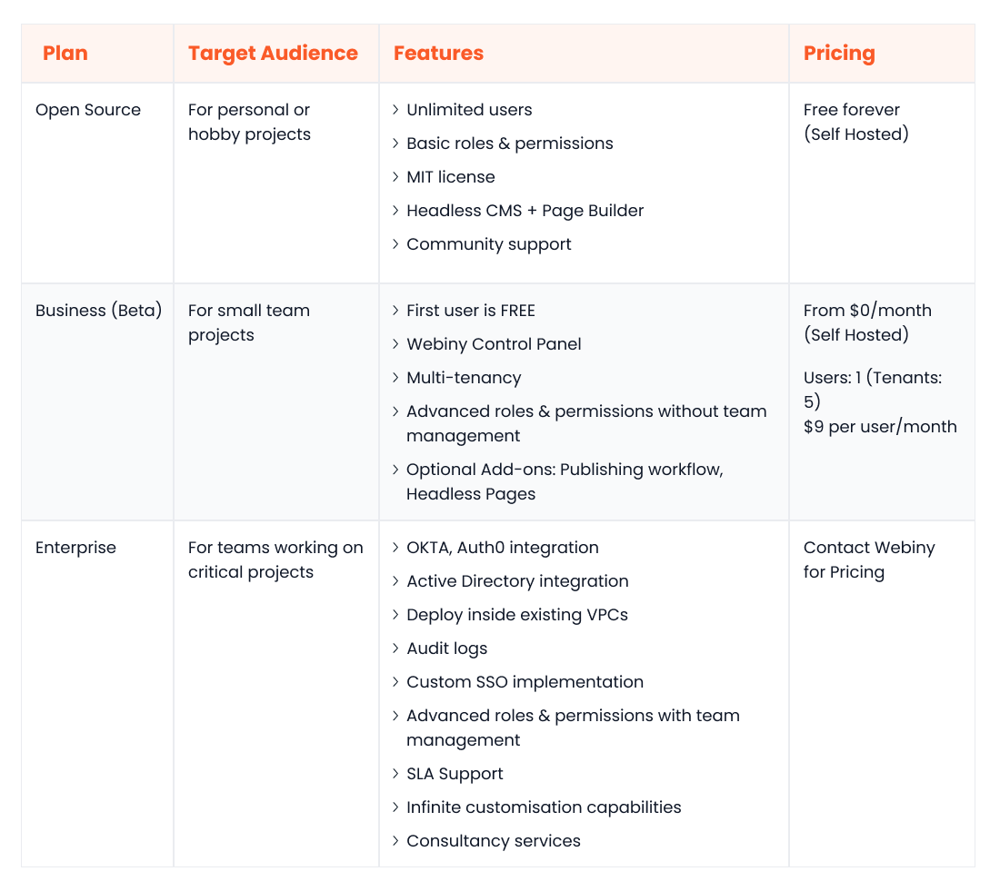
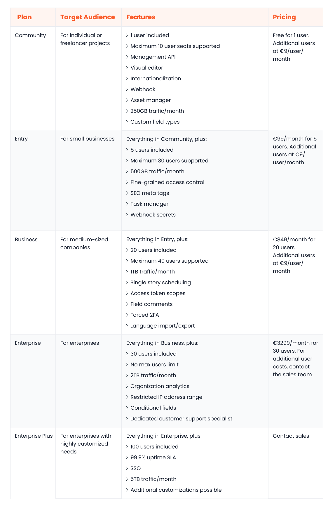

The traditional CMS (content management system) is slowly fading, replaced by a new paradigm: [the headless CMS](https://www.webiny.com/enterprise-serverless-cms/headless-cms). Unlike its monolithic, inflexible predecessor, the headless CMS decouples content from presentation, delivering ultimate freedom and agility in building digital experiences.

If you are in the market for a reliable enterprise CMS, it’s only natural to have the [Webiny](https://www.webiny.com/) vs [Storyblok](https://www.storyblok.com/) discussion. Even though Storyblok is an established player in the headless CMS scene, and Webiny is a relatively newer entrant, the CMS platform comparison between the two can be a head-scratcher.

In this headless CMS comparison article, we will thoroughly analyze the two platforms, covering key categories like performance, scalability, security, and more. By the end, you‘ll clearly understand which platform best aligns with your unique business requirements.

## Webiny Overview

Webiny is an open-source, enterprise-ready headless CMS platform that offers limitless on-demand scalability due to its serverless architecture. But what truly sets Webiny apart from other enterprise CMSs is its ability to self-host within your own AWS account.

Webiny features an [intuitive, no-code page builder](https://www.webiny.com/enterprise-serverless-cms/page-builder) that enables you to build and share dynamic landing pages at an unprecedented scale. You can also develop your own library of no-code page templates to optimize your content creation process.

Webiny CMS is a [multi-tenanted platform](https://www.webiny.com/features/multi-tenancy-site-management) with built-in data segregation. This means that you can manage a large number of clients or projects within a single instance, significantly decreasing your total cost of ownership (TCO).

Other notable Webiny features include:

- Form builder
- File manager
- Publishing workflows
- Role-based access control
- External identity provider integration
- API monitoring
- Localization
- CI/CD support
- Staged rollouts
- Audit logs
- Infrastructure as Code (IaC) capabilities

Webiny has been designed to accommodate the needs of businesses of all sizes. Small businesses can use Webiny's free tier indefinitely, while enterprises can choose higher-tier plans to unlock SLA support, consultancy, and other such offerings.

## Storyblok Overview

Storyblok is a proprietary headless CMS designed to streamline all stages of the content lifecycle: creation, management, and delivery. Unlike Webiny, Storyblok CMS is a fully managed platform hosted on AWS servers in Frankfurt, with the option to host in the US and China.

The visual editor offers an intuitive editing experience that enables collaborative content creation at scale. It also empowers marketing teams to build a custom component library through a simple drag-and-drop interface.

Other handy Storyblok features include:

- Global CDN
- Auto-scaling during peak periods
- Pipelines
- Custom workflows
- Collaboration suite
- Activity logs
- Asset manager
- Internationalization
- Two-factor authentication
- User management

Storyblok has a flexible pricing model to cater to various user needs. Individuals or hobbyists can start for free, albeit with single-user support, while businesses ranging from startups to enterprises can select from four different paid plans.

## Webiny vs Storyblok: headless CMS comparison

The following sections will provide a CMS platform comparison of Storyblok vs Webiny so that you can make the best choice for your business. This headless CMS comparison will cover key factors like ease of use, data query and content modeling, customizability, scalability, community, and more.

### Ease of Use

#### Webiny

Webiny is purposefully crafted to be user-friendly for all members of your digital team. Marketers can build dynamic pages of different types in seconds via the drag-and-drop page builder, including product pages, blogs, and landing pages.

Content creators can leverage ready-made templates and building blocks to speed up content creation and can ensure quality control via [advanced publishing workflows](https://www.webiny.com/enterprise-serverless-cms/advanced-publishing-workflow).

Meanwhile, developers can build fully decoupled frontends using their preferred technologies (e.g. React, Next, Gatsby, etc.) thanks to Webiny’s API-first nature. They can also add custom features to the platform with ease using the [serverless development framework.](https://www.webiny.com/features/development-framework)

#### Storyblok

Storyblok also scores highly in the usability department compared to other Webiny alternatives. Using collaborative visual editing, digital teams can get more done in less time while avoiding miscommunications. The Component Composer, built into the visual editor, allows marketers to intuitively build different types of components.

Similar to Webiny, developers can integrate with Storyblok using their preferred frontend technologies, including React, Angular, and Astro. They can also customize API response calls, create flexible data schemas, and extend functionalities using the Storyblok App Directory.

### Data Query and Content Modeling

#### Webiny

With Webiny, you can create scalable content models via both the administrative interface and application code. Whether you want to clone content models, add field validators, generate custom fields, or link content models via reference fields, Webiny offers you a way to do so.

Moreover, the GraphQL API comes with robust support for pagination, filtering, and sorting. This enables developers to minimize the number of HTTP requests needed to efficiently retrieve data.

#### Storyblok

In Storyblok, a content repository is known as a space. Each space has its own stories and content types. A story is a content entry in Storyblok that adheres to a specific content type.

While you can create conditional and custom fields and manage spaces and stores via the API, the overall support for content modeling in Storyblok is comparatively less extensive than that of Webiny CMS and other Storyblok alternatives.

In terms of data querying, Storyblok offers ordering and sorting features, along with different operations to filter results, such as is, in, not_in, like, not_like, and any_in_array.

### Customizability

#### Webiny

Webiny is in a league of its own when it comes to customizability. As a Webiny CMS user, you have unparalleled freedom to customize both the front end and back end to your exact specifications.

For example, you can develop a UI that perfectly reflects your brand identity. You can also refine or rewrite core functionalities, like data storage, the search algorithm, or modeling.

#### Storyblok

Since Storyblok is headless, you can design a fully decoupled and customizable front end for your application. However, due to its proprietary nature, you can’t customize any core backend functionalities. Nevertheless, you can tailor or extend some of the platform’s features using free apps from the App Directory.

### Performance and Scalability

#### Webiny

Webiny’s resilient, auto-scalable infrastructure is built using bleeding-edge cloud-native services, including Amazon CloudFront, Amazon Lambda, Amazon API Gateway, and Amazon DynamoDB. It seamlessly scales up or down, automatically and instantly, and is engineered to handle hundreds of millions of records without any performance blips.

#### Storyblok

The Storyblok platform is hosted on GDPR-compliant AWS data centers that offer auto-scaling during peak periods. However, due to its managed nature, the pricing structure for the scaling may lack transparency compared to [self-hosted platforms like Webiny](https://www.webiny.com/features/self-hosted-headless-cms).

Additionally, Storyblok imposes a bandwidth limit even on its highest-tier plan, prompting more companies to consider Webiny and other Storyblok alternatives.

### Integration Ecosystem

#### Webiny

As an open-source and API-first platform, Webiny can be integrated with any third-party service, including SAAS identity providers, sales and marketing tools, and generative AI products. The serverless development framework and the plugin-based architecture make it incredibly straightforward for developers to implement custom integration workflows.

#### Storyblok

The Storyblok App Directory is home to a large collection of apps and integrations across several categories, including collaboration, deployment, editing experience, and SEO, making it an appealing Webiny alternative. Moreover, you can build your own custom extension as a field plugin, tool plugin, or custom sidebar application.

### Community and Support

#### Webiny

With an ever-growing community of developers, supporters, and innovators, Webiny CMS provides ample opportunities for engagement through its official Slack channel. Moreover, the extensive documentation on the Webiny site covers everything from architecture and access control to the no-code suite and custom authenticators.

It's worth noting that technical support from Webiny is exclusively available to enterprise customers.

#### Storyblok

Storyblok has a mature community of contributors, ambassadors, and problem solvers available for discussion via the official Discord server. Moreover, you can find comprehensive docs, case studies, FAQs, developer guides, and whitepapers on the official Storyblok site.

Storyblok offers basic support to all paid users and also assigns a dedicated customer success specialist to enterprise accounts, giving it the edge over other Webiny alternatives.

### Open-Source

#### Webiny

Webiny’s headless CMS is available as [open-source software](https://www.webiny.com/features/open-source) under the MIT license, making it a leading choice among Storyblok alternatives. Your developers can fetch the source code from GitHub and customize any aspect of the platform, such as the APIs, the data storage layer, the page builder, or the sorting algorithm.

#### Storyblok

Storyblok is a proprietary, closed-source platform, which means your team can’t access its source code. Also, since it’s fully managed, you don’t have any control over how your infrastructure and data are secured — a capability that’s inherently available with Webiny and other Storyblok alternatives.

### Pricing

#### Webiny

Webiny’s pricing model includes three self-hosted packages:

- **The Open Source package** caters to those building personal or hobby projects. It’s free for indefinite use.
- **The Business package** is geared toward small businesses. It is priced at $9 per user per month.
- **The Enterprise package** is suitable for large organizations that require dedicated support and advanced compliance features. For pricing specifics, you can contact the Webiny sales team.

Here’s a tabular overview of Webiny’s pricing:

#### Storyblok

Storyblok provides 5 distinct plans tailored to different user needs:

- **The Community plan** caters to freelancers and individual users. It is free for 1 user and costs €9 per month per extra seat.
- **The Entry plan** accommodates small businesses. It costs €99 per month for 5 users, with €9/month charged for each additional user.
- **The Business plan** is geared toward medium-sized businesses. It’s priced at €849/month for 20 users, with the option to add more users at €9/user/month.
- **The Enterprise plan** is a good fit for large businesses with advanced scalability and performance needs. It costs €3299/month and includes 30 users. To know the additional user costs for the Enterprise plan, contact the Storyblok sales team.

Here’s a tabular overview of Storyblok’s pricing:

### Security

#### Webiny

Webiny maintains high security standards. Here are some key security highlights of the platform:

- The Webiny source code and third-party dependencies are regularly scanned for vulnerabilities using CodeQL and Dependabot.
- Webiny is SOC2 Type 1 certified.
- Webiny is deployable inside an Amazon Virtual Private Cloud (VPC).
- Webiny can be integrated with any external identity provider.
- Authentication via [AWS Cognito](https://www.webiny.com/features/aws-serverless-infrastructure) is enabled by default.
- All data inside DynamoDB, the primary database, is encrypted both at rest and in transit.

#### Storyblok

Storyblok also takes security seriously. Some security-centric features of the platform are:

- Automated anomaly detection tools monitor access to the Storyblok platform.
- The AWS data centers that host Storyblok are SOC1, SOC2, and SOC3 certified.
- Storyblok uses HTTPS for encrypted communication with external systems.

## Webiny: A New Approach to Enterprise CMS

Webiny CMS stands out among Storyblok and other Webiny alternatives with its exceptional qualities. It's enterprise-ready yet open-source and self-hosted, allowing businesses to attain exceptional levels of performance, compliance, and resilience, all while maintaining complete control over their data security and infrastructure.

Its serverless foundation not only rids you of the hassle of server management but also leads to substantial cost savings. You can expect a 60-80% reduction in operational costs compared to conventional VM-based deployments.

Despite Storyblok's prominent status as a leader in the headless CMS scene, it lags behind Webiny in terms of feature set, flexibility, and pricing. This contrast is similarly evident when comparing Webiny with other leading headless CMS platforms, such as [Strapi](https://www.webiny.com/blog/webiny-vs-strapi), [Sanity](https://www.webiny.com/blog/webiny-vs-sanity), and [Contentful](https://www.webiny.com/blog/webiny-vs-contentful).

## Webiny vs Storyblock: CMS Platform Comparison Conclusion

When it comes to Storyblock vs Webiny, both are solid headless CMSs that cater to several business use cases. However, as this CMS platform comparison has shown, if you are looking for a truly futuristic headless CMS for your business, Webiny should be the obvious choice over Storyblok.

While Storyblok may have a slight advantage in integrations, Webiny CMS surpasses it in all other key categories, including scalability, pricing, customizability, open-source nature, and content modeling.

**[Click here to visit the Webiny website and request a demo today.](https://www.webiny.com/)**