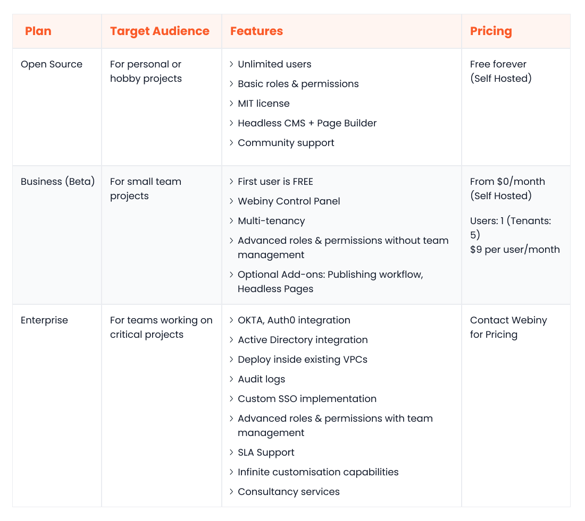

Headless Content Management Systems (CMSs) enable businesses to deliver impressive omnichannel experiences. Unlike traditional CMSs, which have tightly coupled backend and frontend layers, a headless CMS is a backend-only solution without a default frontend.

This unique design makes a headless CMS more robust and adaptive than its traditional counterparts. Leveraging APIs, a headless CMS can integrate with several decoupled frontends simultaneously without experiencing scalability or performance issues. This means businesses can use it to serve content across all customer touchpoints (websites, smartphones, kiosks, smart watches, etc.) from a centralised content repository.

The headless CMS landscape has surged in recent years, with numerous vendors vying for market dominance. Despite this competition, Strapi is still considered a frontrunner, with an extensive feature set that caters to a wide array of users.

However, a relatively new entrant, [Webiny](https://www.webiny.com/), is poised to challenge the status quo. With its modern, cloud-native architecture, Webiny promises unparalleled scalability and extensive customisation options.

Below, we will perform an in-depth comparative analysis of Webiny vs Strapi across several core categories, all of which are worth considering when deciding on your business's next headless CMS solution. Let’s read on to find out more.

## Overview of Webiny

Webiny is an [open-source enterprise CMS](https://www.webiny.com/enterprise) that seamlessly scales on top of serverless computing that runs inside your own AWS account. With its serverless architecture, Webiny eliminates the burden of infrastructure provisioning, management, and scaling. This level of robustness and scalability is hard to find in other [open-source headless CMS solutions](https://www.webiny.com/enterprise-serverless-cms/headless-cms).

Webiny empowers businesses to customise every aspect of their content management experience. Developers have full access to its JavaScript-based source code, so they can develop new features or rewrite existing ones at will. Marketers can use the drag-and-drop page and [form builders](https://www.webiny.com/enterprise-serverless-cms/form-builder) to design and release dynamic pages quickly and efficiently.

A key differentiator that sets Webiny apart is native support for [multi-tenancy](https://www.webiny.com/features/multitenancy). This feature allows you to use a single Webiny instance to store, manage, and deliver content to multiple clients. The serverless foundation ensures that this happens without any performance degradation.

Other valuable features include seamless integration with many frontend frameworks, a comprehensive control panel for real-time monitoring and management, a CLI with CI/CD support, a well-maintained plugin system for easy extensibility, the ability to work with preferred identity providers, and built-in digital asset management.

Webiny offers flexible solutions tailored to the needs of businesses of varying sizes. Small and medium-sized businesses can get the free plan in which the infrastructure is self-hosted and self-managed. Larger enterprises can benefit from the Enterprise plan with infrastructure support and consultancy services from the Webiny team.

## Overview of Strapi

Strapi also markets itself as open source and is built using JavaScript. Users can either choose to self-host inside their own environment or opt for the Strapi cloud, a fully managed solution that provides additional features.

Strapi prioritises customisation and flexible content modelling. It has an intuitive content types builder that allows your marketers to build reusable and dynamic content components at scale. Its source code is available on GitHub and can be customised to fit the unique needs of any business.

Other handy features include an easy-to-use editor, media file support, automatic backups, a built-in email provider, visual editing, seamless extensibility via plugins, multi-database support, and GraphQL and REST APIs.

Strapi caters to businesses of all sizes. Smaller businesses with budgetary constraints can go with the self-hosted community plan that provides a core set of features. Depending on their hosting preferences, larger organisations can choose between the self-hosted and fully-managed plans.

## Webiny vs Strapi: How Does Each Platform Match Up?

Webiny and Strapi are viable headless CMS solutions, each with several advantages and limitations. Below, we take a look at both, focusing on a handful of critical areas that you’ll want to consider when picking your organisation's next headless CMS platform.

### Ease of use

#### Webiny

Webiny's intuitive design and user-friendly interface make it an accessible platform for both marketers and developers. Marketers and designers can seamlessly create dynamic pages for various use cases using the drag-and-drop, [no-code page builder](https://www.webiny.com/enterprise-serverless-cms/page-builder). Pre-made templates provide a quick starting point, while A/B testing facilitates data-driven content optimisation. Additionally, the ability to launch pre-rendered pages ensures optimal SEO performance.

Besides customising Webiny’s codebase, developers can integrate their favourite front-end technologies with the CMS. The three API endpoints, for management, reading, and previewing, further streamline integration and usage.

#### Strapi

Strapi excels in user-friendliness with its sleek interface that simplifies the process of content modelling and creation. Whether you want to define a collection type to group different pages together (e.g. blogs), create a one-off page type (e.g. homepage), or leverage custom fields for a personalised editing experience, Strapi offers a straightforward way to do so.

Strapi is also regarded as a developer-friendly platform. The extensive docs, installation guides, and starter kits make integrating Strapi with any front-end technology easy. The choice between REST and GraphQL further enhances its flexibility.

### Data query and content modelling

#### Webiny

Webiny offers robust content modelling features, including custom types and the ability to define content models via application code. The GraphQL API offers built-in pagination, sorting, and advanced filtering support. However, you can also extend the API to customise the filtering approach.

#### Strapi

Strapi also allows you to define a composable content model that’s easy to manage. However, it doesn’t offer native support to model content via code. In addition to the GraphQL API for simplified filtering, sorting, and pagination, it offers a Query Engine API that allows developers to interact with the database at a more granular level.

### Customizability

#### Webiny

Webiny is a highly customisable platform. Whether you want to add a new content type, rewrite the modelling layer, refine the core search algorithm, extend the API, or tweak the editing interface, Webiny makes it possible through a well-maintained codebase, external plugins, and extensive documentation.

A standout Webiny feature – that Strapi doesn’t have –  is the ability to configure a different theme for each tenant. This allows you to personalise the experience of your customers as per their unique brand identities.

#### Strapi

Strapi also offers the ability to customise the source code, whether you choose to host yourself or on the Strapi Cloud. Additionally, it has a mature marketplace, which makes it easier for non-technical teams to extend functionality via plugins.

### Performance and scalability

#### Webiny

Webiny has been purpose-built to sustain heavy usage from large volumes of users. The AWS Lambda functions used to host Webiny can scale up and down to cater to fluctuating traffic, delivering optimal performance, scalability, and cost-effectiveness.

Moreover, all Webiny apps are multi-tenant by default. This allows you to run hundreds or thousands of segregated projects and websites within a single instance.

#### Strapi

The Strapi Cloud ensures on-demand scalability and impressive performance. However, if you opt for the self-hosted option, the levels of scalability and performance will be determined by the infrastructure on which Strapi runs. Since Strapi isn’t purpose-built to run on a serverless platform, it might require additional configurations and customisations to achieve comparable performance and scalability to Webiny.

### Integration ecosystem

#### Webiny

An API-first and open-source platform like Webiny can seamlessly integrate with any external service. Whether you want to integrate with a third-party SAAS provider or another application from your existing tech stack, you can leverage APIs or tweak the source code to do so.

#### Strapi

Strapi, much like Webiny, is open-source and API-first. However, its robust ecosystem and marketplace extend its capabilities beyond Webiny's. The marketplace has hundreds of plugins catering to diverse enterprise use cases. Moreover, you also have the option to create your own plugins.

### Community and support

#### Webiny

Webiny’s community, although not as mature as Strapi’s, is constantly growing. You can connect with developers and contributors on the official Slack channel. The platform offers extensive documentation covering all key content management aspects, including API, page builder, integrations, admin area, and file manager. For enterprise customers, technical support is also provided.

#### Strapi

Strapi has a well-established community of developers and creators available via Discord and the forums on the official website. The comprehensive documentation offers guides for both developers and non-technical users. For enterprise customers, Strapi offers technical support with SLAs.

### Open-source

#### Webiny

Webiny is available as an [open-source CMS solution](https://www.webiny.com/features/opensource) under the MIT license. It’s a fully [self-hosted platform](https://www.webiny.com/features/selfhosted) built to provide businesses with all the tools they need to manage content on their own terms, in their own data centre, while enjoying enterprise-grade performance with [AWS serverless](https://www.webiny.com/features/aws-serverless-infrastructure). No other open-source headless CMS platform, not even Strapi, offers this level of control, independence, and performance within a self-hosted environment.

#### Strapi

Strapi, too, is an open-source software licensed under MIT. Nevertheless, deploying and scaling it within your environment demands careful capacity planning, configuration, and fine-tuning. If you want performance and scalability out of the box, you can choose to deploy in the Strapi Cloud, but that strips away all the benefits of self-hosted deployments.

### Pricing

#### Webiny

Webiny has a [transparent pricing structure](https://www.webiny.com/pricing) that doesn’t enforce any long-term commitments. The Open-source package is free and geared towards people building personal or hobby projects.

The Business package targets small businesses and is priced based on the number of users at $9/user/month, making it a great option when scaling your team. The Enterprise plan offers the most significant feature set; to get a price for this plan, contact the [Webiny sales team](https://www.webiny.com/forms/product-demo).

#### Strapi

Strapi has a flexible pricing structure for both its self-hosted and cloud plans. The Community plan is for self-hosted customers looking for a quick start; it’s completely free. The Enterprise self-hosted plan offers several features for larger teams; contact Strapi sales for pricing.

The Pro plan under Cloud plans costs $99 per project per month and targets small businesses. The Team Cloud plan costs $499 per project per month and offers more features than Pro. You can also request a Custom cloud plan to unlock the most extensive feature set for the managed service; contact Strapi sales to get a price for this plan.

### Security

#### Webiny

Webiny implements strict security measures across all key areas:

- **Codebase:** It uses CodeQL to scan source code and Dependabot to scan third-party libraries for exploitable vulnerabilities
- **Infrastructure:** The serverless offerings of AWS are secured and made fault-tolerant using industry-leading practices. Moreover, since there are no servers to manage, the chances of misconfigurations are significantly reduced
- **Application:** Webiny supports different authentication mechanisms and allows you to integrate with leading cloud identity providers, like Okta
- **Data:** All your content is stored inside DynamoDB and Elasticsearch. DynamoDB supports data encryption at rest and in transit, whereas Elasticsearch only supports encryption in transit

#### Strapi

The Strapi Cloud enforces various security and compliance controls to keep your data safe, including automated backups, SSO, review workflows and audit logs. The platform also offers a few configurable security-related features, including encryption and authentication.

## Webiny: Trailblazing a New Path for Headless CMS

Webiny is poised to become a leader in the headless CMS world for several reasons. It is open-source yet enterprise-grade, self-hosted yet inherently scalable, and exceptionally stable whilst fully customisable. Very few, if any, headless CMS platforms in the market can check all these boxes.

As a cloud-first, serverless-powered solution, it’s the ideal fit for businesses looking for a modern, futuristic content management solution. It can scale horizontally, on its own, to handle more traffic and scale vertically to cater to more tenants or digital touchpoints. Remarkably, it achieves this while decreasing maintenance costs – by an impressive 60% to 80% – compared to traditional VM-based deployments.

Since it is API-first and open-source, it can seamlessly blend into any existing infrastructure. You can integrate it with internal and external tools with ease. Moreover, your developers can use the tools and frameworks they are comfortable with, including [React](https://www.webiny.com/integrations/react-cms), [Next](https://www.webiny.com/integrations/nextjs-cms), or Angular, to build responsive and engaging frontends.

Despite its longstanding presence as a leader in the headless CMS landscape, Strapi falls short by comparison. It lacks several features inherent to Webiny, including multi-tenancy, the ability to define content models programmatically, and on-demand scalability in a self-hosted setup.

## Conclusion

Webiny and Strapi stand out as prominent players in the headless CMS market, each offering distinct advantages for diverse business needs.

Webiny excels with its cloud-native architecture, promising exceptional scalability, customisation, and innovative features like multi-tenancy and serverless support, making it a forward-thinking choice for modern businesses. Its serverless model significantly reduces maintenance costs, further enhancing its appeal for enterprises seeking a futuristic CMS solution.

Strapi, a long-standing leader in this space, offers a user-friendly platform with extensive customisation and a mature community and plugin ecosystem. It remains a strong choice for businesses prioritising simplicity and flexibility, especially with its mature community support.

However, in aspects like self-hosted scalability and advanced features like multi-tenancy, Strapi does not match Webiny's offerings.

As such, the decision between Webiny and Strapi hinges on a business's specific requirements and future scalability plans, with Webiny emerging as a particularly compelling option for those seeking a modern, scalable CMS.

To find out more, [book a demo](https://www.webiny.com/forms/product-demo) with our team today!