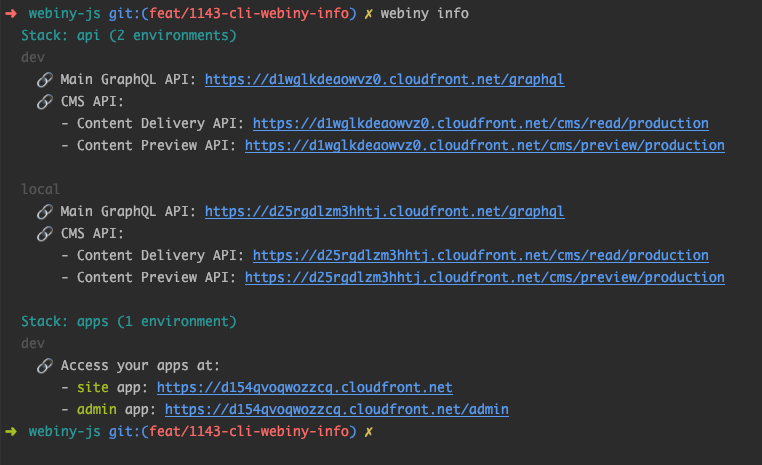
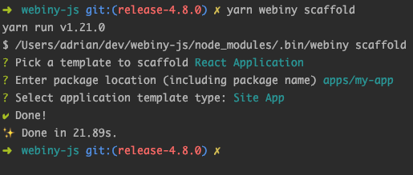

## 🆕 What’s New In Webiny 4.8.0?

In this week’s release, we introduce a couple of improvements and fixes in different areas of Webiny. Let’s check them out!

## 🚀 Features

- **New CLI **`info`** command **([#1171](https://github.com/webiny/webiny-js/pull/1171))

Ever found yourself looking for the URLs of the API and site you’ve previously deployed? If the answer is yes, well, don’t worry, we’ve been there too. 🙂

But, with this week’s release, this issue is the thing of the past. With the new `yarn webiny info` command, you immediately get all of the relevant URLs, across all of the environments you might've previously deployed.

Check the screenshot to see it in action!

- **New scaffolds (**[#1170](https://github.com/webiny/webiny-js/pull/1170)**)**

In this week’s release, we are introducing four new scaffolds that you can use to significantly speed up your development. Let’s take a look.

> In order to access the list of all available scaffolds, `run yarn webiny scaffold`. From there, you can select the scaffold you need.For more information on scaffolding, make sure to visit our [official docs](https://docs.webiny.com/docs/deep-dive/cli/creating-a-scaffold-plugin/#introduction-to-scaffolding).

- **1. Admin App Module** ([#1170](https://github.com/webiny/webiny-js/pull/1170))

Let’s start with the most important scaffold. The `Admin App Module` the scaffold will essentially create a new module in the Admin app. Meaning, it will generate a set of plugins that will insert a new section in the Admin app's main menu and create a new route that will render the default view that consists of a list of all records and a basic form. In other words, it's a view that provides the complete CRUD functionality, which can be then adjusted to your needs, by adjusting the GraphQL queries/mutations, the list, the form, and so on.

- **2. React Application** ([#752](https://github.com/webiny/webiny-js/pull/752))

By default, a new Webiny project comes with the Admin and Site apps, which you are free to expand in any way you might need. But, if those two apps are not enough, with the newly added React Application scaffold, you can easily create additional ones. Imagine you had a secure area on your public website that your users can access. In that case, this scaffold might be an ideal tool for you, as the secure area might be a totally separate app.

- **3. React Package** ([#1134](https://github.com/webiny/webiny-js/pull/1134))

Next up, we have the React Package scaffold, which will essentially create a couple of simple files for getting started with a new React package, for example, creating a new React component or set of components.

- **4. Node Package** ([#1135](https://github.com/webiny/webiny-js/pull/1135))

Finally, the Node Package scaffold will enable you to quickly start with a simple Node.js package, similar to what the React Package scaffold is trying to do as well. This can be used to start creating libraries that you might need to share across all of your apps or APIs.

## 🐞 Bug Fixes

- **Scaffolding**: update “exclude” and “reference” paths if needed ([27085cf](https://github.com/webiny/webiny-js/commit/27085cf96a612f47956d68fb54fd0ed7b7d24823))
- **CWP templates**: add a post-install script to properly link monorepo packages ([ba1f28d](https://github.com/webiny/webiny-js/commit/ba1f28d9508f224bdc1af31e5b3b36e64af2256f))
- **Page Builder App**: increase z index on File Manager overlay ([#1157](https://github.com/webiny/webiny-js/issues/1157)) ([193d2fc](https://github.com/webiny/webiny-js/commit/193d2fcd0e2f460652760d3f1b909c4287ce9798))

---

## ⬇️ Try the Latest Release

Give Webiny a try by following our [Quick Start](https://docs.webiny.com/docs/get-started/quick-start), which will guide you through the initial setup steps.

And, just in case you’ve missed it, check out [the full changelog](https://github.com/webiny/webiny-js/releases/tag/v4.8.0).

---

## 🙌 Community Updates

### 🔭 Webiny Solutions

With Webiny, you can build Serverless [Websites](https://www.webiny.com/use-case/serverless-websites/), [Web Applications](https://www.webiny.com/use-case/serverless-web-applications/), [APIs](https://www.webiny.com/use-case/serverless-graphql-api/), and [Microservices](https://www.webiny.com/use-case/microservices/). We understand that no project is the same; our team is here for you.

[Book a demo call](https://calendly.com/webiny/30min) with us, and we’ll happily answer any questions you have 🚀

### 📚Knowledge sharing

**Commodo**

[Commodo](https://github.com/webiny/commodo) is a library of higher-order functions that let you define and compose rich data models. This week, Webiny’s top contributor Adrian goes through the basics of Commodo.

Check out our YouTube videos on:

[01. Commodo Introduction](https://youtu.be/i9xRDdqCzjk)

[02. Core Ideas](https://youtu.be/RpTWltA2d4I)

[03. The Basics](https://youtu.be/NbSmE2EFP3Y)

[04. Data Validation](https://youtu.be/sVCTIp9sng0)

[05. Nested Fields](https://youtu.be/_j73mzITXao)

[06. List Fields](https://youtu.be/4xzZu74inRM)

<iframe width="560" height="315" src="https://www.youtube.com/embed/i9xRDdqCzjk" frameborder="0" allow="accelerometer; autoplay; clipboard-write; encrypted-media; gyroscope; picture-in-picture" allowfullscreen></iframe> 

Stay tuned for more [Commodo](https://github.com/webiny/commodo) videos next week 🚀

**🚥 Webiny Headless CMS Guides**

Check out our guides on Headless CMS with [React](https://docs.webiny.com/docs/guides/headless-react-tutorial), [Vue.js](https://docs.webiny.com/docs/guides/headless-vuejs-tutorial), [Angular](https://docs.webiny.com/docs/guides/headless-angular-tutorial), and [many other technologies](https://docs.webiny.com/docs/guides/headless-gatsby-tutorial).

This time, you will learn how to use the popular [React Native](https://reactnative.dev/) framework (a framework for building native apps using React) with the [Webiny Headless CMS](https://docs.webiny.com/docs/webiny-apps/headless-cms/features/content-modeling).

Webiny’s developer Ashu, walks you through the [guide](https://docs.webiny.com/docs/guides/headless-react-native-tutorial). Check out the highlight video below.

## 🤝 Get Involved

We encourage everyone to get involved and contribute, regardless of their experience level. Read the [contributing guide](https://github.com/webiny/webiny-js/blob/master/CONTRIBUTING.md), and if you still run into problems, just give us a ping on [Slack](https://www.webiny.com/slack), we will help you out.

Our development team is on standby to help your in-house team to learn and adopt Webiny — all free of cost!

## 🚀 We are hiring

We are looking for a member to join our team.
If you are interested? Apply for the [Full-Stack JavaScript Engineer](https://careers.webiny.com/full-stack-javascript-engineer/en) role.

Since we are a small team, in this role, you’ll have a significant opportunity to directly influence the technical and product design choices we will make.
