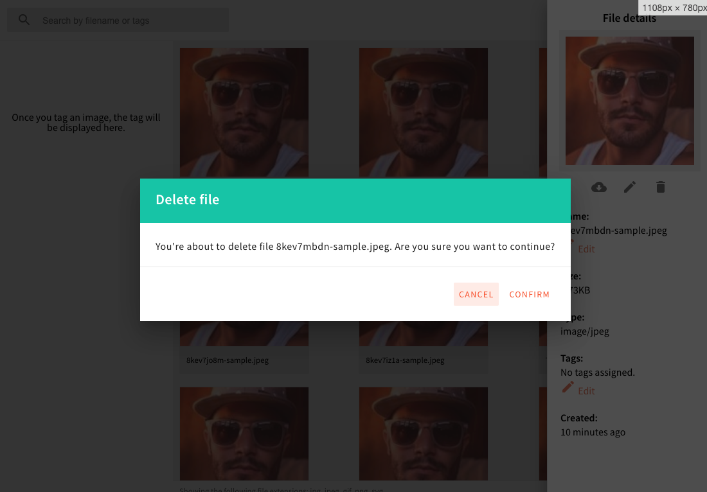
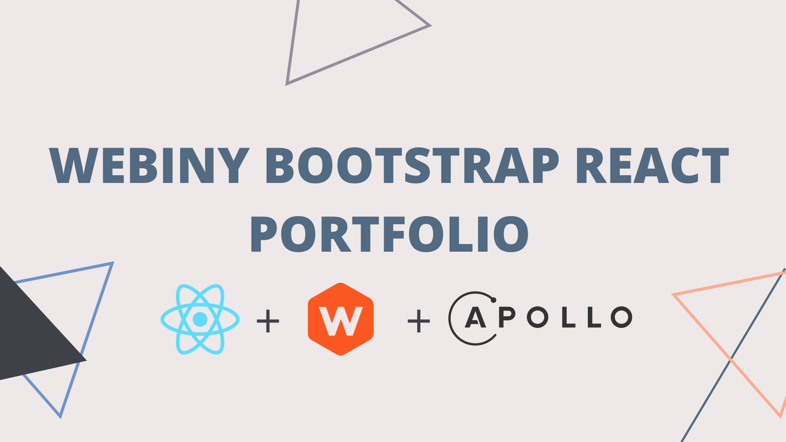

## 🆕 What’s New In Webiny 4.11.0?

In this week’s release, we introduce a couple of fixes in different areas of Webiny. Let’s check them out!

## 🐞 Bug Fixes

**File Manager — delete file dialog** ([#1216](https://github.com/webiny/webiny-js/pull/1216))

A couple of users reported that “nothing happens” once they clicked on the delete file icon, in the File Manager’s sidebar. As it turned out, the behavior that was supposed to happen — showing the delete file confirmation dialog, was working as expected, but the dialog itself was not visible (that’s why users had a feeling nothing is happening). This is now taken care of.

**Polished existing scaffolding tools** ([#1217](https://github.com/webiny/webiny-js/pull/1217))

We fixed a couple of hiccups in our existing scaffolding tools, and while we were at it, added some minor polishes, to make the whole experience more pleasant.

## ⬇️ Try the Latest Release

Give Webiny a try by following our [Quick Start](https://docs.webiny.com/docs/get-started/quick-start), which will guide you through the initial setup steps.

If you have an existing Webiny project, you can upgrade your project by running `yarn upgrade`.

And, just in case you’ve missed it, check out [the full changelog](https://github.com/webiny/webiny-js/releases/tag/v4.11.0)**.**

## 🙌 Community Updates

### 🎥 Webiny Guides/Tutorials

We created the Guides and Tutorials page for you; our community. A list of great resources to help you learn and master Webiny like a pro.

Start [building](http://webiny.com/guides-and-tutorials) your serverless applications today 🚀

## 📚Knowledge sharing

**Scaffolding**

In this week’s knowledge sharing session, our lead developer, [Adrian](https://twitter.com/doitadrian), shows us the `scaffold` Webiny CLI command, and with that, a couple of built-in scaffolds than enable us to build new APIs, React apps, and custom utility packages significantly faster!

<iframe width="560" height="315" src="https://www.youtube.com/embed/SgfWQG8YirU" frameborder="0" allow="accelerometer; autoplay; clipboard-write; encrypted-media; gyroscope; picture-in-picture" allowfullscreen></iframe>

### 📠 Webiny Bootsrap React Portfolio Guide

In this guide, Webiny’s DevRel [Albiona](https://twitter.com/albionaitoh) guides you to bootstrap a portfolio website with [React](https://reactjs.org/), [Webiny Headless CMS](https://www.webiny.com/serverless-app/headless-cms), and [Apollo](https://www.apollographql.com/docs/react/).

Start your portfolio website today.

## 🤝 Get Involved

We encourage everyone to get involved and contribute, regardless of their experience level. Read the [contributing guide](https://github.com/webiny/webiny-js/blob/master/CONTRIBUTING.md), and if you still run into problems, just give us a ping on [Slack](https://www.webiny.com/slack), we will help you out.

Our development team is on standby to help your in-house team to learn and adopt Webiny — all free of cost!

## 🚀 We are hiring

We are looking for a member to join our team.
If you are interested? Apply for the [Full-Stack JavaScript Engineer](https://careers.webiny.com/full-stack-javascript-engineer/en)** role**.

Since we are a small team, in this role, you’ll have a significant opportunity to directly influence the technical and product design choices we will make.
